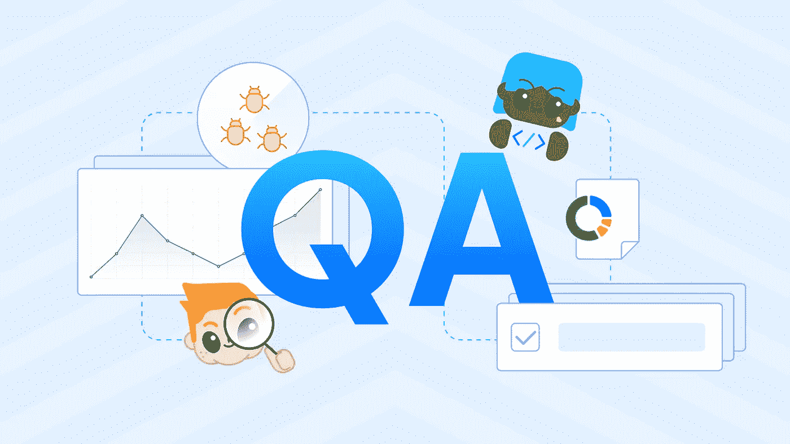

# 建立高效 QA 团队的 6 个技巧

> 原文：<https://medium.com/nerd-for-tech/6-tips-to-build-an-effective-qa-team-56cfcc72747e?source=collection_archive---------3----------------------->

软件开发过程中**质量保证(QA)** 的重要性再怎么强调也不为过，但是建立和维护一个有效的 QA 团队是具有挑战性的。

当组建一个 QA 团队时，有许多因素需要考虑，从团队成员的技能和经验到你的测试方法。同样重要的是要记住，你不只是在寻找单个的贡献者，你是在寻找能够作为一个团队一起工作的专家。

质量保证团队使用测试技术来识别潜在问题，并促进产品的持续改进。创建和维护一个有效的测试团队是一项关键而艰巨的任务。

让我们讨论一下建立一个有效的 QA 团队的 6 个技巧。

# 1.雇佣经验不同的团队成员

不要害怕雇佣经验不同的团队成员。多元化欢迎新的想法，并为现有的设置开辟了改进的途径。

这并不是说你应该雇佣刚刚开始职业生涯的人。你仍然希望有很多经验和知识的团队成员可以分享。但是你也希望有不同的团队成员，这样你就可以从他们不同的观点和技能中获益。

例如，在任何软件开发中，一个无人注意的错误都可能导致数百万美元的损失。这同样适用于任何产品的执行、[、](https://blog.ones.com/project-management-challenges?hsLang=en)或创造中的问题。你的 QA 应该足够多样化，以检测产品的所有潜在问题，并可以将它们引导到相关的团队。

# 2.确定你的技能差距，并设法弥补它们

你知道你的质量保证团队并不像它应该的那样有效。你有一些技能差距需要弥补。但是你从哪里开始呢？

第一步是确定这些技能差距是什么:

继续同一个软件开发的例子，如果你的最终产品与原型不匹配，那么在开发阶段就存在技能差距。在此阶段添加 QA 成员，以确保流程的无缝执行。这也有助于[处理项目管理中的意外变化](https://blog.ones.com/change-management-in-project-management?hsLang=en)。

这可能意味着寻找具有合适技能和经验的人，或者在新的领域培训你现有的团队成员。

根据 Quettra 的说法，普通应用在 90 天后会失去 95%的新用户。另一方面，Google Play 上排名前十的应用失去了不到 50%的用户。这种巨大的差异取决于 QA 团队的可信度。

# 3.职责的明确性

如果你清楚每个团队成员的角色和职责是最好的，你还需要确保每个人都知道谁负责每项任务。这可能很棘手，尤其是在处理分布在不同时区的 QA 团队时。

但是为了避免群体思维陷阱:

例如，计划、原型、开发、测试、部署、维护和更新团队应该清楚他们的角色和职责。QA 团队还需要明确职责，以便于识别潜在问题。

# 4.渴望了解更多

QA 都是学习。不断地。你需要不断地渴求知识，因为一旦你停止学习，你就开始落后了。

这就是为什么雇佣经验不同的团队成员是至关重要的。

自我激励的 QA 团队成员将加快测试过程。有动机和兴趣进行性能测试和产品分析的技术人员通常会带来好的想法。他们对书籍和在线资源的了解有助于他们进行彻底的测试，从而减少了手工测试的需要。

# 5.对他们工作的信念

如果你对自己测试软件的能力有信心，那是最好的。然而，你也必须能够站在编写代码的人的立场上想象自己。这就是移情作用的来源。

当你能从开发者的角度看问题时，你就能开始理解他们为什么做出这样的选择。这种理解将帮助您更有效地测试代码。

你还需要有条理，有很强的沟通能力。在团队中工作时，你必须能够将你的发现传达给你的团队成员，并获得他们的意见。

# 6.记住，你是在建立一个专家团队，而不是一群个人贡献者

当你建立你的质量保证团队时，你希望专家们能够团结起来形成一个有凝聚力的团队。

这意味着你需要有不同背景的团队成员，这样他们就可以在团队工作时带来创新。他们不需要都是 QA 专家，但是你应该寻找这些东西:

这就是培训和发展派上用场的地方。有了合适的团队，你就能应对任何挑战。

当 [24%的公司](https://truelist.co/blog/software-testing-statistics/)开始自动化测试时，他们的投资回报率立即增加。

# 结论

你的 **QA 团队**是你产品开发过程中最重要的元素之一。但是建立一个有效的团队可能很困难——尤其是当你不知道从哪里开始的时候。

这六个建议将帮助你建立一个满足你需求的完美团队。请记住，重要的是要灵活，并适应不断变化的需求。

如果您正在寻找一个有效的 QA 团队，可以简化您的手动测试和质量保证过程，并交付具有端到端可追溯性的产品。不要再看了；我们在[one](https://ones.com/)提供管理研发过程的所有工具，以促进和便利软件开发团队不同成员之间的协作。

*原载于 2022 年 12 月 29 日***。**