# 60 本数据科学词典

> 原文：<https://medium.com/nerd-for-tech/60-lexicons-of-data-science-40ebf81bc74f?source=collection_archive---------13----------------------->

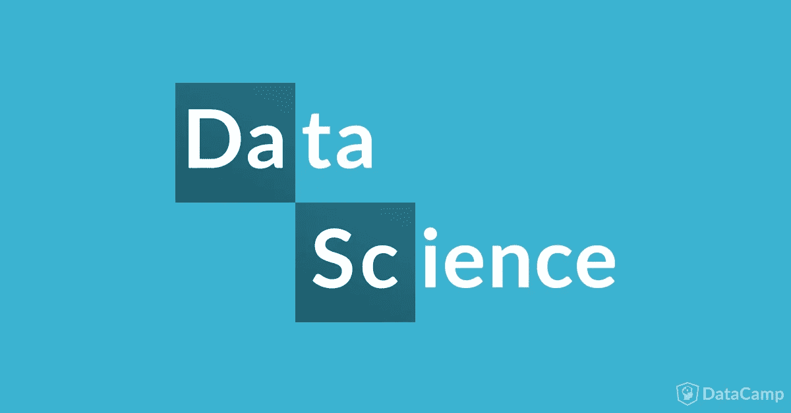

来源:[数据营](https://www.google.com/url?sa=i&url=https%3A%2F%2Fwww.datacamp.com%2Fcommunity%2Fblog%2Fdata-science-periodic-table&psig=AOvVaw3eYMfbgMr3qjYsESwCYjFu&ust=1621098440469000&source=images&cd=vfe&ved=2ahUKEwi7luW21MnwAhVPrmMGHbBkDDAQjRx6BAgAEAc)

数据科学领域正随着术语的出现而发展，这些术语来自计算机科学、统计学、数学和软件工程。在扩展中，数据科学的语言发展非常快。
如果你刚刚开始学习数据科学，你应该会学到很多新术语。这就是数据科学词典的用武之地。我在这里收集了一个数据科学术语列表。
在这篇文章中，我将为您提供一个关于数据科学的简短词汇，包括人工智能、机器学习和深度学习。下表按字母顺序列出了 60 个术语。

# 准确(性)

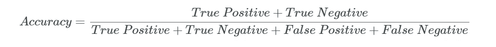

假设您正在训练一台机器来区分垃圾邮件和非垃圾邮件。比方说，在 100 封电子邮件中，它正确分类了 60 封，而对其余 40 封给出了错误的结果。所以，我们可以说效率是 60%。因此，准确率是正确分类的电子邮件的总和除以电子邮件的总数。一般来说，准确性是指在所有给定的电子邮件(无论是垃圾邮件还是非垃圾邮件)中，机器正确预测的百分比。

# 激活功能

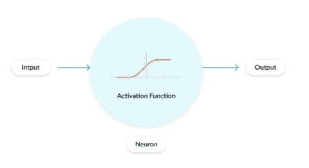

激活函数用于神经网络。没有激活函数的神经网络成为线性回归模型，这意味着它失去了学习复杂模式的能力。如果数据是线性的，线性回归模型可以准确地工作，但是如果数据是非线性的，我们就需要一个激活函数。总之，激活函数包括神经网络的非线性。有许多激活函数，因此如果希望网络学习数据集，正确选择一个函数非常重要。它选择一个神经元对整个神经网络的有用程度，然后分别激活它。

# 人工智能

人工智能(AI)使机器有可能从经验中学习，适应新的输入，并执行类似人类的任务。你今天听到的大多数人工智能例子——从下棋计算机到自动驾驶汽车——都在很大程度上依赖于深度学习和自然语言处理。应用这些技术，可以训练计算机通过处理大量数据和识别数据中的模式来执行特定的任务。

# 自回归

自回归是一种时间序列模型，它使用以前时间步长的观测值作为回归方程的输入，来预测下一个时间步长的值。这是一个非常简单的想法，可以导致对一系列时间序列问题的准确预测。

# 反向传播

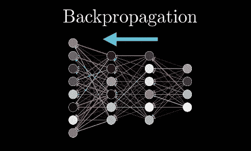

它是基于在前一个时期(即迭代)中得到的错误率(即损失)来微调神经网络的权重的实践。权重的适当调整确保了较低的错误率，通过增加其泛化能力使模型可靠。

# 大数据

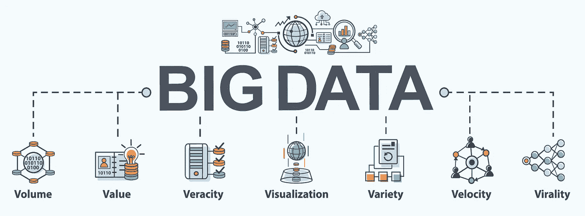

由于数字时代的兴起，正在创建的数据量呈爆炸式增长。从最初的数据库和电子表格到 GPS 设备留下的数字足迹，数据的数量一直呈指数级增长。大数据是世界上所有数据的集合，是获取关于数据的未知景象以提升商业智能的过程。

# 偏见

偏差是实际值和预测值之间的差异。这是因为我们的算法不太灵活，无法理解数据集的真实形状。现在，如果差异很大，我们的机器学习模型将在训练和预测过程中出错，因为它将遭受欠拟合。

# 助推

升压是一个连续的过程，其中每个后续模型都试图纠正前一个模型的错误。后续模型依赖于前一个模型。一些增强算法是:

*   adaboost 算法
*   马恩岛
*   XGBM
*   LightGBM

# 分类

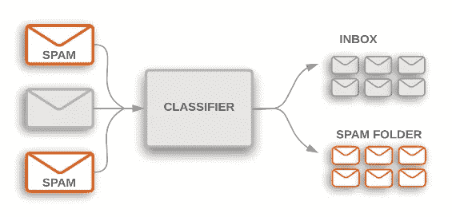

一个分类问题是当输出变量是一个类别时，比如“红”或“黑”或“病”和“没病”，“狗”或“猫”。分类模型试图从观察值中得出一些结论。给定一个或多个输入，分类模型将尝试预测一个或多个结果的值。例如，在区分邮件是“垃圾邮件”还是“非垃圾邮件”时，在查看交易数据时，“欺诈”还是“授权”。根据输出类别的数量，它进一步分为两种类型:二元分类(处理 0 或 1 两个类别)和多类别分类(处理 2 个以上的类别)。

# 使聚集

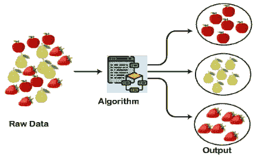

假设你有一些随机数据，你想找到任何模式或类，或数据之间的关系。让我们用购物中心的真实例子来理解聚类技术:当我们访问任何一个购物中心时，我们都可以观察到用法相似的东西被排列在一起。比如 t 恤分组在一个区，裤子在其他区，类似的，蔬菜区，苹果，香蕉，芒果等。，被分组在单独的部分，这样我们就可以很容易地找到这些东西。聚类技术也以同样的方式工作。

# 计算机视觉

计算机视觉是计算机科学的一个领域，致力于让计算机像人类视觉一样看到、识别和处理图像，然后提供相关的输出。整个过程包括图像采集、筛选、分析、识别和提取信息。计算机视觉的一些关键应用包括:

*   智能(自动驾驶)汽车中的行人、汽车、道路检测
*   物体识别
*   目标跟踪
*   动作分析

# 混淆矩阵

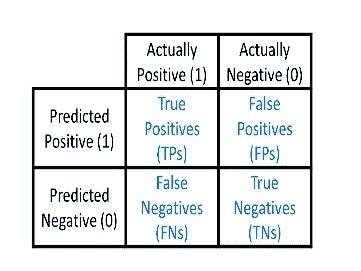

混淆矩阵是一个表格，通常用于解释分类模型的性能。它是一个 N * N 矩阵，其中 N 是类的数量。我们在模型类的预测和实际类之间创建一个混淆矩阵。第二象限称为第二类错误或假阴性，而第三象限称为第一类错误或假阳性。

# 交叉验证

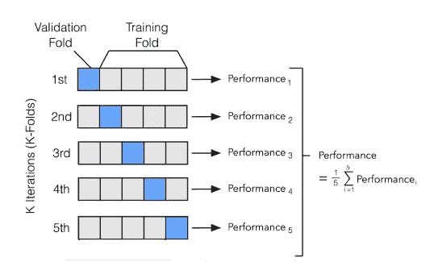

比方说，我们将数据集分成 3 个相等的部分，并将其命名为 X、Y 和 Z。考虑以下给定的情况:
当 X 和 Y 用作训练集时，Z 将用作验证集
当 X 和 Z 用作训练集时，Y 将用作验证集
当 Y 和 Z 用作训练集时，X 将用作验证集
现在，对三次迭代进行平均，以获得模型的总效率。因此，在“交叉验证”中，我们从数据集的每个部分交叉验证我们的模型结论。

# 数据科学

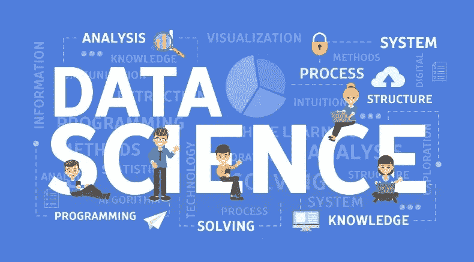

数据科学是一个结合了领域专业知识、编程技能以及数学和统计知识的研究领域，旨在从数据中提取有意义的见解。数据科学从业者将机器学习算法应用于数字、文本、图像、视频、音频等，以产生人工智能(AI)系统来执行通常需要人类智能的任务。

# 资料组

数据集是数据的集合。数据集被组织成某种类型的数据结构。例如，在数据库中，数据集可能包含业务数据的集合(姓名、工资、联系信息、销售额等等)。几个特征定义了数据集的结构和属性。这些包括属性或变量的数量和类型，以及适用于它们的各种统计度量，如标准差和峰度。

# 深度学习

深度学习只是一种机器学习，由人脑的结构驱动。深度学习算法试图通过不断分析具有给定逻辑结构的数据，得出与人类相似的结果。为了实现这一点，深度学习使用了一种称为神经网络的多层算法结构。与我们如何从经验中学习类似，深度学习算法将重复执行一项任务，每次都稍微调整一下以改善结果。

# 集成学习

假设你生病了，去看三个医生。医生 A 预测你患有病毒性咳嗽，医生 B 说这是正常的咳嗽，医生 C 说你患有病毒性咳嗽。因为三分之二的医生预测病毒，你会知道这个预测是正确的。现在用弱分类器代替医生，用不同的类代替咳嗽和病毒性。这变成了最大投票集合技术。总而言之，集成学习是一种使用不同模型的预测来获得更好的预测的技术。

# 世

机器学习中的一个时期意味着训练数据集通过算法的一次完整传递。这个历元数是该算法的基本超参数。它指定整个训练数据集通过算法的训练或学习过程的次数或完整遍数。在每个时期，数据集的内部模型参数都会更新。

# 电子设计自动化(Electronic Design Automation)

探索性数据分析是检查或理解数据并提取数据的洞察力或主要特征的过程。EDA 通常分为两种方法，即图形分析和非图形分析。EDA 的主要动机是

*   检查数据分布
*   处理数据集的缺失值
*   处理异常值
*   删除重复数据
*   分类变量编码
*   标准化和缩放

# 抽取、转换、加载至目的端（extract-transform-load 的缩写）

ETL 代表提取、转换、加载。假设你有一家公司，你的网站有很多访问者。现在，你想推出一款手机应用。从多个来源收集数据并把它们放在一个地方是一个巨大的挑战，这就是提取的意义所在。现在，您可能已经收集了结构化或半结构化格式的数据。对于构建报告，结构很重要。这就是转型的由来。然后，数据被加载到仓库中，然后根据业务需求进行转换，这就是我们所说的加载。

# 评估指标

评估指标的目标是衡量统计/机器学习模型的质量。例如，以下是一些评估指标

1.  罗马纪元
2.  ROC 评分
3.  f 分数
4.  原木损失

# 特征选择

特征选择是机器学习的核心概念之一，它会极大地影响模型的性能。您用来训练机器学习模型的数据特征对您可以实现的性能有着巨大的影响。

**减少过度拟合**:冗余数据越少，基于噪声做出决策的机会就越少。

**提高精度**:误导数据越少，建模精度越高。

**减少训练时间**:更少的数据点降低算法复杂度，算法训练更快。

# f1-分数

这是精度和召回率的调和平均值，并且给出了比精度度量更好的错误分类情况的度量。

# 开始

生成对手网络(GAN)是一种机器学习模型，其中两个神经网络相互竞争，以使其预测更加准确。GAN 的主要重点是从头开始创建数据，主要是图像，但包括音乐在内的其他领域也已完成。构建 GAN 的第一步是确定所需的最终输出，并根据这些参数收集初始训练数据集。

# 梯度下降

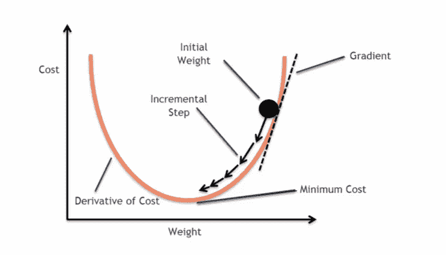

想象一个球在一个有很多山谷的地方。现在球的目标是找到最深的山谷。这就是梯度下降的作用。这是一种优化算法，可以比作下山。它迭代地接近函数的最小值。我们希望模型中的“误差”最小。比如帮助我们找到简单线性回归模型中成本函数的全局最小值。

# 超参数

超参数是必不可少的，因为它们直接控制训练算法的行为，并对正在训练的模型的性能产生有意义的影响。确定适当的超参数在我们的神经网络体系结构的成功中起着至关重要的作用。因为它对学习模型有巨大的影响。例如，如果学习率太低，模型将错过数据中的主要模式。如果高，可能会有碰撞。

# 循环

迭代指的是在数据集上训练模型时算法参数更新的次数。例如，训练神经网络的每次迭代都采用一定数量的训练数据，并通过使用梯度下降或一些其他权重更新规则来更新权重。

# 图像识别

图像识别是系统或软件识别图像中的物体、人物、地点和动作的能力。它使用具有人工智能和训练有素的算法的机器视觉技术，通过相机系统识别图像。例如，我们有可以识别给定图像中文本的扫描仪，称为 OCR。

# 不平衡数据集

数据不平衡通常表示数据集中的类分布不均。例如，在信用卡欺诈检测数据集中，大多数信用卡交易不是欺诈，只有极少数类别是欺诈交易。这样，欺诈类和非欺诈类的比例大约为 50:1。

# 峭度

峰度被确定为给定分布尾部的厚度(或重量)。根据峰度值的不同，它可以分为以下三类:

*   **中峰度:**峰度值等于 3 的分布。遵循正态分布的随机变量的峰度值为 3
*   **Platykurtic:** 如果峰度小于 3。在这种情况下，给定的分布比正态分布具有更细的尾部和更低的峰值
*   **Leptykurtic:** 峰度值大于 3 时。在这种情况下，给定的分布比正态分布具有更宽的尾部和更高的峰值

# 标签

要素是输入，标注是输出。标签是最终选择，如大米、小麦、玉米、玉蜀黍等。训练完成后，模型将预测标签(作物类型)作为新特征向量的输出。

# 损失函数

这是一个评估您的算法对数据集的建模程度的过程。如果你的预测是错的，你的损失函数将输出一个更高的数字。如果他们很好，它会输出一个较低的数字。当你改变你的算法来尝试改进你的模型时，你的损失函数会告诉你是否有所进展。

# 机器学习

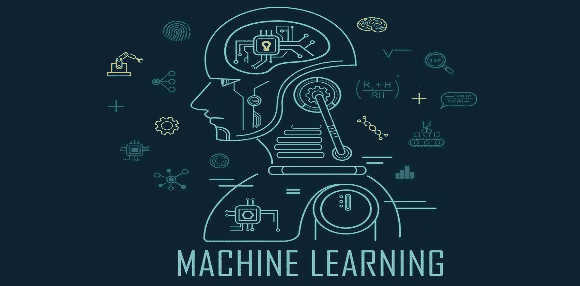

医生根据患者目前的症状和病史，预测他/她患有某种疾病。现在，利用人类的这种能力，试图让他们在没有明确编程的情况下通过机器进行学习，这被称为机器学习。你给机器一些输入和输出，让机器开发一套规则，这样它就可以对一套新的输入进行预测。更简单地说，ML 是从经验中学习，预测下一步会发生什么，然后随着获得的每一次经验而变得更好。

# 均方误差

均方误差(MSE)是拟合线与数据点接近程度的度量。对于每个数据点，取该点到曲线拟合上相似 y 值(误差)的垂直距离，并对该值求平方。然后，将所有数据点的所有这些值相加，并且在具有两个参数的拟合(例如线性拟合)的情况下，除以点数减 2。

# 模型

它是一种描述数据的方法。你给模型一个算法来训练一些数据，并对新的看不见的数据进行预测。那么什么是模型呢？它由数据和做出一些预测的计划组成。

# **自然语言处理**

简单来说，自然语言处理是一个旨在让计算机系统理解人类语言的领域。NLP 由处理、构造、分类原始文本和提取信息的技术组成。聊天机器人是自然语言处理的一个经典例子，句子首先被处理、清理并转换成机器可理解的格式。

# 神经网络

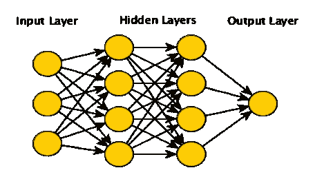

神经网络是一种机器学习算法，其结构基于人脑的结构。像其他类型的机器学习算法一样，它们可以通过试错来解决问题，而无需明确地按照规则进行编程。它由作为节点的神经元、输入/输出层和一些主要处理在其中完成的隐藏层组成。所有这些组件都是相互关联的，它们可以学习。在前向传递期间，这些节点进行一些计算，而在后向传递期间，这些节点从所犯的错误中学习。

# 正常化

规范化是重新调整数据比例以使其具有相同比例的过程。当我们的数据中的属性具有不同的比例时，使用规范化。例如，如果您有一个范围从 0 到 1 的变量和另一个范围从 0 到 1000 的变量，您可以规范化该变量，使两者都在 0 到 1 的范围内。

# **一热编码**

一个热编码通常在预处理步骤中完成。这是一种将分类变量转换成可解释格式的数字的方法。在这里，我们为变量的每个类别创建一个布尔列。

# **过拟合**

过度拟合是一种现象，当模型学习数据集中的特征和噪声达到影响模型对新数据的性能的程度时，就会发生这种现象。这意味着训练数据中的随机波动被模型拾取并学习为概念。有两种方法可以克服过度拟合:

*   降低模型复杂性
*   正规化

# **模式识别**

**模式识别**是利用机器学习算法识别模式的方法。模式识别可以解释为基于已经获得的知识或基于从模式和/或其表示中提取的统计信息的数据分类。模式识别的一个重要方面是它的应用潜力。

**例子:**语音识别、说话人识别、多媒体文档识别(MDR)、自动医疗诊断。

# p 值

这个概率值实际上就是 p 值。简单地说，如果我们假设我们的零假设是正确的，它只是观察我们所观察到的或极端结果的概率。

# 精确

精度是一个度量标准，用于量化正确的正面预测的数量。它被测量为正确预测的正例除以被预测的正例总数的比率。

# 预测分析

预测分析是一种数据分析，旨在基于历史数据和分析技术(如统计建模和机器学习)对未来结果进行预测。预测分析科学能够以有意义的精确度创造未来的洞察力。在现代预测分析工具和模型的帮助下，任何组织现在都可以使用过去和当前的数据来可靠地预测未来几毫秒、几天或几年的趋势和行为。

# 预处理

它是机器学习的重要步骤之一。它确保数据准备好在模型上执行。这包括从各种来源加载数据集、集成数据集，然后进行清理。预处理的主要步骤是特征提取和特征选择。

# 推荐系统

每一个不同的社交媒体应用或音乐/视频平台或电子商务平台都在使用推荐系统来实现更好的用户互动。它根据个人过去的购买和偏好，为个人提供个性化的体验。它通过更多地了解买家来提供关于客户的信息，并可以做出更好的商业决策。

# **正规化**

正则化是一种用于解决统计模型中过拟合问题的方法。在机器学习中，正则化会惩罚系数，从而使模型更好地泛化。我们有不同类型的使用正则化的回归技术，如岭回归和套索回归。

# 回归

它是一种机器学习算法，用于将一个变量的行为与另一个变量的值相关联，这意味着它给出了两个变量之间的关系。比方说，我们想找出房子的面积如何影响一个地区的房价。我们将使用回归来得到房价和房屋面积之间的关系。现在基于这个关系，如果给定面积，我们可以进一步预测房价。

# **ROC-AUC**

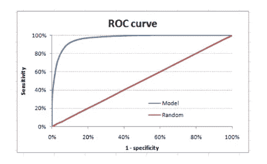

ROC 曲线是灵敏度和(1-特异性)之间的图。(1-特异性)也称为假阳性率，灵敏度也称为真阳性率。以下是手头案例的 ROC 曲线。

# 强化学习

强化学习意味着通过与环境互动来学习。RL 代理从其经验中学习，而不是从其连续的试错学习过程中学习，这与外部监管者提供示例的监管学习相反。
知道区别的一个很好的例子是自动驾驶汽车。自动驾驶汽车使用强化学习来不断做出决定，比如走哪条路线，以什么速度行驶，这些问题都是在与环境交互后决定的。监督学习的一个简单表现就是预测旅程结束时出租车的总费用。

# 情感分析

情感分析是决定一篇文章是积极的、消极的还是中性的过程。一种用于文本分析的情感分析系统结合了自然语言处理(NLP)和机器学习方法，以向句子或短语内的实体、话题、主题和类别分配加权情感得分。

# **偏斜度**

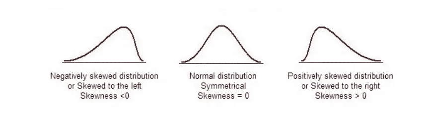

偏斜度是对称性的一种度量。如果一个分布或数据集在中心点的左右两边看起来一样，那么它就是对称的。

# 重击

SMOTE(综合少数过采样技术)是解决不平衡问题最常用的过采样方法之一。
旨在通过复制随机增加少数类实例来平衡类分布。

# 监督学习

监督学习是指我们使用适当标记的数据来教授或训练机器。这意味着一些数据已经标记了正确的答案。之后，向机器提供一组新的示例(数据)，以便监督学习算法分析训练数据(训练示例集)并从标记数据产生正确的结果。

# **迁移学习**

迁移学习是指在新数据集上应用预先训练好的模型。预训练模型是某人为解决问题而创建的模型。该模型可用于解决具有类似数据的相关问题。

# 训练和测试设备

训练数据是您的算法知道其“标签”的数据，您将把这些数据提供给训练过程以构建您的模型。测试数据集是您的模型的看不见的数据集，它将帮助您概括它。这是数据集的一部分，您将它隐藏在模型之外，仅在训练发生后使用它来计算一些指标，并获得关于您的算法行为的提示。

# **欠拟合**

当模型不能理解数据的趋势时，就会出现欠拟合。例如，如果我们试图将线性模型拟合到非线性数据集，就会出现这种情况。这也会导致不良的准确性和性能。欠拟合是指你的结果过于笼统，这意味着你没有从训练数据集中学到足够的东西。

# 无监督学习

它使我们能够在很少或根本不知道我们的结果应该是什么样的情况下处理问题。例如，在使用非监督算法计算了与公司用户相关的所有数据后，该模型可能会想出一种将用户分为三组的方法。比较这些组后，您可能会认出组 1 位于某个地理位置，组 2 和组 3 位于另一个地理位置。

# 验证集

它是训练集的另一个子集，用于评估每个运行/超参数值集的模型性能。如果不满意，您将更改您的模型，然后使用训练集再次训练它，然后在验证集上验证该模型。

# 形象化

数据可视化是通过图形、图表或其他可视化格式来表示数据点的重要方式。数据可视化让我们更深入地了解数据在不同步骤中发生了什么，并让我们对机制有了更直观的了解。可视化有助于检查数据的完整性，并排除此类错误的可能性。

又参考:【https://undolearning.com/lexicons-of-data-science/ 

***如有任何建议或疑问，欢迎随时评论。
感谢您的阅读！***