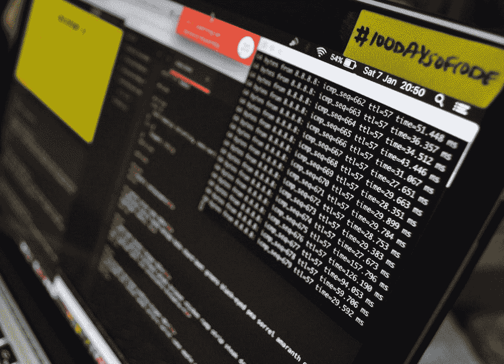
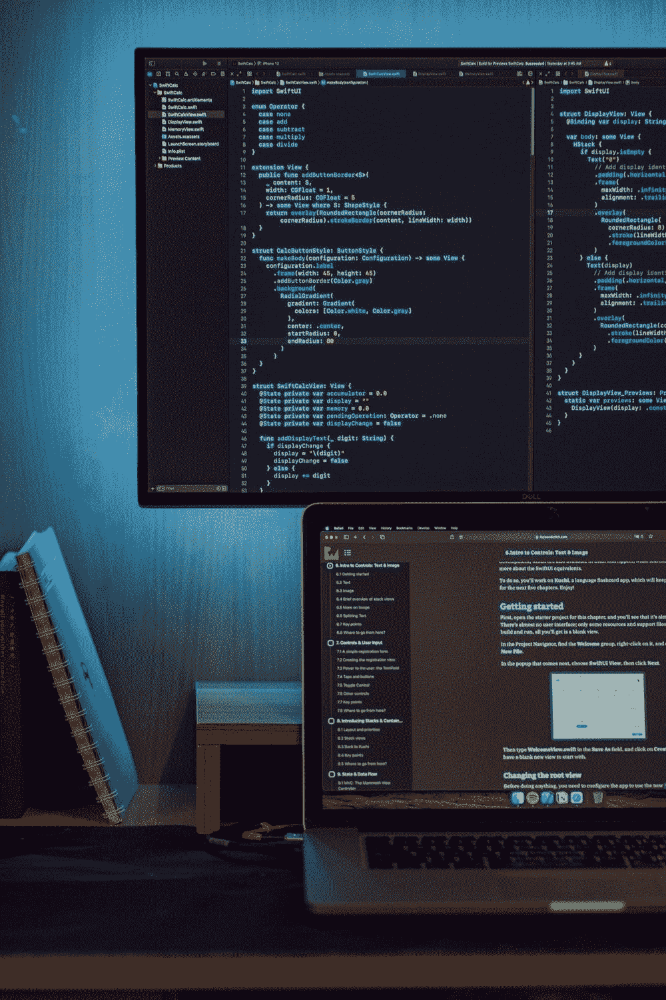
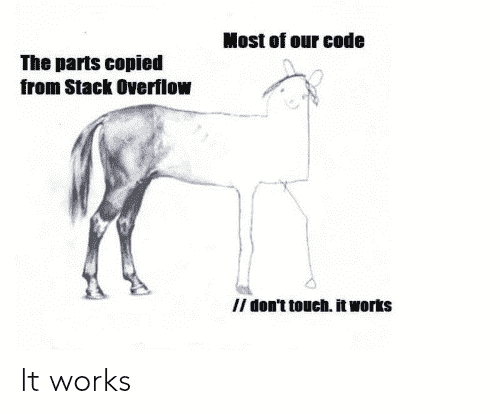

# 你可能犯过的 7 个基本编码错误

> 原文：<https://medium.com/nerd-for-tech/7-basic-coding-mistakes-you-been-probably-making-e58c17b21100?source=collection_archive---------12----------------------->

# 1.语言困境

一个似乎让成长中的开发人员不堪重负的问题是新语言和技术的大量涌现。当我们都是语言选择的初学者时，我们经常犯这个错误。

语言来来去去，但最成功的开发人员都是问题解决者&他们从不仅仅因为对他们的编程生涯没有重大影响而轻易放弃。

来源:[布雷特·乔丹](https://unsplash.com/@brett_jordan)

# 2.复杂代码

假设编码是一种智商测试不会让你成为一个成功的程序员。从视觉上感知谁能够利用最复杂的功能或令人印象深刻的文件并不是一个挑战。应该本着有效解决难题的精神来编写代码。简单的代码更容易书写，更容易维护，更容易管理。

说白了，简单代码并不意味着走捷径。

由[路易斯·康伊·恩古吉](https://unsplash.com/@ngeshlew)在 [Unsplash](https://unsplash.com/@ngeshlew) 上拍摄的照片

# 3.使用错误的工具

既然已经有了 Python，为什么还要利用 Swift 进行数据科学研究呢？那是错误的工具，错误的用途。不要因为一种语言简单就挑选它，而是要探究它的兼容性以及它能为你和你的企业做什么。

照片由 Unsplash 上的 [Safar Safarov](https://unsplash.com/@codestorm) 拍摄

# 4.不备份代码

没有养成正确的习惯来保护你的代码对于新手开发者来说是令人沮丧的，对于有经验的开发者来说是灾难性的。作为一名程序员，永久保存和备份你的工作是非常重要的。这与处理经常保存的重要文档或电子表格没有什么不同。

因此，了解如何利用 Git 版本控制是非常重要的。

照片由[**Yancy Min**](https://unsplash.com/@yancymin)**上的Unsplash**

# **5.盲目复制代码**

**我们经常在不知道 Stackoverflow 是做什么的情况下复制它的代码，从而犯错误。嗯，总是试着花至少 10 分钟的时间在你复制的东西上，以真正理解它的作用。**

****

**基于 Stackoverflow 的模因**

# **6.不开心**

**编程可能是艰巨的，令人沮丧的，有时可能是一个赤裸裸的折磨。确定你喜欢你钟爱的关于编码的小事情，不要忘记找点乐子。**

**无论你进入它是为了解决复杂的难题，建立美丽的设计，还是仅仅为了学习一个初期的技能，利用你喜爱的东西来延续你自己。**

****

**照片由 [**海伦娜删剪**](https://unsplash.com/@wildlittlethingsphoto)**

# **7.不问问题**

**编程是很难做好的，变得更好意味着不断地学习新事物。你能做的最好的事情就是阅读和学习编程来获得优势，但是当你需要一些额外的指导时，不要害怕提问。**

****

**照片由 [**蒂姆·莫斯霍尔德**](https://unsplash.com/@timmossholder) 拍摄**

# **||不要犯这些编程错误| |**

**很容易陷入一个常规，要么努力让你的头脑思考一些应该简单的事情，要么努力回忆一些代码做了什么。无论如何，避免犯这些错误，你会发现你的代码在进步。**

**作者:[哈里·波德尔](https://www.linkedin.com/in/hari8848/)**

**“编程既不困难，也不是一件靠自己就能完成的简单任务”——Hari Paudel**