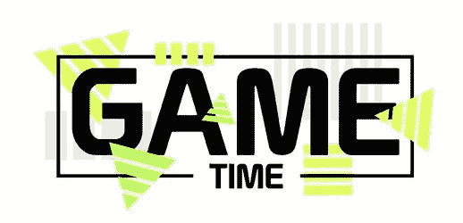

# 你可以用 Javascript 编写 7 个很酷的东西！

> 原文：<https://medium.com/nerd-for-tech/7-cool-things-you-can-codewith-javascript-4ec96471ad14?source=collection_archive---------18----------------------->

## Javascript 的应用

Javascript 是有史以来最流行的编程语言之一。它是网络编程语言，也是最容易学习的语言之一。它于 25 年前开发并推出，已经存在了很长时间。但与其他语言不同的是，它还在不断发展，并且有着广泛的应用。当谈到 javascript 时，你只受到你的想象力的限制。在本文中，我将列举一些可以用 Javascript 编写的很酷的东西。

## 1)无服务器应用程序

当我们考虑任何应用程序的功能时，我们默认应用程序运行在处理用户请求的服务器上。但是，如果有一种方法可以让您不必担心服务器基础设施的应用程序呢？这就是无服务器架构的意义所在。它允许您在云上部署许多小功能，然后这些功能一起工作来执行所需的任务。使用无服务器架构的开发人员只需为应用程序编写代码，无需担心将由云提供商管理的基础设施。人们可以使用 NodeJS 来编写 Lambda 函数(AWS)和云函数。使用无服务器架构的主要好处之一是可以创建可伸缩的应用程序。

## 2)移动应用

手机是最流行和最常用的上网工具之一。所有设计的网站都是响应式的，这样它们也可以在手机上使用。现在，为各种平台开发不同版本的应用程序可能非常繁琐。Javascript 允许用户开发跨平台的应用程序。许多 javascript 框架允许用户使用相同的框架编写支持 iOS 和 Android 设备的应用程序。最流行的两个框架是: **React Native** 和 [**Ionic。**](https://ionicframework.com/) 像沃尔玛、Airbnb、脸书这样的应用都是用 react 和 JavaScript 开发的。

## 3)游戏

对于所有的游戏爱好者来说，你可以用 javascript 开发自己的浏览器游戏。Phaser 是最流行的 javascript 游戏框架之一。它允许你开发简单的浏览器游戏。随着 HTML5 canvas 的推出，浏览器游戏的技术和复杂性有了巨大的进步。传统上，浏览器不是一个游戏平台，但现在随着这些进步，这类游戏的数量显著增加。你可以使用[这个](https://codepen.io/TheCodeDepository/pen/jKBaoN?page=8)代码作为开发你第一个游戏的参考。

## 4)制作网站动画

javascript 最广泛采用的用法是为任何网页或应用程序添加交互性。Javascript 允许用户与网页交互。它通过将网页从静态页面转换成动态页面来帮助改善用户体验。它将行为添加到网页中。您可以在网页上添加计时器，通过单击按钮隐藏或显示信息，创建搜索栏，或者改变鼠标悬停事件的颜色。说到增加交互性，您可以用一点点想象力和 javascript 技巧做任何事情。

## 5)桌面应用程序

除了移动应用，javascript 还允许你开发跨平台的桌面应用。ElectronJS 是用于相同目的的框架。使用 ElectronJS 的一个主要优势是它使用 HTML、CSS 和 Javascript 来开发应用程序，因此人们不必学习任何新的东西来开始。它允许用户为 Windows、Mac 和 Linux 开发应用程序。

## 6)飞行无人机

是的，你没看错。Javascript 应用程序并不仅限于开发移动和 web 应用程序，甚至是无服务器应用程序。它在控制无人机方面也有应用！随着无人机在拍摄风景和安全方面的应用，无人机在科技界越来越受欢迎。一些商用四轴飞行器嵌入了基本的操作系统。因此，可以安装 NodeJS。所以现在人们可以通过使用 JavaScript 很容易地给这些机器编程。这意味着我们可以通过使用 JavaScript 来编程飞行轨迹、速度、高度波动和许多其他参数。

## 7)智能手表应用

智能手表已经成为热门话题，许多关注健康的人购买智能手表来监测他们的心跳、脉搏等。但是如果我告诉你你可以自己编写应用程序呢？受欢迎的智能手表制造商 Pebble 已经创建了 [Pebble.js](https://developer.pebble.com/tutorials/pebble-js-tutorial/part1/) ，这是一个小型 javascript 框架，允许开发人员用 JavaScript 为 Pebble 系列手表创建应用程序。然后是 [Alpha WatchBench](https://sdtimes.com/alpha-software-releases-apple-watch-javascript-development-app/) ，它使用 JavaScript 帮助开发者为 Apple Watch 开发 [iOS 应用](https://intersog.com/solutions/ios-apps-development/)。

这些是您可以使用 javascript 编码和参与的一些项目。但是这个清单并没有到此为止。许多创造性的项目可以通过 javascript 使用机器学习来开发。人们也可以用 Javascript 的知识创作艺术和幻灯片。我希望你们都尝试一下 javascript，开发一些很酷的项目。编码快乐！

也可以参考—[https://artjoker.net/tpost/am477hj6o4](https://artjoker.net/tpost/am477hj6o4-what-sool-things-can-you-make-with-javas)/