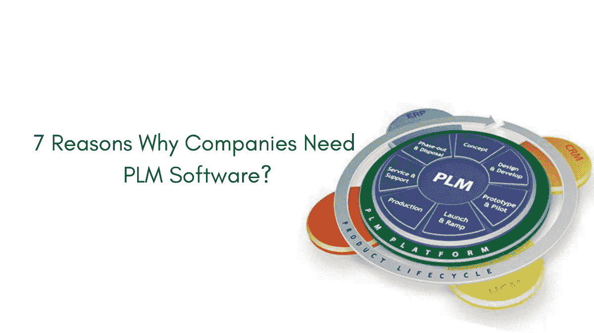

# 公司需要 PLM 软件的 7 个理由？

> 原文：<https://medium.com/nerd-for-tech/7-reasons-why-companies-need-plm-software-31f8e78721b9?source=collection_archive---------5----------------------->

产品生命周期管理软件

# 什么是 PLM？

PLM 席卷了工业 4.0，产品生命周期管理是指从最初的构思、开发、服务和处置开始，战略性地管理产品的旅程。

产品生命周期管理要求产品和流程公司在设计、采购、生产和分销的同时有效地管理数据。

# PLM 的意义和优势

产品生命周期管理软件(PLM)是一个定制的解决方案；量身定制，以满足这一竞争市场的动态特性。它确保所有部门之间的高效和有效的团队合作，维护数据管理和通信的中心空间。

PLM 有助于在产品开发生命周期中管理产品的整个过程。统计数据显示，47%的顶级产品和服务公司更有可能采用 PLM。

## **让我们了解 PLM 如何帮助您的企业蓬勃发展:**

# ㈠提高工程效率和效力:

PLM 软件不仅仅是一个工程软件套件，更是一个管理工具，帮助制造商进行产品开发。它为工程师们创建了一个互联的平台来分享他们的设计，并通过数字线程进行无与伦比的实时项目协作。PLM 的另一个业务优势是，任何从事产品开发生命周期或运营的人都不太可能遇到因使用过时信息而导致的处理错误。

# ㈡集中数据管理:

PLM 允许集中获取数据，它确保通过单一平台完成数据管理，使制造商能够全面了解组织的组成部分:工程、销售、客户成功、供应商、合作伙伴、营销和客户，为他们提供针对其需求定制的所需数据。对于目前没有 PLM 系统的组织来说，将不得不花费大量时间在不同的系统之间复制数据，交叉引用这些数据以发现任何异常，并且不得不搜索放错地方或丢失的数据。此外，PLM 允许数据在不同的地理位置之间轻松流动，没有任何噪音。

# ㈢加快上市时间:

PLM 有助于更快地推出产品，因为通信和数据管理是无缝的，允许公司通过自动化流程专注于提供客户想要的东西。

多个用户访问该产品可确保每个团队都在同一页面上。

变更由所有相关方审核，审核和批准比其他变更流程更快、更全面。BOM 是一致的，并且可以包括关于具有用户友好界面的多个过程的文档。

# ㈣降低成本:

*   **采购成本:** It 部门通过关注零件重复使用来降低库存成本，从而利用更高的组件数量、管理间接成本和工具费用。取决于你所在的行业，每 6 到 8 个工程师和设计师。
*   **管理成本:**手动文档控制和变更管理流程可能需要变更分析师、管理员或职员。一个全面的 PLM 系统可以让你把这个比例调整到 20:1。
*   **成本估算:**更早地将产品推向市场可以确保更具成本效益的生产运行。统计数据显示，较长的生产生命周期具有更可预测的成本降低，这是寿命较短的产品所不具备的。PLM 确保产品在每一个阶段都得到妥善处理，从而延长产品寿命。

# ㈤合规风险管理:

合规性风险管理是识别、评估和最大限度地减少因组织不遵守法律、法规、标准以及内部和外部政策和程序而可能造成的损失的过程。产品生命周期管理要求组织保证在整个过程中遵守法规标准和内部公司政策。

PLM 促进了集成的端到端合规管理，加快了合规时间。

# ㈥增加客户保留率:

1.  **联系客户:** PLM 还为客户成功提供了一个平台，与客户联系，了解他们的痛点，并帮助他们克服这些痛点。
2.  **提高客户忠诚度:**由于数据是集中的，公司可以很容易地收集客户对产品的反馈，并根据他们的需求做出相应的改变，从而提高客户忠诚度和忠诚度。

# ㈦提高产品质量:

当公司能够直接利用来自所有相关团队的洞察力时，他们可以优先考虑和计划成功。质量控制确保交付的产品符合公司的标准。它还会促使您的产品和客户成功团队交付最好的产品，同时提高质量并获得更多的市场份额。

# 寻找最适合你的 PLM 软件

在这个动态的环境中，PLM 应该不仅仅是一个 PLM，它应该在客户和您之间架起一座桥梁，并通过保持在客户心中的最高位置来帮助您击败竞争对手。虽然传统 PLM 可以满足其目的，但基于云的 PLM**因其易于扩展、附加功能和成本而更受青睐。**

**基于云的 PLM 通过以下方式帮助企业扩大规模或变得更加敏捷和灵活**

*   **策划新产品或投资组合。**
*   **在单一平台上与合作伙伴和供应商分享产品详情。**
*   **只需点击几下鼠标即可将信息传递给新团队成员，而不是花费数小时在多个位置部署和更新数据。**

**最好的 PLM 软件应该能够轻松适应您的需求，并帮助您实现这些优势以及更多优势；根据您的需求进行策划。**