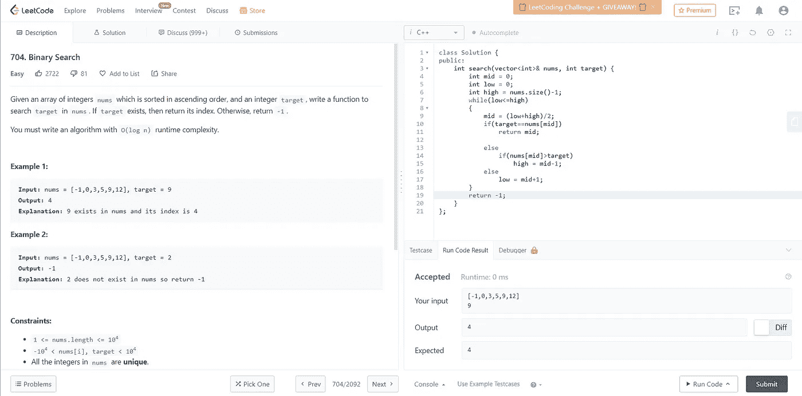

# 704.二进位检索

> 原文：<https://medium.com/nerd-for-tech/704-binary-search-717bed20f8d1?source=collection_archive---------1----------------------->

(LeetCode 易题)

给定一个按升序排序的整数数组`nums`和一个整数`target`，编写一个函数在`nums`中搜索`target`。如果`target`存在，那么返回它的索引。否则，返回`-1`。

你必须写一个运行时复杂的算法。

**例 1:**

```
**Input:** nums = [-1,0,3,5,9,12], target = 9
**Output:** 4
**Explanation:** 9 exists in nums and its index is 4
```

**例 2:**

```
**Input:** nums = [-1,0,3,5,9,12], target = 2
**Output:** -1
**Explanation:** 2 does not exist in nums so return -1
```

**约束:**

*   `1 <= nums.length <= 104`
*   `-104 < nums[i], target < 104`
*   `nums`中的所有整数**都是唯一的**。
*   `nums`按升序排序。

首先，让我们了解一下什么是二分搜索法以及它是如何工作的？

二分搜索法工作所需的唯一条件是数组元素必须按升序或降序排序。

比方说，数组按升序排序，nums = [1，2，3，4，5，6，7]。现在让我们说，我们需要找出 6 是否存在，如果存在，在什么位置。

这正是二分搜索法的样子，它将数组分成两部分，最后只遍历数组中满足基本要求的那部分。

每次遍历时，它不断地将数组分成两半，如果在线性搜索的情况下必须遍历整个数组，这通常会降低时间复杂度。

这是二分搜索法的以下代码。既然我已经告诉了你们如何遵循逻辑，我希望你们做一个尽可能多的例子的快速预演，这将会加强你们的概念，并且很明显会让你们清楚这个算法的工作基础。

所以这里二分搜索法的**时间复杂度**是 **O(logN)** 其中 N 是数组的大小**空间复杂度**是 **O(1)** 。

当要寻找的数组元素位于数组中间时，**最佳时间复杂度**归结为 **O(1)** 。

```
**class Solution {
public:
    int search(vector<int>& nums, int target) {
        int mid = 0;
        int low = 0;
        int high = nums.size()-1;
        while(low<=high)
        {
            mid = (low+high)/2;
            if(target==nums[mid])
                return mid;

            else
                if(nums[mid]>target)
                    high = mid-1;
            else
                low = mid+1;
        }
        return -1;
    }
};**
```



希望你喜欢花时间通读基本算法的基础知识，并对如何解决它们有一个清晰的概念。恭喜你，继续学习！🙌💻

请继续关注更多此类文章！！干杯！！

如果你喜欢看我的博客，为什么不给我买杯咖啡，支持我的工作呢！！[https://www.buymeacoffee.com/sukanyabharati](https://www.buymeacoffee.com/sukanyabharati)☕