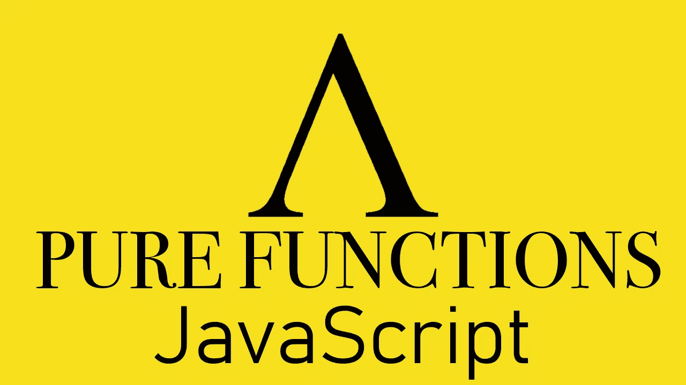

# 让你用 JavaScript 编写真正纯函数的 8 个概念

> 原文：<https://medium.com/nerd-for-tech/8-concepts-to-make-you-code-truly-pure-functions-in-javascript-316c430a7ed?source=collection_archive---------3----------------------->

## 就像在函数式编程语言中一样

[作者制作的图片](http://arnoldcode.com/newsletter)与❤

纯函数的行为与数学函数相同，并给你带来不同的好处。如果它符合两个条件，则被认为是一个:

1.  **给定相同的参数，函数总是计算并返回相同的结果。**