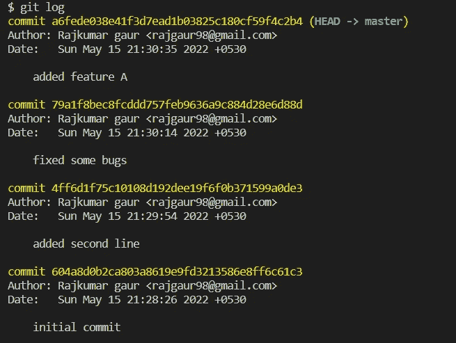
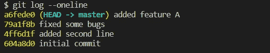
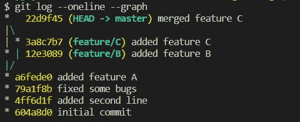
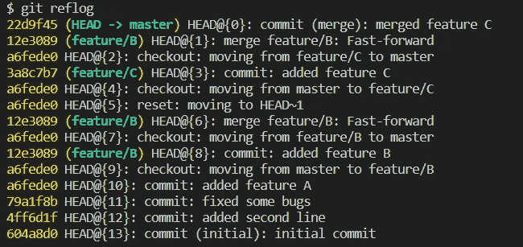
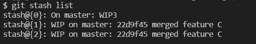
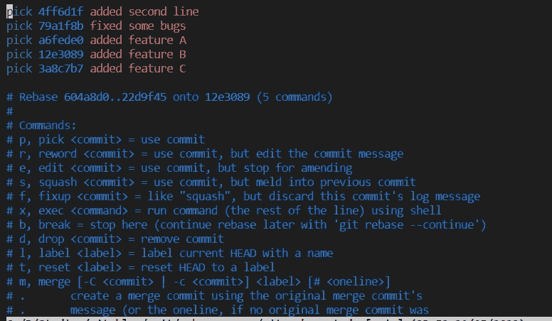

# 我每天使用的 8 个 git 命令

> 原文：<https://medium.com/nerd-for-tech/8-git-commands-i-use-every-day-69d1d3f2f7f8?source=collection_archive---------0----------------------->

不包括拉、推、添加和提交…

罗曼·辛克维奇·🇺🇦在 [Unsplash](https://unsplash.com?utm_source=medium&utm_medium=referral) 上拍摄的照片

与团队合作时，Git 可能比单独工作复杂得多(更令人讨厌的冲突)。下面是我如何使用 git 度过一天的。这里不包括常见的命令，如 git add、commit、push 和 pull。

# git 开关

这是一个非常简单的命令。`git switch`用于切换到新的或现有的分支。

切换到现有分支:`git switch <branch-name>`
切换到(并创建)新分支:`git switch -c <branch-name>`

# git 日志

`git log`显示当前分支的提交历史。它显示了下面的输出。

要查看更简洁的版本，请使用`git log --oneline`

要查看提交历史的图表，请使用`git log --oneline --graph`

# git 参考日志

在 git 中没有什么是真正丢失的。即使您重置了提交或删除了分支，您也可以使用`git reflog`再次访问您的代码。它显示了你在 git 中所做的每一个小的改变，比如切换分支、提交代码等等。让我们看看输出，以便更好地理解。

示例:如果您错误地重置为旧的提交，并希望再次访问已删除的提交，您可以使用 reflog 返回到重置前的状态！

如果你想去一个旧的状态，假设在`HEAD@{6}`，你可以使用`git checkout HEAD@{6}`这将让你到一个分离的头状态。您可以使用`git switch -c <new-branchname>`切换到具有分离头状态的新分支，并在不影响其他分支的情况下继续您的新功能。

# git 还原

这是一个非常简单但有用的命令。如果你在工作目录中有任何改变，你希望恢复到文件头中的状态，你可以使用`git restore <file-name>`

如果需要放弃所有文件中的更改，可以使用`git restore .`。

以上仅适用于尚不在临时区域中的文件。使用`git restore --staged <file-name>`恢复暂存区中的文件。这将从临时区域中删除文件，但不会恢复文件中的更改。再次使用`git restore <file-name>`来实际恢复更改。

# git 贮藏

Stash 用于临时丢弃工作目录和暂存区中的更改，并将它们分开存储。这通常在您想要在不实际提交代码的情况下在分支之间切换时使用。在储藏之后，树枝处于干净的状态。

使用`git stash`保存当前代码。或者，使用`git stash save <stash-name>`来命名 stash 条目，以便于参考。

使用`git stash list`查看所有隐藏物品的列表

`stash@{0}`是名为 WIP3 的已命名 stash，其他的默认名称与最新提交的名称相同。

为了实际检索存储在 stash 中的代码，转到所需的分支并执行`git stash pop`,这将删除最新的 stash 条目，并将这些更改应用到当前分支之上。要检索任意隐藏条目，请使用`git stash pop stash@{n}`

# git rebase -i

我个人喜欢交互式 rebase 命令来重写提交历史(如果需要的话)。我用它来压缩、删除或修改提交的内容，但是这个命令提供了许多其他的子命令，你可以探索一下。

运行`git rebase -i HEAD~5`查看最近 5 次提交(5 可以用任意数字代替)。它将打开一个编辑器，在我的例子中是 vim

对于挤压，用`squash`替换`pick`，这将把提交合并到先前的提交中。删除时，将`pick`替换为`drop`。为了更新提交消息，用`reword`替换`pick`并更新该行上相应的提交消息。

保存后退出 vim 编辑器。对于不熟悉 vim 的用户，按`i`进入编辑模式。编辑提交，按 escape，然后按`:wq`保存并退出。

# git 重置

使用 git reset 将头部指向前一次提交。使用`git reset <old-commit>`将头部重置为该提交，并删除该旧提交之后的任何提交。

以上只会重置提交，但代码不会被改动。要重置代码，请使用`git reset --hard <old-commit>`

# git 提交—修改

如果你想修改代码并在同一个提交中使用`git commit --amend -m "msg"`推送代码，这将**而不是**添加一个新的提交，而是用新的代码和消息更新最新的提交。这通常也用于在代码没有任何变化的情况下，重新表达提交消息。

那都是乡亲；)
我会再写一篇博客来解决矛盾。
另外，如果你使用这些命令有任何不同，请在评论中告诉我！