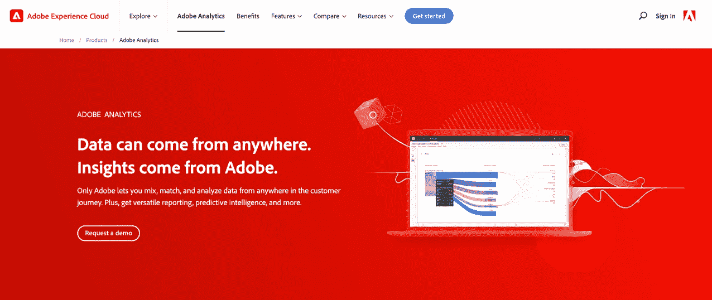
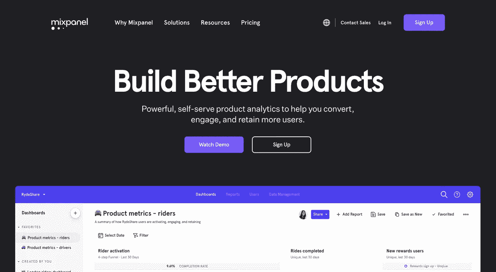
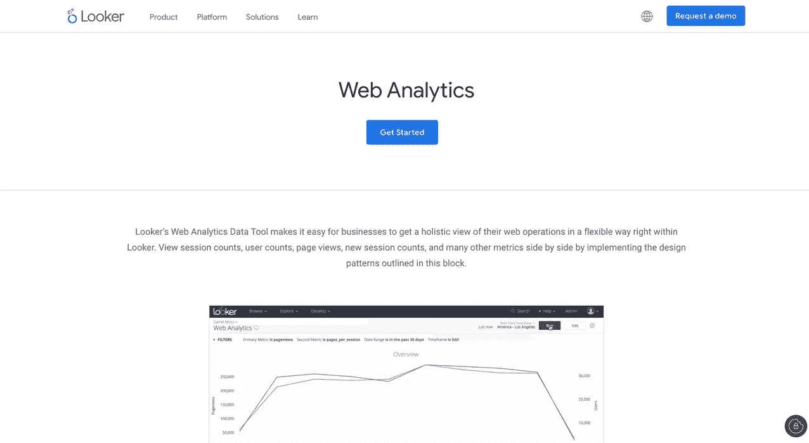
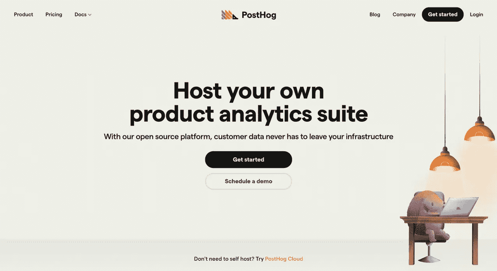
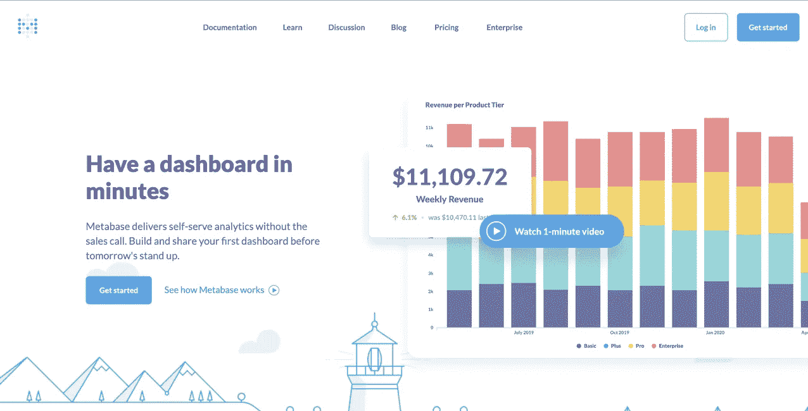
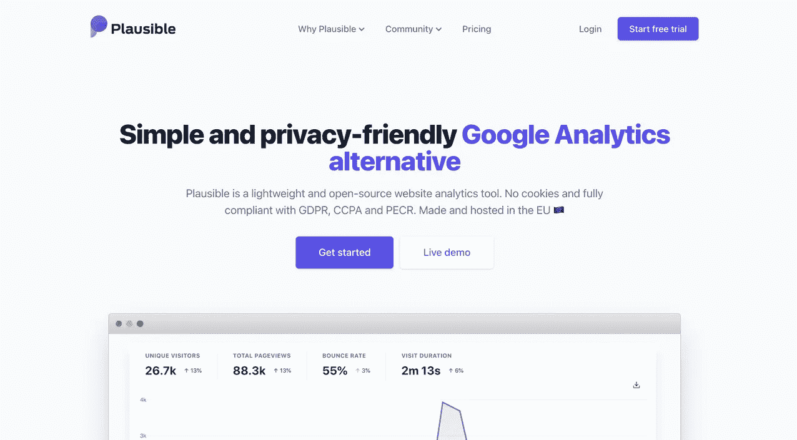
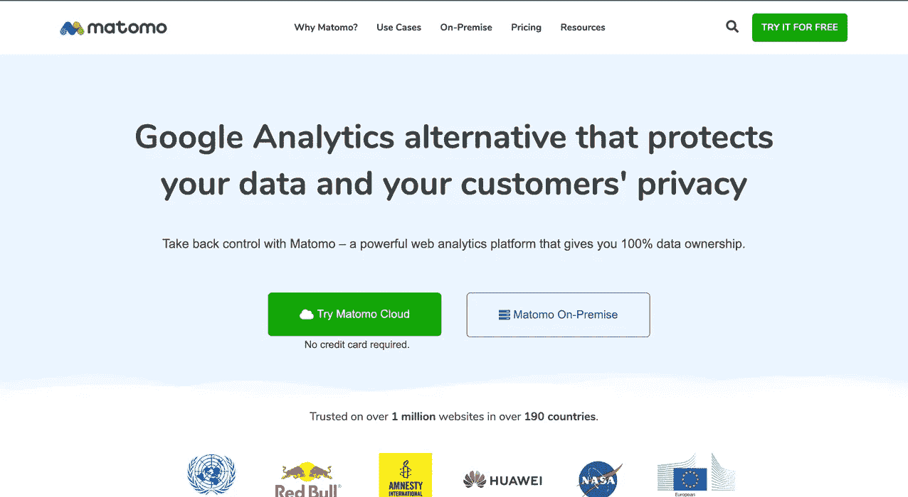
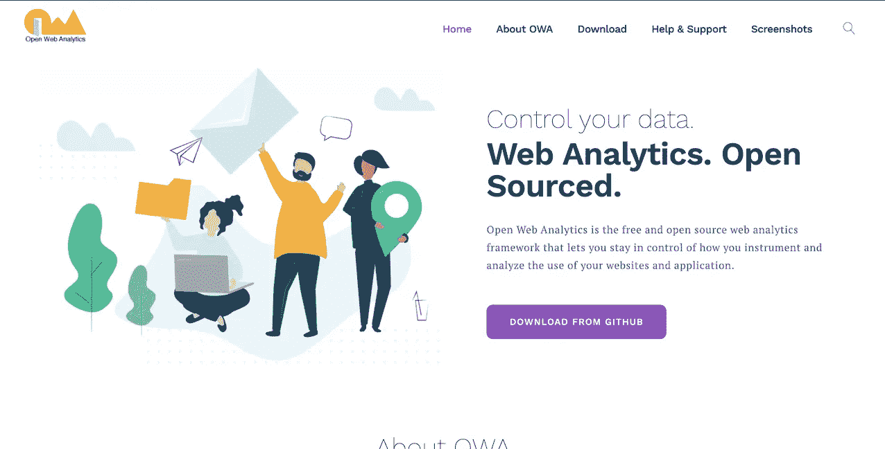

# 8 个谷歌分析备选方案(企业和开源)

> 原文：<https://medium.com/nerd-for-tech/8-google-analytics-alternatives-enterprise-and-open-source-51a215713ca2?source=collection_archive---------8----------------------->

你看过没有字幕的外国电影吗？你只有故事的一面——移动的画面——你对正在发生的事情有一些想法，但是你不能确定这部电影是关于什么的，除非你得到字幕。谷歌分析也是如此。虽然谷歌分析可以向你展示有用的信息，比如谁访问了你的网站，他们什么时候离开的，但它并不能说明全部情况。

谷歌分析是一个知名品牌的免费分析软件，所以人们默认会被它所吸引——但它也有漏洞。它有一个复杂的仪表板，需要培训才能充分利用它。Google Analytics 通过收集大量个人数据默认个人数据和隐私法规，如通用数据保护法规(GDPR ),这可能会导致您的网站出现责任问题。

此外，谷歌分析使用数据采样，这种方法会给你留下不准确的见解。例如，它在一定数量的事件(比如 500，000 个事件)后对您的流量数据进行采样。因此，与其保留所有的 500，000 个事件，不如抽取 10%的样本并按比例放大。

行业正朝着更加灵活和易于使用的分析工具发展，所以你不会被谷歌分析所束缚。在这里，我们探索不同的全面的谷歌分析替代方案-包括企业和开源选项-为您的公司提供产品和网络分析选项。我们还分析了每个工具提供的功能，以及它与 Google Analytics 的不同之处。

# 企业谷歌分析替代方案

如果您正在寻找处理安全性、托管和维护成本的工具，企业选项是您的最佳选择。以下是谷歌分析的一些企业替代方案:

# 1.Adobe Analytics

*来源:*[*Adobe Analytics*](https://business.adobe.com/products/analytics/adobe-analytics.html)

**它是什么:** [Adobe Analytics](https://business.adobe.com/products/analytics/adobe-analytics.html) 提供了一套工具，让您可以收集、测量和探索用于预测流量和获得洞察力的数据。它有一个交互式分析工作区，可以帮助您轻松地拖放数据表、可视化和组件。

Adobe Analytics 提供了一种高级报告模式，使您能够在站点的不同页面上构建和分析客户的转化过程。实时细分功能使用机器学习模型来预测客户行为并降低客户流失风险。它还有一个流程分析图，可以帮助你了解你的客户是如何浏览你网站的每一页的。

**它与谷歌分析有何不同:**

*   Adobe Analytics 使用一个功能强大的界面，即“专用分析工作区”，来报告、可视化和分析数据。相比之下，Google Analytics 使用多个报告界面——一个定制的 GA 界面、Google Data Studio 和 Analysis Hub 界面(可供 GA360 用户访问)。
*   Adobe Analytics workspace 有一个拖放选项，可以轻松构建和共享报告。尽管这一功能在 Google Analytics 4 中有所改进，但它仍然需要与 Google Data Studio 建立连接来构建复杂的定制报告。
*   Adobe Analytics 提供[多通道数据收集](https://business.adobe.com/mena_en/products/analytics/multichannel-data-collection.html)，使您能够从不同来源(如 web、移动设备、电子邮件和客户端服务器端应用程序)捕获数据。相比之下，谷歌分析没有多渠道的数据收集。

# 2.混合面板

*来源:*

***它是什么:** [Mixpanel](https://mixpanel.com/) 是一个分析工具，让企业深入研究网站和移动应用程序上的用户行为。Mixpanel 可以让你根据用户在你的网站上进行或没有进行的操作来对他们进行分组，并且很容易地比较趋势。*

*通过其保留报告功能，您可以看到哪些网站用户群会留下来，以及是什么让他们保持兴趣。它的仪表板和警报可以为您的团队实时定制，当指标发生变化时，您会收到通知。Mixpanel 提供了[超过 50 种集成](https://mixpanel.com/integrations/)，包括内容管理系统(CMS)、消息和营销自动化平台、数据库、客户支持系统等。*

***它与谷歌分析有何不同:***

*   *Mixpanel 为您提供了一个灵活的数据模型层，允许您将数据转换成“类似 Excel 的命令”相比之下，谷歌分析有一个严格定义的数据模型，这是有限制的。*
*   *Mixpanel 提供[独特的用户数据实时报告](https://mixpanel.com/blog/how-real-time-data-is-changing-business-optimization/)，而 Google Analytics 报告很慢，需要很长时间来显示数据。*
*   *使用 Mixpanel，您可以轻松地(在几分钟内)构建定制仪表板，并在指标发生变化时设置警报。相比之下，谷歌分析定制仪表板相当复杂和有限。*

# *3.检查员*

**

**来源:* [*看客*](https://looker.com/platform/blocks/data-tool/web-analytics)*

***它是什么:** [Looker](https://looker.com/platform/blocks/data-tool/web-analytics) 是一个商业智能和大数据分析平台，提供实时探索、分析和可视化大数据的解决方案。Looker 的 web 分析工具使您能够创建交互和动态仪表板(多个用户可以同时工作)。它可以让您全方位了解您的客户正在做什么(例如，独立访问者、会话计数、每次会话的参与情况)。*

*仪表板有大量的过滤器，使您能够对 web 数据进行切片和切块，并获得深入、有价值的业务见解(例如，针对网站中不同属性的属性过滤器)。它还提供内部和云托管选项。*

***它与谷歌分析有何不同:***

*   *Looker 有一个易于使用的用户界面和仪表板，与谷歌分析复杂的用户界面和仪表板相比，你的团队中的任何人都可以理解。*

# *开源谷歌分析替代方案*

*虽然拥有企业工具很好，但通过这些开源的 Google Analytics 替代品，您可以拥有控制权、灵活性和对代码库的访问权。*

# *4.海报*

**

**来源:**

****它是什么:** [PostHog](https://posthog.com/) 是一个开源的产品分析平台，可以直接与您的数据仓库和事件管道配合使用，让您能够控制您的客户数据。它允许你自动跟踪不同的事件，如点击、页面浏览、表单和点击。使用 PostHog，您可以创建灵活的仪表板来显示您的产品性能指标，如购买、注册和转换。如果您想要托管自己，PostHog 是非常好的选择，可以选择迁移到云、私有云部署，甚至将数据保留在您的基础架构中。**

****它与谷歌分析有何不同:****

*   **PostHog 有两个谷歌分析没有的独特内置功能:功能标志和会话记录。[特性标志](https://posthog.com/docs/user-guides/feature-flags)使您能够向用户部署和推广新特性。[会话记录](https://posthog.com/docs/user-guides/session-recording)使您能够记录用户如何浏览您的网站，并允许回放单个会话。**
*   **PostHog 有一个交互式用户界面，用于可视化您的产品和不同用户路径上的网络流量，而在 Google Analytics 中，这个过程相当复杂，而且没有洞察力。**

**“PostHog 是一个产品分析平台，而不仅仅是一个网站分析平台。营销团队经常使用谷歌分析来跟踪页面浏览量等信息，但 PostHog 可以跟踪更广泛的事件，并提供专门的工具来帮助产品和工程团队理解为什么他们的产品会发生这些事情。— [乔·马丁](https://www.linkedin.com/in/joemartinwords/)，PostHog 的产品营销主管**

# **5.元数据库**

****

***来源:* [*元数据库*](https://www.metabase.com/)**

****它是什么:** [Metabase](https://www.metabase.com/) 是一个开源的商业智能和分析工具，它连接您的数据库，并为每个人(无论是否是 SQL 专家)提供一种简单的方法来获得答案并从数据中学习。它有一个交互式仪表板，您可以共享和自动创建报告。Metabase 不仅是开源的，还提供云和企业托管选项。**

****它与谷歌分析有何不同:****

*   **尽管 Metabase 不能完全取代 Google Analytics，但它可以让您对数据进行深入分析。**
*   **您还可以通过添加数据库连接[来集成 Google Analytics](https://www.metabase.com/docs/latest/administration-guide/01-managing-databases.html)，并获得关于您的数据的答案和见解。**

# **开源网络分析替代方案**

**上述工具专门用于产品分析，但如果您正在寻找开源 web 分析的替代方案，您可以查看以下工具:**

# **6.花言巧语的**

****

***出处:* [*似是而非*](https://plausible.io/)**

****它是什么:** [似是而非](https://plausible.io/)是一个开源的网络分析工具，让初创公司、自由职业者和博客作者通过一个易于使用的仪表板来测量网站流量指标。这个工具使用一个单独的页面根据用户在你的网站上的参与度来呈现详细的网站统计数据。这个看似合理的脚本不到 1kb，所以你不用担心你的站点在添加它的时候会变慢。**

**您的网站访问者的隐私得到了保证，并且网站性能是匿名进行的，不需要 cookies 或个人数据。似是而非使用一个公共的路线图来提供功能建议和一个你可以参与的活跃社区。**

****它与谷歌分析有何不同:****

*   **似是而非是一个易于使用的工具，不需要你的团队培训，而谷歌分析是复杂和混乱的使用。**
*   **似是而非的分析脚本是轻量级的(它不影响网站速度)，而谷歌分析是重量级的，可以降低你的网站速度。**
*   **似是而非的分析符合 GDPR 和 cookie 的法律，从而尊重您的网站访问者的隐私。相反，谷歌分析强迫你发送 cookies 并收集网站访问者的数据。**
*   **似是而非的分析是开源的，这意味着代码库可以在 GitHub 上公开获得，而谷歌分析是闭源的。**
*   **似是而非提供你的数据和自托管服务的 100%所有权，而谷歌分析妥协你的数据。**

# **7.马托莫**

****

***来源:* [*马托莫*](https://matomo.org/)**

****它是什么:** [Matomo](https://matomo.org/) 称自己是一个“强大的网络分析平台”，可以让你控制你的网站数据。Matomo 保护您的内部网站和内部网应用程序的数据。**

**当涉及到被跟踪的网站、报告、细分市场、目标、页面浏览量、用户数量等时，这个工具也不限制数据。它可以与 100 多种技术轻松集成。**

****它与谷歌分析有何不同:****

*   **Matomo 利用您的数据进行报告，并给出 100%准确的报告，而 Google Analytics 进行数据采样，随着时间的推移，会给出不准确的假设。**
*   **Matomo 符合 GDPR、CCPA 和 cookie 法，因此尊重您的网站访问者的隐私。相反，谷歌分析强迫你发送 cookies 并收集网站访问者的数据。**
*   **Matomo 提供自托管，给你灵活性和对数据的控制，而谷歌分析是远程托管的。**
*   **Matomo 允许与 Google 搜索控制台、Bing 搜索控制台和 Yahoo 搜索控制台集成，而 Google Analytics 只允许与 Google 搜索控制台集成。**

# **8.开放网络分析**

****

***来源:* [*打开网页分析*](https://www.openwebanalytics.com/)**

****它是什么:** [Open Web Analytics](https://www.openwebanalytics.com/) 是一个开源的 Web 分析平台，可以让你分析和跟踪你的网站和应用程序访问者。它通过简单易用的控制面板灵活监控您的分析。**

**Open Web Analytics 允许您定义和跟踪无限的站点操作和交互。有一个热图功能可以显示网站访问者点击你网站的位置。Open Web Analytics 通过数据访问 API 执行自定义细分，并与 WordPress 和 MediaWiki 等 CRM 集成。**

****它与谷歌分析有何不同:****

**Open Web Analytics 使用内置的热图工具来发现用户点击的位置并监控鼠标的移动。而在谷歌分析中，你必须安装[页面分析扩展](https://chrome.google.com/webstore/detail/page-analytics-by-google/fnbdnhhicmebfgdgglcdacdapkcihcoh?hl=en)才能访问热图。**

**Open Web Analytics 提供对多个网站的无限制跟踪，而 Google Analytics 每个帐户仅限 50 个个人资料。**

**Open Web Analytics 内置了 CMS 集成。相比之下，谷歌分析只允许通过第三方插件集成。**

# **集成客户数据平台，一次获取所有数据**

**每个分析工具都有一套独特的特性和功能。但是，它需要多个分析工具来跟踪从您的网站做出数据驱动的决策所需的一切，每个工具都承载着大量的 API 和性能成本。**

**虽然有一个以上的分析软件来跟踪你的网站是明智的，但由于网站性能缓慢、集成链接中断、API 更改等挑战，跟踪所有的分析软件并不容易。**

**另一方面，无论上述哪种工具对您有意义，像 [RudderStack](https://rudderstack.com/product/event-stream) 这样的客户数据平台可以捕获所有事件数据，并自动将数据分发到多个分析工具。RudderStack 还为您的所有客户数据提供了一种[仓库优先的方法](https://rudderstack.com/blog/your-guide-to-creating-a-warehouse-first-data-analytics-stack)。立即通过[注册 RudderStack](https://app.rudderlabs.com/signup?type=freetrial) 体验无缝的客户数据集成。**

***本博客最初发表于:* [*https://rudder stack . com/blog/8-Google-analytics-alternatives-enterprise-and-open-source*](https://rudderstack.com/blog/8-google-analytics-alternatives-enterprise-and-open-source)**