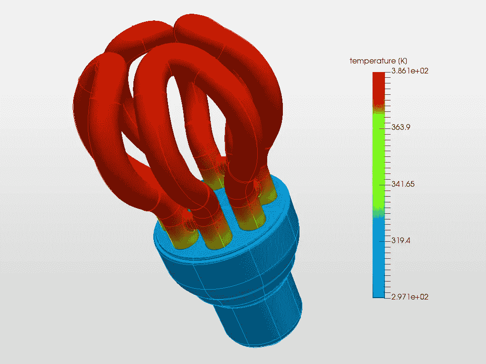
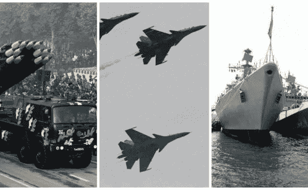

# 机械工程毕业后要做的 8 件事

> 原文：<https://medium.com/nerd-for-tech/8-things-to-do-after-mechanical-engineering-2dd9045558ff?source=collection_archive---------2----------------------->

> “做伟大工作的唯一方法是热爱你所做的事情。如果你还没有找到，继续寻找。不要和解。”~史蒂夫·乔布斯

你渴望成为一名机械工程师，现在你已经成为了，为自己感到骄傲。机械工程是工程专业的热门方向之一，因为它在就业机会上具有多样性。根据 AICTE 的数据，每年大约有 150 万工程师毕业。2019 年的调查显示，印度约有 78.3 万名学生注册学习机械工程。机械工程的范围很广。一个机械工程师可以随便选择任何一条职业道路，并且很容易生存下来。你现在可能会想到一个著名的问题

# 机械工程毕业后做什么？

让我带你看看下面的一些选项

# 1.出国留学

毕业后继续深造也许是你的选择之一。如果你觉得接触印度教育系统之外的东西是你的事情，那么计划留学是完美的。在机械工程的不同子领域有各种硕士课程。我将带你通过一些课程，虽然它不是按顺序。尽管除此之外还有更多选择。

*   一般在脑海中首先蹦出的选择是机械工程 中的 [**MS。虽然这是一个更广泛但更先进的领域，但专业知识的范围很广。该课程深入机械理论/实践和能源系统以及设计。完成这门课程后，学生可以进入汽车、化工、航天、制造等行业。他们得到的职位有项目经理、农业或机械工程师、制造经理等。**](https://studyabroad.shiksha.com/ms-in-mechanical-engineering-from-abroad-ds11509265)
*   另一个近来越来越受欢迎的领域是机器人和自动化。人工智能和机器学习对这个领域有着巨大的影响。所有的制造厂现在都自动化了，需要熟练的工程师来操作。
*   如果你有兴趣成为蓬勃发展的电子行业的一员，机电硕士学位可以成为你的选择之一。对机械的热爱和对电子的兴趣是必须的。如果你是一个汽车爱好者，你也会学习汽车电子。
*   对于汽车爱好者来说，**汽车工程或车辆设计硕士**再合适不过了。你将处理不同的汽车设计、制造和测试过程。如今，电动汽车正在蓬勃发展。汽车专业有很大的发展空间
*   最后但同样重要的是，你可以攻读航空航天 **或电动汽车**领域的 [**硕士学位，这是一个蓬勃发展的行业，有许多分支和专业领域。在国外有很多学习这些领域的机会。**](https://www.mastersportal.com/disciplines/37/aerospace-engineering.html#:~:text=Getting%20a%20Master's%20or%20Bachelor's,will%20be%20conducting%20after%20graduation.)

在选择最适合你的课程时，你可能会发现许多未列出的课程。让我们在评论中了解他们。

# 2.MTech 学位

如果你是家长，但仍想接受高等教育，不要担心印度会支持你。你可以在各种机构中查找 MTech。但是，写 GATE 是在印度追求[MTech](https://www.shiksha.com/engineering/colleges/m-tech-colleges-india)的必经之路。MTech 是一门为期两年的课程，建立在你在机械工程时代所获得的知识基础上。坚持单一部门往往是一种误解。在这个现实世界中，工程的每个领域都是相互联系的。因此，为你的进一步研究选择一个多学科领域将是一个优势。印度不同的大学提供广泛的 MTech 课程。

*   **机电一体化 M . Tech**:一个跨学科领域，涉及电气、电子、机械以及传感器、机器人和计算机。每个行业都需要机电一体化的知识来进行设计和开发。
*   **生产工程技术(M . Tech in Production Engineering)**:是产品制造过程中所有过程的设计、开发、实施、操作、维护和控制。
*   **机器人学 M . Tech**:研究不同机器人及其组件的设计、建造和开发，包括不同类型的传感器。

# 3.行业内的工作

由于机械工程涉及任何机械零件的设计、开发、安装、操作和维护，因此每个行业都需要一名机械工程师。毕业生在不同的领域工作，包括制造业、汽车研究和航空学。我列举了几个你可以在下面工作的行业。

在你的本科时代，你一定学过以下科目。所有这些科目将帮助你在各自领域选择任何核心技术职业。

制造工程师

你将使制造过程发生。无论是大批量生产的商品，还是专业的超高科技设备，你们创造了设计和生产我们日益增长的人口所依赖的商品的机器和技术。根据工业 4.0，制造过程还涉及自动化。机械工程师赋予参与自动化的机器人生命。

汽车工程师

机械工程师推动着汽车工业。他们为各种类型的移动车辆设计底盘、轮组和燃烧系统。从 2 轮到 10 轮卡车，从 80 座巴士到 2 座 F1 赛车，机械工程师负责运动。汽车工程师利用电动汽车、太阳能电池板、氢电池和其他技术来寻找更好的交通方式。

航空工程师

航天工程师都在空中。无论是飞机，战斗机，还是火箭和导弹，他们都考虑到了设计和热力学。他们设计更节能的飞机，减少排放，建立卫星舰队，为现代 GPS 技术提供动力，并创造下一代航天器。

工艺工程师

过程工程师管理机械过程，并想方设法使它们更有效、更安全，并提供更好的质量。它们直接影响着世界上几乎每一个主要的机械行业，从供水、石油和天然气到制药和食品制造。

铁路和水路工程师

机械工程师负责运动。铁路的每个方面都依赖于机械工程师，如轨道、发动机、隧道、障碍物和桥梁。类似地，水路包括小船、轮船、潜水艇和喷气式飞机。他们还研究能源生产系统，如水力发电厂和涡轮机、风车等。

生物医学工程师

起搏器、人工瓣膜，甚至机器人手术助手都是机械工程师的作品。他们通过创造机器拯救生命来赋予生命。就连手术刀片和手术刀等设备都是由机械工程师设计的。

# 4.成为研究助理

[研究助理](https://www.linkedin.com/jobs/research-assistant-jobs-bengaluru/?originalSubdomain=in)在各个研究所和大学协助学术或私人研究。研究助理的主要职责是通过收集、分析和解释数据，为研究员或研究团队提供支持。如果你对能带来创新的研究感兴趣，那么研究助理的职位最好能获得实践经验和曝光率。你将体验研究生活的许多方面，并发展技能，如数据分析、沟通和解决问题。你可以在不同机构的不同教授手下做研究助理。IITs、NITs 和所有其他机构都有研究助理的职位，可以和教授一起写论文。

# 5.提升自己的技能

在今天的世界上，有成千上万的失业毕业生，而其他技术毕业生最终从事非核心工作。其中一个原因可能是教育系统与行业没有联系。今天，随着新技术的出现，行业不时发生变化，但我们的课程仍然是一样的。另一方面，员工正在寻找能够增加商业价值的技能型人才。然而，可用的人才需要培训和指导，使他们为行业做好准备。因此，请随时关注行业的最新发展。花积极的时间不仅学习课本以外的技能，而且发展跨学科的技能。因为设计是这个行业的主要部分之一，你应该用不同设计软件的知识来提升自己，比如 Catia，AutoCAD，NX，或者 Creo。有各种在线课程可供你学习工业技能。

我们有各种各样的课程，特别是机械工程师的课程，如下所列。你还在等什么？今天就加入我们，获得您的行业认证。

# 6.工商管理硕士

现在你已经有了很强的技术背景，你也需要一些非技术和管理技能。通过 MBA，你将获得诸如营销、金融、人力资源、演示、管理和其他软技能等技能。

不同的专业有:-

*   金融
*   营销
*   人力资源
*   国际商业
*   物流和供应链
*   操作
*   信息技术
*   零售管理
*   战略
*   商业分析
*   电子商务

对于有机械工程背景的学生来说，尽管根据你的兴趣有很多课程可供选择，还是推荐**运营管理或项目管理的 MBA**。运营管理 MBA 学位会让你接触到商业运营和职能的各个领域。项目管理允许您管理各种正在进行的项目。

# 7.企业家

你想自己当老板吗？那么自己创业是一个不错的选择。创业是最新的时尚，但创业并让它脱颖而出才是真正的成功。尽管这将是最艰难的一天，每天都会有很多起伏。一个坚定的企业家克服挑战，从每一次失败中学习和收获。你可以用你的机械知识来开始你自己的冒险，并且努力工作。你可以是技术型的，也可以是非技术型的，但任何事情都需要技巧和决心。你在 Btech 期间获得的所有知识可能都不是必需的，但整体的全面发展和技能将使你成功。

# 8.武装部队

作为 Btech 毕业生，你有如此多的机会加入印度武装部队的技术团队。因为你是一名机械工程师，所以在所有三个部队的工程流中将会有大量的空缺。机械工程师是印度军队的中坚力量。他们负责维护修理机器、车辆、飞机和武器的团队。此外，他们的工作是基于情况的多学科。

毕业后你可以通过三种方式加入印度军队

1.  写作**联合防务服务由 UPSC 进行。一旦通过考试，候选人将获得永久委任并在德拉敦的 IMA 接受培训。**
2.  **[**短期服务委员会**](https://afcat.cdac.in/AFCAT/generalTerms&Conditions.html) **(SSC)由服务选择委员会(SSB)** : —本条目没有笔试。根据截止到第六学期的分数，候选人被列入 SSB 面试的入围名单。*如果你想加入你的核心流，你可以选择 SSC(tech)或者你可以选择 SSC(Non-tec* h)。**
3.  **有一个条目叫做 TGC 条目即 [**技术研究生课程条目**](https://joinindianarmy.nic.in/writereaddata/Portal/NotificationPDF/tgc_130.pdf) 。你需要有一级学士学位，并且可以在 25 岁以下申请**

****

**机械工程的分支渗透到各行各业。你可能已经学习了你需要知道的大部分东西，当然除了电子、计算机、通信等方面的细节。但是你也会学到所有这些的基础知识。即使你打算走那条路，你也只需要知道这些。不是每个人都是命中注定的。做你爱做的事，做你想在这个世界上看到的改变。你现在选择职业了吗？**

****请在评论区告诉我们更多选项。在下面评论你选择的职业和你的疑问。****

***最初发表于 2021 年 2 月 5 日 https://www.elitetechnogroups.com**的***