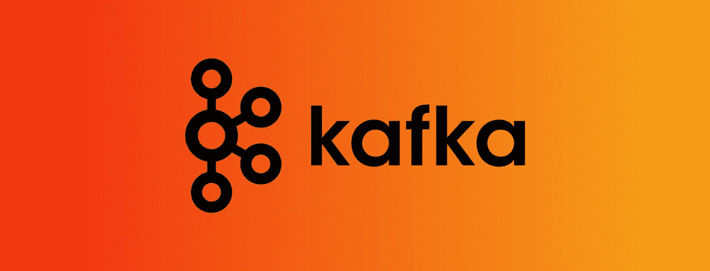
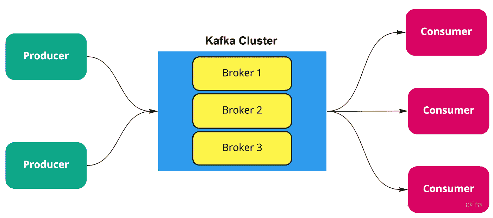
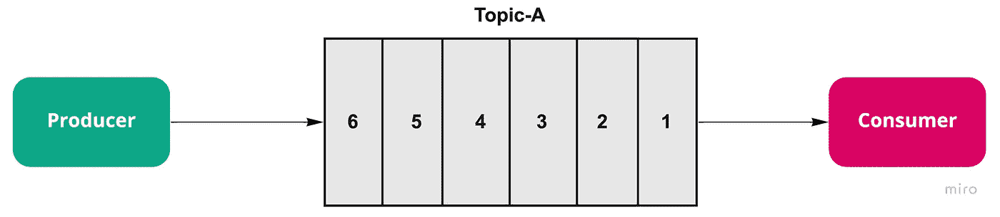
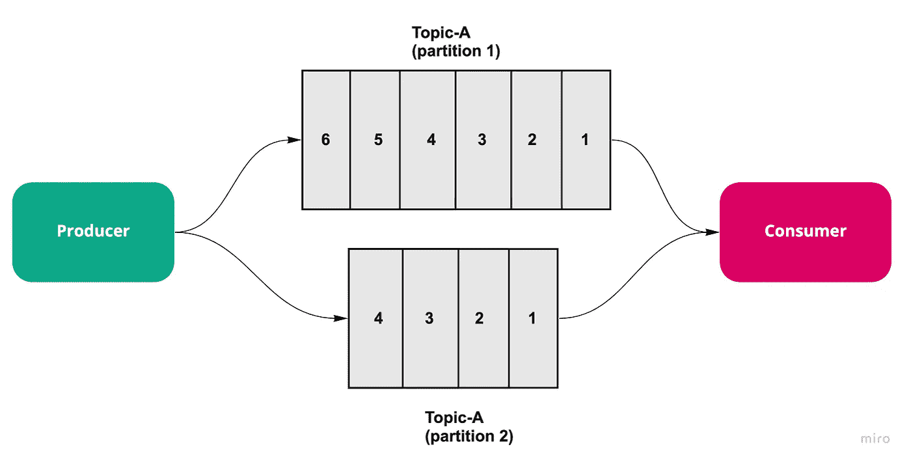

# 阿帕奇卡夫卡:基本介绍

> 原文：<https://medium.com/nerd-for-tech/a-basic-introduction-to-kafka-a7d10a7776e6?source=collection_archive---------1----------------------->

[图像来源](https://www.metricfire.com/blog/kafka-monitoring-using-prometheus/)

在这篇博文中，我将简单介绍一下*阿帕奇卡夫卡*以及入门卡夫卡所必须知道的术语。

# 卡夫卡——是什么？

简而言之，Kafka 是一个分布式系统，允许多个服务通过其基于队列的架构相互通信。这样一来，让我们开始了解一些基本的卡夫卡术语。让我们开始吧；)

**代理**:一个*代理*是一个服务器，上面运行着 Kafka，负责多个服务之间的通信。多个经纪人将形成一个 Kafka 集群。

**事件**:由 Kafka 代理产生或消费的消息被称为*事件*。这些消息以字节的形式存储在代理的磁盘存储器中。

**生产者和消费者**:向 Kafka broker 产生这些事件的服务被称为*生产者*，消费这些事件的被称为*消费者*。同样的服务也有可能既产生又消费来自 Kafka 的消息。

**主题**:为了区分 Kafka 中存储的事件类型，使用了主题。简而言之，*主题*就像文件系统中的一个文件夹，其中只存储与特定类型相关的事件或消息。例如:“支付-详情”、“用户-详情”等。

**分区**:为了获得更高的吞吐量，可以将一个主题进一步划分为*分区*。它是保存主题数据子集的最小存储单元。

**复制因素**:一个分区的副本是那个分区的备份。主题的*复制因子*决定了 Kafka 集群应该维护该主题中的多少个分区副本。分区为 1、复制因子为 2 的主题意味着相同数据的相同分区的两个副本将存储在 Kafka 集群中。

**偏移量**:为了跟踪哪些事件已经被消费者消费，指向最近消费的消息的索引被存储在 Kafka 中，该索引被称为*偏移量*，并且帮助跟踪哪些事件已经被消费者消费。因此，如果消费者下降，这个偏移值将帮助我们准确地知道消费者必须从哪里开始消费事件。一个为 kafka 主题生成消息的生产者有 3 个分区，如下所示:

[图像来源](https://docs.cloudera.com/HDPDocuments/HDF3/HDF-3.3.0/kafka-overview/content/apache_kafka_concepts.html)

**Zookeeper**:*Zookeeper*是 Kafka 集群中的一个额外服务，帮助维护集群 ACL，存储所有主题的所有分区的偏移量，用于跟踪 Kafka 代理节点的状态并维护客户端配额(允许生产者/消费者读取/写入多少数据)。

**消费者群**:一群消费者可以加入一个群体，以便合作和消费来自一组主题的消息。这个消费者分组被称为*消费者组*。如果两个消费者订阅了同一个主题，并且出现在同一个消费者组中，那么这两个消费者将被分配不同的分区集，并且这两个消费者都不会接收到相同的消息。如果多个消费者订阅同一个主题，消费者群体可以帮助获得更高的消费率。

我在[这篇文章](/@ahmedgulabkhan/kafka-partitions-and-consumer-groups-in-6-mins-9e0e336c6c00)里已经比较详细的讲过卡夫卡分区和消费群体，一定要去看看。

# 事件是如何产生和消费的？

为了更好地理解这一点，让我们考虑两种情况

**场景 1:**

在第一个场景中，我们假设在 Kafka 集群中有 1 个 Kafka 代理，由 1 个主题(比如主题 A，分区计数和复制因子都为 1)、1 个生产者和 1 个消费者组成，如下图所示

考虑我们的生产者向 Kafka 代理的 Topic-A 发送事件(同步或异步)。因为只有一个分区，所以发送到同一个主题的所有消息都存储在 Kafka 队列中，并为每个产生的新事件不断追加到队列中。

消费者订阅主题-A，并按照产生的顺序消费来自 Kafka broker 的所有事件。

**情景二:**

现在，如果我们考虑与上面相同的情况，但是假设我们的主题(主题-A)有 2 个分区，而不是以前的 1 个。从生产者发送到主题 A 的事件将以这样一种方式发送到这两个分区，即没有两个分区会接收到相同的事件。并且消费者将从分配给它的分区接收事件。

# 常见问答列表

问:卡夫卡会向消费者传递信息吗？

A.不，卡夫卡的消费者遵循的是拉策略，而不是推策略。这意味着消费者是负责向 Kafka 代理发起请求以检索消息的人。

问:卡夫卡作品中的信息在被消费后会被删除吗？

A.Kafka 中存储的消息在使用后不会被删除，而是通过以下任一方法删除:

*   邮件仅在达到特定时间段后被删除(基于时间的保留)或
*   当达到分区的最大消息大小时(基于大小的保留)

问:相同的消息被发送到相同主题的分区吗？

A.没有两个分区会从生产者那里接收到相同的消息

问:来自同一主题的不同分区的消费是否以生产者发送它们的相同顺序发生

A.Kafka 保证生产者发送到各个分区的消息的顺序，但是如果消费者使用这个主题的分区，这些不同分区使用的消息的顺序与生产者产生的消息的顺序不同

如果你想知道 Kafka 中的分区和消费群是如何工作的，你可以阅读下一篇文章 [Kafka 分区和消费群 6 分钟](/@ahmedgulabkhan/kafka-partitions-and-consumer-groups-in-6-mins-9e0e336c6c00)

你可以浏览这个系列中更多的卡夫卡文章

1.  [6 分钟内卡夫卡分区和消费群](/@ahmedgulabkhan/kafka-partitions-and-consumer-groups-in-6-mins-9e0e336c6c00)
2.  [使用 Docker 在本地设置 Kafka 的三个简单步骤](/@ahmedgulabkhan/3-simple-steps-to-set-up-kafka-locally-using-docker-b07f71f0e2c9)

请关注卡夫卡系列的下一篇博客。我也将发布更多关于软件工程概念的文章。

**你也可以在** [GitHub](https://github.com/ahmedgulabkhan)
[dev . to](https://dev.to/ahmedgulabkhan)上找到我