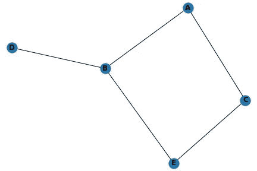

# 用 Python 漂亮地介绍了 Networkx

> 原文：<https://medium.com/nerd-for-tech/a-beautiful-introduction-to-networkx-with-python-9e474c9efc53?source=collection_archive---------11----------------------->

如果你曾经想知道 networkx 在这个世界上到底意味着什么，并且你是一个新手，我写这篇文章是因为你，也许你有一些背景知识，我欢迎你来复习这篇文章。当我开始作为一名数据科学家的旅程不久，当我遇到人们讨论 networkx 时，如果你现在处于我的位置，我欢迎你阅读这篇文章。我假设你有一点 python 的背景，并且你对使用像 pandas、matplotlib 和 seaborn 这样的库感到很舒服。

你一定想象过像 Twitter 和脸书这样的流行社交网站是如何工作的，想象过我们如何通过脸书与朋友联系？因此，脸书和其他社交网站致力于一种叫做社交网络的方法。几乎所有的社交媒体网站都使用社交网络，如脸书、Instagram 和 Linkedin 等。它对营销人员吸引顾客有着重要的影响。社交网络使用图表来创建网络。他们的节点是人，边是他们彼此之间的连接。边相连的两个节点是朋友。现在让我们看一个例子来理解什么是社交网络。(geekforgeek)

NetworkX 是一个 Python 包，用于创建、操作和研究复杂网络的结构、动态和功能。Networkx 对于图形优化很好。由于其简单性，它已被开发人员广泛用于图形和社交网络问题。让我们开始编码吧。我将使用 jupyter 笔记本来完成这份出版物。

开始使用 networkx 的第一件事是通过运行以下命令来安装它:

pip 安装网络 x

然后导入它:

将 networkx 作为 nx 导入

之后，让我们伟大的一个空图

graph = nx。graph()#调用图形或实例化

如果你打印图形，你什么都没有，因为你没有添加边或节点，不要忘记，我们在讨论图形或社交网络时处理边和节点。现在让我们添加节点和边。

graph . add _ node(' A ')#这将只向图中添加一个节点

graph.add_nodes_from(['B '，' C '，' D '，' E '])#这允许我们一次添加多个节点。我们现在可以通过运行以下命令来检查节点:

print(graph.nodes())

现在让我们给我们的图表添加边。不要忘记边将两个节点连接或结合在一起。

graph.add_edge(('A '，' B ')#这将只向图中添加一个节点

graph.add_edges_from([('A '，' C ')，(' B '，' D ')，(' B '，' E ')，(' C '，' E')])

现在是时候可视化我们的图表了。我们将需要 matplotlib 来这样做

将 matplotlib.pyplot 作为 plt 导入

nx.draw(graph，with_labels=True，font _ weight = ' bold ')
PLT . save fig(' gra . jpg ')
PLT . show()

这标志着我们对 networkx 的美好介绍到此结束。我希望你现在能使用网络并创建图表。我会继续在 networkx 上写更多。请注意，上面的图表可能与您自己的不完全一样，原因是您运行包含代码的单元格越多，您得到的图表的变化就越多。

感谢您阅读本文。希望有用，有帮助。如果你从这里收获了一两件事，亲切的点赞，鼓掌，掉个评论，分享以利他人。在 Twitter 上关注我[这里](https://twitter.com/analyst_abiden)，在 LinkedIn 上关注我[这里](https://www.linkedin.com/in/abideenmuhammed/)，电子邮件:abideenmuhammed2018@gmail.com