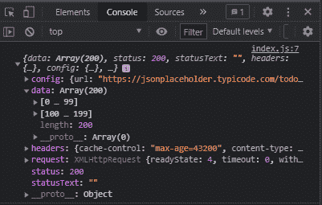
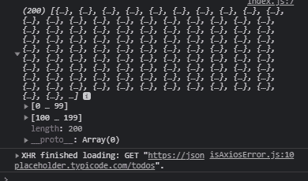
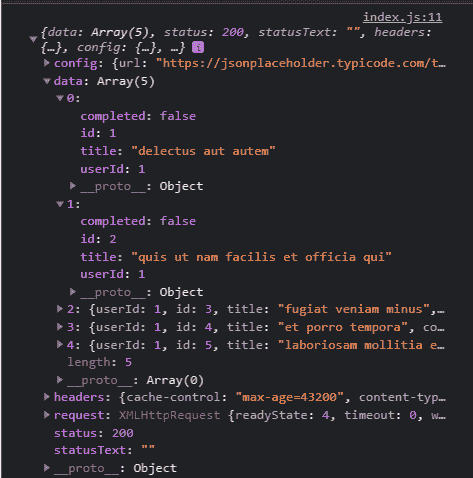
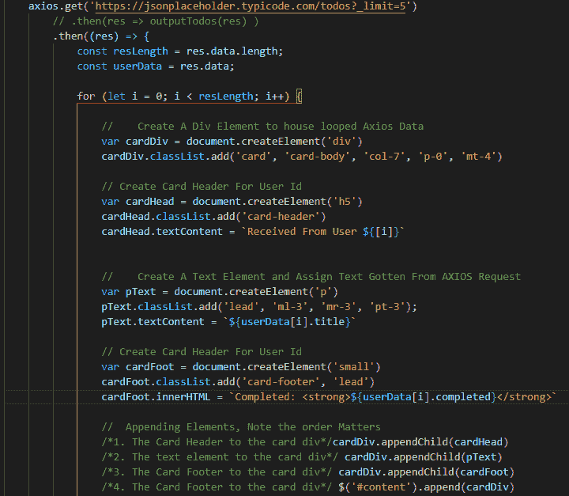

# 使用 Axios 进行请求的初学者入门

> 原文：<https://medium.com/nerd-for-tech/a-beginner-introduction-to-using-axios-for-requests-e07fe9c87f54?source=collection_archive---------3----------------------->

# 先决条件 **:**

1.  异步 Javascript。在这里阅读我的文章
2.  JavaScript 中的承诺
3.  JavaScript 中的对象
4.  本文中可能会用到 Jquery 和 Bootstrap。

*(这些知识有助于提高你的理解，但不是必须的)*


链接到项目存储库— [这里是](https://github.com/Uny1me/axios-project/)。

**简介**

“简而言之，Axios 是一个 Javascript 库，用于从 [node.js](https://nodejs.org/en/) 发出 HTTP 请求，或者从支持 [ES6 Promise API](https://developer.mozilla.org/en-US/docs/Web/JavaScript/Reference/Global_Objects/Promise) 的浏览器发出 XMLHttpRequests。— [*什么是 Axios.js，我为什么要关心？*](/@MinimalGhost/what-is-axios-js-and-why-should-i-care-7eb72b111dc0) *作者@Eric Kolleger。*要了解更多关于 Axios 的信息，我推荐阅读这篇文章。

这篇文章我想做的是教大家如何使用 Axios。虽然您可以在 Node.js 应用程序上使用 Axios，也可以在简单的 web 应用程序上使用它，但在本文中，我将在一个简单的 web 页面上使用它。

让我们开始吧

使用 index.html 文件和 index.js 文件创建一个项目文件夹，并确保从 HTML 文件和 Axios 链接中引用脚本。

```
<script src=”https://cdn.jsdelivr.net/npm/axios/dist/axios.min.js"></script>
```

然后，您可以将这段代码粘贴到文件主体中:

```
<div class=”container pt-5">
   <button onClick=”getRes()” class=”btn btn-danger”>GET</button>
</div>
```

*(我正在使用 bootstrap，因此使用了类:BTN BTN-危险和容器)*

开始时，我们在屏幕上有一个按钮，它有一个名为 getRes 的函数，用来监听它的点击事件。

**获取请求**

*In index.js*

```
// GET REQUEST
function getRes() {
 axios({
   method: ‘get’,
   url: ‘https://jsonplaceholder.typicode.com/todos'
  })
.then(result => console.log(result))
.catch(error => console.error(error));
}// Usually you output res i.e. response to the console but to get data Object we use res.data
```

**解释:**

在 getRes 函数中，我们用语法 *axios({})* 调用 Axios。在花括号之间，我们可以选择我们想要使用的数据通信方法，然后指定进行数据通信的 URL(位置)。

接下来是**”。括号中的 then()"** 语句是在请求成功的情况下严格运行的代码，这通常涉及引用已经接收到的数据部分。收到的数据通常像一个 JavaScript 对象，可以保存到任何名称，上面我们选择“结果”

接下来是**”。catch()"** 语句，在它的圆括号中，是请求失败时执行的代码，这个错误可以在保存到一个变量(在本例中是“error ”)后打印到控制台。

由于上面的链接是有效的，对存储在链接中的待办事项列表链接的请求是成功的，这意味着控制台应该有如下输出:



然而，得到这样的响应对我们来说并没有多大作用，我们必须提取我们需要的数据。回到代码，我们可以利用我们对对象的了解，将存储在响应对象中的数据记录到控制台:

```
.then(result => console.log(result.data))
```

然后我们可以得到一个包含 200 个值的数组。如图所示:



您并不仅限于记录控制台的输出或输入，您可以选择在您认为合适的时候操作 DOM。继续用这个语句替换您的 then 语句，看看会发生什么:

```
**.then(res => alert(‘you successfully tested a get request with Axios’))**
```

我不知道你怎么想，但 200 似乎是一个很长的数字，缩短它，这样我们就可以用几行代码来限制接收的数据量。在 Axios 请求的大括号内，我们继续限制数据，如下所示:

```
params: {
   _limit: 5
}
```

所以我们的总函数是这样的:

```
axios({
  method: ‘get’,
  url: ‘https://jsonplaceholder.typicode.com/todos',
  params: {
    _limit: 5
   }
})
.then(res => console.log(res))
.catch(err => console.error(err));
```

然而，我们不必总是写得很完整，我们可以把它缩短。我们可以这样做:

```
axios.get(‘https://jsonplaceholder.typicode.com/todos?_limit=5')
.then(res => console.log(res))
.catch(err => console.log(err))
```

限制写在 URL 中，即。_limit=5 '

**向 DOM 输出数据**



为了理解如何将数据输出到 DOM，我们必须查看我们接收到的数据的结构，即我们使用 then 语句请求浏览器登录到控制台的结果，这将有助于理解对象。查看图像，我们可以看到它的状态为 200，这意味着它是一个成功的请求，假设我们只想在控制台中看到 200。所有这些嵌套项的父对象就是我们所说的“res ”,所以如果我们简单地在 then 语句中写入:

```
.then((res) => {
 console.log(res.status);
 })
```

与我们的另一个 then 语句相比，这个结构看起来有点不同，但是如果 Axios 成功的话，这样我们可以编写多个可执行函数。

运行请求，在您的控制台中您应该看到 200，因此如果我们想在 DOM 中看到 200，我们可以简单地将 res.status 附加到 HTMLelement。例如:

```
document.getElementById(‘root’).innerHTML = `${res.status}`
//Or using jQuery shorthand:
$(‘#root’).text(`${res.status}`)
```

**一个复杂的例子:**

我们同样可以把它写在 then 语句中

```
**$(‘#content’).html(`
<div class=”card col-7 p-0 mt-4">
<h5 class=”card-header”>Received from user ${res.data[0].userId}</h5>
<div class=”card-body”>
<p class=”lead” id=”inner-text”>The todo is ${res.data[0].title}</p>
</div>
<div class=”card-footer lead”>Completed: <b>${res.data[0].completed}</b></div>
</div>
`)**
```

**解释:**这就是 Javascript 的美妙之处，能够在给定的条件下创建 HTML 元素。在这里，我们简单地声明，如果 Axios 请求成功，就应该创建 HTML 元素，并将其与内容一起放入元素中，即上面代码的第 1 行(上面 jQuery 简写的普通等价物是使用 innerHTML。即

```
document.getElementById(‘content’).innerHTML = ‘’
```

尝试一下，注意会发生什么。然而，回想一下，我们在请求中要求 5 个项目，那么如果我们想看到全部 5 个项目呢？

**一个更复杂的例子:**



**解释:**

代码中充满了注释，这使得它不言自明，我们只需使用 for 循环来创建元素，并为每个实例中的每个数据创建元素。然后，我们将从 axios 请求中获得的数据(分配给已创建的元素)。

**POST 请求和补丁将在本文的第二部分讨论。**