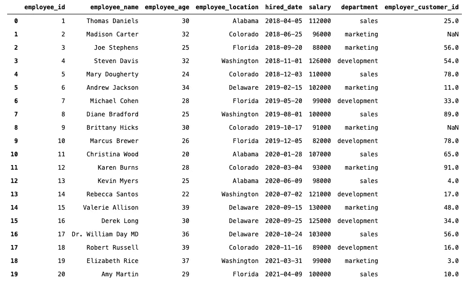
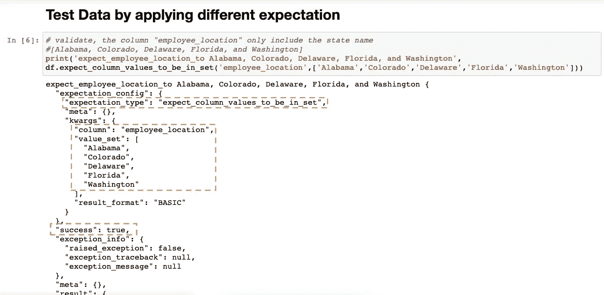
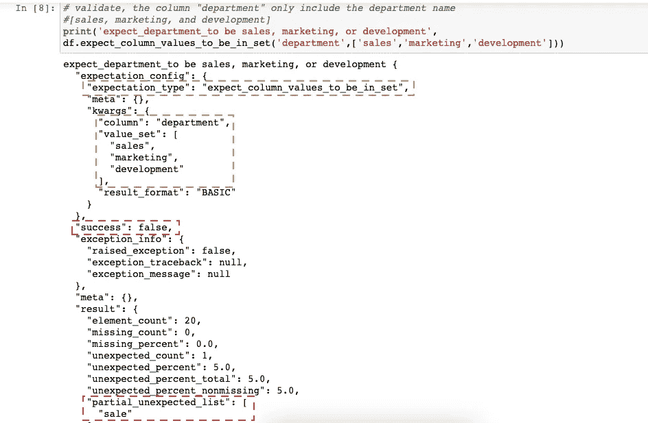

# 远大前程初学者教程

> 原文：<https://medium.com/nerd-for-tech/a-beginner-tutorial-of-great-expectations-e43022922aa?source=collection_archive---------6----------------------->

## Great Expectation 是一个工具，用于在数据工程环境中验证数据、检查数据、文档和数据分析的质量。

米卡·鲍梅斯特在 [Unsplash](https://unsplash.com/collections/8336854/analysis?utm_source=unsplash&utm_medium=referral&utm_content=creditCopyText) 上的照片

数据质量是数据工程师、分析师、机器学习工程师、科学家和所有数据最终用户在数据科学领域面临的一个普遍问题。如果数据质量很差，分析师可能无法创建准确的分析，机器学习模型的行为可能与预期不同。如果管理团队无法获得糟糕的图表/分析，他们可能会做出糟糕的决策。因此，确保我们用于决策、创建分析或开发机器学习模型的数据得到事先验证至关重要。如果数据有冗余，确保事先知道并记录下来。

在数据工程生态系统中讨论最多的一个新工具是解决所有这些问题的巨大期望。我最近研究了这个工具，并尝试了一下。在这篇文章中，我将通过一些关于远大前程的例子来讲述一些基础知识。

在设计 ETL 或 ELT 管道时，我们许多人都面临这个问题，我们总是必须确保从不同来源提取的数据包含准确的数据。一些常见问题可能是，

🛑列可能包含意外的空值或某些意外的值

🛑表格可能包含一个额外的列或行

🛑表中列的顺序可能与预期的不同

🛑该表可能有多个重复的行或列。

我刚刚列出了很少的问题，但是出现了大量的数据质量问题。工具《远大前程》帮助我们进行了验证。该工具还可以记录数据验证和质量测试及其结果，并通过一个精彩的、易于阅读的用户界面呈现出来。《远大前程》中的测试叫做期望测试。下面，我展示了一个简单的测试用例场景，在其上实现了一些期望测试，并展示了生成的文档。

# **测试用例场景**

让我们假设公司 XYZ.io 总共有 20 名员工。该公司只有 3 个部门(销售、营销和开发)。这些员工仅来自 5 个州(阿拉巴马、科罗拉多、特拉华、佛罗里达和华盛顿)，年龄在 20 至 40 岁之间。员工工资在 8 万到 13 万之间。员工总的先前经验和雇用日期。每个员工当前正在寻找的客户 ID。参见下面的数据集。

按作者分类的数据

# 期望测验

作者的 GistFile

1.  **expect _ column _ values _ To _ be _ in _ set**—检查列仅包含预期值。

expect _ column _ values _ to _ be _ in _ set 由作者测试

在上面的测试中，我们已经验证了列 **employee_location** 只包括**阿拉巴马州、科罗拉多州、特拉华州、佛罗里达州**和**华盛顿州**。因此，**成功**显示**为真。**

在下面的例子中，我们将看到一个失败的场景。

expect _ column _ values _ to _ be _ in _ set 由作者测试

在上面的例子中，我们试图验证列 **department** 只包含值 **sales、marketing** 和 **development** 。但是期望产生了一个**失败**的结果。看，**成功**就是**假。**

正如您所看到的，期望测试用真和假来验证数据。在本文中，我只展示了一个关于期望测试的例子。然而，有很多 [**期望测试**](https://docs.greatexpectations.io/en/latest/autoapi/great_expectations/dataset/dataset/index.html#great_expectations.dataset.dataset.Dataset.expect_column_to_exist) 可以用来验证你的数据和检查数据的质量。在这个 [**GitHub 资源库**](https://bit.ly/GE_Notebook_Tutorial) 中，你可以看到我对这些数据进行的不同类型的期望测试。

重要的是要记住，本文只关注远大前程的基础知识。在生产环境中，远大前程的设置是不同的。查看远大期望团队的这篇 [**文章**](https://docs.greatexpectations.io/en/latest/guides/tutorials.html) ，了解如何安装和设置远大期望。

如果你喜欢这篇文章，请关注我的 [**LinkedIn**](https://bit.ly/LinkedInKetan) ， [**Medium**](https://bit.ly/MediumKetan) 或 [**Instagram**](http://bit.ly/KetanInsta) 。如果你想了解我更多，可以查看我的 [**网站**](https://bit.ly/websiteKetan) 。

如果你有一些问题要讨论，你可以给我写一个 [**LinkedIn**](https://bit.ly/LinkedInKetan) 的消息。很乐意用我的经验帮助你。