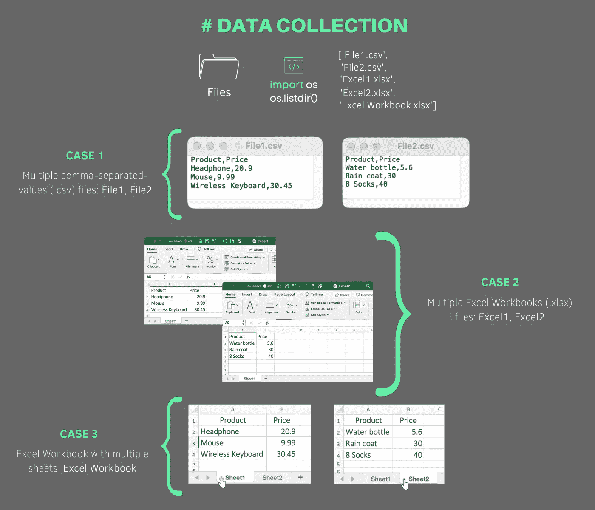

# 初学者指南:Python 中的文件导入和连接

> 原文：<https://medium.com/nerd-for-tech/a-beginners-guide-file-import-and-concatenation-in-python-eef853cc39f4?source=collection_archive---------10----------------------->

## 组合多个 csv 文件、xlsx 文件和工作表

组合大量具有相同结构和扩展名的文件可能是许多数据科学项目的第一步。这可以很容易地通过使用一种叫做连接的操作来完成。掌握文件导入和连接将节省您大量的时间，这就是为什么我们将看看三个流行的情况。假设您有一个包含多个逗号分隔值(csv)文件、多个 Excel 工作簿(xlsx)和一个包含多个工作表的 Excel 工作簿的目录。让我们看看如何使用 Python 组合文件！

用于说明本指南的数据极其简单(参见*图 1* )，但所提供的解决方案显然是可扩展的！**下面是我们的数据收集模式:**

图一。数据收集架构。

在所有情况下，我们都希望有一个包含 6 种产品及其价格的输出文件。手动执行这项任务不会有任何害处，但是这篇短文的主旨是提供一个适应性强、可伸缩的解决方案来连接大量复杂的文件。**让我们用**[**Google Colab**](https://www.geeksforgeeks.org/how-to-use-google-colab/)**:**

**案例 1:合并多个 CSV 文件**

首先，你一定注意到了*图 1* 中提到的 ***OS 模块*** 。让我给你简单介绍一下 OS 模块。操作系统模块提供了几十个使用 Python 与操作系统交互的功能。我们可以访问、修改、移动、删除文件，还有许多其他功能。

大部分时间我们都在分析本地文件和文件夹并与之交互，以执行进一步的数据分析，现在您明白为什么操作系统模块会派上用场了。为了开始这个分析，如果您想继续，您可以从我的 [Github](https://github.com/cristianefragata/study-projects/tree/main/medium-content/file%20import%20and%20concatenation) 库手动下载所有 5 个文件。一旦你做到了，我们就可以走了！

最终输出应该是:

可以看到目录相当乱。我们故意把所有文件上传到同一个文件夹。因为生活也是混乱的，所以我决定让它这样。如果您的文件夹中只有想要合并的文件，您可以跳过下一个代码片段。

另一方面，一个杂乱的目录也是学习一点关于 **glob 模块**的好机会。glob 模块根据 Unix shell 使用的规则找到所有与指定模式匹配的**路径名，并以任意顺序将这个匹配作为一个列表返回。我们将使用 glob 模块只选择扩展名为 csv 的文件。**

假设文件顺序很重要，我们使用了上面的排序函数，但是请记住，如果您有一个数字列，比如一个 *id* 或一个*日期*，您总是可以使用 pandas 对整个数据帧进行排序。上面代码片段的最终输出是:

最后，我们将使用 list comprehension 和 pandas 来读取名为 result 的列表中返回的所有 csv 文件。pandas concat 函数用于获得最终的数据帧。再次导出到 csv 是快速和容易的！

**案例 2:合并多个 Excel 工作簿(xlsx)**

现在，我们希望使用多个 Excel 工作簿作为输入文件来获得相同的结果。我们将再次使用 glob 来指定扩展名，并从列表中排除多工作表文件(Excel Workbook.xlsx)。很快，我们将有一个结合了 Excel1 和 Excel2 的新 Excel 文件。

**案例 3:合并单个 Excel 工作簿的多个工作表**

最后，我们将使用一个包含多个工作表的 Excel 工作簿作为输入文件来执行相同的任务。这次我们不需要 glob，因为我们只有一个文件。我们可以在 read_excel 函数中指定文件路径和参数“None”。此参数确保我们将一次导入所有工作表。输出是一个 Python 字典！您可以使用名称作为关键字来访问所有工作表。现在，我们只需要将这个 dict_keys 对象转换成一个列表，我们就可以开始了！

**让我们最后下载所有 3 个输出文件！**

我将在下面嵌入我的笔记本，以防你想检查中间输出和评论！

**感谢阅读！回头见！**