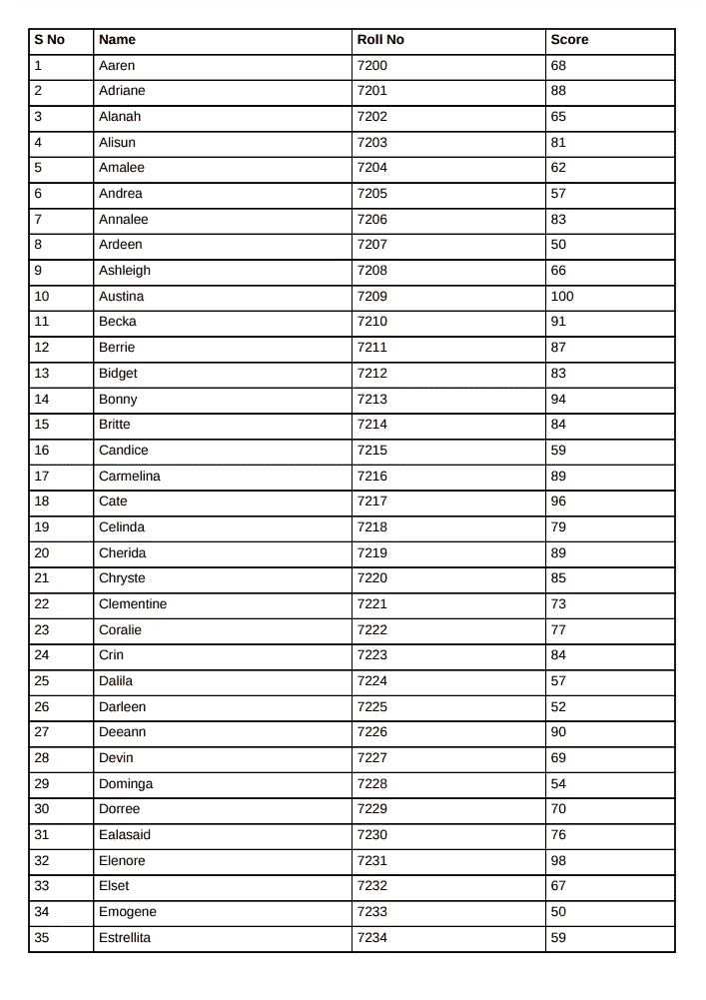

# 用 Django 生成 pdf 的初学者指南——第 1 部分

> 原文：<https://medium.com/nerd-for-tech/a-beginners-guide-to-generate-pdf-s-with-django-part-1-901e258f0f93?source=collection_archive---------3----------------------->

## 了解如何随时将您的 HTML 代码转换为 PDF。

最近，我遇到了一种情况，我需要用一些预定义的规则和格式批量打印 Django 数据库记录。然而，我找不到一个涵盖我所寻找的内容的教程。因此，我们在这里，一个整洁的小解决方案，这可能就是你正在寻找的！


照片由[克里斯里德](https://unsplash.com/@cdr6934?utm_source=medium&utm_medium=referral)在 [Unsplash](https://unsplash.com?utm_source=medium&utm_medium=referral) 上拍摄

# 介绍

在本教程中，我们将使用 [xhtml2pdf](https://pypi.org/project/xhtml2pdf/) ，一个基于 Python 的库来快速将 html 代码转换成 pdf。您可以使用以下命令从 PyPi 安装这个包

```
pip install xhtml2pdf
```

这就是我们在本教程中需要的全部内容。我们开始吧！

# 一个示例项目

考虑一个名为 ***project*** 的典型 Django 项目，带有一个名为 ***Test*** *的 app。*使用以下命令开始

```
django-admin startproject project
cd project
python manage.py startapp Test
```

该项目的目录结构类似于

```
.
├── db.sqlite3
├── manage.py
├── project
│   ├── asgi.py
│   ├── __init__.py
│   ├── settings.py
│   ├── urls.py
│   └── wsgi.py
└── Test
    ├── admin.py
    ├── apps.py
    ├── __init__.py
    ├── migrations
    │   ├── 0001_initial.py
    │   └── __init__.py
    ├── models.py
    ├── tests.py
    ├── urls.py
    └── views.py
```

## 数据库模型

让我们在 **Test/models.py** 中为我们的项目创建一个数据库模型，它将包含学生记录，即学生姓名、学号和分数。

## PDF 样式

现在，让我们从设计 PDF 开始。我们可以使用外部样式表，但这需要一些额外的配置。所以让我们坚持内联样式，为我们所有的记录设计一个小的表格结构

# 生成 PDF

现在是表演时间了！让我们编写生成 pdf 的核心函数。我们将使用 xhtml2pdf 中的 pisa 来完成所有必要的转换。在**测试**下创建一个新文件 **utils.py** ，并使用下面的代码片段。

要使 PDF 可以直接下载，请在 HTTPResponse 中使用 can you**Content-Disposition**。例如，您可以在 utils.py 中的第 9 行之后添加另一行

```
response['Content-Disposition'] = f'attachment; filename="{pdf_name}"'
```

## views.py

我们已经开始运作了。现在是时候为我们的 pdf 写一个视图了。让我们把 **Test/views.py** 中的 pdf 结构和 utils.py 连接起来。

## urls.py

…当然，我们怎么能忘记 URL 呢？

# 结果

完成所有步骤并填充数据库后，pdf 应该看起来像这样。很漂亮吧？



# 第二部分有什么

到目前为止，我们已经讨论了如何使用 HTML 和 CSS 定义 PDF 的基本布局。第 2 部分将涵盖其他基本内容，如添加页眉和页脚、页码、定义 a4、letter 和其他格式的布局、批量打印 PDF 和输出为 ZIP 文件。

在那之前，保持快乐，保持安全！