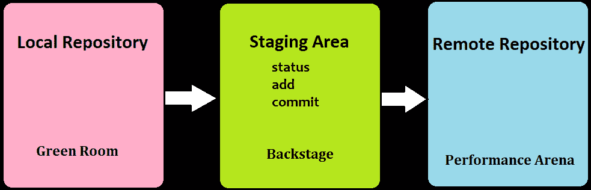
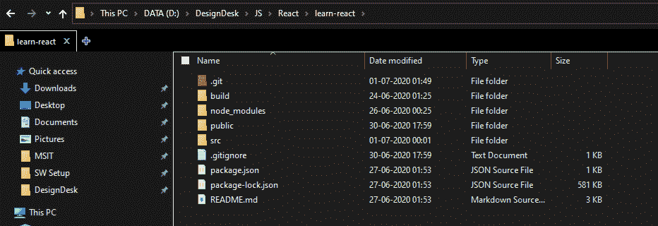
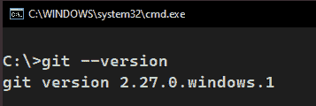
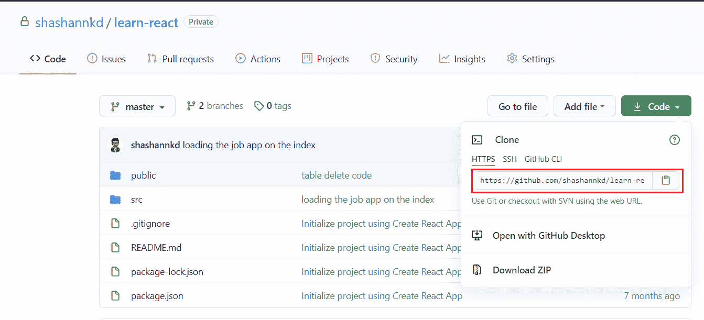
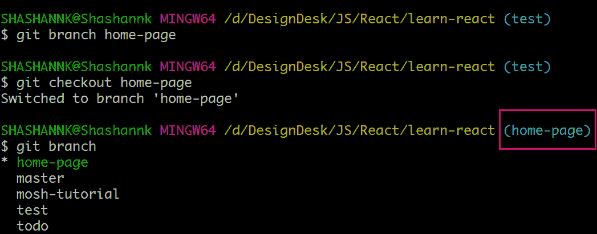

# Git 初学者指南

> 原文：<https://medium.com/nerd-for-tech/a-beginners-guide-to-git-8a3d7e98a93c?source=collection_archive---------2----------------------->


# Git 是什么？

这就是你可能在这里搜索并登陆的东西。到本文结束时，您将对 Git 的内容和原因有一个全面的了解。那么，让我们开始吧。

Git 是一个开源的免费分布式版本控制系统。对于初学者来说，一口气理解这些单词可能会很难。让我们浏览一下，这只会帮助您更好地使用这个软件。

*   **开源:**这意味着可以查看、检查和修改它的源代码。是的，**你**可以提高 Git 的性能，让它变得更好或者修复任何不工作的东西。
*   **免费:**嗯。这很好理解。你不需要为使用 Git 付费。此外，它在软件安全方面也是免费的，即 Git 不会跟踪你的使用模式以使你的体验“更好”。
*   **分布式:**以一种不复杂的方式开始，让我们说分布式意味着存储在不止一个地方。这是怎么发生的？除了我们的电脑，它还存放在哪里？什么是远程存储库？我们将进一步讨论它们。
*   **版本控制系统:**这意味着 Git 可以用来控制你的文件或应用程序或源代码或任何你选择使用它的东西的版本。

# 什么是版本控制系统(VCS)？

让我们以一种更容易理解的方式来理解“文件的控制版本”的确切含义。

为了理解这一点，我们需要回顾一下，还记得没有电脑的美好时光吗？嗯，如果你是维护和编写大量文档的人，它们就没那么好了。在一篇文章/一封信/一本书最终被批准之前，曾经有许多版本的文件被称为“草稿”。通常有许多相同文档的草稿，它们有独特的内容，但大多数时候是冗余数据。

但是今天，我们有数字计算机，许多文档编辑器有各种很酷的功能。当我们使用这些应用程序来创建或编辑我们的文件时，我们需要一些东西来保存我们文件的各种版本。从创建到最终阶段，文件的每个版本都像是文件的快照。

VCS 的功能不仅限于单个文件。它可以拍摄包含大量文件和文件夹的整个项目的快照。

# 为什么我们需要一个 VCS？

现在我们知道了什么是 VCS，让我们明白为什么我们需要它。我交替使用了 Git 和 VCS 这两个词，因为我们在这里谈论的是同一件事。我认为主要有两种应用。在我们进入优势之前，我们将知道引擎盖下发生了什么。

# 类似

在拍摄上述“快照”时，您的文件会经历 3 个阶段。

让我们用一个类比来理解这一点。想象你正在管理一个舞台表演，让演员们准备好。演员们去绿色房间，在那里他们穿上他们的服装，并为他们各自的角色做其他安排。久而久之，参与者一个接一个出来，在后台集合。

在这里，参与者的出席被验证，并根据他们出现的顺序站立。在宣布之后，参与者进入表演舞台，你会因为组织这个没有任何问题而受到赞赏。

有了 Git，画面是一样的。绿色房间是您的本地存储库，文件就存储在这里。然后，您进行更改并将其添加到暂存区域，在那里它的状态被更新并被索引，就像后台发生的一样。将文件“添加”到临时区域后，您所做的所有更改都会被“提交”,这会将文件发送到远程存储库。这就完成了拍摄快照的过程，或者我们可以说保存了一个版本。



这显示了保存版本时文件经历的三个阶段。

让我们来看看使用 Git 的主要优点。

## 当事情出错时...

是啊，我们都搞砸了。当您的代码没有那个臭名昭著的 bug，而您需要恢复到应用程序的一个旧版本时，Git 就来了。当你有很多人在这个项目上工作时，这就是我们的下一个重点。

## “团队合作”

是的，与团队合作是开发人员不可或缺的一部分。当我们使用 Git 时，代码共享/更新/维护变得非常简单。许多人可以轻松地在应用程序的不同“分支”上工作。当你开始使用它的时候，你就会知道它有多好。

# Git vs GitHub？

好吧，我们得知道 Git 是什么。但是 GitHub 到底是什么？它们是一样的吗？它们是什么？

GitHub 是一个基于云的托管服务，使用 Git 进行软件开发。这意味着你可以把你的代码免费存储在云上。是的，没错，你所要做的就是在 [GitHub](https://github.com/) 上创建一个账户。将您的存储库链接到您的 GitHub 用户，瞧..！！

我们将在本文后面讨论“推送”我们的代码。

您的 GitHub 帐户包含您拥有的所有资源库，无论是您自己的还是从其他开发者那里“派生”来的。

为了澄清存储库的含义，存储项目文件的主文件夹称为存储库。

**例如:**您的项目可能有许多不同技术的文件，但是原始目录是存储库。



learn-react 是存储库的名称。git 文件存储了关于这个特定“存储库”版本的所有信息。

# 安装 Git

你可以在这里安装几乎所有平台[的 Git。有许多文章会带你完成它的安装过程，这并不困难。](https://git-scm.com/downloads)

安装 Git 后，可以在终端或命令提示符下输入 git — version 来检查它。它会显示计算机上安装的版本。



根据您阅读本文的时间，您计算机上的数字可能会有所不同。

## 链接 Git 和 GitHub

请参照[这个](https://kbroman.org/github_tutorial/pages/first_time.html)来完成这个任务。这真的很简单。几个简单的命令就完成了。

# 命令类别

像我们使用的任何其他安装的应用程序一样，Git 可以以同样的两种方式使用。

*   GUI 应用程序
*   命令行

由于我们对计算机科学非常好奇，并且我们喜欢使用命令提示符/bash 以尽可能短的方式完成任务，以便快速完成工作(当然，也是为了炫耀)，我们将学习如何使用 git 命令保存我们项目的版本。git 提供的大多数命令都属于这几大类。

**注意:**我只提到了所有常用的主要命令。

所以分类是:

*   创造
*   更改
*   平行发育
*   同步更改

# 创造

这些命令用于创建 git 存储库。做这件事有两种方法。这两个步骤并不是强制性的。这就是你开始这个项目的想法。

## 创建本地存储库

当您在计算机上从头开始构建项目时，将使用此命令。这意味着这个项目从您的本地存储库开始。

我们准备创建一个项目，我们必须初始化一个 Git 存储库。就这么简单。导航到该目录，在该路径中打开 Git Bash，并键入以下命令。

```
cd my-demo-project
git init
```

第一个命令将我们带到 my-demo-project 路径，git init 完成在该路径初始化 git 存储库的工作。你可能会发现这类似于为我们试图建造的建筑放置一块基石。

## 克隆现有存储库

与前面的命令不同，克隆是在有一个已经在 **GitHub** 中的存储库时完成的，还记得这个家伙吗？

您可以克隆在您自己的 GitHub 帐户或您有权访问的任何其他存储库中创建的存储库。

有很多方法可以做到这一点，但如果你是第一次，并从这里开始，我会推荐以下步骤。

*   转到存储库的主页
*   点击“代码”按钮
*   您将看到一个 URL，它是存储库的地址。
*   复制路径，并输入以下命令

```
cd my-demo-project
git clone [repository-url-from-github] example: 
git clone <https://github.com/the-repository-name/repository-name.git>
```



我的 GitHub 帐户中的示例存储库。

# 更改

我们已经创建了一个演示项目，让我们添加一个文件 [README.md](http://readme.md/) ，它包含我们正在创建的项目的基本信息。

## 上演你的改变

由于我们已经创建了一个文件，这个文件被 Git 标记为“未跟踪”。这意味着文件的存在和状态没有更新，即这是新版本。我们现在有一个文件，而之前我们有 0 个文件。

有几个命令可以帮助您了解文件/项目的状态，并将这些更改移动到临时区域。

```
git statusgit add README.mdgit add .
```

## 提交更改

提交变更标志着我们一直在谈论的“快照”或版本的完成。

```
git commit -m "README added"
```

大多数开发人员在提交时忽略了给出有意义的消息。但是如果出了问题，这些开发人员要追溯哪个变更是在什么时候提交的。

> 输入有意义的提交消息..！！

通过以上做法，你不仅节省了自己的时间，也节省了其他开发人员的时间，无论是你的朋友/同事/经理。记住，好的信息很少被欣赏，但是坏的信息每次都会被诅咒和皱眉。所以，“不要成为那个人..！!"。

# 犯还是不犯是个问题？

这是开发人员面临的最重要的问题，即使他们有了多年的经验。何时提交？什么时候不要？

虽然诱惑可能是一次性提交整个项目，并显示消息“项目已完成”，但是请记住我们读到的关于好的提交消息的内容。

提交的理想时间是当你完成一个独立组件的构建时。是的，就这么简单。

例如，如果您正在为一个项目构建主页，提交可能如下所示:

*   初始提交
*   实现的导航栏和链接
*   图像轮播完成
*   页脚链接已完成
*   修正了滚动错误

除非你的组织或老师提到，否则没有硬性规定要以某种方式去做。但以上建议来自于我自己作为开发者的经验。

# 平行发育

使用 Git 最有趣的地方来了。分支是一条独立的发展道路。当有许多人在同一个项目上工作，甚至有更多的分支时，这就很方便了。

## 分支

**我们为什么需要分行？**

*   任何项目的默认分支都称为“main”。如果没有创建分支，默认情况下您将在 main 上工作。但是这根本不是一个好的实践。
*   一直从事应用程序数据库方面工作的开发人员将为自己创建一个新的分支“db-services”。新创建的分支将拥有 main 中的所有代码，这些人可以根据他们的设计自由地添加文件和进行更改。对分支“db-services”的提交将保留在该分支中，直到它们被合并到主分支中。
*   从事 UI、DevOps 等工作的开发者。可以创建他们认为合适的分支，而不会中断开发过程并支持并行开发。

**创建新的分支**

```
git branch home-page
git checkout home-page
```

第一个命令创建一个名为 home-page 的新分支。第二个命令将控件移动到主页分支。请小心你正在工作的分支，在错误的分支工作会有毁灭性的后果。

使用 checkout 命令在分支中移动。

```
git checkout main
```

命令列出所有现有的分支

```
git branch
```



标记部分显示当前活动的分支。

# 合并

**什么是合并？**

当我们谈到各个团队在各自的分支中独立工作时。这是它的另一方面。

**为什么合并？**

我们需要一种方法来集成所有的变化，以便应用程序可以根据其用例进行实际测试。Git merge 拯救了我们。

**如何合并？**

我们需要做的就是推送(我们将在下一节中讨论)代码，并创建一个拉取请求(PR ),并在修改被批准后进行合并。我们可以把它直接合并到主分支，但是我们不是野蛮人。未经 PR 批准就合并代码会造成每个开发人员都有的噩梦——“合并冲突”。因此，请遵循最佳实践。

# 同步您的更改

## git 远程添加原点

一旦完成了所有的更改，我们需要将本地存储库连接到远程存储库。根据类比，标记从绿色房间到表演竞技场的路径。同样，一个简单的 Git 命令完成了所有的工作。

```
git remote add origin [repository-url]

example:
git remote add origin <https://github.com/the-repository-name/repository-name.git>
```

你会发现很多文章都是以原点为头的。简而言之，它指向该分支中最近的提交。

## git 推送

我们创建了分支，编写了代码，用有意义的消息提交了更改，将本地回购与远程回购联系起来。我们来这里是为了最后一步，摊牌，表演。

将我们对本地存储库中的项目所做的所有更改推送到远程存储库中。

```
git push -u origin [branch-name]
```

理想的做法是将所有的提交和一个 push 命令放在最后，以避免混淆。

## git 拉

当一个团队在同一个项目上工作时，这意味着变更会被持续推进，对代码库的变更会永无止境。

因此，我们需要一种机制，在我们开始工作之前，以某种方式获取最新的代码库。

以下命令可以实现这一目的:

```
git pull origin main
```

# 没有“愚蠢的问题”

## 什么是 Git Log？

git log 为您提供了到目前为止您对项目所做的所有提交的列表，以及提交标识符和其他细节。

```
git log
```

## 为什么 [README.md](http://README.md) 很重要？

这是一个新的开发者或用户为了获得项目的说明或细节而要查阅的初始文档。我认为它是你项目中最重要的文件。草率的自述文件可能会耗尽您为开发应用程序/项目所付出的所有努力。

## “是什么。gitignore "？放什么进去？

。gitignore 是一个文件夹，其中提到了所有冗余、敏感数据的所有路径，这样它们就不会被推送到远程存储库。

**示例:**您为该项目下载的节点模块等数据，可能有数百 MB。相反，我们可以跳过这一步，发送一个 package.json 文件，该文件将在初始化时自动安装所有的依赖项。

如果你已经走了这么远，我想感谢你的阅读，并感谢你的努力。我期待着写更多。快乐学习..！！