# Hangfire 初学者指南

> 原文：<https://medium.com/nerd-for-tech/a-beginners-guide-to-hangfire-6cda13315e74?source=collection_archive---------7----------------------->


想象一个网站，让用户管理自己每月的收入和支出。它甚至可以显示易读的图表以及有助于更好决策的见解。这个网站所需要的只是一个输入——一个标题为“支出”和“收入”的电子表格，以及下面相应的金额。

电子表格上传后，网站需要一些时间来处理信息。现在，如果用户最终需要等待很长时间才能获得输出，就会降低整体用户体验。如果处理任务在后台进行就好了，这样用户可以继续查看网站上的其他信息。为了实现这一点，网站开发人员需要有后台任务来处理上传的信息。这可以在中实现。Net 编程的多种方式，包括内置的技术，如线程和任务。

然而，在这篇博客中，我们将使用名为“Hangfire”的第三方库来实现相同的后台处理。事不宜迟，我们先来了解一下什么是 Hangfire，以及如何使用 Hangfire 实现后台任务。

**目录**

1.  什么是 Hangfire？
2.  使用 Hangfire 实现后台任务
3.  包扎

# 什么是 Hangfire？

Hangfire 是一个开源框架，可用于在中执行后台处理。Net 和。Net 核心应用程序。它主要用于执行后台任务，如批量/电子邮件通知、文件批量导入、视频/图像处理、数据库维护、文件清除等。Hangfire 可以用于具有高/低 CPU 消耗的后台任务、短/长时间运行的任务、循环作业、启动并忘记等等。

# 用 Hangfire 实现后台任务

为了使用 Hangfire，我们将创建一个 ASP。Net 核心 Web 应用程序和 API 类型的应用程序。

## 第一步

创建一个 ASP。Net Web 应用程序，并为项目提供有效的名称和路径。


## 第二步

选择模板为 API，版本为。网芯 as 3.1。确保“为 HTTPS 配置”已选中。

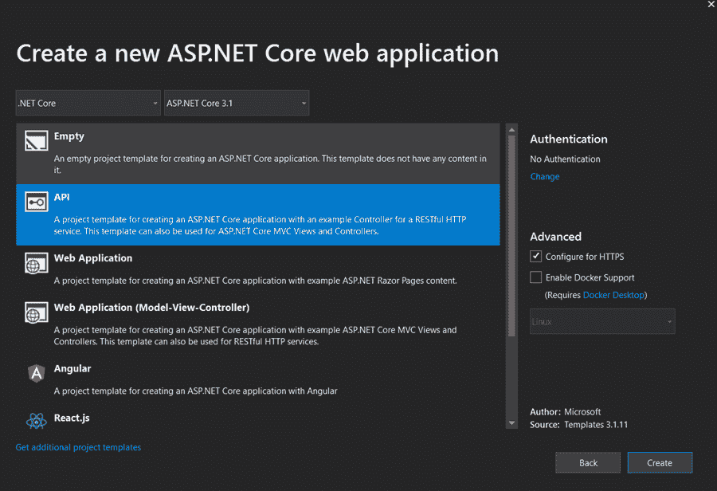

## 第三步

默认的 API 模板项目结构如下所示。


## 第四步

让我们安装 Hangfire 所需的包，以便在项目中实现。要安装软件包，右键单击项目并单击 Manage NuGet Packages。

**软件包安装**

*   绞刑。核心
*   绞刑。AspNetCore
*   绞刑。Core(这是用来利用代码内部的 Hangfire 内存存储的。有一个选项可以存储它们并在数据库级别维护它们(Install-Package Hangfire。SqlServer)，这提供了即使在应用程序重启时也能保持作业顺序和执行时间的优势)。

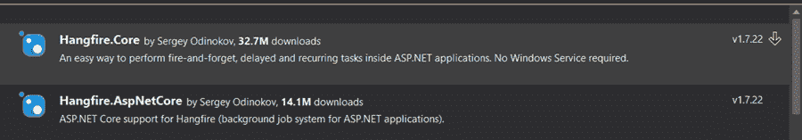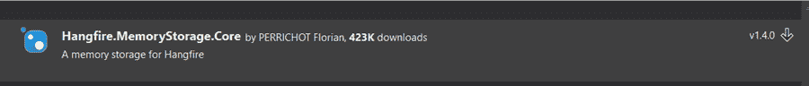

## 第五步

一旦安装了软件包，该过程就转移到在启动服务中配置已安装的软件包。为此，打开 Startup.cs 文件，转到 ConfigureServices 方法并添加以下行

```
services.AddHangfire(c => c.UseMemoryStorage()); JobStorage.Current = new MemoryStorage();
```

你还需要参考下面的库。

```
using Hangfire; using Hangfire.MemoryStorage;
```

这里，我们使用存储作业数据的“memorystorage”方法来实例化 Hangfire。

## 第六步

在同一个 startup.cs 文件的 Configure 方法中，添加以下行

app。UseHangfireServer()；

并在 app.useEndpoints 内添加端点。MapHangfireDashboard()；。

该选项为我们提供了一个仪表板，可以提供 Hangfire 库正在处理的后台作业和重复作业的实时数据。

配置完上述代码后，启动文件方法应该如下所示。

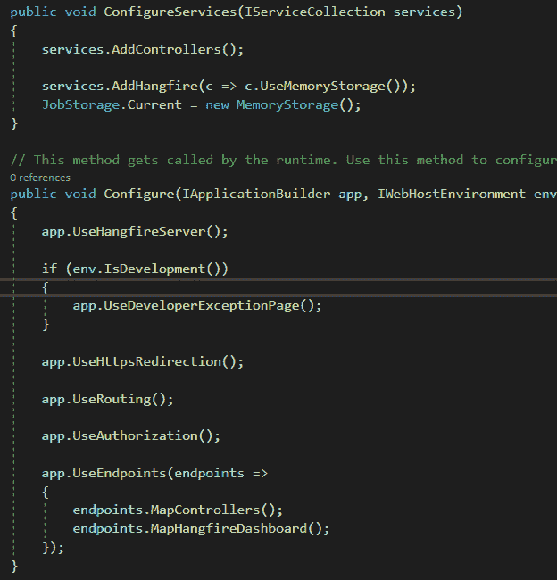

## 第七步

下一步是利用代码中的 Hangfire。为此，请打开控制器— weatherforecastcontroller.cs，并在类的开头声明一个全局变量，以利用后台作业客户端注入。

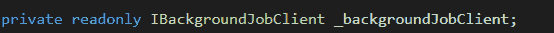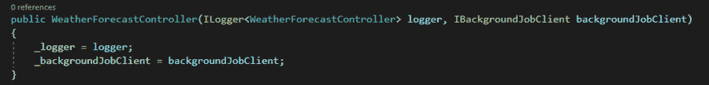

## 第八步

利用 Get 方法中声明的变量，并添加以下代码行。这里，我们实现了一个后台任务，它在每次调用端点时运行。

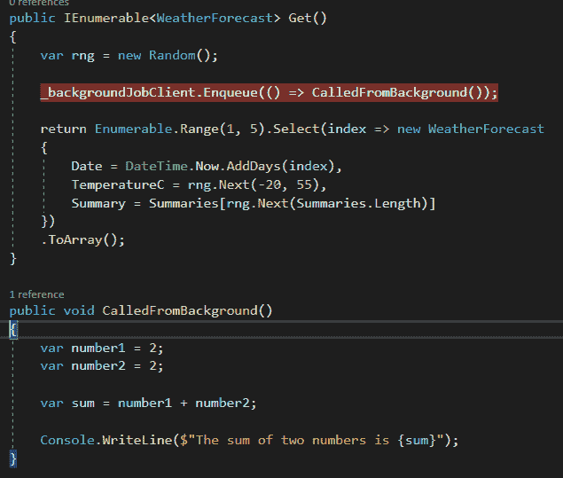

## 第九步

现在要运行应用程序，打开运行应用程序选项中的下拉菜单，选择应用程序名“PARTECH_Hangfire”作为运行应用程序的默认方式。这将在所需的端口运行应用程序，并打开应用程序的控制台窗口(可用于跟踪我们在代码中输入的日志)。

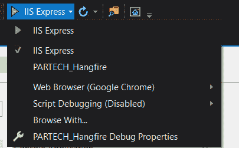

## 第十步

运行应用程序后，控制台窗口会打开，并指出应用程序已经启动。几秒钟后，它会记录我们已经登录到方法中的信息(已经入队)。

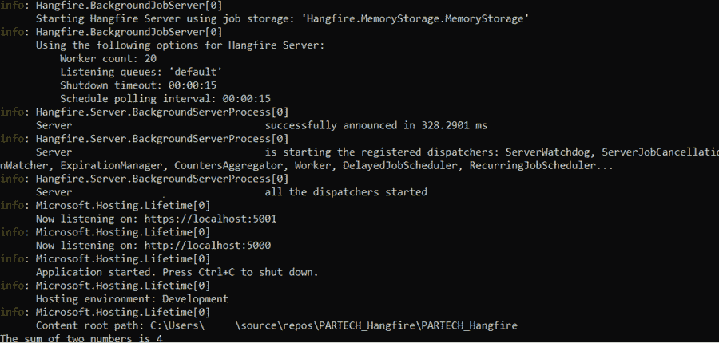

## 步骤 11

下一步是在我们的代码中使用 Hangfire 创建一个循环作业。

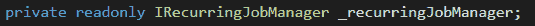

为此，在 weatherforecastcontroller.cs 文件中，添加全局变量并分配注入的值，就像我们对后台作业客户端所做的那样。

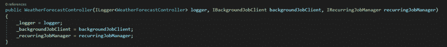

## 步骤 12

利用循环作业变量，并添加一个将被定期调用的日志。

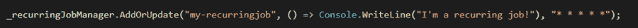

在这里，上面的行被分成三部分，第一部分是 jobid，第二部分是必须执行的任务，最后一部分是 Cron 表达式，它规定了必须重复该作业的时间范围。在我们的示例中，作业将每一分钟重复一次。

## 第十三步

运行应用程序以观察结果。每隔一分钟就会执行一次日志消息。

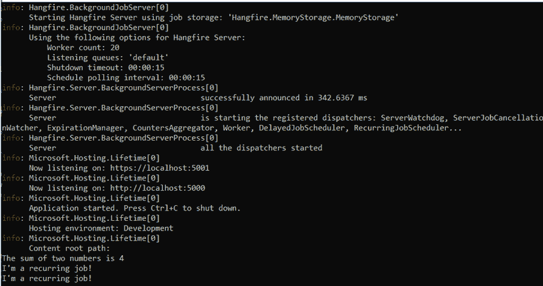

除此之外，Hangfire 还提供了一个选项来可视化作业并查看每个作业的结果(成功或失败)(按天和按周)。

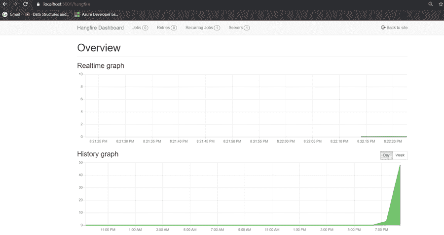

此外，它还提供了一个选项来查看通过代码配置的重复性作业，并提供了一个选项来在运行时删除它们。它还列出了正在运行的活动 Hservers。仪表盘还提供了很多更酷的功能，可以方便地维护作业。

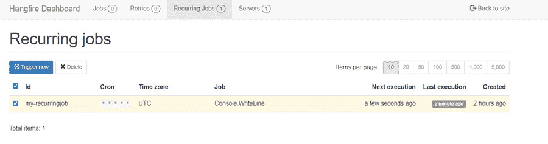

# 结论

正如我们在这篇博客中看到的，Hangfire 令人印象深刻，易于安装/使用，用户友好(通过仪表板)，并且可以立即部署。总之，使用 Hangfire，配置和运行后台和循环作业是一项非常简单的任务。

*原载于*[*https://www . partech . nl*](https://www.partech.nl/nl/publicaties/2021/05/a-beginners-guide-to-hangfire)*。*