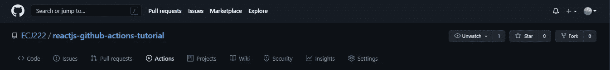
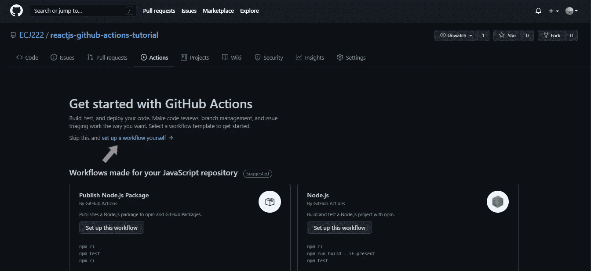
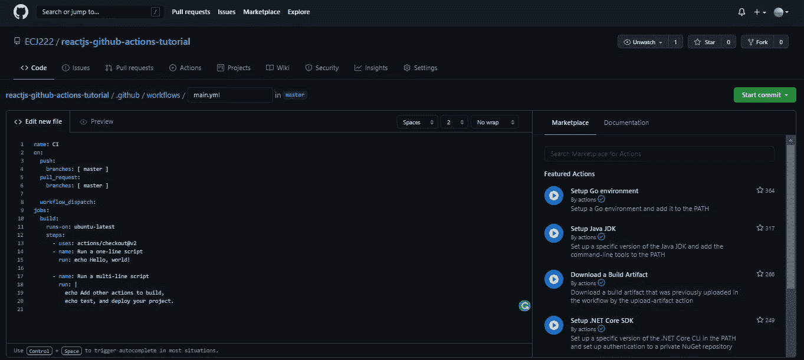
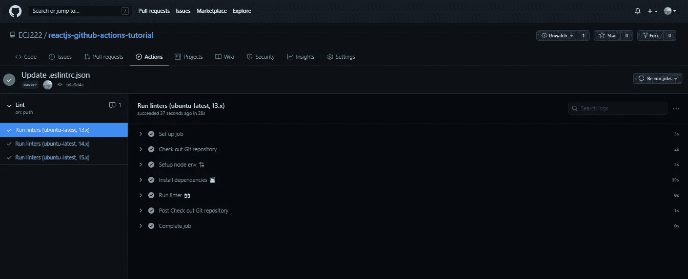

# 使用 Github 操作设置 CI/CD 的初学者指南

> 原文：<https://medium.com/nerd-for-tech/a-beginners-guide-to-setting-up-ci-cd-with-github-actions-81554e7847d0?source=collection_archive---------6----------------------->


如果您正在阅读本文，您或您的团队可能需要一种方法来运行自动测试，更快地构建、交付和部署项目，不用担心，这就是 Github Actions 的持续集成和持续交付(CI/CD)的用武之地。但是等等，CI/CD 是什么意思？

# 持续集成

持续集成是将来自多个参与者的代码变更自动集成到单个软件项目中的实践。这是主要的 DevOps 最佳实践，允许开发人员频繁地将代码变更合并到一个中央存储库中，然后在那里运行构建和测试。

# 连续交付(CD)

持续交付是指您的代码总是准备好发布，但除非您决定这样做，否则不会推向生产。这是一个手动步骤。通过持续部署，应用程序的任何更新工作版本都会自动推送到生产环境中。

# 持续部署(CD)

连续部署是一个过程，通过该过程，软件代码或架构中合格的变更一旦准备好就被部署到生产中。

# **用于执行 CI/CD 的工具示例**

有许多工具可以配置和执行 CI/CD 流程:

*   [詹金斯](https://www.jenkins.io/)
*   [CircleCI](https://circleci.com/)
*   [团队合作](https://www.jetbrains.com/teamcity/)
*   [竹子](https://www.atlassian.com/software/bamboo)
*   [Gitlab](https://about.gitlab.com/)
*   [代码船](https://codeship.com/)
*   [特拉维斯·CI](https://travis-ci.org/)


[Github Actions](https://github.com/features/actions) 是一款可以轻松实现软件工作流自动化和处理 CI/CD 流程的工具，[2018 年 10 月推出](https://github.blog/2018-10-17-action-demos/)，2019 年 8 月推出 beta 版，2019 年 11 月最终发布，Github Actions 也是付费的，虽然有免费版，但有一些限制。

# 在项目中使用 Github 动作的示例

对于这个例子，我们将使用 [React Js (Create React App)启动项目](https://reactjs.org/docs/create-a-new-react-app.html)进行演示。


首先，我们需要进入 GitHub 项目并访问 Actions 选项卡:



我们进入一个屏幕，允许我们在预定义的工作流或已建立的工作流之间进行选择，在我们的示例中，我们将使用已建立的工作流。



注意下面`.github/workflows/`中的`main.yml`文件中的工作流程，这是我们建立自己的工作流程时 Github 给我们的默认工作流程。我们可以用不同的工作流程创建不同的文件。



现在我们将改变文件的内容。

```
name: Lint on: pushjobs:  
  run-linters:  
    name: Run linters
    runs-on: ${{ matrix.os }} strategy:
      matrix:
        os: [ubuntu-latest]
        node: [13.x, 14.x, 15.x] steps:
      - name: Check out Git repository
        uses: actions/checkout@v2 - name: Setup node env 🏗 
        uses: actions/setup-node@v2.1.2
        with:
          node-version: ${{ matrix.node }} - name: Install dependencies 👨🏻‍💻
        run: npm ci - name: Run linter 👀
        run: npm run lint
```

# '名称'

这是我们工作流程的标签。

# “开”

Github 执行用`on`键定义的工作流——在我们的例子中，任何`push`事件。我们还可以定义一个特定的分支。例如，`master`分支中的`push`事件:

```
on:
  push:
    branches:
      - master
```

# 乔布斯的

每个工作流由一个或多个`jobs`组成。在我们的例子中，只有一个。

# “连续运行”

此参数包含将在其中执行代码的虚拟机的类型。在这种情况下，我们将使用`ubuntu-latest`(查看不同类型的可用虚拟机)。

# “战略”和“矩阵”

一个`strategy`创建一个`matrix`环境，在其中执行工作。每个`matrix`允许我们建立一组不同配置的虚拟环境。

# “步骤”

一个`step`是一系列的任务。在我们看到的例子中，第一步是检查触发推送事件的存储库，以便工作流可以访问它。

```
- name: Check out Git repository
  uses: actions/checkout@v2
```

在第二步中，使用 node.js 版本设置工作流以执行应用程序。

```
- name: Setup node env 🏗 
  uses: actions/setup-node@v2.1.2
  with:
    node-version: ${{ matrix.node }}
```

第三步，工作流使用`npm ci`命令安装我们的应用程序所需的所有依赖项，有关该命令的更多信息，我强烈建议您查看[文档](https://docs.npmjs.com/cli/v7/commands/npm-ci)。

```
- name: Install dependencies 👨🏻‍💻
  run: npm ci
```

终于，我们到了最后一步。


在最后一步中，我们使用 [linter](https://eslint.org/) 工具，这是一个分析我们代码的工具，可以标记编程错误、bug、风格错误，总体上有助于改进我们的代码。

```
- name: Run linter 👀
  run: npm run lint
```

每当我们将代码推送到我们的存储库时，这个工作流就会运行，当我们再次访问存储库的 Actions 选项卡时，我们可以看到工作流已经执行的次数的列表。在这种情况下，如果没有发生错误，我们将获得以下内容:



就这样，我们结束了。

# 结论

[Github Actions](https://github.com/features/actions) 是创建和维护持续集成/持续交付/持续部署(CI/CD)工作流的最佳方式之一，这绝对是一个值得兴奋的特性。它通过处理许多步骤简化了开发工作流程。

您可以从这里获得本文中使用的完整示例:

[](https://github.com/ECJ222/reactjs-github-actions-tutorial) [## ecj 222/react js-github-操作-教程

### Create React App 入门这个项目是用[Create React…

github.com](https://github.com/ECJ222/reactjs-github-actions-tutorial)