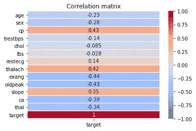

# 你的第一次分类的初学者指南

> 原文：<https://medium.com/nerd-for-tech/a-beginners-guide-to-your-first-classification-f8547d679411?source=collection_archive---------8----------------------->

当我说*初学者*时，我不仅仅是指*你*。


所有照片由 Pixabay.com 提供

上次，以防你错过，我们一头扎进了一个简单的线性回归。在我们重新分析之前，让我们先熟悉一下二进制分类。

什么是二元分类？我们将训练我们的机器来判断一个东西是 1 还是 0。很简单，对吧？准备好在你的笔记本上写代码(或者复制粘贴——我不做评价)。

让我们从导入我们将需要的库开始:

```
import numpy as np
import pandas as pd
from sklearn.preprocessing import StandardScaler
from sklearn.linear_model import LogisticRegression
```

接下来，让我们载入一个你以前可能见过的数据集——心脏病 UCI，可以在[这里](https://www.kaggle.com/ronitf/heart-disease-uci?select=heart.csv)找到。快速提示:如果您正在与“文件不存在”错误作斗争，请使用“pwd”在新的单元格中打印您的工作目录，并使用“cd”命令移动到正确的文件目录，这也可以在笔记本的任何单元格中运行。

```
df = pd.read_csv('./data/heart.csv')
```

现在我们已经读入了数据集，让我们看看我们正在处理什么。

```
df.head(5)df.info() #in a new cell<class 'pandas.core.frame.DataFrame'>
RangeIndex: 303 entries, 0 to 302
Data columns (total 14 columns):
 #   Column    Non-Null Count  Dtype  
---  ------    --------------  -----  
 0   age       303 non-null    int64  
 1   sex       303 non-null    int64  
 2   cp        303 non-null    int64  
 3   trestbps  303 non-null    int64  
 4   chol      303 non-null    int64  
 5   fbs       303 non-null    int64  
 6   restecg   303 non-null    int64  
 7   thalach   303 non-null    int64  
 8   exang     303 non-null    int64  
 9   oldpeak   303 non-null    float64
 10  slope     303 non-null    int64  
 11  ca        303 non-null    int64  
 12  thal      303 non-null    int64  
 13  target    303 non-null    int64  
dtypes: float64(1), int64(13)
memory usage: 33.3 KB
```

你会注意到的第一件事是，东西看起来很干净。没有空值，没有伪装成对象的整数，也没有要重命名的列——除了一些探索之外，我们没有什么可做的。

首先，让我们看看我们的目标，方便地命名为“目标”

```
df.target.value_counts()1    165
0    138
Name: target, dtype: int64
```

如果这真的是你的第一次分类，那么你可能会对这个结果有点困惑。我们不是给目标标上“有心脏病”或“没有心脏病”，而是简单地标上 1 或 0。事情并不总是这么简单，但是如果你的目标是二进制分类，最终你需要你的目标是二进制的。出于我们的目的，1 将是阳性结果，0 将是阴性结果，因为患者没有心脏病。

另一件需要注意的事情是我们职业的平衡。

```
df.target.value_counts(normalize = True)1    0.544554
0    0.455446
Name: target, dtype: float64
```

我们有相当平衡的类，这是理想的，尤其是数据行如此之少。我推荐用熊猫的。describe()函数来自己探索这些数据。

接下来，让我们生成几个简单的图来更好地理解我们的分析。

首先，相关矩阵:

```
import seaborn as sns 
import matplotlib.pyplot as pltsns.heatmap(df.corr()[['target']], 
            annot = True,
            cmap='coolwarm',
            vmin=-1.,
            vmax=1.,
            linewidths=.01
).set_title('Correlation matrix');
```



没什么太意外的！许多强相关和负相关的实验结果可能看起来有点奇怪(我们是数据科学家，不是医学博士科学家)，但对成功的分类是有用的。

接下来，我建议制作一个 pairplot，我会将代码粘贴到下面，您可以自己探索:

```
sns.pairplot(df)
```

接下来，我们需要将数据分成变量，然后分成训练集和测试集。这可能是你第一次将变量分成训练集和测试集，但是不要被吓倒。这使得跟踪我们正在做的事情有点棘手，但是当我们最后评估我们的工作时，这一切都是有意义的。

定义我们的 X 和 y 变量如下所示:

```
X = df.drop(columns = 'target')
y = df['target']
```

简单，和上周的线性回归一样。接下来，一点新的东西:

```
from sklearn.model_selection import train_test_splitX_train, X_test, y_train, y_test = train_test_split(X, y)
```

默认情况下，这将我们的数据分成 80/20。我建议在括号内使用 shift + tab 来探索文档字符串和可控参数，我建议我们做任何事情都要这样做。

接下来，我们需要使用另一个 Sklearn 工具来标准化我们的数据。这是一个必要的步骤，因为我们所有的数据都在不同的尺度上。如果我们无法衡量(新注册的韵文)，我们就会过分重视特定的变量。

这也可能是你第一次试衣改造；请记住，我们的“训练”变量是我们用来教导我们的机器的，我们的测试集是我们如何评估我们所做的，因此我们经常会“适应和转换”我们的训练变量，但只是“转换”我们的测试。

所有东西看起来都是这样的:

```
from sklearn.preprocessing import StandardScalerss = StandardScaler() 
# instantiating

X_train_scaled = ss.fit_transform(X_train) 
# fitting and transforming in one stepX_test_scaled  = ss.transform(X_test) 
# only transforming our test set
```

让我们通过查看每列的第一个值来看看它是如何工作的:

```
X_train_scaled[0]array([-0.26638864, 0.6815542 , 0.03773129, -0.66672428, 1.55906522, -0.382707, 0.88990834, 1.00301838, -0.70944433, -0.74607132, 1.03344495, -0.74360567, -0.48812338])
```

看起来很棒——现在开始有趣的事情吧！我们来分类。

首先，我们需要一个空模型将如何执行的概念:

```
print(f'Null model accuracy: {round(max(y_test.mean(), 1 - y_test.mean()), 2)}')Null model accuracy: 0.61
```

61%的准确率是要打破的数字。

现在，这应该是一个初学者的教训，它是，但我想探索一个新的图书馆，我要带你和我一起去。如果没有冒险精神，数据科学家什么都不是。

最初，我们打算运行 Sklearn 的逻辑回归。相反，我们将使用[Lazy Predict](https://lazypredict.readthedocs.io)——一种工具，它将允许我们同时运行大量算法，并为我们提供每个算法的准确性度量。这不一定构成您分析的全部，相反，它是一个工具，我们将使用它来选择一个特定的模型，然后进行调整和完善。

在我们开始之前，您很可能需要安装这个库；之后，导入分类。

```
!pip install lazypredictfrom lazypredict.Supervised import Classification
```

接下来，让我们设置我们的模型，或者在这种情况下，模型搜索:

```
clf = Classification()
# instantiatingmodels, predictions = clf.fit(X_train_scaled, X_test_scaled, y_train, y_test)
# fitting our model and predicting in one stepprint(models)
# printing the results
```

我们的结果应该是这样的:

```
 **Accuracy** **Bal.Accuracy  ROC AUC  F1 Score**    
**Model**                                                                           
ExtraTreesClassifier             0.88     0.87     0.87      0.88   
XGBClassifier                    0.87     0.86     0.86      0.87   
Perceptron                       0.86     0.86     0.86      0.86   
LGBMClassifier                   0.86     0.85     0.85      0.86   
BernoulliNB                      0.86     0.85     0.85      0.86   
RandomForestClassifier           0.86     0.85     0.85      0.86   
LinearDiscriminantAnalysis       0.86     0.84     0.84      0.85   
RidgeClassifierCV                0.86     0.84     0.84      0.85   
RidgeClassifier                  0.86     0.84     0.84      0.85   
LinearSVC                        0.86     0.84     0.84      0.85   
GaussianNB                       0.84     0.83     0.83      0.84   
LogisticRegression               0.84     0.83     0.83      0.84   
BaggingClassifier                0.83     0.82     0.82      0.83   
CalibratedClassifierCV           0.84     0.82     0.82      0.84   
SVC                              0.83     0.82     0.82      0.83   
NearestCentroid                  0.83     0.82     0.82      0.83   
NuSVC                            0.83     0.82     0.82      0.83   
AdaBoostClassifier               0.84     0.82     0.82      0.84   
KNeighborsClassifier             0.83     0.81     0.81      0.83   
QuadraticDiscriminantAnalysis    0.82     0.81     0.81      0.82   
SGDClassifier                    0.82     0.80     0.80      0.81   
LabelSpreading                   0.78     0.77     0.77      0.78   
LabelPropagation                 0.78     0.77     0.77      0.78   
ExtraTreeClassifier              0.78     0.76     0.76      0.78   
PassiveAggressiveClassifier      0.75     0.74     0.74      0.75   
DecisionTreeClassifier           0.72     0.72     0.72      0.73   
DummyClassifier                  0.63     0.63     0.63      0.63   

                               **Time Taken**  
**Model**                                      
ExtraTreesClassifier                 0.09  
XGBClassifier                        0.03  
Perceptron                           0.01  
LGBMClassifier                       0.02  
BernoulliNB                          0.01  
RandomForestClassifier               0.11  
LinearDiscriminantAnalysis           0.01  
RidgeClassifierCV                    0.01  
RidgeClassifier                      0.01  
LinearSVC                            0.01  
GaussianNB                           0.01  
LogisticRegression                   0.01  
BaggingClassifier                    0.02  
CalibratedClassifierCV               0.04  
SVC                                  0.01  
NearestCentroid                      0.01  
NuSVC                                0.01  
AdaBoostClassifier                   0.09  
KNeighborsClassifier                 0.01  
QuadraticDiscriminantAnalysis        0.01  
SGDClassifier                        0.01  
LabelSpreading                       0.01  
LabelPropagation                     0.01  
ExtraTreeClassifier                  0.01  
PassiveAggressiveClassifier          0.01  
DecisionTreeClassifier               0.01  
DummyClassifier                      0.01
```

酷豆！我们有每个模型的基线精度，以及运行它所花费的时间，当我们有更大的数据集时，这将是有用的。另一个伟大的特点是包括平衡的准确性，ROC AUC 和 f1 评分。虽然您可能还不熟悉这些指标，但在选择模型时考虑它们是很重要的——事实上，我们使用的心脏病数据集是一个完美的例子，说明了为什么这些指标是无价的。

在处理患者健康结果时，我们是愿意将健康的患者诊断为患有心脏病，还是告诉患病的患者他们很健康，并拒绝他们的治疗？这是一个数据科学的道德困境，我们可以使用所有的评估指标来解决，我们可以调整我们的模型，以支持一个或另一个方向(在这种情况下，最大限度地减少假阴性)。在以后的博客文章中，我们将进一步讨论评估。


现在，恭喜你！你已经解决了第一个分类问题。虽然仅给出模型性能图表似乎有点模糊，但请放心，基础工作已经做好，在接下来的几周内，我们将利用上面所做的工作，进一步研究特性化、模型选择、超参数调整和评估。

干得好！希望您能在下一期文章中找到回来的路。


所有照片由 Pixabay.com 提供