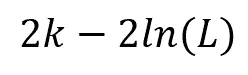
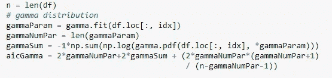
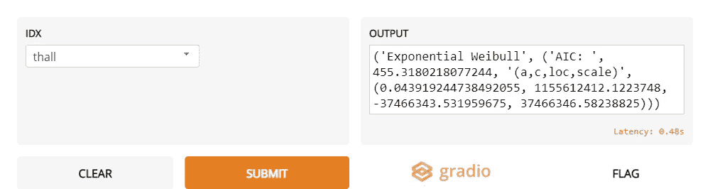
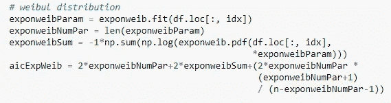
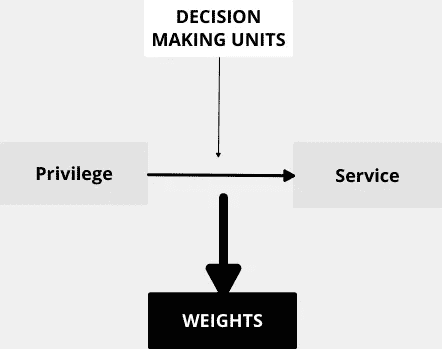

# 最佳拟合数据分布

> 原文：<https://medium.com/nerd-for-tech/a-best-fit-method-to-a-data-distribution-dc6da5562817?source=collection_archive---------15----------------------->

AIC 最佳拟合分布

# **拟合优度**

当输入是数据并且数据是随机的时，适当的分布与数据相拟合，使得成本函数最小化。来自`scipy`的分布使我们能够使数据符合它们的分布。这将进一步有助于参数估计和 **AIC(赤池信息标准)**估计。

我偶然发现了一个包含各种数据分布的 excel 电子表格。下面分享了 excel 电子表格。

[22 研究分配的电子表格(quantitativeskills.com)](https://www.quantitativeskills.com/sisa/rojo/distribs.htm)

excel 电子表格使您能够开发数据分布。这些数据分布是从我们的基本参数生成的，而这里我们做的练习是从基线数据分布估计参数，尤其是数据的核密度图。

# 阿凯克信息准则

这里，k 是参数的数量，L 是模型数据的所有概率的乘积。

最小的 AIC 值是分布的最佳匹配，这意味着对数似然最大化。

我在 [gradio.app](https://gradio.app) 中记下了这个练习，并为它生成了正确的参数。

# 密码

**伽马分布计算**

数据集: [**Heart.csv**](https://www.kaggle.com/rashikrahmanpritom/heart-attack-analysis-prediction-dataset)

> 结果:

> **分布**:‘指数威布尔’
> 
> AIC:19860.888686886617
> 
> 一个:0 . 16860 . 188868886865
> 
> c: 11556 . 488686868667
> 
> 锁定装置:-37400 . 48686868667
> 
> 规模:37600.88868688667

数据集的`thall` 属性的原始密度图

**heart . CSV 数据集的 thall 属性的原始核密度图**

**指数威布尔分布计算**

**gradio . app 中的完整代码，以便重新创建功能**

# 结论

> 这在哪里有用？

1.  ***我发现它在给 DEA 问题分配随机决策单元(DMU)时很有用***

考虑下面的 DEA 问题，为了获得权重，您需要提供决策单元(DMU)。在这种情况下，您需要找到 DMU 的来源，然后对应用程序进行微调。

2. ***了解拟合分布的偏度和峰度。***

3. ***在参数估计和数据分布起着重要作用的组合学问题中，对搜索树进行估计。***