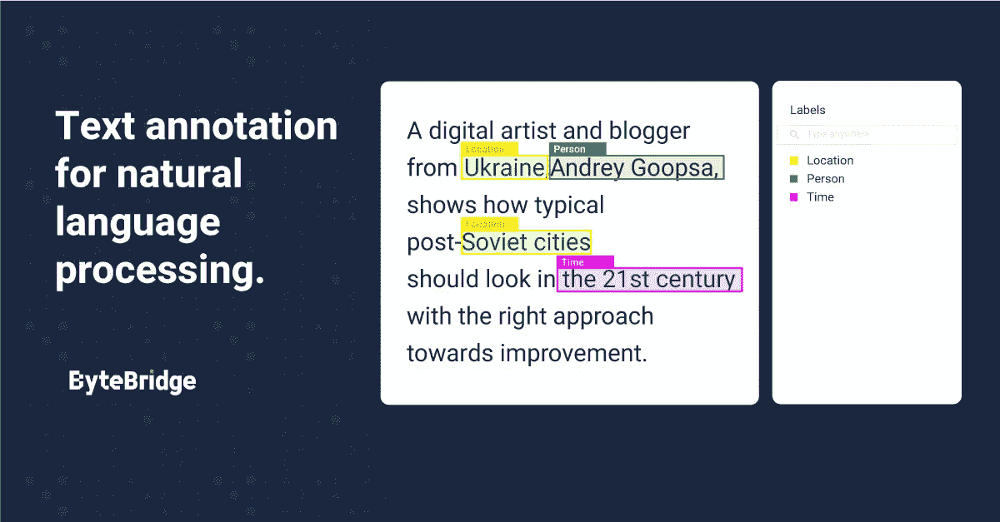

# 浅析自然语言处理技术

> 原文：<https://medium.com/nerd-for-tech/a-brief-analysis-of-nlp-technology-28e590bb665d?source=collection_archive---------3----------------------->

NLP 将语言分成更短的片段，以理解片段之间的关系以及片段是如何组合的。语言有两个组成部分:句法(单词根据它们的语法意义排列在句子中)和语义(文本传达的意思)。每个类别都有核心的自然语言处理技术。

## **语法分析**

以下是机器用来分析语法的一些标准方法:

分段:把一个句子分成更小的片段

词汇化:缩小一个词的范围，将相似的词组合在一起

词性标注:表示每个单词的属性

提取词干:删除单词的前缀和后缀，得到词根

## **语义分析**

下面是机器用来分析语义的两种流行方法:

*   命名实体识别:识别预设组(如人和地点)并进行分类

词义消歧:根据上下文确定词义

需要注意的是，计算机的思维方式与人类不同；他们只进行逻辑思考。自然语言的复杂性不应该被低估。人类用无数种方式表达自己。世界上有数百种语言和方言，每种语言，无论是书面语还是口语，都有自己的语法规则和俚语，而且各不相同。为了让计算机理解所有这些差异，它必须预先遇到这些差异。此外，它必须基于类似的数据进行训练。另一个挑战是，训练数据库应该与预期的应用程序属于同一个域。

## **文字情感注解简介**

情感标签评估文本中的态度和情感，将文本标记为积极、消极或中性。

**更多阅读:** [**情绪分析**](https://bytebridge.medium.com/text-labeling-case-fine-grained-multi-category-labeling-of-emotions-d811f863f67b)

文本情感分析，又称观点挖掘、倾向分析等。用一句话来说，就是分析、加工、总结、推理的过程。在互联网上(如博客、论坛和社交服务网络)，许多用户会发表有价值的评论，如人物、事件和产品。这些信息表达了人们的各种情绪态度和倾向，如喜悦、愤怒、悲伤、喜悦和批评、赞扬等。基于这些，潜在用户可以通过浏览这些评论，了解公众对某个事件或产品的看法。

大多数情感分析研究集中于显性情感，因为这种情感更容易发现和分析。分析情绪通常有两个方面:

情绪极性:分析情绪(积极的还是消极的？)

情感强度:从高到低的喜爱程度

## **需要制定项目章程和标准**

让基于文本的情感标注变得更简单。很多情感分析项目都涉及到大量的文本标注。像“咖啡味道很差”这样直截了当的文本可能需要标注者标注“正面”、“直接负面”或中性。**复杂隐含的文本很难制定标准。**因此，在表达诸如“挖苦”和“讽刺”这样的困难情绪时，标准非常重要，这直接影响到项目周期和数据质量。

# 对可扩展和定制数据集的高需求

目前，各行业对最优质的 AI 训练数据需求迫切。AI 在各个领域都有实现，比如教育、法律、智能驾驶、银行、金融等。每个领域都有细分和专业化的要求。

其中，尤其是智能转型的传统企业和科技企业，更需要有丰富项目经验的培训数据服务商的协助，帮助整理数据标注指令，获取更合适的数据。在特殊场景下使用高质量的数据，减少研发周期，加速实施过程，帮助企业更快更好地进行智能化转型。

在深入的产业落地过程中，人工智能技术与企业需求仍有差距。企业用户的核心目标是利用人工智能技术实现业务增长。实际上，人工智能技术本身并不能直接解决所有的业务需求。它需要创建可以基于特定业务场景和目标大规模实现的产品和服务。

我们需要明确的是，对于 AI 公司和整个行业来说，数据标注是实现人工智能的重要一环。标注数据的准确性和效率影响着人工智能算法模型的最终结果。

## NLP 服务

我们在电子商务、零售、搜索引擎、社交媒体等领域提供不同类型的自然语言处理。我们的服务包括语音分类、情感分析、文本识别和文本分类(聊天机器人相关性)。

ByteBridge 与全球 30 多个不同的语言社区合作，现在提供[数据收集和文本注释服务](https://tinyurl.com/2wjw8bbs)，涵盖**英语、中文、西班牙语、韩语、孟加拉语、越南语、印度尼西亚语、土耳其语、阿拉伯语、俄语等语言**。

# 结束

将你的数据标注任务外包给 [ByteBridge](https://tinyurl.com/2wjw8bbs) ，你可以更便宜更快的获得高质量的 ML 训练数据集！

*   无需信用卡的免费试用:您可以快速获得样品结果，检查输出，并直接向我们的项目经理反馈。
*   100%人工验证
*   透明标准定价:[有明确的定价](https://www.bytebridge.io/#/?module=price)(含人工成本)

**为什么不试一试？**