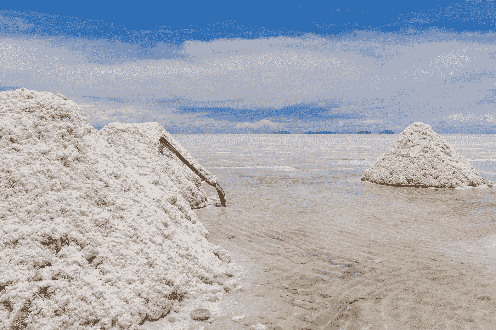
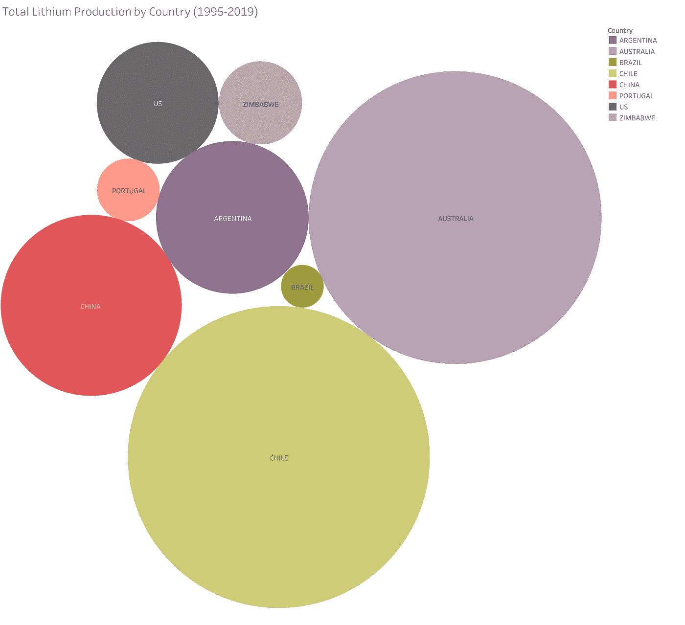
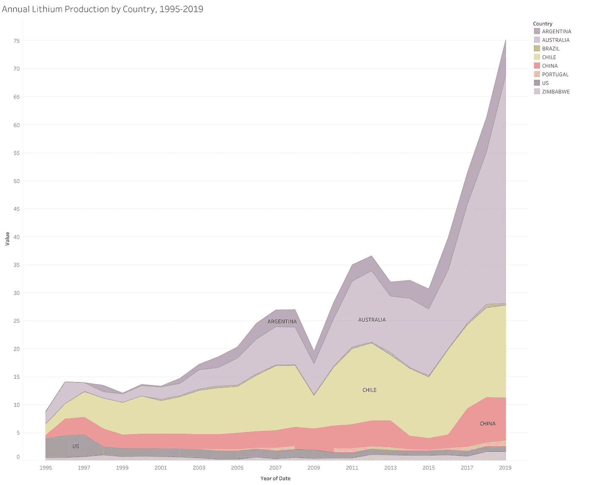
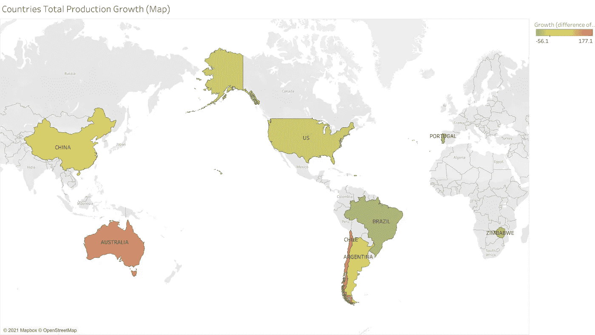
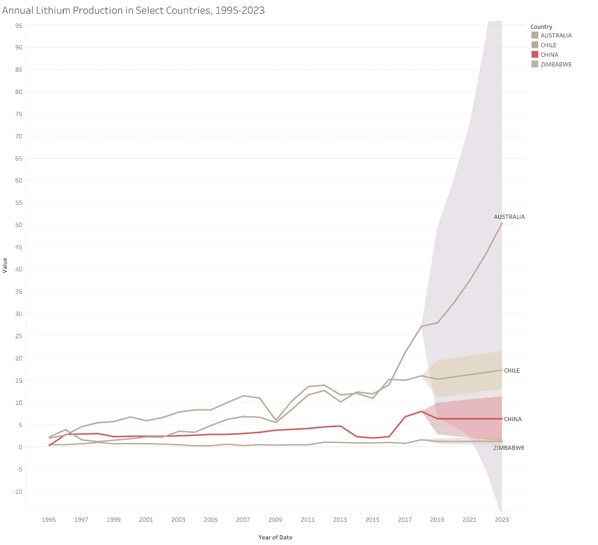
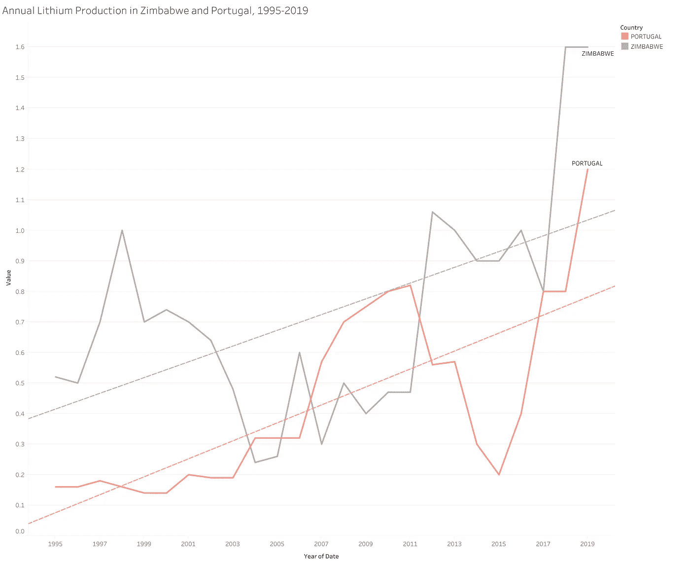

# 浅析锂源

> 原文：<https://medium.com/nerd-for-tech/a-brief-analysis-on-lithium-sources-a133d1da80e?source=collection_archive---------16----------------------->

Alexander Schimmeck 在 [Unsplash](https://unsplash.com?utm_source=medium&utm_medium=referral) 上的照片

# 摘要

随着对电动汽车(主要是汽车行业)的激励和集体兴趣的增加(但不止于此)，对锂离子电池的需求也在增加，并可能继续以前所未有的速度增长。此分析的目的是为任何需要采购锂离子电池的人提供应对短缺的洞察力。对于像[三星 SDI](https://www.samsungsdi.com/index.html) ，最近宣布为 [Rivian](https://rivian.com/) 提供电池的公司来说，这些信息可能是有用的。

数据收集自 [WorldData.ai](http://worlddata.ai) ，它为我提供了来自 *BP Statistical Review 的数据集。*数据包含特定国家的锂产量(以千吨锂含量计),从 1995 年至 2018 年每年记录一次每个来源的锂产量。

我在 Tableau 中执行了一个分析来可视化数据，并在本文中简要讨论了结果。这个项目中的所有可视化是互动的，可在我的网站:[https://hainesdata.science/#lithium-sources](https://hainesdata.science/#lithium-sources)

# 全球锂产量

很明显，全球锂产量已经大幅增长，这可能是因为锂离子电池需要更多的锂，尤其是在电动汽车中。

各国锂总产量(1995 年至 2019 年)

如上图所示，南半球国家多年来已经生产了大量的锂，尤其是与北半球国家相比。在过去的 20 年里，智利的锂产量居世界首位，达到 238，000 吨。澳大利亚也不容忽视，因为其数量与智利相似:224，000 吨。

# 锂年产量

## 年度绩效

智利和澳大利亚一直是锂的生产大国吗？我们将逐年调查所有锂国家的表现。

各国锂年产量(1995 年至 2019 年)

在这里，我们可以确认南半球不仅生产大量的锂，也生产持续变化的锂。阿根廷、澳大利亚、智利和津巴布韦在 2018 年前几乎完全一样。2018 年，智利和津巴布韦生产锂的速度放缓，而阿根廷和澳大利亚则大幅增加。

根据所使用的数据，无法判断是什么导致了南方国家之间的“分裂”，但我认为这与这些国家的经济状况以及锂的价格与这些国家自己的市场成比例有关。或者，智利、中国、津巴布韦和美国确实出现了锂短缺。快速谷歌搜索实际上显示，美国可能会看到锂短缺，这应该会增加锂在其他来源国的价值。

我们还可以证实，智利和澳大利亚在过去几十年里锂产量一直很丰富。美国在 1995-1997 年间一直很富裕，但后来掉队了，并努力追赶其南方竞争对手。

## 总体增长

为了进一步分析每个国家的表现，我们可以使用地图可视化显示这些国家在 1995 年至 2019 年之间锂产量的总变化:

各国总产量增长(Map) (1995 年至 2019 年)

正如所料，澳大利亚和智利的锂产量增长最快，其次是中国和阿根廷。暖色调见证了更大的变化。一些国家的产量全面下降。

# 主要锂采购国

从这些分析中可以清楚地看出，在采购锂时需要注意一些关键国家。

选定国家的锂年产量(1995-2023 年)

最近，澳大利亚、智利、中国和津巴布韦的锂产量发生了显著变化。

## 澳大利亚

澳大利亚的产量在过去 5 年中大幅增加，可能是由于锂离子电池需求的大幅增长。看起来澳大利亚在经济上处于最有利的位置，可以提供更低的价格。同样，这是不可能用给定的数据来说明的，而且那个结论仅仅是推测。

使用 99%的置信区间，我预测了澳大利亚产量的大范围增长。按照目前的增长速度，很难说澳大利亚的锂供应会发生什么。澳大利亚对锂的需求可能很大，如果澳大利亚出现短缺，锂的价格将大幅上涨。**未来几年通过合同从澳大利亚采购锂将非常危险。没有足够的把握知道它将走向何方。**

## 中国

在过去的几年里，中国的年产量一直保持稳定，与其他国家的年产量相比，这是非常了不起的。鉴于中国在半导体制造业中占主导地位，他们可能会耗尽锂，并稳步节约资源，以确保其半导体制造业的可扩展性。

## 辣椒

又一个锂产量下降的国家。然而，智利位于南半球。如前所述，南方国家生产率的“分裂”是显著的。然而，有 99%的信心预测，智利不太可能在未来几年内看到生产率下降。从智利采购锂的成本可能比澳大利亚高，但风险要小得多，而且在未来几年内肯定会增长。

## 津巴布韦和葡萄牙

我将这些国家归为一类，因为它们的数据由于整体产量较小而受到限制。虽然巴西和津巴布韦的产量还没有达到明显的峰值，但应该注意的是，在过去几十年里，津巴布韦和葡萄牙的产量稳步增长，尽管它们的总产量有所下降。

下图是一个线形图，显示了津巴布韦(R =0.2848，p=0.006)和葡萄牙(R =0.5577，p <0.0001). The R² and p-values resulted from a linear regression. Both p-values suggest strong evidence of increases in production rates in Zimbabwe and, most remarkably, Portugal. **目前从葡萄牙和津巴布韦采购锂的成本很高，但预计未来产量会增加。**根据对津巴布韦产量的预测，未来几年至少会有一个稳定的产量。

# 关键要点

锂生产市场确实不稳定，因此不可预测。然而，通过使用这些分析，可以降低风险并提前计划可能发生的任何锂短缺。

以下是主要要点:

*   在过去的 5 年里，锂的产量急剧增加
*   未来几年依赖从澳大利亚采购锂将非常危险。
*   中国可能会保守地生产锂，以保护他们在半导体制造业的领先地位。
*   从智利采购锂可能比澳大利亚更贵，但风险要小得多，而且在未来几年内肯定会增长。
*   从葡萄牙和津巴布韦采购锂现在会很贵，但期待未来产量的增加。投资于它们的生产可能会被证明是有用的。

感谢阅读。请查看我的其他文章，如果你之前错过了，这篇文章的交互式可视化可以在[我的网站](https://hainesdata.science/#lithium-sourcing)上找到。如果您有任何问题，请随时通过 LinkedIn 或电子邮件联系我们。