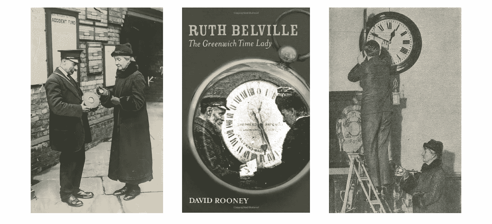
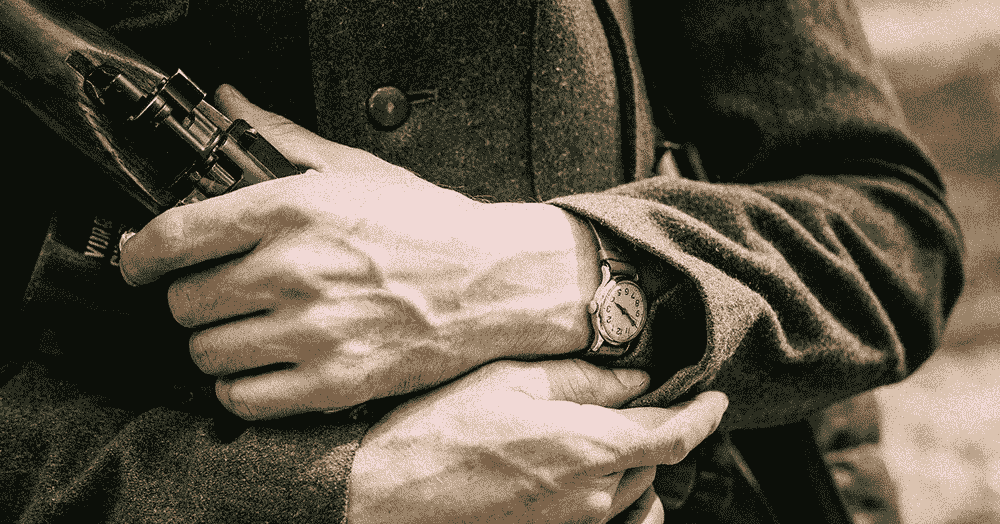
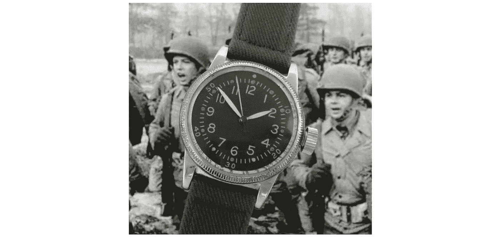
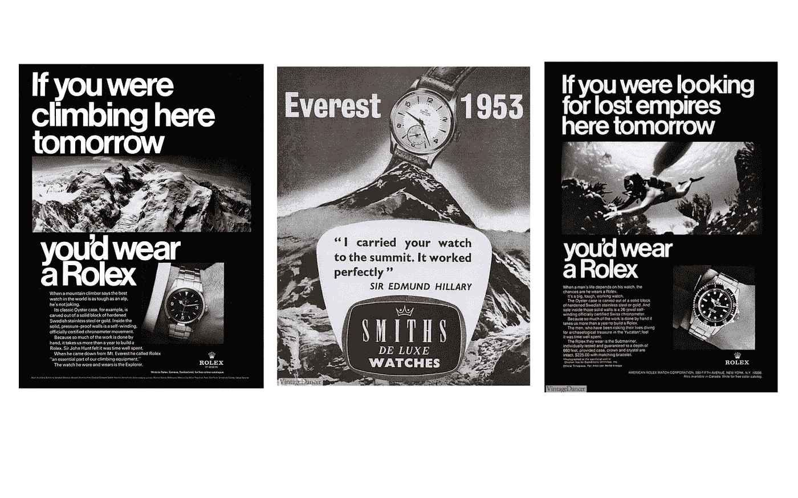
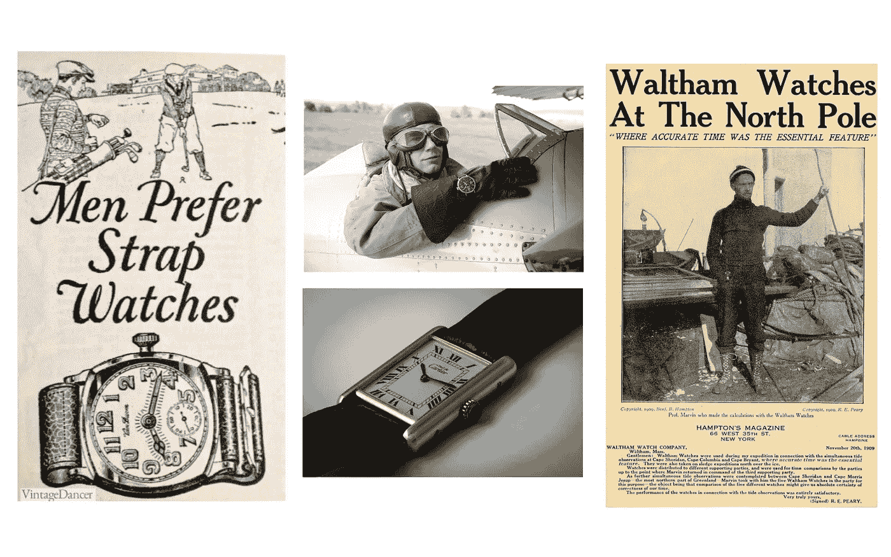
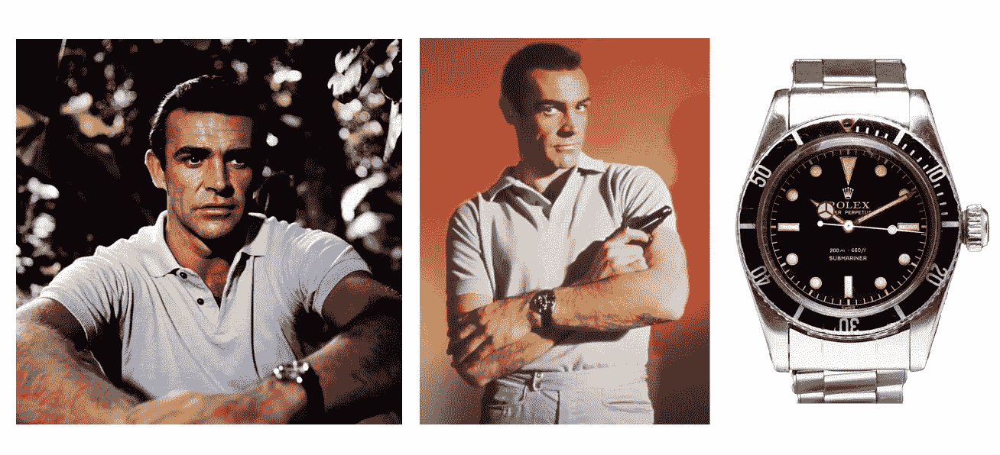
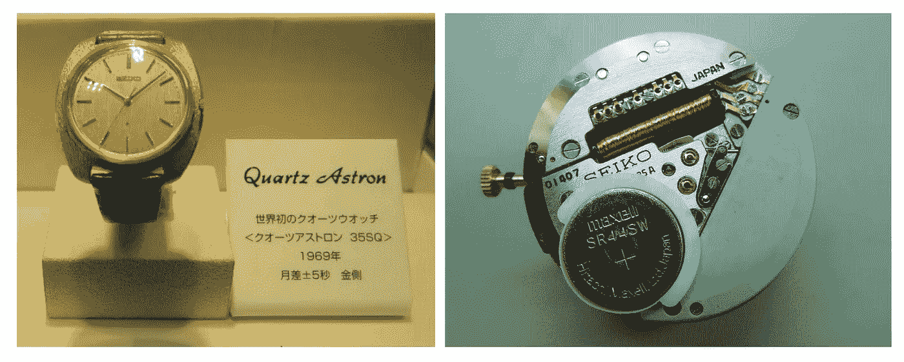
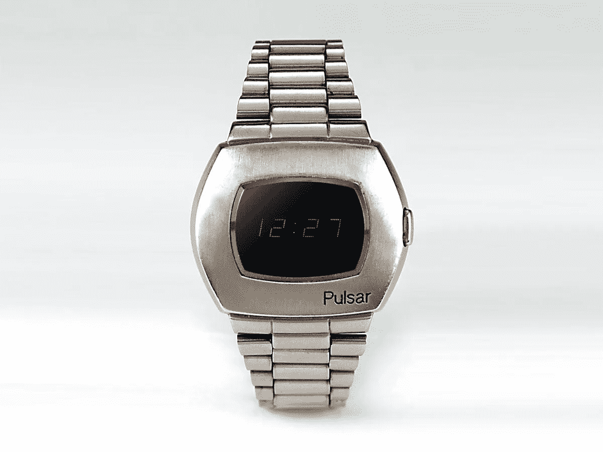
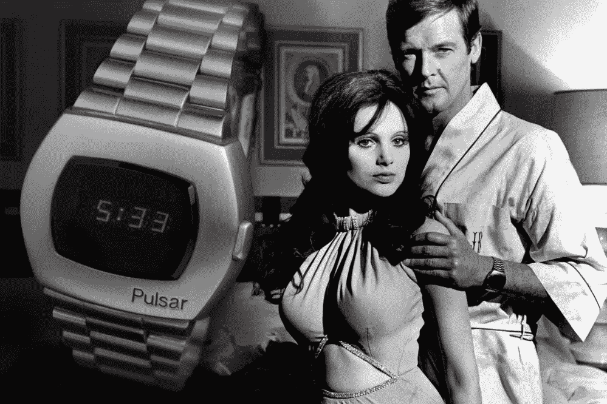

# 智能手表简史:计时

> 原文：<https://medium.com/nerd-for-tech/a-brief-history-of-smartwatches-timekeeping-7efc0042ac14?source=collection_archive---------12----------------------->

直到最近，当我开始坦诚自己烦躁不安的行为来追溯一切的根源时，我才发现自己对历史的热爱。对于 TL:DRs 来说，这不是一个无聊的历史博客，谈论哪家公司在哪一年推出了哪种型号，谁是什么功能的第一人。我在这里收集了导致智能手表进化的文化、环境和科学发展。只有一个三季的网络系列可以公正地对待整个故事，但我已经试图在一个三部分的博客中捕捉尽可能多的东西，就像现在如何在你的手腕上捕捉巨大的计算能力一样。

我们将要谈论的工作是几个世纪前完成的，提供了一个历史的视角，这样我们就能意识到我们已经走了多远，在某种意义上仍然是一样的。正如科技历史学家托马斯·休斯所言——历史不会详细地重复自己，但会让我们看到相似之处。作为人类建造的世界中的生物，我们应该更好地理解它的进化。

页（page 的缩写）让我们注意我的双关语

# **大局**

我们没有一根线可以用来理解进化，但我们可以研究的是编织在一起的织物。我们可以将智能手表的历史分为三个大的时代。在这三个系列的每一篇博客中，我们都将深入探究这些广阔的时代:

1.  计时的历史

2.商业实验:我称之为“实验”,因为当时智能手表还没有取得商业上的成功。手表和科技公司都进入了这个领域，以抢占彼此的市场，但没有一家公司能真正找到适合自己市场的产品。

3.现代智能手表:现代智能手表时代是苹果手表推出后的时代，当时手表成为欲望的对象，裸露的手腕开始被视为健康无知的标志。

让我们开始吧…

# 计时的历史

时间并不总是像现在这样容易接近。机械钟有自己的进化曲线，变得足够精确来计时。在那之前，人们主要依靠巨大的日晷和钟楼。唷，我们已经走了很长的路，现在才能在锁屏中看到它。

在 20 世纪，时间就是金钱。格林威治时间女士做的是卖时间的生意。每天，她用皇家天文台校准时间，然后在城市里四处走动，让人们看看她的阿诺德怀表，这样他们就可以根据它调整自己的手表。

《绿色时光》的女主角露丝·贝尔维尔抓住了销售时间。

这种时间销售供应链的一个问题是同步。每一个时钟都有自己的准确性，并且在一段时间内会损失时间(P)。在 B2B 客户中，铁路是最不快乐的。火车时刻表经常被打乱，火车的到达/离开时间变得难以预测。只是到了后来，当电线杆网络足够成熟时，时间才被标准化。但是它还没有个性化。

对于富人来说，这是一个不同的场景。他们会买怀表并用珠宝装饰，就像我们谈论智能手表的电池寿命一样，这些怀表需要定期加油来维护。这是个性化时代的一个进步，但它只是一种奢侈品，并不具备这样的需求。

只有当世界处于战争状态时，让时间成为我们手腕上的附属品才变得重要。士兵们发现很难随身携带怀表，而且需要看一眼就知道时间来校准机芯。

军队广泛使用手表。

在 19 世纪 80 年代的殖民军事行动中，[英军](https://en.wikipedia.org/wiki/British_Army)的军官开始使用手表，例如在 1885 年的[英缅战争](https://en.wikipedia.org/wiki/Third_Anglo-Burmese_War)中。智能手表极大地实现了士兵可以同时攻击的战壕战！著名的卡地亚品牌的基础是基于创始人的朋友需要检查他的飞艇飞行性能，同时保持双手控制。正如我们今天可能称之为的——不用手的体验。

第一次世界大战后，手表是一个蓬勃发展的行业。一些曾经是女性附属品的东西正作为男性产品出售。公司围绕战争创造了营销活动来庆祝士兵的短暂，手表成为了 ***小时*** (:P)的需求。手表成为一战英雄的象征，每个公民都购买手表来感受这种自豪感。

手表为盟军赢得战争的贡献有很多故事。A11 手表被贴上了“赢得战争的手表”的标签。这是一块特殊的手表，秒针可以停在上面，然后“哇！当人们同时按下他们手表的表冠以完美地同步所有人的时间时，简报官说！

a11——赢得战争的手表

引入了像天文钟这样的功能来帮助海军人员计算经度、标绘位置和方向。这是用来取代无线电的，无线电的信号可以被敌人用来追踪他们自己的位置。这些功能被称为 ***复杂功能*** ，就像我们今天在智能手表上看到的一样。

随着战后世界的安定，人们追求冒险的激情，制表师用防水、不易破碎等特性说服了他们。营销人员追踪著名的探险，充分利用历史事件。劳力士发布了探险家手表系列，第一批人类登上了珠穆朗玛峰。

手表制造商的促销活动

通过电影这一媒介，公司与消费者之间的纽带得到了加强，肖恩·康纳利在该系列的前四部电影中展示了劳力士潜水艇。

詹姆斯·邦德摆出劳力士潜水艇的造型

世界沉浸在戴手表的喜悦中，但在科学家中，有一个严重的问题需要解决。手表的滴答声是手表内部发生机电运动的结果，这种运动通常是不准确的。它每个月会慢 60 秒。这些公司竞相使他们准确，因为这将是营销金蛋。到 20 世纪 50 年代，瑞士制表商在机电手表领域占据了全球 50%以上的市场份额。让他们大吃一惊的是石英。

石英在计时方面特别有用，因为它具有压电特性，这意味着当受到压力时它可以发电，反之亦然。这有助于建立更准确的运动。

早在 20 世纪 20 年代，贝尔电话实验室(当时叫美国电话电报公司·贝尔实验室)首先开发了石英钟。但直到 20 世纪 50 年代，公司才可以将石英带进手表。

在东京的一个圣诞节，精工推出了第一款商用石英表，售价 1250 美元，相当于现在一辆丰田卡罗拉的价格。它每月的精确度在 5 秒以内，比机械表精确 100 倍。由于瑞士手表继续专注于传统机械表，其出口量从 1973 年的 4000 万只下降到 10 年后的 300 万只。在这段动荡时期，瑞士钟表业出现了大规模裁员，几家钟表公司关门大吉。美国人和日本人领先。

在推出智能手表后，我们可以观察到类似的历史重演。在赶上苹果用智能手表伏击市场方面，瑞士手表制造商明显落后。

**增加显示技术的可见性(:P)**

1968 年，以“未来主义”的名义，腕表进化的主线与显示技术的主线交织在一起。这是为了满足斯坦利·库布里克为他的电影《2001:太空漫游》展示未来手表的要求。

这就诞生了汉密尔顿的 Pulsar，这是第一款带有数字显示屏的手表。这也是第一款没有活动部件的手表，的确是一个工程奇迹！

汉密尔顿和电子/数据公司已经创造了一种可以安装在表壳内的固态计算机。可能没有移动部件，但*有*3474 个晶体管。如果一个棋子被侵蚀或者掉了位置，游戏就结束了。在这个发展阶段，脉冲星还不能大规模生产，所以一切都必须手工放置。

单单电池系统就非常复杂。要制造一款不会立即耗尽的手表，意味着它只能显示你按下按钮时的时间，然后只有一秒钟——这个问题在 40 年后的 Apple Watch 上引起了工程师的共鸣，它的“永远在线”显示只在第五代产品 2019 年的 Series 5 中出现。

人们会戴着手表睡觉，LED 会被按下，这样灯就会整夜亮着，电池也会没电。在阳光下也很难看到，所以发光二极管被做得更亮。Pulsar 也是瑞士进口的第一块手表。有人甚至看到詹姆斯·邦德戴着 Pulsar 来代替他通常戴的劳力士或欧米茄手表；在邦德电影《T2》中，《生死与共》(1973)。

尽管有缺点，Pulsar 还是大受欢迎。在石英革命的第一阶段，数字比模拟更受欢迎，led 比 LCD 更受欢迎。

1974 年，当国家半导体公司以 125 美元的价格进入市场时，led 的需求得到了极大的推动，这是竞争对手的一半。于是，美国电子公司蜂拥进入手表市场。1975 年，有 50 多家半导体公司(摩托罗拉、休斯、飞兆、英特尔的 Microma、惠普等。)在美国制造和销售 LED 手表 1975 年 10 月的《商业周刊》封面故事颂扬了这一趋势:“数字手表:将制表业带回美国。”

计时的形式从巨大的结构发展到奢侈品，再到缠绕在我们手腕上的东西。Pulsar 是第一个将计算技术嵌入手表的商业实验，从显示屏开始。很快，数据存储技术被嵌入到手表中，各种应用程序被开发出来，使手表的功能超越了时间的展示。

但是所有这些都是为了我们的第二部分——商业实验。感谢您耐心阅读历史！希望不无聊:)