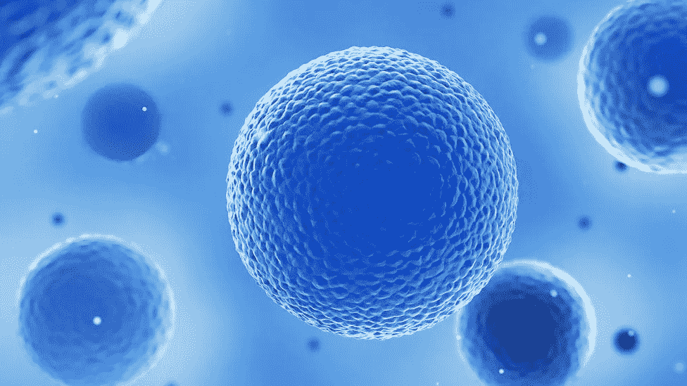
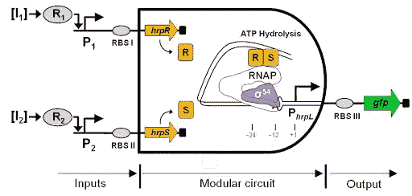
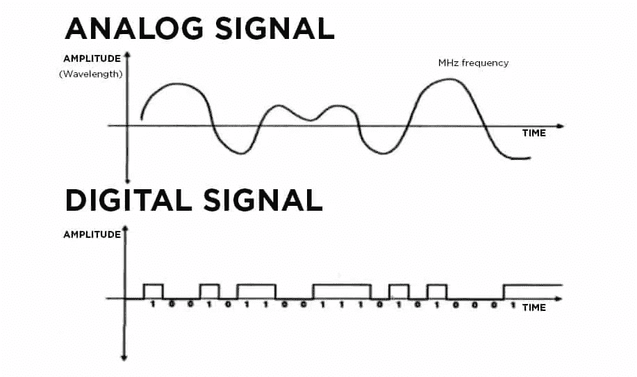
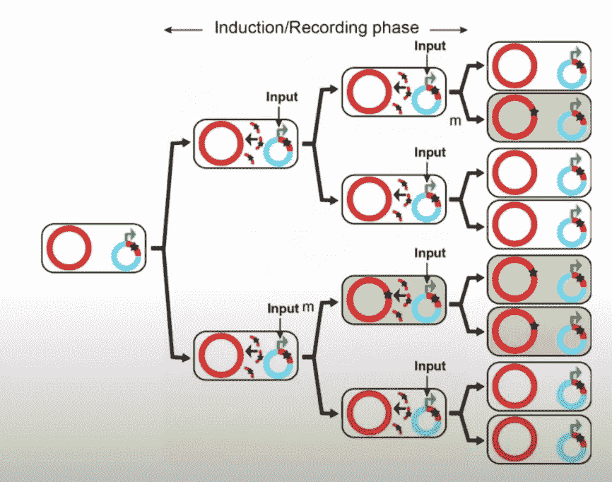
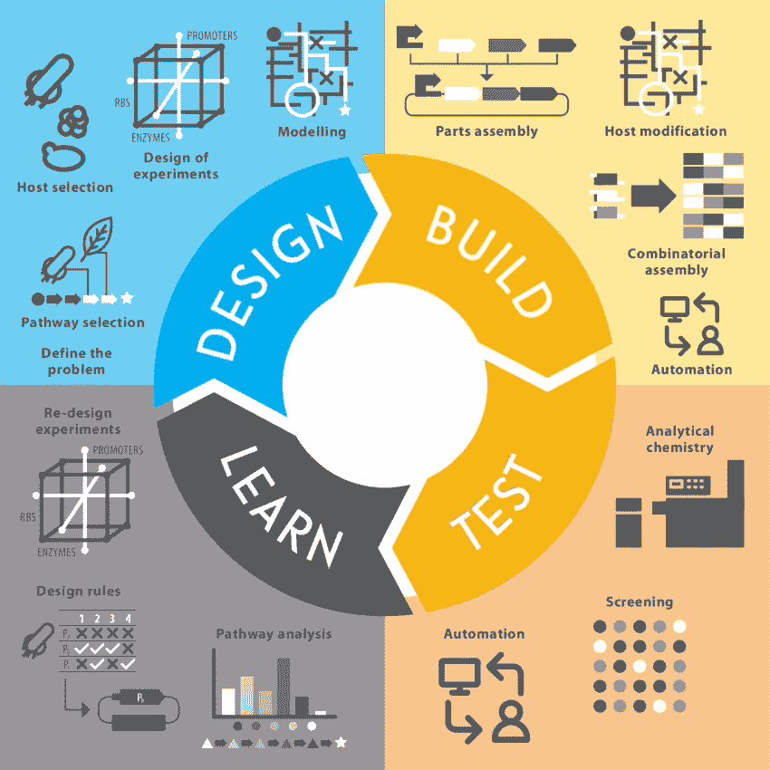

# 模拟合成电路简评&活细胞中的模拟计算

> 原文：<https://medium.com/nerd-for-tech/a-brief-review-of-analog-synthetic-circuits-analog-computation-in-living-cells-4cd3ae7fd313?source=collection_archive---------17----------------------->

## 回到“旧学校”的计算模式才是未来

图片来源:BBC

> 这是一篇综述文章，简要介绍了该主题的不同方面。简单说几个要点:
> —电路//当我提到电路时，它是基于将细胞通路与电子电路进行比较的类比。这些“回路”创造了一系列事件的连锁反应，导致“程序化”的生物反应发生。
> —计算//尽管我将计算解释为执行计算的能力，但细胞执行的计算超出了传统的观点(即决定是否除法)

# 合成生物学概述

在过去的几十年里，合成生物学取得了令人难以置信的飞跃，2000 年开发了合成电路，2010 年创造了第一个合成生命体，最近又创造了能够进行碳固定以合成生产大麻素的大肠杆菌。合成生物学是重新设计或创造新的生物体，通过工程改造使它们具有新的能力和/或功能。Deplazes 是一位生物伦理学研究者，他写了几篇关于合成生物学的伦理含义的研究论文，他将这些科学家分为两组:

1.  创造人工生命——使用非自然分子来复制自然生物学中出现的行为
2.  非自然系统——从自然生物中提取可互换的部分，组装出非自然运行的系统

生物计算属于第二类，因为它需要生物材料(即细胞、DNA、蛋白质)来执行计算，而计算可以被认为是执行计算的能力。虽然生物计算研究有多种途径，但本文将特别关注合成电路。

# 合成电路的当前范例

首先，让我们看看合成电路的定义:

> ***合成生物电路*** *是合成生物学的一种应用，其中细胞内的生物部分被设计成模仿电子电路中观察到的逻辑功能***。**

*当我第一次开始了解这个概念时，我发现我们如何能够将特定的行为“编程”到细胞中，在细胞中特定成分的存在可以刺激特定的生物反应，这很有趣。*

**

*图片来源:王实验室//这是一个 AND 门的例子，两个输入都必须为 1 才能得到 1 的输出(要表达 GFP)。*

*然而，这直接揭示了当前我们如何首先谈论合成电路的问题。如果我们回到定义，它提到“细胞被设计来执行模拟电子电路中观察到的逻辑功能”当讨论逻辑功能时，这是基于逻辑门的概念，其中每个门是一个功能的例子；根据函数的规则，它决定了输出是什么。*

> **原则上，这种类比基于细胞是计算机的想法，因为它们可以接收输入，处理输入，并产生输出。**

*虽然这个类比有助于理解工程合成电路的概念，但它并不完美。无论我们将多少工程学原理带入生物学，生物学仍然有其固有的混乱性和随机性。这类似于在高度多样化的城市里，他们通常有自己版本的唐人街、小意大利等。，虽然他们确实呼应了他们文化的某些方面，但这并不是那种文化的完整代表。*

*这不一定是件坏事。我认为，将工程原理加入生物学已经导致了一个新的范式转变，创造了新的创新和应用，可以对世界产生积极的影响。但是，我们要注意不要抽象太远，在这里我们认为生物电路可以直接模仿并与传统的硅计算机竞争。这个模型只会在未来限制我们，因为我们正在限制生物计算的潜力，而不是利用细胞的自然能力，我们正在抑制它们。*

## *通往计算的道路不止一条*

*当我们听到“数字”这个词时，我们大多数人的第一个联想是“计算机”。考虑到我们将所有的电子产品都称为“数字设备”，因为它们能够执行计算，我们为什么不能呢？即便如此，将此视为唯一的计算模型抑制了我们超越经典计算机目前所能承受的极限的能力。*

*数字计算是由 0 和 1 等离散值组成的计算。它基于逻辑门处理输入和输出，逻辑门是构成所有数字系统基础的逻辑功能。根据逻辑门的规则，它决定了你的输出会是什么。例如，当两个输入都为 1 时，与门的输出也为 1。*

**

*图片来源:Xplorian*

*相比之下，模拟计算是创建一个代表待解决问题的模型，该模型可以接受连续输入并并行处理它们。输入可以是电的、机械的、液压的或生物的。模拟计算允许 0 和 1 之间的**范围**的值，而不是不同的输入/输出值。*

*与普遍的看法相反，模拟和数字计算之间的主要区别不是它接受离散值和连续值的能力，因为一些模拟计算机可以表现出数字行为。*

*事实上，区别在于结构，模拟计算机具有可重新配置的内部结构，允许它们改变它以最好地解决问题，而数字计算机具有固定的结构，以连续的顺序解决问题:*

> *【模拟计算机】它的内部结构是不固定的——事实上，一个问题是在这样的机器上通过以合适的方式改变其结构来生成模型，即所谓的问题的模拟来解决的。然后，该模拟用于分析/模拟要解决的问题。*
> 
> *~模拟计算，Bernd Ulmann 著*

*当我们观察生物学，尤其是细胞时，很明显它们大多遵循模拟计算模型。细胞对环境极其敏感，pH 值、温度、ATP 浓度等最微小的变化都会影响细胞。影响体内平衡和细胞结构。这些元素不断变化，使细胞成为高度动态的系统，能够适应和应对多变的环境。*

*因此，数字合成电路的效率非常低，无法扩展以满足我们对计算复杂性的需求。有了模拟电路，我们可以更加节省能源、时间和资源。由于我们不再需要将信号严格离散为 0 和 1，因此可以减少用于运行计算的器件数量。*

> *更少的零件= >更少的资源= >更少的能源= >更少的时间*
> 
> *更少的部件= >更多的空间= >复杂的计算*

*此外，有了更多的可用空间，我们可以自由地添加更多的部件，如果需要增加计算复杂性。*

# *为什么是模拟？*

*虽然数字系统在确定特定输入的存在和调节基因表达方面很棒，但模拟系统增加了一个整体水平的可能性。模拟系统可以接收各种输入的连续信号，从而有机会监控系统在一定时间范围内的性能。*

*这对于未来在医学、环境、生物生产等领域的应用非常有益。例如，如果我们有一个细菌群落，我们引入了一个可以导致突变的输入，我们可以监测这些突变如何随着时间的推移积累*。**

****

**图片来源:https://www.youtube.com/watch?v=5_z1gG-m96A//这个例子引用了一项[研究](https://www.ncbi.nlm.nih.gov/pmc/articles/PMC4266475/)，该研究在细胞中开发了一个模拟记忆系统。在这个系统中，突变可以作为“记忆”,将突变写入基因组。**

**在这个例子中，假设细菌可以用光作为输入来激活。光可以激活连锁反应，导致细菌获得特定的突变。有两种方法可以加速系统中突变的积累:**

*   **使用更亮的光(量级)**
*   **让光线照射系统更长的时间(持续时间)**

**根据种群中有这些突变的细菌与没有突变的细菌的比例，我们可以使用这些信息来确定系统的输入量和持续时间。**

## **开发模拟生物系统**

****

**图片来源:ResearchGate**

**当开发合成电路时，合成生物学家使用设计-构建-测试-学习模型。这是一个迭代过程，允许生物工程师使用从以下阶段获得的信息来改进他们当前的设计。在第一阶段，一旦选择了一个挑战，研究人员头脑风暴不同的方法，并决定哪一个最能解决这个挑战。**

**从那里，他们可以开始概念化什么类型的设计，他们想要建立。**

**对于模拟计算，一种方法是使用微分方程。微分方程是一个数学概念，它表示系统中的变化，而不涉及这些变化是如何发生的。**

**例如，假设你正在一个新城市旅行，参观所有令人眼花缭乱的景点，品尝他们的美食。你可以这样描述某一天你的位置:A –> B –> G –> c。这个简单的流程图解释了当你在城市中穿行时，你的位置是如何变化的，但是它没有说明*你是如何从一个地方到达另一个地方的。无论你是步行，还是乘坐公共交通工具，等等。***

****

**图片来源:123RF //为了便于类比，在地图上随机添加了不同的点**

**为了确定你的微分方程，这需要知道微积分(目前我不知道，所以这只是我能理解的)。基于该场景，您可以构建一个化学反应网络，该网络描述了在一个过程中发生的化学反应。在我们之前的类比中，网络中的第一个方程是 A –> b。一旦您写下这些方程，您就可以使用质量作用方程(用于确定反应发生的速率)来推导您的微分方程。**

**这些微分方程可以输入到模拟编译器中，模拟编译器可以将微分方程转换成电路仿真，以便进行实验。这类似于数字编译器如何将代码转换成计算机可以理解和执行的东西。从那里，它可以在实验室里建造和测试。**

## **警告，因为所有系统都是不完美的**

**尽管模拟声音很有前途，但仍有一些缺点。例如，模拟系统更容易受到噪声的影响，即外部因素对信号的任何干扰。生物系统中蛋白质表达水平的波动。噪声会导致输出信号的信号波动和/或信号退化。由于这种易感性，在效率和精度之间有一个权衡。**

**此外，虽然 analog systems 提供了稳定的最终输出，但它无法恢复每个计算步骤中出现的信号。例如，如果你的最终目标是从 A 点到 G 点，你就不知道到达最终目的地的中间步骤是什么。**

# **当前进度**

**科学家已经成功制造出能够进行模拟计算的活细胞。第一个演示复杂模拟计算的小组创建了可以执行数学功能的电路，如对数、加法、减法、除法和幂律。另一个小组创造了模拟 DNA 电路，利用链置换来执行计算，其中模拟用于模拟预期的门行为。这些门能够执行加法、减法和乘法。[ [2](https://pubs.acs.org/doi/full/10.1021/acssynbio.6b00144)**

**模拟电路也被设计成具有记忆功能。2014 年，法尔扎德法尔德等人。al 开发了 SCRIBE，这是一种通过将过去的细胞事件写入 DNA 来创造细胞“记忆”的策略。简而言之，外部信号(即光或生物分子)刺激细胞中 ssDNA 的产生，然后 ssDNA 可以通过重组将突变写入基因组，从而编码这些信息。通过这种方法，他们能够使用编码记忆来确定输入的持续时间和大小。[ [3](https://www.ncbi.nlm.nih.gov/pmc/articles/PMC4266475/)**

**此外，在开发混合计算模型方面正在取得进展，这涉及到对信号的模拟和数字处理的使用。鲁本斯等人。al 开发了混合信号电路，创建了模数比较器(将模拟信号转换为数字信号的组件)。[ [4](https://www.nature.com/articles/ncomms11658#MOESM1194)**

**此外，随着新工具的出现，我们设计和模拟这些系统的能力也在提高。例如，麻省理工学院的一个小组开发了 Arco，它是一个求解器，能够根据给定的输入(微分方程)开发电路硬件设计。[ [5](https://dl.acm.org/doi/pdf/10.1145/2980983.2908116) 最近，Medley et。al 开发了一个编译器，将化学反应网络转换成细胞形态芯片配置。细胞形态芯片是由生物材料(即蛋白质)制成的细胞启发的芯片，能够模拟生物系统。[ [6](https://journals.plos.org/ploscompbiol/article?id=10.1371/journal.pcbi.1008063)**

******为了让本文保持一个严格的概述，我只是顺便提到了这些例子。然而，我确实打算在以后的文章中更深入地探讨这些领域！***

# **当前的挑战**

**为了继续向前推进，仍有一些挑战需要克服:**

*   **改进构建模拟电路的理论框架——需要做更多的工作来理解电池的机制，以及我们如何才能最好地利用它们来执行计算。**
*   **模糊模拟信号的实现—模糊模拟信号是 0 到 1 之间的任何输入。我们希望在细胞中评估的特征(即噪音、表达水平等。)将以基于时间方式在两者之间运行。加深我们对如何构建它们的理解，将有助于我们构建更复杂的电路。**
*   **模拟硬件不是模块化的——就使用模拟计算模拟生物系统而言，很难重用模拟硬件来运行不同类型的路径和过程。这意味着我们经常不得不为每一个都构建独特的硬件，这既耗时又低效**

# **下一步是什么？**

**最终，完全转向模拟系统的想法并不是最终目标。生物系统是模拟-数字计算系统的例子，所以如果我们想利用它们的全部潜力，那就需要向混合计算模式发展。**

**我关注模拟电路的主要原因是，在研究和提高我们执行模拟计算的能力方面有很大的潜力。**

**在开发模拟和混合生物系统方面的进一步进展将允许在创造诊断和治疗、生物修复、生物生产、开发湿件等方面取得进展！**

# **了解更多信息:**

**[活细胞中的合成模拟计算— Youtube](https://www.youtube.com/watch?v=WNkbD3Dwo8g)**

**[模拟超级计算机:从量子原子到生命体——Youtube](https://www.youtube.com/watch?v=ZycidN_GYo0)**

**[模拟计算机回归——Youtube](https://www.youtube.com/watch?v=sVKmiCy4LA8)(尽管它专注于模拟电子，但概念是可以转移的)**

**[贝恩德·乌尔曼的模拟计算](https://www.perlego.com/book/654438/analog-computing-pdf)(你可以注册免费试用这本书)**

**[合成生物学:一门新兴的工程学科——Youtube](https://www.youtube.com/watch?v=5_z1gG-m96A)(22:19 是他开始谈论模拟电路的时候，但我建议你观看整个过程)**

# **研究论文**

****构建模拟电路****

**[1] [活细胞中的合成模拟计算](https://www.nature.com/articles/nature12148)**

**[2] [通过 DNA 链置换电路的模拟计算](https://pubs.acs.org/doi/full/10.1021/acssynbio.6b00144)**

**[3] [基因组编码的模拟记忆，在活细胞群体中具有精确的体内 DNA 写入](https://www.ncbi.nlm.nih.gov/pmc/articles/PMC4266475/)**

**[4] [活细胞中的合成混合信号计算](https://www.nature.com/articles/ncomms11658)**

****模拟编译器****

**[5] [利用 Arco](https://dl.acm.org/doi/pdf/10.1145/2980983.2908116) 进行可编程模拟器件的配置综合**

**[6] [硅片上生物网络的编译器](https://journals.plos.org/ploscompbiol/article?id=10.1371/journal.pcbi.1008063)**

****转向模拟//混合计算模式****

**[7] [蜂窝传感系统中时变信号的最佳检测理论](https://elifesciences.org/articles/62574)**

**【8】[通往细胞优势的途径](https://www.nature.com/articles/s41467-019-13232-z)**

**[模拟合成生物学](https://www.ncbi.nlm.nih.gov/pmc/articles/PMC3928905/#:~:text=Every%20living%20cell%20within%20us,interact%20via%20complex%20feedback%20loops)**

**[10] [合成生物学:使用模拟电路的统一观点和评论](https://ieeexplore.ieee.org/stamp/stamp.jsp?arnumber=7258405)**

**[11] [用于细胞计算和记忆的合成模拟和数字电路](https://www.sciencedirect.com/science/article/pii/S0958166914000810#:~:text=Recent%20analog%20cellular%20circuits%20calculate%20math%20functions%20using%20just%20a%20few%20parts.&text=Memory%20devices%20can%20be%20based%20on%20bistable%20circuits%20or%20recombinase%20operations.&text=Biological%20computation%20is%20a%20major,a%20wide%20range%20of%20applications)**

**嗨！我叫 Maggie，今年 16 岁，希望通过新兴生物技术影响世界。目前，我正在探索一些有趣的话题，如生物计算、哲学、伦理学和气候变化。**

**如果你看完了，谢谢你看我的文章！如果您想收到我的生物计算之旅的每月更新，请随时在 [Linkedin](https://www.linkedin.com/in/maggie-chua-65a5b61b6/) 上与我联系，或者注册我的[个人简讯](https://www.getrevue.co/profile/MaggieChua)！**