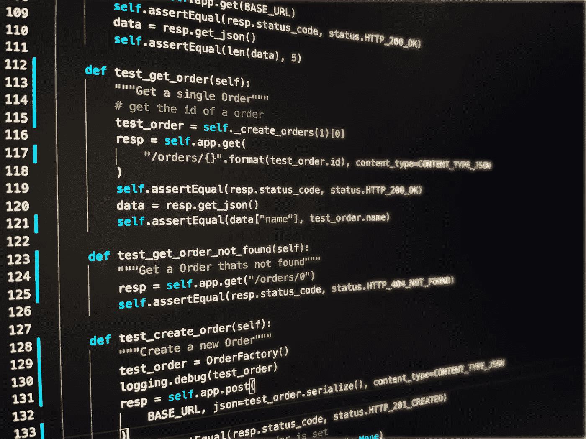

# 测试驱动开发的案例

> 原文：<https://medium.com/nerd-for-tech/a-case-for-test-driven-development-7d9a552e0a16?source=collection_archive---------5----------------------->

## 你不能不做

Python 中的单元测试用例(图片由作者提供)

测试驱动开发(TDD)是为您希望拥有的代码编写测试用例，然后编写代码使它们通过的实践。这听起来违背直觉。如何为尚不存在的代码编写测试用例？先别想这个。

当教授测试驱动开发时，我几乎总是被问到，“你如何说服那些不想写测试用例的人这是一个好主意？”我非常相信不要命令人们做什么，而是启发他们看到我们为什么做事的价值。我与他们分享，也与你分享，我个人的旅程让我迷上了使用测试驱动开发。

# **为什么开发人员不写测试**

在我们开始之前，让我们理解为什么开发人员不写测试用例。

## **我已经知道代码的工作原理。**

可以，但是以后在系统工作的其他人呢？他们怎么知道他们是否打破了什么东西？我总是告诉从事现有项目的开发人员，在创建一个新的分支之后，开始编码之前，你要做的第一件事就是运行单元测试！否则，您如何知道您是否破坏了代码，或者如果碰巧，存储库中的代码已经被破坏了。测试用例对“未来的你”和对你一样重要。

## **我不写断码**

我肯定你不知道，但是你的代码运行的环境是不断变化的。由于新发现的漏洞或只是版本升级，软件包正在更新。您如何知道您的代码是否仍然适用于升级后的包？您可以浪费大量时间进行手动测试，或者您可以运行您的单元测试，并在几分钟内知道是否有问题发生。

## 我没有时间

你实际上没有时间不写测试用例，因为从长远来看，自动化测试用例节省了你的时间和压力。测试用例允许你快速敏捷地从简单的错误修复到全面的重构。这就是拥有测试用例让你有信心进行代码修改的地方，因为你知道测试用例将揭示任何可能被无意中引入的行为变化。

# **我的故事**

这就是我的故事的来源。我做了相当多的后端开发。我喜欢创造服务给别人使用。有一天，我正在用一个很棒的 API 创建一个我确信会很棒的服务。我正在深入代码，我需要一些信息，所以我把它作为一个参数添加到 API 中。然后我需要别的东西，所以我把它作为一个参数。最终我需要更多的东西，所以我也把它们作为参数添加进来。

现在是时候为我的代码编写一些测试用例了。当时，我并没有跟踪 TDD。当我开始编写测试用例时，我突然意识到我还没有参数所需信息的一半。我漂亮的 API 太恐怖了！怎么会这么糟糕？我哪里做错了？

我没有考虑代码的调用者，因为我没有遵循 TDD。TDD 的作用是给你一个呼叫者的视角。它允许您在编写代码之前探索如何调用代码。它让你考虑，“作为一个呼叫者，我知道什么可以传入并得到回答？”拥有这种视角对于编写好的代码至关重要。如果没有人能调用代码，代码就没有任何用处。从呼叫者的角度来看，它必须是有意义的。一旦我获得了调用者的观点，我就能够确定调用者拥有什么，他们可以传入什么，我可以使用什么从服务中给他们提供他们期望的行为。

# **传播激情**

意识到这一点后，我被迷住了。我决定总是为我希望拥有的代码编写测试用例，以确保我的愿望总是能够实现。

过了一段时间，我和我团队的一名成员 [Liana Lin](https://www.linkedin.com/in/chen-liana-lin-66541480/) 一起工作，她以前没有编写过任何测试用例。我们是结对编程，我们决定我们需要采取一种新的方法，重构我们正在工作的代码。在一些大范围的重构之后，我停下来说，“让我们做一个检查点，看看我们是否破坏了什么”，然后我运行了单元测试。不到一分钟，它就向我们展示了我们破解的两个代码区域。她对我说，“JR，你是怎么做到的？”。(JR 是我的昵称)。我说，“做什么？”她说，“你不到一分钟就跑了 382 个测试用例！我要花 20 分钟来完全测试这个代码并找到漏洞”…然后她说，“你能给我演示一下怎么做吗？”她被卖了。我刚刚说服了一个从未编写过测试用例的人，让他意识到测试用例的价值。我们立即停止了重构，我向她展示了如何编写测试用例。

从那天起，Liana 就是我们项目中最多产的测试用例作者之一。她亲眼目睹了从长远来看节省了多少时间，而且她再也没有手工测试过她的代码。我创造了一个不可阻挡的测试用例编写机器。

# **结论**

保持调用者的视角对于编写优秀的代码至关重要。让我们面对现实吧，你可能会写一些代码片段来测试你的代码。花时间将它们变成正式的测试用例。然后每当你在代码中发现一个 bug，不要去修复它！首先编写暴露 bug 的测试用例，然后修复代码，直到测试用例通过。那只虫子再也不会回来了。

希望这能帮助你或你的同事理解测试用例的价值，以及测试驱动开发在保持你关注代码消费者方面的重要性。

## **确认**

我想感谢我的好朋友 [Wolfgang Segmuller](https://www.linkedin.com/in/wolfgangsegmuller/) ，他是 IBM Research 最初的 DevOps 冠军之一，当时我们在 2017 年举办了 DevOps 训练营。最近，他打电话给我，问我是否写过一篇关于我过去在训练营讲的 TDD 故事的文章。我不能让他失望，说不…所以我现在就写下来。秘密泄露了。感谢沃尔夫冈在那些年激励我，成为我的犯罪搭档。