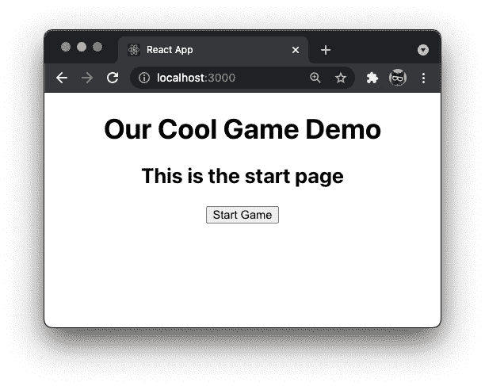

# 要交换的箱子。在 React 中使用 Switch 语句。

> 原文：<https://medium.com/nerd-for-tech/a-case-to-switch-using-switch-statements-in-react-e83e01154f60?source=collection_archive---------0----------------------->

你知道在 React (JSX)中可以使用 switch 语句吗？本文解释了如何超越三元运算符，并在 React 中使用 switch 语句。


照片由[蒂姆·高](https://unsplash.com/@punttim?utm_source=medium&utm_medium=referral)在 [Unsplash](https://unsplash.com?utm_source=medium&utm_medium=referral) 拍摄

在最近的一个项目中，除了三元运算符提供的二元选项之外，我还需要条件渲染。通常二进制选项工作得很好。例如，显示一个表单，然后在提交后显示一条感谢消息。然而，我需要结合一些游戏流逻辑，根据状态有条件地呈现 4 个组件中的 1 个。我很快意识到，在 JSX，React 不喜欢 If-Else 语句。这里解释一下，[https://react-cn.github.io/react/tips/if-else-in-JSX.html](https://react-cn.github.io/react/tips/if-else-in-JSX.html)的原因。

> 在 JSX，声明不起作用。这是因为 JSX 只是函数调用和对象构造的语法糖。

其次，如果我在一个逻辑块`if (state.value === 'value1') else if (state.value === 'value2') else if (state.value === 'value3') else …`中包含 4 个组件，这开始变得笨拙，有点难以理解。与 React 应用程序中的普通 JavaScript 一样，您可以加入 Switch 语句来清理代码。此外，您可以在 JSX 中使用 switch 语句。你所需要做的就是将它封装在一个自调用函数中，也就是所谓的立即调用函数表达式(IIFE)。你可以在这里了解更多:[https://developer.mozilla.org/en-US/docs/Glossary/IIFE](https://developer.mozilla.org/en-US/docs/Glossary/IIFE)

# 如何将 switch 语句合并到 React 项目中

有了“为什么”的答案，我们将深入研究如何将 switch 语句合并到一个演示 React 项目中。对于这个演示，我们将建立一个游戏的基本结构。虽然，与真实的游戏不同，我们所有的状态变化都是由点击事件引起的。另外，请注意这个演示是用 React 的函数格式编写的，而不是基于类的格式，如果它看起来与你习惯看到的不同的话。

在终端的项目文件夹中，键入:

```
npm create-react-app switch-demo
```

这将构建出我们的 React 应用程序框架。接下来，我们需要创建一些组件，我们将有条件地在`App.js`文件中呈现这些组件。在同一终端窗口中键入:

```
cd switch-demo/src
mkDir components
touch components/Lost.js
touch components/Playing.js
touch components/Start.js
touch components/Won.js
```

好了，现在我们有了文件结构。所以我们可以在文本编辑器中打开`App.js`。编辑文件的顶部，导入`useState`和我们所有的组件。

接下来，让我们修改一下`App()`函数。当您生成 React 应用程序时，会有一些默认代码。继续删除它。此时你应该有的如下。我们正在设置我们的`useState`和`handleClick()`来处理点击事件。在`handleClick()`中，我们将为`game`设置 State()

好的，现在在`App.js`的`<div className="App">`中添加一个小的全局头和我们的 switch 语句。

让我们来分析一下 switch 语句中发生了什么。在第 7 行，声明了条件变量。对我们来说，这是我们为状态`game`声明的常数。所以它遍历案例，并询问 does `game === 'start’`、does `game === 'playing'`等。如果`game`确实等于其中一种情况，那么它将呈现该组件，如果不等于则返回`null`。另外，`default:`是 switch 语句正确工作所必需的。

在 GitHub Gist 的第 **6** 和第 **19** 行，你可能会问自己，这些括号是怎么回事？如果您选择在 JSX 中使用 switch 语句，这就是前面提到的具有自调用功能的格式化要求。

```
**// Self-invoking function**( () => {
  // do something here
})()**Can also be written as:**( function() {
  // do something here
})()
```

所以完整的`App.js`文件应该是这样的

因此，为了让这个演示真正工作，我们需要构建组件，因为它们目前是空文件。虽然我们不会给它们添加太多东西，因为我们需要一些东西来证明概念，所以它们包含的只是一个标题和一个或多个按钮，这些按钮有一个用于`onClick()`的事件监听器，该监听器调用传递下来的函数`handleClick()`，该函数`setState()`用于`game`

**直接将代码复制并粘贴到正确的文件中:**

> Lost.js

> Playing.js

> Start.js

> Won.js

喔喔喔，这就是编码。保存所有内容，将终端指向 React 应用程序的根目录，然后输入命令。

```
npm start
```

现在，您应该有一个功能开关语句演示。



总之，这就是如何将 switch 语句合并到 React 中。Switch 语句允许有条件地呈现布尔值以外的内容。当您需要有条件地渲染 3 个或更多组件，而一次只显示其中一个时，它们是最有益的。