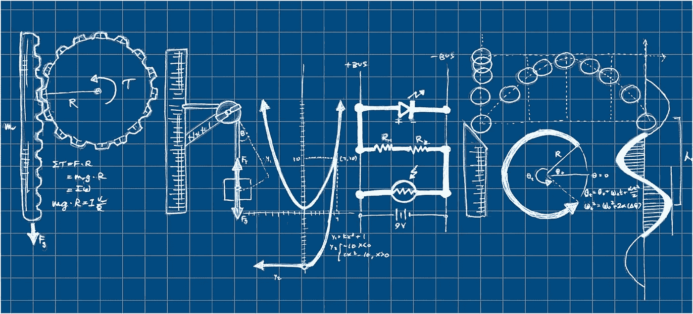
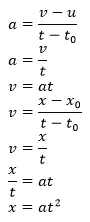
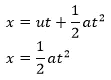
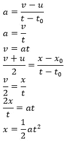

# 当人们不使用运动方程时会犯的一个常见错误

> 原文：<https://medium.com/nerd-for-tech/a-common-mistake-that-people-make-when-they-do-not-use-the-equations-of-motion-7f1cedf068cb?source=collection_archive---------2----------------------->

页（page 的缩写）c:印度分析杂志

想象你遇到一个人，他对运动方程一无所知。然而，他知道加速度和速度的公式。如果你让这个人用他所知道的任何知识，找出一个公式来计算一个物体从静止开始沿直线运动的位移，他可能会这样做:

注:a =加速度，v =最终速度，u =初速度，t =最终时间，t0 =初时间，x =总位移，x0 =初位移。

然而我们知道运动方程引导我们得出这个结论:

这是很意外的！当我们使用不同的公式时，这两个公式都是正确的，为什么我们会得到不同的解。现在这里是人们出错的地方:第一张图中使用的速度公式是**不是**正确，它是错误的！大多数人认为这是速度公式，而事实是这是平均速度*的公式！如果把它作为平均速度，他们会得到:*

这里我们看到，我们已经从两种情况中导出了相同的公式:使用传统公式和使用运动方程。所以，从下次开始，记得在使用速度的公式时要小心！

如果你喜欢这篇文章，请阅读[为什么在对数中使用基数变化规则时需要小心？](https://srivishnuvusirikala.medium.com/why-do-you-need-to-be-careful-when-using-the-change-of-base-rule-in-logarithms-b3c08b6ee5a4?sk=7dc16e40fc0f71cae944e32c364d9a29)还看了[如何反驳格兰迪的系列](https://srivishnuvusirikala.medium.com/how-to-refute-grandis-series-37f5c3cff3f9?sk=8faa4aba369e5fd31d5366ccc612e658)。