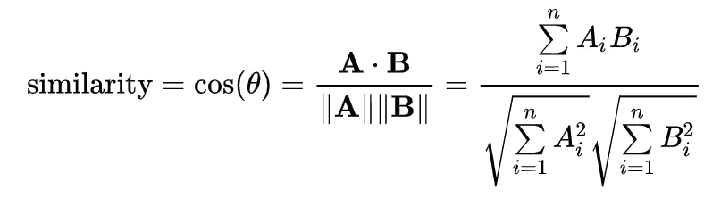
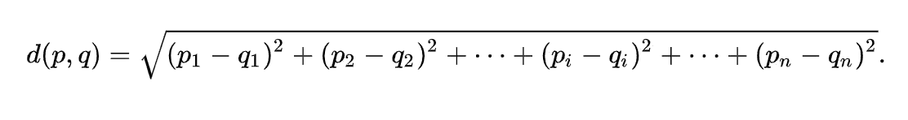
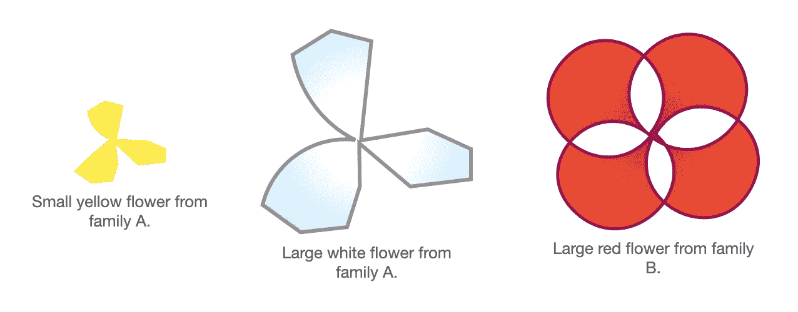
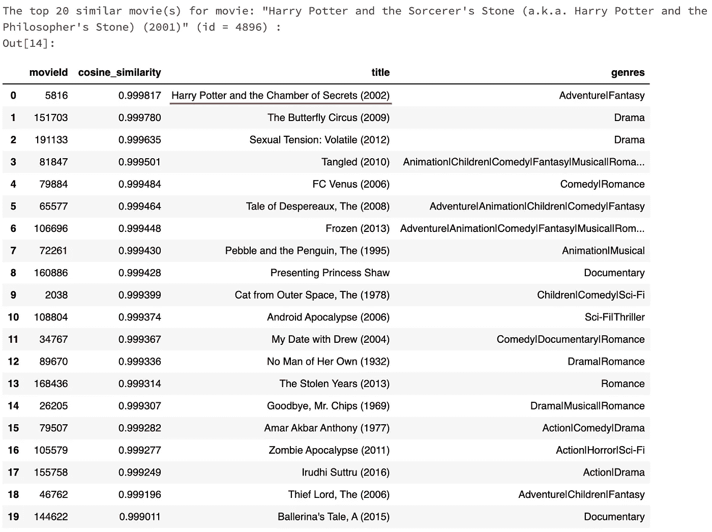
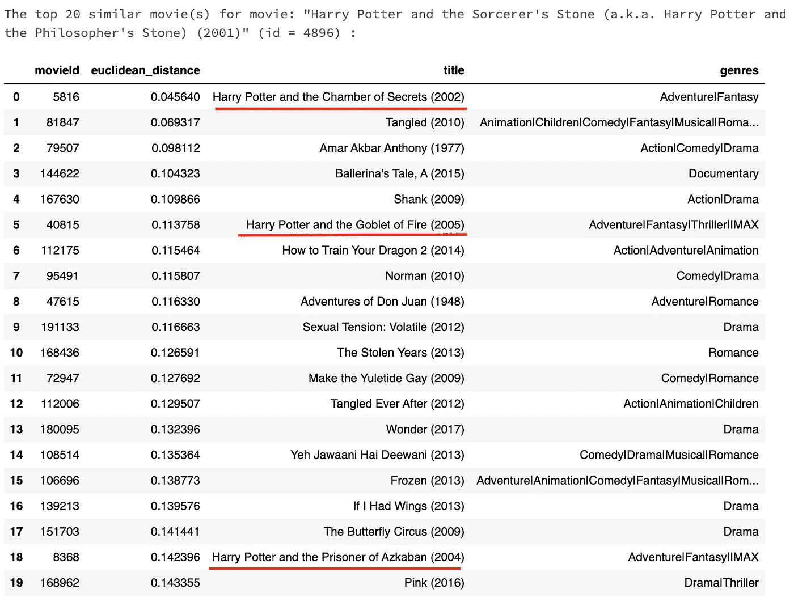
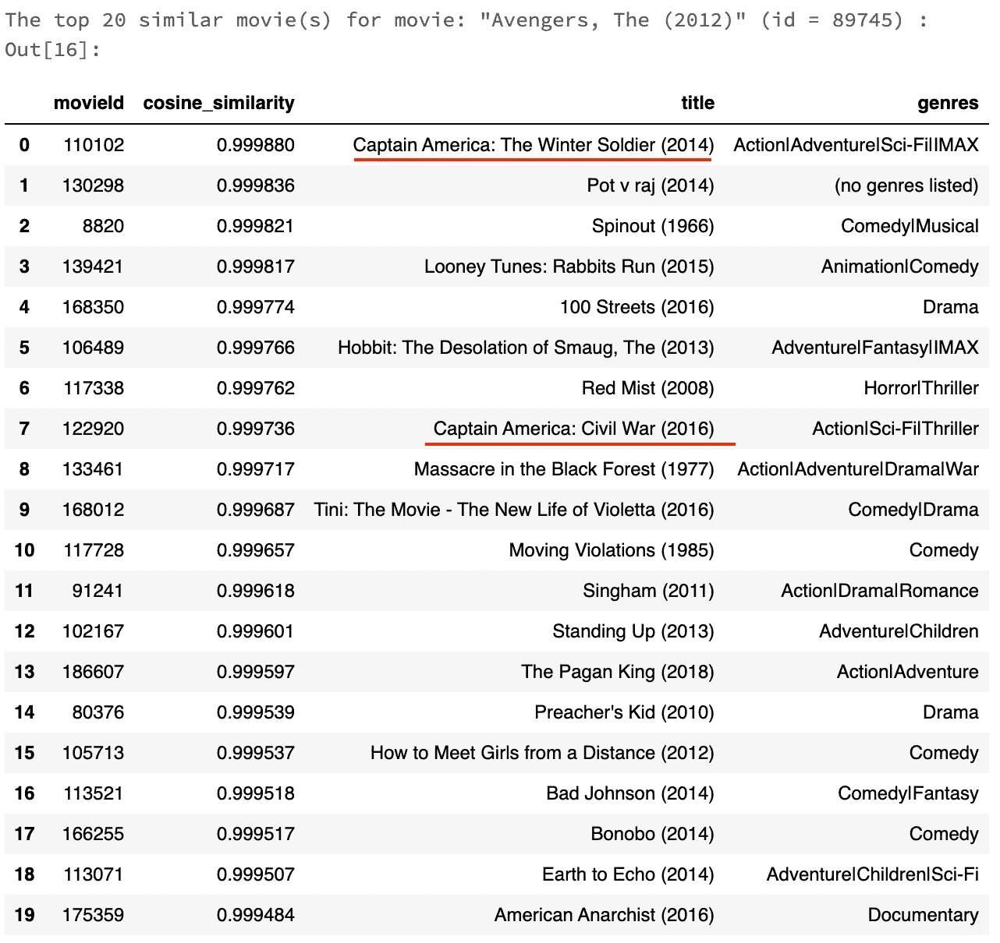
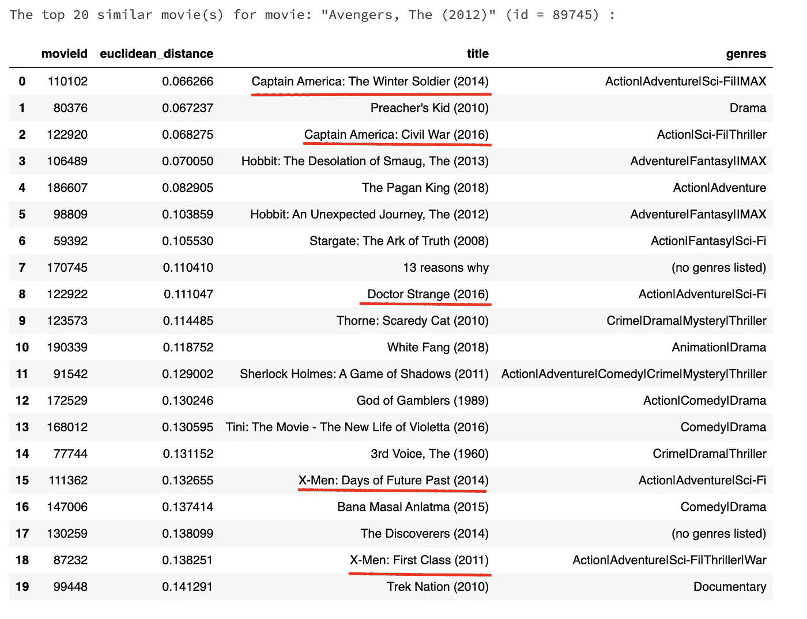

# ALS 推荐引擎中余弦相似度和欧氏距离的比较

> 原文：<https://medium.com/nerd-for-tech/a-comparison-of-cosine-similarity-vs-euclidean-distance-in-als-recommendation-engine-51898f9025e7?source=collection_archive---------5----------------------->

## 用 ALS 结果两种方法寻找相似电影的完整分析

在推荐系统中，一个常见的功能是通过利用 ALS 结果来找到相似的电影或用户。使用 ALS 矩阵分解，我们可以通过使用它导出的潜在因子轻松实现这一点。

问题是选择哪种相似性度量:有几种流行的方式/方法来计算相似性，其中最常用的两种方法是余弦相似性和欧几里德距离。

以下是每一个的数学定义:

余弦相似性度量两个向量之间的角度(越接近 1，越相似):

余弦相似性

欧氏距离衡量两点之间的距离(距离越小，越相似):

欧几里得距离

根据我的研究，当特征的大小不重要或者甚至扰乱输出时，建议应用余弦相似度(例如，在[通过词频](/bag-of-words/what-similarity-metric-should-you-use-for-your-recommendation-system-b45eb7e6ebd0)找到相似文本中)，当大小重要时，应用欧几里德距离(例如，如果[因素具有实际意义](/@mark.rethana/building-a-song-recommendation-system-using-cosine-similarity-and-euclidian-distance-748fdfc832fd))。

然而，仅仅从定义或抽象案例描述上理解实际效果对我来说仍然是令人困惑的，所以我决定用一些简单的例子来解释这两个指标的不同结果:

Eg1。*寻找相似的动物。*余弦相似度可能会发现猫和老虎更相似，因为它们都来自猫科动物家族；而欧几里德距离可能发现狼与虎更相似，因为它们都是体型相似的凶猛捕食者。

Eg2。*寻找相似的植物。*余弦相似度可能会发现小黄花与同科大白花更相似，而欧氏距离可能会发现大红花与不同科大白花更相似但大小相似。

Eg3。*寻找相似的歌曲。*在上面的第二个链接[中，作者使用欧几里德距离来选择在三个因子(价、能量和调)上总共具有相似值的歌曲，而余弦将选择在这些因子上具有相似比率/分布的歌曲。](/@mark.rethana/building-a-song-recommendation-system-using-cosine-similarity-and-euclidian-distance-748fdfc832fd)

Eg4。*寻找相似的学生。A 是尖子生，英语、数学、地理考试成绩分别为 100、100、100。b 是一个学生，分数 50，50，50。c 是另一个学生，分数 70，70，70。余弦相似度会发现 A 和 C 或者 A 和 B 同样相似(两种情况下计算的相似度都是 1.00)，而欧氏距离会发现 A 和 C 更相似(86.60 > 51.96)。*

Eg5。*寻找相似的电影(理论上)。*回到我们的案例，基于上述推理，我期望余弦相似性能够找到在四个潜在因素上具有相似分布的电影(这可能意味着电影的类型或结构等的相似性)。)，而欧氏距离会在因子值中找到那些相似的。(然而，由于我们不能理解它的因素，我们不能真正理解 ALS 如何工作或预测结果。)

简单来说，余弦相似度是比值/尺度的相似度，欧氏距离是实际值的相似度。

现在好像更好理解了吧？(至少这对我管用。)

我们可以看到这两种方法在某种程度上都有意义，因此由用户决定哪种结果最能满足他们的目的。在寻找相似学生的例子中，如果有人重视不同学科之间的平衡，那么他们可能更喜欢余弦相似性；如果有人看重杰出的智力，他们可能会认为欧几里得距离更有意义。

现在让我们回到电影推荐引擎，看看这两种方法在找到相似电影的情况下表现如何。 *(* [*GitHub 链接我的电影推荐引擎*](https://github.com/zcheng233/Movie-Recommendation-Engine-in-Spark) *供参考)*

首先，我愿意假设，如果一部电影来自一个系列，那么最相似的电影一定包括同一系列的其他电影。所以我决定搜索类似的电影*哈利波特与魔法石(2001)* 并期望得到包含其他哈利波特电影的结果。

以下是我从两个相似性指标中得到的信息:

余弦相似度排名前 20 的相似电影

欧氏距离排名前 20 的相似电影

嗯，也许后期的哈利波特电影和早期的有很大的不同，或者至少在模特看来是这样。这可能是真的，因为导演和演员都变了，情节也发展了十年。欧几里德距离似乎做得更好，因为在它的前 20 名名单中有三部惠普电影。我也很欣慰地看到余弦相似性将*惠普和密室(2002)* 放在了它的列表的顶部，尽管它是惠普系列中唯一一个在它的前 20 名列表中的。

*复仇者联盟(2012)* 怎么样？ALS 能找到其他漫威大片吗？

余弦相似度排名前 20 的相似电影

欧氏距离排名前 20 的相似电影

再次，我们可以看到欧几里德距离再次胜过余弦相似度，有 5 部漫威电影在它的列表上，相比之下只有两部。对于出现在两个列表中的两部直接相关的电影*美国队长*，欧几里德距离将它们的排名高于余弦相似度(即认为它们具有更高的相似度)。

经过所有的分析，我更喜欢使用欧几里德距离来计算相似性得分。然而，一个终极问题仍然存在:在搜索相似电影时，人们实际上搜索的是哪种相似性？这似乎在很大程度上取决于每个人的偏好，所以唯一的解决方案是让用户手动选择哪些电影在他们看来更相似。

也就是说，我们最好用 A/B 测试来决定哪种方法在现实生活中的表现更好。❦︎

*欢迎评论和反馈！；——)*