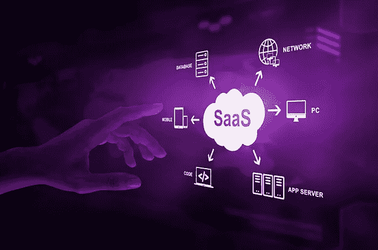
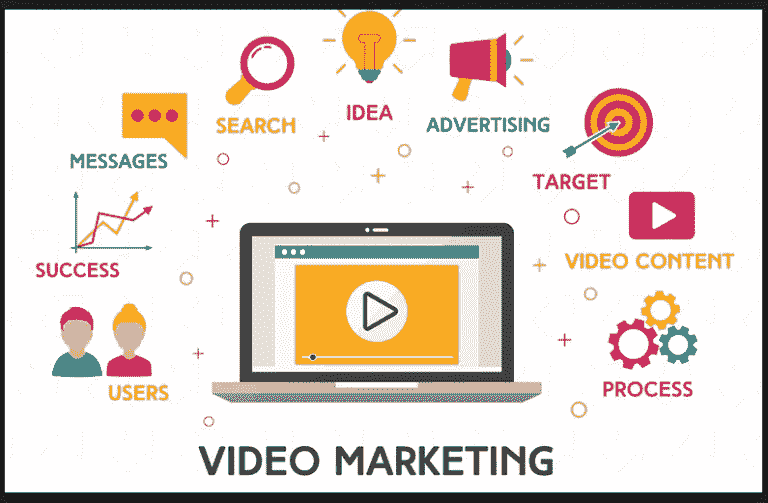

# SaaS 产品营销完全指南

> 原文：<https://medium.com/nerd-for-tech/a-complete-guide-to-saas-product-marketing-237c6c9ca782?source=collection_archive---------3----------------------->

SaaS 预计将以 18%的复合年增长率扩张。SaaS 公司有很多成功的机会，但是如果没有非常专业的 SaaS 产品营销，他们是不会成功的。

每个营销程序都包含一系列的步骤，确保你的营销活动按计划进行。这个博客只包含那些可以实现你的目标的步骤。

**什么是 SaaS 产品营销？**

推出你的 SaaS 产品的过程被称为 SaaS 产品营销；它描述了为营销和销售 SaaS 商品和服务所做的努力。赢得新客户和建立 SaaS 品牌的过程永无止境。

SaaS 产品营销负责创建定位、信息、竞争差异，并为销售和营销团队有效合作提供必要的工具。主要目标是打开和抓住机会。

**传统营销 Vs Saas 产品营销**

传统营销的主要目标是为销售团队创造营销合格线索(MQLs ),销售团队随后将处理其余的工作。

相比之下，SaaS 产品营销专注于通过在用户旅程的所有阶段招募消费者来扩大产品。

让我们把它们放在上下文中单独考察。

**传统营销:**

位于销售、营销和产品的中心

创建商品和服务的定位和信息

为销售团队建立需求并获得 MQLs

**SaaS 产品营销:**

通过提供免费试用和免费增值模式，该公司将其产品定位为主要的购买驱动力(在产品导向的 SaaS 营销中)

开发商品和服务的定位和信息

为了扩大你的产品，你有责任在用户旅程的所有阶段都让他们参与进来

**各种营销技巧**

**集客营销**

如果你仔细观察集客方法及其四个阶段，你可以回过头来考虑如何通过首先识别你的购买者角色并概述他们的重要特征来制定集客策略。

这个过程的每一步都受到这些角色的影响，这些角色包含了他们所面临的困难、他们的互联网习惯和他们的交流偏好的细节。

下一步是为他们制作内容，讲述他们的问题和挑战。

成功的 SaaS 企业通过专注于客户面临的问题并提供解决这些问题的资源，使自己在竞争中脱颖而出。

**社交媒体营销**

通过社交媒体销售你的 SaaS 产品有几种策略。看看以下社交媒体如何帮助贵公司营销计划的例子:

消费者教育很重要，因为它将你的公司定位为思想领袖，并在购买过程中帮助消费者。此外，它对最终的决策过程有重大影响。

有兴趣了解更多的人，不只是联系你的销售团队；他们还[在买家旅程的 27%时间里进行独立的网络研究](https://www.gartner.com/en/sales/insights/b2b-buying-journey)。

创建品牌意识，因为企业需要知道你的产品，以便与它互动。当企业决策者考虑你所在行业的解决方案时，你希望成为他们第一个想到的公司。

企业必须知道你的产品，才能使用它。当业务决策者考虑您所在领域的解决方案时，您希望成为他们首先想到的公司。要做到这一点，你必须有一个独特的网上存在，强调你的产品的优势。

**视频营销**

当一条信息在视频中展示时，观众会记住 95%的信息，而在文本中展示时，只有 10%。这是一个显著的区别，视频营销是你的 SaaS 营销计划的一个有价值的潜力。

说到视频内容营销，SaaS 公司有一些非常有趣的机会。你有很多可以宣传和解释的功能和技能，这有助于创造销售线索和留住客户。

你制作的视频应该让观众了解你的产品、它的解决方案，以及它如何让他们在工作中受益。通过循环利用你的博客和社交媒体帖子，你也可以制作信息丰富的视频内容。

无论是哪种情况，你都必须确保你的视频继续以客户为中心，与他们的故事相关，而不是以产品为中心。

**如何推出你的 SaaS 产品？**

建立一个潜在客户群，因为他们喜欢你的内容而与你互动，这很有价值。

例如，如果你为企业主提供创建定制发票和跟踪员工时间的软件，推出关于企业主经历的问题和困难的博客、播客或视频系列，并提供建议、技巧和实用技巧，将会吸引他们。

为了增加你的读者群，你可以在你的产品发布之前进行这项工作。

这个基础有潜力发展成为一个喜欢和你交谈的忠实追随者。

**制造炒作**

当你发展一个感兴趣的观众来制造轰动时，利用你所能支配的所有资源。

在不太热衷于销售的情况下，在你的电子邮件和社交媒体中给出一些关于未来的信息。

正如我们之前所讨论的，这很好地说明了为什么避免试图过早商业化是至关重要的。

如果你一直在扩大你的订户群，这是个好消息，因为这意味着你的读者真的对你发布的内容感兴趣。

一些企业认为这是销售的起点，他们没有错，但你需要慢慢适应。

如果你试图在势头一增强就进行销售，人们会变得愤怒。

把这当成你和你的粉丝建立关系的下一个阶段。

**与有影响力的人合作**

随着你的受众扩大，密切关注你的更多参与和知名的追随者。

影响者可以成为增加你的可信度和受众的有力工具。告知潜在的影响者你的提议和策略。

首先询问他们对测试的兴趣，并免费提供对你的新产品的反馈。

当影响者对你的产品充满热情时，思考如何最好地利用他们的宣传是很重要的。

你可以请他们为你的博客写稿，共同主持关于你的产品的网上研讨会，在案例研究中扮演重要角色，担任发言人，成为播客的嘉宾，并通过他们的渠道向他们的观众营销，等等。

你可以请他们为你的博客写稿，共同主持关于你的产品的网上研讨会，在案例研究中扮演重要角色，担任发言人，成为播客的嘉宾，并通过他们的渠道向他们的观众营销，等等。

为了增加你的产品和业务的热情和合法性，你也可以使用影响者网络来招募某人作为组织的发言人。

**通过社交墙展示用户生成的内容**

用户生成的内容已经成为所有营销活动的生命。它之所以具有如此重要的意义，是因为它是由人而不是名人和模特创造的。这使得它真实可信，更容易与人们联系。

UGC 是在 Instagram、Twitter、脸书、LinkedIn、Youtube 等社交媒体平台上创建的。、社交媒体帖子、客户评论、推荐等。

在大型数字屏幕上实时显示用户生成的内容会变成一堵社交墙。[拥有用户生成内容的社交媒体墙](https://taggbox.com/social-media-wall-events/)可在多个营销接触点展示，如活动、产品发布会、音乐会、体育赛事、营销活动、网站等。

你可以通过网站上的社交媒体墙来使用这些用户生成的内容，以提高参与度，增强社交证明，并为你的 SaaS 产品进行口碑营销。

# 包扎

SaaS 产品营销需要通过一系列深思熟虑的步骤来实现你的营销目标。我们在这篇博客中提到了一些最好的步骤，以确保你的营销工作获得成功。