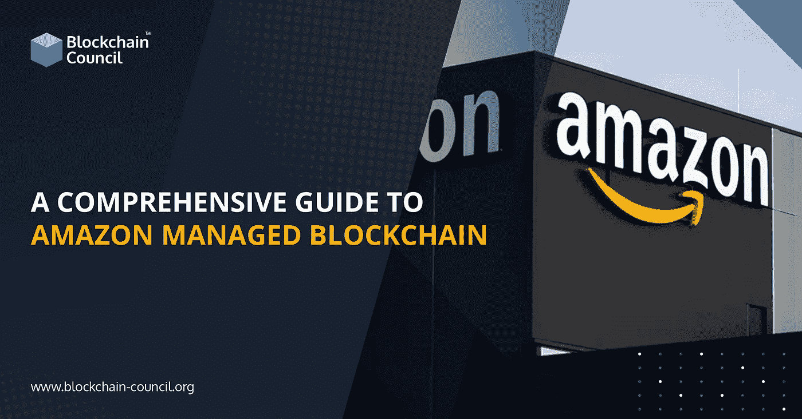

# 亚马逊管理的区块链综合指南

> 原文：<https://medium.com/nerd-for-tech/a-comprehensive-guide-to-amazon-managed-blockchain-fa72d50af8a5?source=collection_archive---------4----------------------->

区块链是一种点对点(P2P)去中心化的分布式账本，以不可变的方式记录交易。技术使开发人员能够创建这样的应用程序，在该应用程序中，多方可以同时进行交易，而不依赖于中央权威机构。

虽然这看起来令人兴奋，但强调区块链开发最紧迫的挑战之一是其可扩展性是至关重要的。利用现有技术创建可伸缩的区块链是一项艰巨的任务。

只需几次点击，托管区块链允许用户加入公共网络，并维护和管理可扩展的私有网络。您可以依赖亚马逊管理的区块链，而不是手动安装软件、创建和管理访问控制证书、配置网络组件、持续监控基础设施以及根据需要适应变化，这简化了您的区块链平台的维护。

这种区块链的主要优势在于，它消除了构建网络所需的开销，更重要的是，它可以自动扩展，以满足数千个应用程序进行数百万次交易的需求。

**亚马逊托管区块链的优势**

让我们来看看亚马逊管理的区块链的一些好处。

**完全托管**

亚马逊管理的区块链能够在几个 AWS 账户之间建立区块链网络，允许一群人进行交易和交换数据，而不需要中央权威机构。它还消除了手动硬件配置、设备设置以及网络和安全配置的需要。

**提供两种不同的区块链平台**

受管区块链最初仅支持 Hyperledger Fabric，然而，客户现在可以根据自己的需求在 Hyperledger Fabric 和以太坊之间进行选择。

**可扩展**

这种区块链能够根据网络的应用程序使用情况来扩展您的区块链网络。这种区块链可以根据您的需求灵活扩展您的区块链网络。这意味着，如果网络用户需要更多容量来进行和验证交易，他可以利用托管区块链的 API 来快速添加新的对等节点。

**可靠性**

尽管很难跟踪和检索完整的交易历史，但托管区块链努力提高订购服务的可靠性，这是 Hyperledger 结构中确保交易交付的一个组件。Managed Blockchain 提供的订购服务是用特殊的亚马逊 QLDB 技术创建的，包含不可变的更改日志，确保数据无限保存。

**以太坊现已在亚马逊管理的区块链上发售。**

亚马逊于 2019 年首次宣布公开其完全管理的区块链服务，然后两年后，即 2021 年 3 月，亚马逊公布了其扩展的产品，包括亚马逊管理的区块链上以太坊的普遍可用性。由于这个消息，亚马逊管理的区块链提供了两个区块链平台的选择:Hyperledger Fabric 和以太坊。

Hyperledger Fabric 是一个开源的企业级许可 DLT 平台，以其模块化和多功能性而闻名于各种行业用例，如银行、保险、医疗保健、供应链、人力资源等。它非常适合需要严格隐私和访问控制的应用程序。

当谈到以太坊时，它是一个用于分散应用程序的开源平台，最适合高度分布式的网络，在这些网络中，数据透明是必不可少的。它支持一个成功的用例，即分散融资(DeFi ),该用例正在获得牵引力，并且没有显示出放缓的迹象。

**收尾**

我们的谈话到此结束。我们希望你现在已经牢牢掌握了亚马逊管理的区块链。

如果区块链领域引起了你的兴趣，你可以加入[区块链学位](https://www.blockchain-council.org/online-degree/online-degree-blockchain/)，成为一名区块链认证开发者。