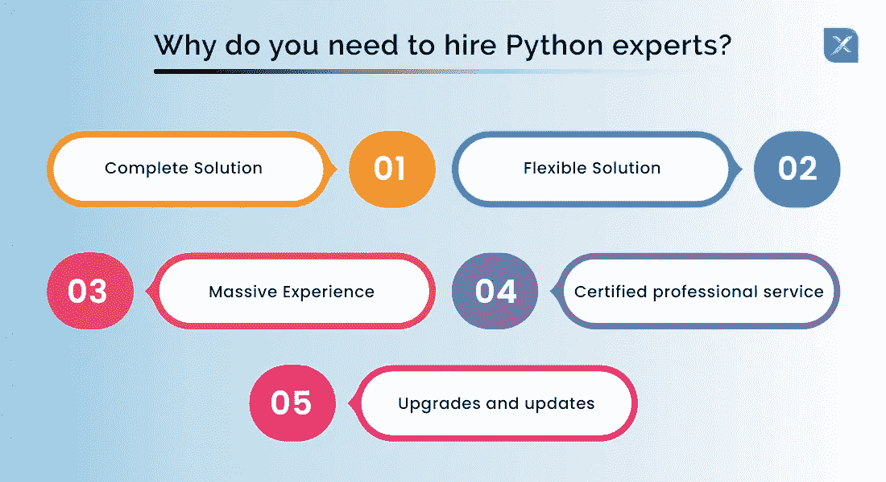

# 2022 年雇佣 Python 开发者综合指南

> 原文：<https://medium.com/nerd-for-tech/a-comprehensive-guide-to-hiring-python-developers-in-2022-5f77ef3fe697?source=collection_archive---------7----------------------->

Python 是计算机编程语言的统治者。它以领先第二名 Java 12%的优势而自豪。由于这个原因，对 Python 顾问的需求是最高的，他们的工资结构也被定位为溢价。

令人惊讶的是，即使是入门级的 Python 开发人员，收入也比老牌 Java 顾问高得多。但是如何雇佣 Python 开发者，或者驱动他们做出最佳选择的各种因素是什么，是一个值得关注的问题。

在这份关于如何在印度 2021 雇佣 Python 开发者的详细综合指南中，你会习惯所有的细节。在我们博客的最后，你会清楚地了解到如何为你的下一个项目选择最好的 Python 开发者。

# Python 是什么？

Python 是当今最流行的计算机编程语言。它广泛应用于网站建设、任务自动化、数据可视化、机器学习和软件测试活动。

这种通用编程语言非常通用，对初学者友好，正因为如此，它是多家财富 500 强公司的选择。

像网飞、优步、Spotify 等大品牌也利用 Python 进行数据分析、建立网站、自动完成任务和开发软件。

由于 Python 语言简单易学，甚至像科学家和会计这样的非技术专业人员也在执行日常计算机活动中使用 Python 语言，如管理财务或库存。Python 在大品牌中很受欢迎，因为:

*   帮助开发交互式框架的多个第三方模块。
*   来完成各种项目。
*   这是一种免费的开源语言。
*   它整洁的语法使阅读和写作变得容易。
*   它提高了生产率和速度。

现在我们已经熟悉了 Python 计算机编程语言的动态，是时候理解为什么我们需要专家在我们基于计算机的需求中实现这种语言了。虽然 Python 是一种简单易学的语言，但它的专业执行能力是必不可少的，因为当你雇佣专门的 Python 开发人员时，你会受益于:

**完整的解决方案**
当您[雇佣 Python 专家](https://www.inexture.com/hire-python-app-developers/)时，您就可以利用 Python 的属性进行数据分析和机器学习、自动化和脚本编写、web 开发、软件测试和原型制作，以及其他日常任务，如跟踪股票市场、填写在线表格或将文本文件转换为电子表格。

**灵活的解决方案**
专业的 Python 应用开发者可以轻松处理前端和后端项目开发。

丰富的经验
一个精通 Python 的开发人员也是一个完全了解其他编程语言的人，比如 java、HTML、CSS 等等。因此，当你雇佣一个 Python web 开发人员时，你将从大量的专家服务中受益，从而彻底改变项目。

**认证专业服务**
Python 开发人员是认证专业人员，他们也为网站和其他集成应用程序添加完美的属性。

升级和更新
Python 高手总是精通语言更新，因此在需要时会升级他们的项目。

# 雇佣专门的 Python 开发人员的更好方法

既然你们都准备雇佣 Python Django 开发人员，是时候决定是要内部开发人员还是远程开发人员了？要做出这个决定，您需要评估以下两个参数:

**成本**
我们所说的成本是指两种 Python 开发者的[费用](https://www.inexture.com/how-much-does-it-cost-to-hire-python-developers-for-your-next-project/)。例如，在美国，内部开发人员每年收费在 88，492 美元到 112，985 美元之间。而远程开发者按小时收费。

**人才**从国外雇佣他们是一件昂贵的事情。然而，悔恨的开发者遍布世界各地，你可以利用他们的服务，按小时计算，而不需要花费在他们的搬迁上。

**更好的结果**
根据 Owl Labs 进行的研究，远程开发人员对工作的专注度提高了 22%。因此，他们压力更小，工作效率更高。

在以上几点的基础上，相比于内部团队，自责的开发人员更实惠，生产力也更高。但现在的问题是如何雇佣他们？

# 雇佣远程 Python 应用程序开发人员的方法

为即将到来的项目雇佣有经验的开发人员的三个最有能力的选择:

社交网站
每小时有数百万人活跃在社交媒体上。因此，如果你在脸书或 LinkedIn 等任何社交媒体网站上发布远程 Python 应用程序开发人员的要求，你肯定会在几个小时内获得积极的回应。此外，您还可以选择从已表现出兴趣的自信候选人中挑选最佳人选。但是结束了，这里你需要加一个提交申请或者表示兴趣的截止时间。否则申请人数会超出你的预期。

**招聘广告网站**
招聘广告网站是搜索远程开发者的最主要来源。像 Craigslist 或者实际上有数不清的申请者可供选择。此外，您可以找到许多位于本地的远程开发人员。

**网上求职板**
求职板是专门为处理公司和个人的就业需求而设计的网站。GitHub 和 Stackflow 是招聘认证 Python 开发人员的流行在线工作板。

**认证解决方案**
in execute 就是这样一个认证解决方案提供商，可以满足您的 Python 开发人员的需求。因此，如果你不想进入从一堆干草中找到一根针的麻烦，这个选项最适合你。要使用此选项，您需要:

# 如何入围最佳 Python 开发人员

最佳 Python 开发人员的入围基于以下细节:

**专长**
专业的 Python 开发人员或 [Python web 开发公司的代表](https://www.inexture.com/how-to-shortlist-the-best-python-development-company/)应该对 Python 语言有全面的了解。他应该了解 Python 的基本概念，如 OOPS、数据结构、迭代器、文件处理等。

**精通知识**
选择的 Python 开发者应该了解各种 Python web 框架，像 Flask 和 Django。除此之外，他还应该精通 Javascript、CSS、HTML 以及其他支持 Python 的语言。

**数据技能集**
拥有最佳数据技能集的开发人员是最有生产力的。他们是专业的数据科学家。因此，选择的开发人员应该具备数据辩论、数据分析、数学等方面的知识。

**技术诀窍**
对于当前时代的项目开发，你需要聘请一位专门的 Python 顾问，他是人工智能、物联网、机器学习、区块链等所有趋势技术的专家。

**沟通技巧**
沟通是有效执行任何任务的关键。因此，您选择的 Python 开发人员应该能够顺利地与组织的所有其他部门沟通，并与他们保持关系。

# 哪里可以找到最好的 Python 开发人员

既然您已经了解了专业 Python 开发人员所需要的技能，下一个问题就是去哪里找最好的 Python 开发人员？

为了摆脱寻找最佳人才或照顾他们的财务需求以及定期跟进的复杂性，一些公司考虑将项目外包给 Python web 开发公司自己。

这种 Python 开发机构根据客户的需求定制他们的服务。

每个软件公司的 Python 开发人员的比率各不相同。因此，选择一个以合理的价格提供最好服务的。如果你的需求是现场的，雇佣内部开发人员总是更好。

这种情况下涉及的成本将是 Python 开发人员的工资和其他因素，如津贴和福利、补偿、住房补贴等。

[雇佣 Python 开发者印度](https://www.inexture.com/hire-python-app-developers/)、波兰、菲律宾，以象征性的费用获得最好的 Python 开发服务。澳大利亚、加拿大、美国和其他欧洲国家的开发商收取相对较高的费用。

除了上面所有的资源，LinkedIn 是雇佣 Python 开发者的一个很好的来源。在这里，你可以根据你的项目需求找到初级、中级或高级 Python 开发人员。

# 雇用 Python 开发人员时要考虑的因素

因为对 Python 开发者的需求增加，他们的收费也很高。一个成熟且经验丰富的 Python 开发者收费很高，因为除了 Python，他还精通其他编程语言，比如 Java。这些专业人员精通并更新现代技术要求，如云计算、机器学习、NLP 和其他现代技术。

你需要记住，中级 Python 开发人员的经验和技能总是比高级开发人员少。为此，我们创建了一个专门的部分，用于招聘高级、中级和入门级 Python 开发人员。一定要读。

接下来是在雇佣 Python 开发人员之前需要注意的因素:

**项目的规模**
确定项目的规模、范围和复杂程度。这将帮助您决定按时完成项目所需的开发人员级别和数量。项目的可伸缩性和潜力是决定 Python 开发团队选择的两个因素。

**技术专长**
你需要看你是否聘请了高级水平的 Python 开发者；他精通所有技术技能，如 Django、Docker、AWS、机器学习、FLASK、REST、Git、Kubernetes、API、云计算、DevOps、Apache Spark、MySQL 等。

**编程经验**
拥有 5-8 年经验的 Python 开发者被认为是资深。3-5 年的被认为是中级，不到 3 年的被认为是入门级或初级。更多的经验意味着更多的创新思维。

**软技能要求**
除了技术技能，需要的 Python 开发者还应该精通软技能。软技能有助于 Python 开发人员超越技术层面进行创新性思考。

**沟通技巧**
Python 开发人员优秀的沟通技巧是与项目干系人建立良好关系所必需的。

一旦上述因素被考虑在内，你也可以根据技术能力和职责来评估开发人员。但在此之前，与他们分享他们需要从事的项目的性质——AR 和 VR、人工智能、web 应用等。如果双方都同意每一点，那么继续执行。

# 雇佣初级 Python 应用程序开发人员

入门级的开发人员应该能够从零开始策划项目，应该有以前的 Python 经验。

# 雇佣高级 Python 应用程序开发人员

*   按照行业标准熟练编写复杂的 Python 程序
*   精通前端技术，如 JavaScript，CSS3，HTML5 等。
*   了解对象关系映射器(ORM)库
*   有数据可视化工具的经验(Tableau、Qlik 和查询语言，如 SAS、SQL 和 Hive)
*   AWS 和其他云计算服务的知识
*   关于 HDFS、蜂巢、猪、火花和 Scala 的知识
*   强大的调试技能和对线程限制的理解

# Python 顾问的费用

Python 开发者的工资很高。他们的工资增加是因为近年来对 Python 开发人员的需求增加。许多咨询机构收取的 Python 开发人员的平均费用是每小时 50-70 美元。根据增加的潜力和动态功能，费率会进一步增加。

然而，关于 Python 应用程序开发成本的[深入观点](https://www.inexture.com/all-you-need-to-know-about-python-application-development-cost/)将给出关于远程和内部 Python 开发人员成本的更好观点。

# 如何评估 Python 开发者

Python 开发者评估测试由全球主题专家设计，按照行业标准评估不同级别的 Python 开发者的知识。这种测试有助于招聘机构和招聘公司根据他们的 OOPS 概念和数据结构筛选和选择候选人。

Python 开发者技能测试通过评估潜在候选人的工作准备情况，帮助雇主和其他招聘人员列出候选人名单。这种评估考试的重点是通过实际工作经验获得的应用技能知识。对这些考试结果的详细分析有助于招聘到不带偏见的最佳人才。

这些评估测试在线进行，包括:

*   MCQ 的(多项选择题)
*   MAQ 的(多项回答问题)
*   音频/视频问题
*   编码模拟

Python 开发人员评估考试确定了如下技能:

这种评估考试的几个例子是:

# 包扎

Python 开发人员是一个积极主动的人，参与管理基于计算机编程语言的项目，尤其是基于 Python 的项目。此外，Python 开发人员的需求和技能也因项目需求而异。所以。作为一个租用者，你需要在为你即将到来的项目给你的开发商打最后一个电话之前研究上述细节。我们希望你雇佣最好的。

*原载于 2021 年 11 月 8 日*[*【https://www.inexture.com】*](https://www.inexture.com/a-comprehensive-guide-to-hiring-python-developers/)*。*