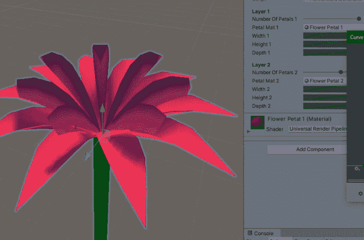
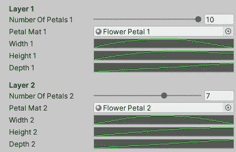
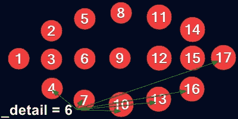
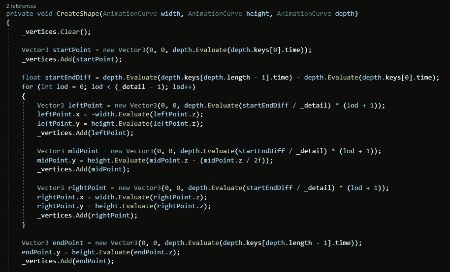
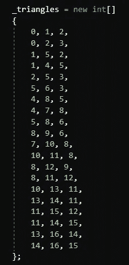
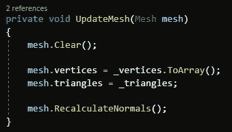
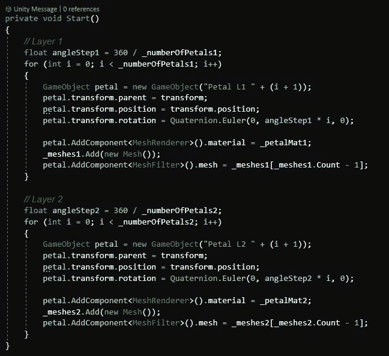
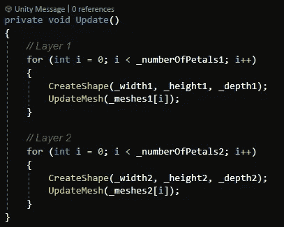

# 在 Unity 中使用动态网格的自定义花生成器

> 原文：<https://medium.com/nerd-for-tech/a-custom-flower-generator-using-dynamic-meshes-in-unity-9f89c932b733?source=collection_archive---------8----------------------->

## 最近我有一些空闲时间，有了做这个的想法。这是我第一次用代码动态创建网格。

我的定制花发生器有两层花瓣

# 设计和灵感:

我不知道是什么让我想到做这个，但我只是突然有了这个想法。

在看了 Brackeys 和 Code Monkey 的几个 YT 视频后，我对如何创建网格有了一个大致的想法。

从那时起，我就试错了创建花瓣的方法，然后使用最近项目中的一些子弹地狱代码在 360 度内动态复制它。

之后，重复第二层花瓣的所有动作。

生成器使用 Unity 中的 3 条动画曲线来控制每个花瓣的宽度、高度和深度/长度。花瓣中每个顶点的宽度和高度是根据顶点从起点到终点的深度计算的。

# 代码:

注意:这是我第一次用代码制作自定义网格，所以可能有很多方法可以改进这段代码。

## CreateShape():

每个花瓣有 17 个顶点，由" ***_detail*** " int 变量指定，该变量等于沿长度的**顶点数减 1** 。

不要问我为什么那样做。\_( ͡• ͜ʖ ͡•)_/

重点是，我可以相对容易地改变细节层次。

这将动态创建并定位花瓣中的顶点。第一个点，然后是所有的中点，然后是终点。

我想不出一种方法来自动创建用于渲染形状的三角形，所以我只是用手写出它们。

## UpdateMesh():

这将清除和更新每一帧的网格，以允许运行时修改。

## Start():

初始化两层花瓣，根据每层要产卵的数量复制和旋转每一层。

## 更新():

每一帧，重新创建网格和更新网格渲染器。

结果是一个非常好看的程序花生成器；几乎可以根据任何要求轻松定制。