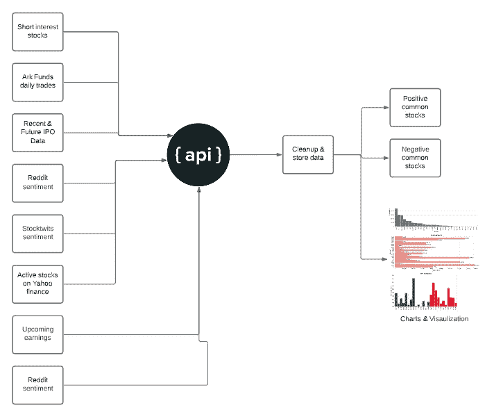

# 数据科学家对股票的看法

> 原文：<https://medium.com/nerd-for-tech/a-data-scientist-view-on-stocks-bc90af3244eb?source=collection_archive---------0----------------------->

# 介绍

不管在哪个领域，数据科学家(DS)都热爱数据(不是吗？).DS 也喜欢连接不同的数据端点，看看是否有意义。在这篇文章中，我将连接股票的其他数据点，进行详细的分析，并创建图表来更好地理解。

**注意:对于非技术用户，转到总结部分**

完整的工作流程—来源于作者