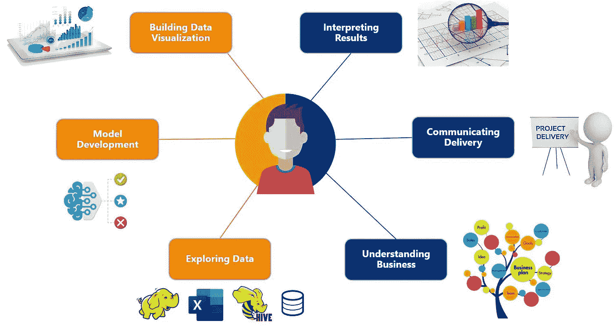

# 数据科学家的一天

> 原文：<https://medium.com/nerd-for-tech/a-day-in-the-life-of-a-data-scientist-6629ffc5913?source=collection_archive---------11----------------------->

数据科学家的日常活动

> 我是 Zin，目前在分析和咨询团队担任支付行业的数据科学家。

数据科学家被认为是 21 世纪最性感的工作，你可能会好奇数据科学家的日常生活是什么样的。

在本文中，我将分享我作为数据科学家的典型一天。我的故事可能不代表整个数据科学家群体，但我相信这将为那些有兴趣加入像我一样的类似行业的人提供数据科学家生活的大致想法。

作为分析和咨询团队的一名数据科学家，我的主要职责是通过提供可操作的见解或通过建立机器学习模型来预测未来趋势或预测客户行为，帮助客户解决他们的问题。

> 综上所述， ***显而易见，我典型的一天包含了来自商业、数据和技术的各种活动。***

## 数据

我每天大约有 50%的时间用于处理数据。有一天，我会探索、预处理或争论数据，而另一天，我会构建机器学习模型或可视化仪表板。

***了解和探索数据***

对数据科学家来说，彻底了解数据至关重要。在数据方面，我们是多个跨职能团队的联系人:无论是在战略规划会议、客户会议还是日常决策过程中。

每当有客户参与，我们必须首先问自己，这是一个熟悉的还是新的业务问题。对于前者，我们可以利用现有的解决方案和数据。然而，对于新的业务问题，我们必须认识到问题是否能够使用现有数据来解决。如果这是不可能的，我们必须进一步考虑探索新的数据集。不可否认的是，数据是决定我们是否能够支持客户业务问题的基本但至关重要的因素。

***数据准备***

为了进行分析或建立模型，我们必须首先准备数据。数据准备起着重要的作用，我们可以有几个步骤，包括数据预处理和数据争论阶段。

将原始数据转换成机器可理解的格式、输入数据、处理异常值、减少维度和创建新特征是数据准备过程的一些实例。

***模型开发***

我们必须维护和重新验证现有的模型，以确保模型是用最近的数据和趋势训练出来的。

我们还会不时地集思广益，提出新的解决方案来满足额外的业务需求。在开发新模型时，通常会执行常规流程，如特征提取、将数据集分为模型的训练/测试、交叉验证、超时验证以及使用相关性能指标选择最佳模型。

> 我主要使用 HiveQL (HQL ),这是一种类似 SQL 的语言，用于从 hadoop 获取数据，进行数据汇总和即席查询。为了探索新的数据源，Python 被用来测试各种第三方 API。数据准备和模型开发主要是使用 Python 实现的。

***建筑可视化仪表盘***

为了支持业务以及了解月度/季度趋势，我们还构建了可视化仪表板。有了这些，非技术用户更容易理解业务是如何执行的，并为未来提前规划策略。

> Tableau 是我开发仪表板的主要商业智能(BI)工具。

## 项目交付

我每天还有 30%的时间用于准备客户项目交付。

在执行分析或建立模型之后，我们不能向客户提供数字。我们必须用通俗的语言来解释这些数字。此外，我们必须为客户提供可操作的方向，以便他们可以拿出一个坚实的，战略性的商业计划。

在准备项目交付时，我面临的挑战之一是提取相关数据来解决客户的问题。由于我们可以访问丰富的数据，我们很慷慨，总是希望尽可能多地分享数据。过多的信息会使我们偏离主要的问题陈述。对每一个洞见问“那又怎样”总是有助于我们聚焦在正确的轨道上。

> I 解释从数据中得出的见解，提取相关信息，并以客户的语言提供简明可操作的信息，这与处理数据和构建模型同样重要。

## 会议

我一天剩下的 20%时间通常花在会议上。

我通常通过跨职能团队会议来获取业务知识。拥有商业知识有助于我们的日常分析和建模。

我还参加了数据科学会议，会上讨论了数据科学技术、新的解决方案以及对管道流程的改进。

> 会议是我们互相学习的机会。

总之，数据科学家不仅需要分析或编程技能，还需要解释结果、识别业务问题和传递相关信息的技能。

我希望这篇文章能帮助那些试图弄清楚数据科学家的一天是什么样子的人。如果你有兴趣或者想成为一名数据科学家，我已经写了一篇关于我如何成为一名数据科学家的文章。