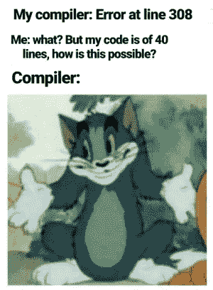
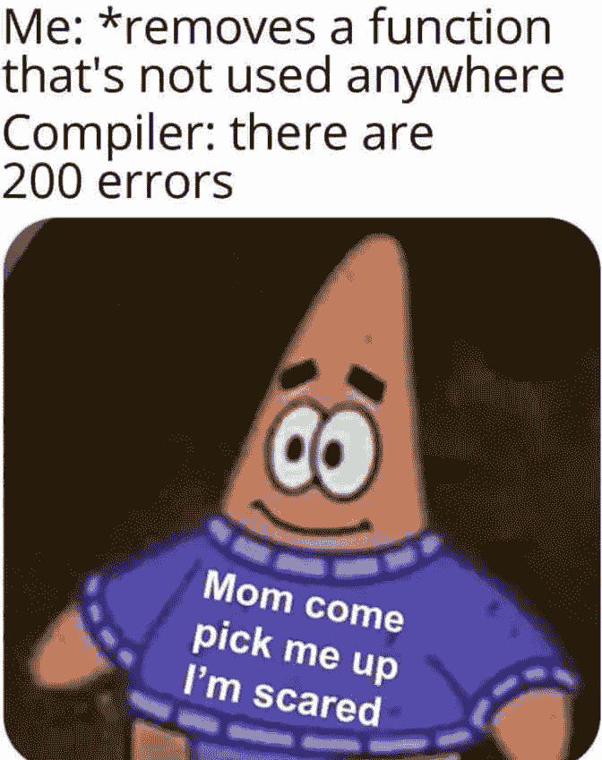
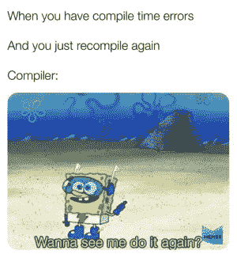
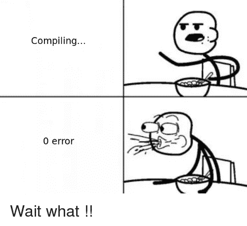

# 编译步骤

> 原文：<https://medium.com/nerd-for-tech/a-detailed-explanation-of-the-compiler-gcc-stages-for-rookies-f768b595933d?source=collection_archive---------4----------------------->



在这里你会明白那些多余的线是从哪里来的。

编译是将高级人类可读编程语言翻译成计算机可以理解的语言的过程:1 和 0，并保存在可执行文件中。完成这个过程的程序叫做“编译器”。

编译器 GCC 可以翻译像 C、C++、Objective C 和 Objective C++这样的语言。这里我们只谈 C 编译。

**基本用法**

要使用 GCC，你需要在命令行中写下程序名和程序名。

```
$gcc -E sourcecode.c
```

如果代码没有问题，GCC 将创建一个预定义名称为“a.out”的可执行文件，您可以像这样执行:

```
$./a.out
```

**把你的文件命名为**

要给它起一个个性化的名字，你可以在句末使用-o 标志，就像这样:

```
$gcc -E sourcecode.c -o newname
```

标志-o 是唯一一个写在命令行末尾的标志。

**标志回顾代码**

您可能希望添加一些标志，以确保您的代码不仅可以工作，而且写得很好。其中一些是:

*   Wall 启用所有编译器的警告消息。
*   Werror 将所有警告显示为错误。
*   Wextra 允许您检查代码的一些可选特征(不包括在 flag -Wall 中)。

# 编译步骤

现在，我们将逐步描述编译过程:

# 1.预处理程序

GCC 做的第一件事是运行**预处理器**。它获取源代码，删除注释，包含头文件，并用代码替换宏(继续阅读以理解这些)。您可以用标记“-E”要求预处理器在这个阶段结束时停止。

```
$gcc **-E** file.c
```

***注释*** 让人们明白你的函数需要什么作为输入(参数)，函数用这些参数做什么，在成功或失败的情况下返回什么。这意味着当其他人需要使用该功能时，可以阅读这些注释并准备好使用它。它们看起来像这样:

```
/**
 * function_name - description of the process made by the function
 * @parameter: The description of the parameter
 * Return: Description of what is printed in the standard error
 * if the functions achive its goal, or if it fails
 */
```

注释也可以在函数内部。它们可以告知代码做什么，或者可以用来避免编译中的一些行。

```
c = (a < b) ? a : b; /* a comment here can explain this line */
```

***一个头文件*** ***文件*** 告诉编译器如何调用一些功能，它的意思是，哪些是函数的名字，哪些是需要的输入和它生成的输出。但是报头不包括在输入和输出中间进行的处理。认为函数是你的朋友，标题就像一个议程，你可以保存你朋友的号码，这样你就可以随时给他们打电话。头文件包含在与源代码相同的子目录中，在内部，头文件是人类可读的，具有与源代码相同的语法。

```
int _putchar(char c);
```

这是我们的新朋友函数' _putchar '。要调用她，我们需要给一个 char，它将返回一个整数(一个数字)。函数的主体将在链接步骤中添加的库中。

***宏*** 是给定名称的代码片段。它们可以定义将在流程中使用的常数，但在流程实现过程中不能更改，比如第一个例子中的常数 PI。他们也可以定义某种特殊的功能。在第二个例子中定义了获得直径为 r 的圆的面积的过程。

```
#define PI 3.14
#define circleArea(r) (3.1415*(r)*(r))
```

# 2.收集

预处理器的输出被接收并转换成汇编代码。
一种人类可读的语言，比 C 语言稍微难一点。让我们看一个用 C 语言和汇编语言编写的相同函数的例子:

```
int main(){
return (1);
}
```

汇编代码比人类可读的语言给出了更具体、更详细的指令。

```
cat example.s
.file   "example.c"
        .text
        .globl  main
        .type   main, [@function](http://twitter.com/function)
main:
.LFB0:
        .cfi_startproc
        pushq   %rbp
        .cfi_def_cfa_offset 16
        .cfi_offset 6, -16
        movq    %rsp, %rbp
        .cfi_def_cfa_register 6
        movl    $1, %eax
        popq    %rbp
        .cfi_def_cfa 7, 8
        ret
        .cfi_endproc
.LFE0:
        .size   main, .-main
        .ident  "GCC: (Ubuntu 7.5.0-3ubuntu1~18.04) 7.5.0"
        .section        .note.GNU-stack,"",@progbits
```

要想看到自己的函数被翻译成汇编代码，可以使用标志-S。

```
$gcc **-S** filename.c
```



# 3.装配

汇编程序将汇编代码翻译成二进制。

```
$gcc **-c** filename.c
```

此阶段中的前一个示例生成一个扩展名为'的文件。“o”命名为“目标代码”。这是一个二进制文件，但 emacs、vim 或 nano 等编辑器不会显示 1 和 0，它们会显示如下内容:

```
$ cat example.o
ELF>@@UH��]�GCC: (Ubuntu 7.5.0-3ubuntu1~18.04) 7.5.0zRx F                                                       A�C
 ��

                   example.cmain .symtab.strtab.shstrtab.text.data.bss.comment.note.GNU-                                                                                       -stack.rela.eh_frame
```

如果您想以 0 和 1 的形式查看文件，可以使用命令 xxd:

```
xxd  -b example.o
```

有点长:204 行，只是为了返回数字 1。



# 4.连接

最后，链接器添加运行代码所需的环境变量、函数定义和设置，创建一个非常大的可执行文件。继续阅读，看看这些是什么意思。

要完成链接阶段，您可以不使用任何标志进行编译:

```
$gcc filename.c
```

默认情况下，它将创建一个名为 a.out 的新的可执行文件。执行如下:

```
$ ./a.out
```

链接器将寻找代码中提到的**环境变量**，例如:

```
$HOME
```

并且会带来变量的内容，在我的例子中:

```
/home/vagrant
```

您可以使用 printenv 命令查看所有的环境变量:

```
$ printenv
LANG=en_US.UTF-8
HOME=/home/vagrant      #This is the home directory
XDG_SESSION_ID=13
USER=vagrant
SHELL=/bin/bash
LANGUAGE=en_US:
PATH=/home/vagrant/.local/bin:/usr/local/sbin:/usr/local/bin:/usr/sbin:/usr/bin:/sbin:/bin:/usr/games:/usr/local/games:/snap/bin
_=/usr/bin/printenv
OLDPWD=/home/vagrant/holberton-system_engineering-devops
```

用 echo 看看其中一个的内容:

```
$ echo $HOME
/home/vagrant
```

所有这些变量都可以在函数中考虑。

关于**函数定义**，编译器已经知道我们调用了库 *stdio.h* ，使用了函数 *putchar* 。但是它只知道我们包含在头中的原型。链接器现在搜索 putchar 函数体，并将其包含在我们的程序中。



# 关于我

我是一名来自霍尔伯顿学校的充满激情的软件开发人员，也是一名来自国立大学的心理学家。在我的一生中，我一直在发展有价值的专业技能，成为一个好的倾听者、批判性思考者和团队成员。我一直被认为是一个非常聪明和有同情心的人。无论是在工作还是学术生活中，我都想创造有意义的经历，并激励我的伴侣。我一直很专注，也很好奇。

如果你想和我建立联系，请在 GitHub 或 T2 Twitter 上关注我。

我希望你喜欢这次阅读！

娜塔莉亚·维拉·杜兰制作。