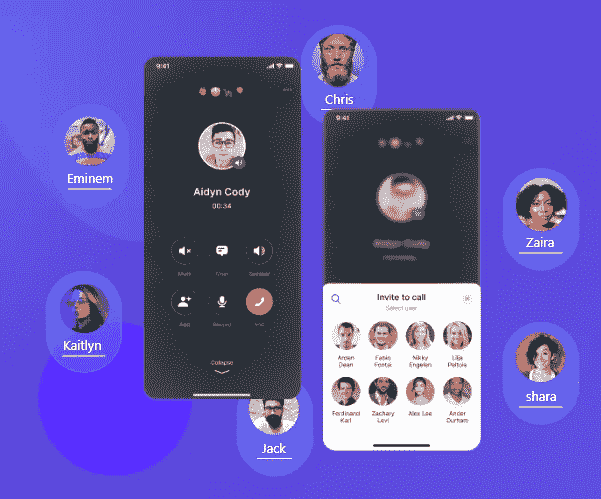
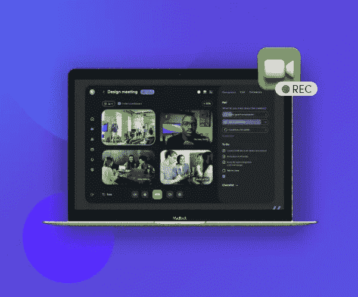

# 关于选择最佳实时视频聊天 API 和 SDK 的详细指南

> 原文：<https://medium.com/nerd-for-tech/a-detailed-guide-on-selecting-the-best-live-video-chat-api-and-sdk-615170550c6e?source=collection_archive---------4----------------------->

**2022 年选出最好的视频直播聊天 API 和 SDK！**

你知道吗[全球大约 38.5%的互联网用户使用他们的移动设备进行视频通话。鉴于视频聊天提供的巨大便利，越来越多的企业将它纳入他们的通信系统。如果你一直计划利用视频聊天与你的观众保持联系，你应该考虑实现一个视频聊天 API 和 SDK。在本文中，我们将讨论围绕选择最佳实时视频聊天 API 和 SDK 的所有重要方面，它们可以帮助您构建一个健壮的通信系统。](https://www.statista.com/statistics/1254884/mobile-video-calling-reach-by-region/)

**视频聊天 API 和 SDK 到底是什么？**

视频通话 API 和 SDK

视频聊天 API(应用编程接口)指的是一种视频音频集成工具，允许通信平台进行视频聊天。它还支持不同类型的软件工具之间的数据交换。

另一方面，video SDK(软件开发套件)由一套软件开发工具组成，可以帮助您构建视频通信应用程序或平台。

现在，我们已经介绍了视频聊天 API 和 SDK 的基本概念，让我们来看看它可以为您的应用构建之旅带来的优势。

**视频聊天 API 和 SDK 提供商的重要性**

视频聊天 API 集成可以帮助您加快应用程序开发过程。它使您能够将所有新时代的视频功能整合到您的应用中。听起来不错，对吧？让我们来看看[视频 API](https://www.mirrorfly.com/video-call-solution.php) 可以为您带来的更多好处:

**1。获得快速软件交付**

视频聊天 SDK 和 API 为你提供了现代化的工具。他们可以帮助你轻松构建跨平台视频聊天应用[。此外，API 实现起来简单快捷。他们不会用很多 bug 来烦你。](https://www.mirrorfly.com/build-video-chat-app.php)

**2。节省资金和资源**

实时视频聊天 API 可以帮助您节省为应用程序开发雇佣和培训新资源的费用。此外，它使开发人员能够专注于构建应用程序，而不是将注意力转移到创建视频聊天解决方案上。

**3。帮助提高生产力**

视频聊天 API 为企业提供了强大的工具和精心编写的文档，可以加快他们的应用程序开发过程。随着应用程序开发阶段更加顺利，公司也可以专注于其他核心业务领域。

# 视频聊天是如何进行的？

不可否认，视频聊天正在改变公司在当前虚拟时代做生意的方式。但是，你知道视频聊天到底是怎么运作的吗？放心吧！我们支持你。

双方通过 VoIP(互联网协议语音)进行视频聊天。它通过一系列协议利用互联网发挥作用。连接到互联网的视频聊天服务提供商向接收设备发送请求。一旦接收者接到电话，发送到该设备的音频和视频就被编码并发送回另一个设备。这个过程被反复重复以执行视频通信。

利用实时流聊天软件可以帮助你进行流畅的视频对话。所以，如果你想让你的商务互动达到顶级水平，那就使用视频聊天 API 吧。

# **必备视频通话 API 特性**

每个企业都是独特的，所以有聊天的要求，不是吗？市面上有各种视频聊天 SDK 和 API 可供选择。您需要根据您的业务需求选择最合适的 API。然而，有些特性是任何视频 API 都必须具备的。让我们一个一个来看:

## **1。多个视频选项**

一个实时视频聊天 API 应该为你提供不同的视频选项。确保它提供一对一的视频聊天、小组会议、实时视频流、网络研讨会和大规模广播会议，没有任何麻烦。

多方视频通话 App

## **2。屏幕共享**

如今，在视频聊天中，屏幕共享对于快速透明的协作非常重要。它使您能够共享您的屏幕，并将您的演示文稿转发给所有其他同事和团队成员。基于云的屏幕共享 API 让企业的信息共享变得更加容易。

视频通话 API 和 SDK

## **3。短信**

人们发现发短信非常方便。这有助于他们在视频互动过程中立即向其他聊天参与者传达他们的想法和消息。选择一个视频聊天 SDK，它允许您在实时视频会话期间安全地发送数据和消息。

视频聊天平台

## **4。视频录制**

视频聊天 SDK 和 API 应该提供安全的实时视频通话记录选项。有了这个，你可以随时存档和保存重要的视频，以备将来推荐。现场视频录制功能应该是端到端加密的。

视频通话记录

## **5。语音聊天**

视频聊天 API 应该为您提供音频通话功能。确保它提供一些基本功能，如静音，以避免不必要的背景噪音。

语音聊天应用

# **选择视频聊天服务提供商时需要注意的要点**

您是否一直想知道哪种视频聊天 API 集成适合您的企业？别担心。我们可以帮助你。在本节中，我们将讨论在选择视频聊天 API 和 SDK 之前您应该研究的一些要点。让我们一个一个来看:

## **→检查浏览器复杂度**

现在，检查视频聊天服务提供商是否处理跨平台问题非常重要。如果你选择一个低级别的 API，你将不得不自己在跨平台兼容性上努力。但是，如果您选择全功能的 API，您将自动获得跨平台兼容性。

## **→兼容浏览器和平台更新**

现在，移动设备和网络浏览器倾向于自动更新它们自己。但有时，开发人员很难理解更新后视频聊天将如何工作。现在，当你选择一个低级别的 API 时，你需要自己想清楚。但是有了一个结构良好的直播视频聊天 API，你就不用担心浏览器和平台的更新了。API 会自动调整以适应发展。

## **→定制化 UI 布局设计**

如果选择传统的视频聊天 API，则需要自己创建视频通话接口。但是通过全功能的视频聊天 SDK 和 API，您可以获得一个嵌入式视频小部件。最好的部分是，它是完全可定制的。此外，UI 组件在不同的浏览器和设备上进行测试。但是，对于低级 API，您需要从头开始设计一切。

## **→安全性和 HIPAA 合规性**

安全性是客户在与您互动时寻求的主要优先事项之一。因此，您应该确保您的[视频聊天集成](https://blog.contus.com/video-call-integration/)受到端到端加密的保护，并保护所有类型的私人数据。

此外，如果你是与 PHI 合作的开发者或企业，你需要坚持 HIPAA 指导方针。现在，当你选择一个全功能的 API 时，它通常带有内置的 [HIPAA 兼容性](https://www.mirrorfly.com/learn/what-is-hipaa.php)。但是，在低级 API 中，您需要自己处理 HIPAA 兼容性。

**结论**

我们希望我们的文章能够帮助您理解顶级视频聊天 SDK 和 API 的最佳选择。我们建议您尽快选择最好的 API 和 SDK，并加强您的视频通信能力。所以，不要再等了！从今天开始你的搜索。我们祝愿你在未来的努力中一切顺利。