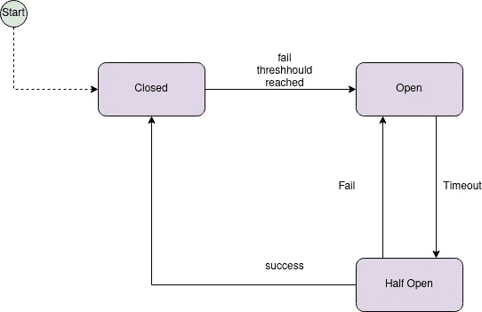

# 微服务架构中电路中断的讨论:策略管理器实现

> 原文：<https://medium.com/nerd-for-tech/a-discussion-on-circuit-breaks-in-the-microservices-architecture-policy-manager-implementation-8c66ab8ab058?source=collection_archive---------8----------------------->

这篇文章是关于**电路中断的系列文章的一部分，**下面你可以找到所有这些问题的列表。

*   [关于微服务架构中电路中断的讨论](https://barrocaeric.medium.com/a-discussion-on-circuit-breaks-in-the-microservices-architecture-c0f45e6b37ca)
*   [关于微服务架构中断路的讨论:HttpClient 实现](/@barrocaeric/a-discussion-on-circuit-breaks-in-the-microservices-architecture-httpclient-implementation-9c7211c4758e) *。*
*   [关于微服务架构中电路中断的讨论:策略管理器实施](/@barrocaeric/a-discussion-on-circuit-breaks-in-the-microservices-architecture-policy-manager-implementation-8c66ab8ab058)。⬅ *你在这里*

之前，在[关于微服务架构](https://barrocaeric.medium.com/a-discussion-on-circuit-breaks-in-the-microservices-architecture-c0f45e6b37ca)中的断路器的讨论中，我们简要地讨论了*什么是**断路器**、*它们如何工作以及*为什么*它可以成为**微服务架构**中的一个好工具。**

下图显示了一个**断路器状态机**的概要，以供修改。

断路器流程—改编自[1]

我们还讨论了如何用一个 **HttpClient** 来实现它。

因此，在这最后一篇文章中，我们将讨论如何实现**断路器** **，使用工厂来管理作为我们方法外壳的策略。**完成实施后，我们将讨论该设计面临的挑战和优势。

*   **对于本文任务，我使用* [*。net core*](https://dotnet.microsoft.com/download) *和*[*Polly*](https://www.nuget.org/packages/Polly/)*包。*

# 深入探究 Polly 政策和方法

如前几篇文章所述， **Polly** 由**策略对象**组成，这些策略对象使我们能够在选择/期望的策略内执行我们的代码[2]。如果我们进一步抽象使用“信封”来执行一个动作的概念，我们会得出如下想法:

> ***策略是将一个函数(我们的代码)的执行包装到另一个函数(策略)**。”*

*在许多语言(如 javascript 和 C#)中，我们有被视为一等公民的函数(方法)。这意味着我们可以通过名字调用函数，也可以将它们存储在内存地址(变量)中。因此，使我们能够将一个函数作为参数传递给另一个函数。这是一个基本的**函数式编程范例**，称为**函数组合。***

**现在你说…“是啊…那又怎样？”**

*这是我们创建**策略管理器实现**的基本概念。使用这个概念，我们可以存储**断路策略**(在 Polly 情况下是对象)【4】并调用它们来使用组合函数概念执行我们的代码。*

# *策略管理器实现*

*为本文设计的**策略管理器**如下所示，它是一个简化的**抽象工厂**，我们通过依赖注入将它注入到我们的服务类中(然而这只是一种方式)。*

*策略管理器. cs*

*从上面的代码来看，最有趣的方法是**CreateDefaultCircuitBreakPolicy**。该方法创建了一个**电路断开策略**，在两次不成功的尝试(不成功是指异常)之后，它将电路断开一分钟。*

*要使用这个工厂，应该调用 **GetCircuitBreaker** 方法。这个函数接收一个名称，如果在我们的字典(在*行 19* 中定义)中没有找到，它允许我们的管理器创建一个**断路策略**并返回它，否则它返回存储在同一字典中的已经创建的策略。*

*下面的代码演示了如何使用策略管理器提供的 **GetCircuitBreaker** 方法来封装给定的**断路策略**的函数。*

*订单服务. cs*

*基本上，在*行 49* 上，我们调用我们的管理器来检索所需的**断路策略**(如果不存在，则创建该策略)。然后，利用手头的策略对象，我们调用一个执行方法(在本例中为 **ExecuteAndCaptureAsync** )并向其传递我们的函数，该函数将由策略包装执行(这里使用的是组合函数！).*

*概括地说，在这个设计中，当我们试图调用我们的管理器来按名称获取策略时，它会返回给我们现有的策略或新创建的策略。这很重要，因为我们的断路事件是由策略配置决定的。**因此，如果我们想让它正常工作的话，我们应该为同一个块调用相同的策略**。*

*** *不要忘记在 Startup.cs 文件中将 PolicyManager 注册为单一服务。只有正确注册了依赖注入容器，它才能找到我们的管理器，并将其注入到我们的服务中。**

** *【https://github.com/ericbarroca/circuitbreak.】上可以找到本文的完整源代码:*

# *实施的好处和挑战*

*也许现在您已经感受到了这个实现带来的好处……(如果您阅读了上一篇文章中关于 [HttpClient 实现的内容，那就更好了)。但是不用担心，我们现在将讨论这种实现的好处和挑战。从利益出发。](/@barrocaeric/a-discussion-on-circuit-breaks-in-the-microservices-architecture-httpclient-implementation-9c7211c4758e)*

*首先，有了像组装的工厂/管理器那样简单的工厂/管理器，人们可以对他们拥有的任何功能使用策略，而不仅仅是对使用 **HttpClient** 的请求。这意味着您可以使用任何协议包装数据库请求或对任何外部系统的任何调用。*

*第二，我们对策略和何时执行策略有更多的控制，我们可以将请求前所需的计算密集型代码块包装到策略中，从而为用户节省大量时间，例如，如果这个**断路发生在**处于打开状态。*

*然而，并非一切都是完美的，这个简单的实现确实给我们带来了一些挑战。开发人员需要记住策略名称，可能他们有时会混淆，调用错误的策略，或者最终为已经指定了策略的块创建新策略。幸运的是，这可以通过更复杂的实现来改进，或者使用 **Polly** 框架上的 **PolicyRegistry** 来实现更严格的场景(不幸的是，这超出了本文的范围)。*

*最后，我们将结束这个关于电路中断的系列。希望你们喜欢，也希望不久能在新的话题上见到你们=)*

# *参考*

*   *马丁·福勒。(2014 年 3 月 6 日)。[断路器](https://martinfowler.com/bliki/CircuitBreaker.html):【https://martinfowler.com/bliki/CircuitBreaker.html】T4*
*   *[2]波利。波利:[https://github.com/App-vNext/Polly](https://github.com/App-vNext/Polly)*
*   *[3] [维基百科。函数式编程:https://en.wikipedia.org/wiki/Functional_programming](https://en.wikipedia.org/wiki/Functional_programming)*
*   *[4] [App vNext。断路器:https://github.com/App-vNext/Polly/wiki/Circuit-Breaker](https://github.com/App-vNext/Polly/wiki/Circuit-Breaker)*