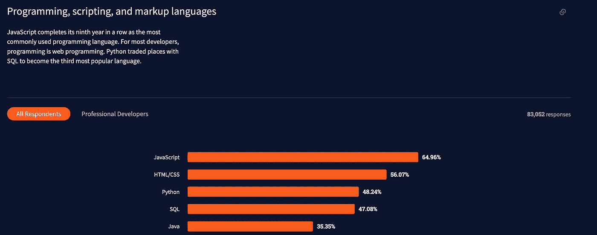
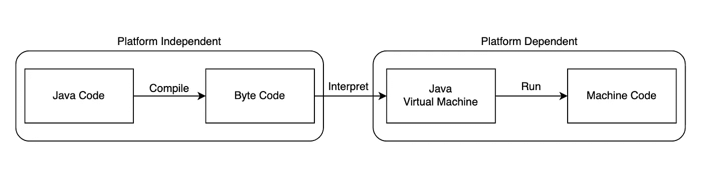
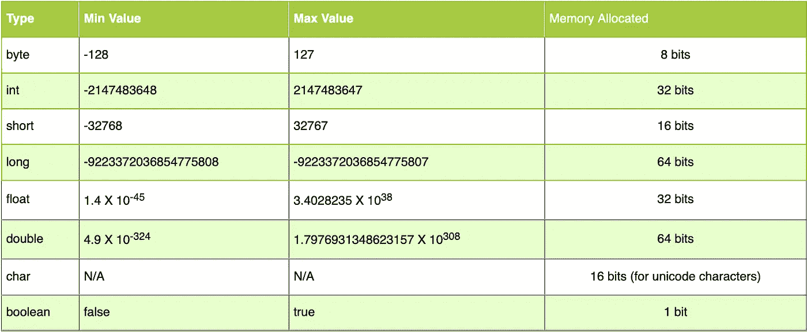

# 我最喜欢的几件事(关于 Java)

> 原文：<https://medium.com/nerd-for-tech/a-few-of-my-favorite-things-about-java-b66969545782?source=collection_archive---------6----------------------->


由 [Carli Jeen](https://unsplash.com/@carlijeen?utm_source=medium&utm_medium=referral) 在 [Unsplash](https://unsplash.com?utm_source=medium&utm_medium=referral) 上拍摄的照片

尽管 Java 刚满 25 岁，在美国已经到了可以租车的年龄，但它仍然是世界上最流行的编程语言之一。它保持了创新性、相关性和活力。在 2021 年 Stack Overflow 开发者调查中，Java 仍然在全球最常用的编程语言中排名第五，超过 35%的参与者表示他们经常使用它，并可能在接下来的一年中使用它。



## 为什么是 Java？

当与像[**Spring**](https://spring.io/)[**Java server Faces**](http://www.oracle.com/technetwork/java/javaee/javaserverfaces-139869.html)[**Google web Kit**](http://www.gwtproject.org/)或 [**Apache Struts**](https://struts.apache.org/) 这样的 Web 框架一起使用时，Java 是一种用于创建强大的 *web 应用程序*的健壮语言。

虽然不是 *Android 开发*的唯一选择，但是[**Java Micro Edition**](https://www.oracle.com/java/technologies/javameoverview.html)**是打开 Java 通向不断扩大的移动市场的框架。Java 还兼容[**Kotlin**](https://kotlinlang.org/)**和[**Android Studio**](https://developer.android.com/studio?gclid=Cj0KCQjw1dGJBhD4ARIsANb6Odl7y8F2MMrQnvl2XqOeqTvIm-YExm13A1xKX88i4Yx2WMUlkxx8tacaAskNEALw_wcB&gclsrc=aw.ds)，保持在移动宇宙的前沿。Twitter、Spotify 和 CashApp 等广泛使用的移动应用程序仍然使用 Java 构建，这一事实证明了 Java 的持续相关性。****

****Java 实际上是为嵌入式系统设计的，比如 SIM 卡、蓝光光盘、电表和电视。我们日常接触的许多系统都只依赖于 Java 代码。****

****Java 涉足*大数据*技术、*游戏系统*、提供*基础设施即服务(IaaS)* 、*平台即服务(PaaS)* 、*软件即服务(SaaS)* 、以及*调试/软件工具*。****

****很明显，Java 在很长一段时间内将一事无成，随着 Oracle 继续支持这种语言，它将保持其在开发界的巨大地位。****

****由于来自 JavaScript/TypeScript 背景，Java 中的许多语法是非常熟悉的，但是，有许多 Java 独有的机制使它在功能和开发人员体验方面与众不同。这里有几个我最喜欢的！****

# ****真正面向对象的设计****

****Java 把 8 种原始数据类型之外的所有东西都当作一个对象，所有的方法和变量都在类内部声明。事实上，如果不声明一个要启动的类，你就不能用 Java 创建一个程序。这给代码带来了许多好处。****

*   ****组织良好且易于阅读的代码库。****
*   ****封装便于维护和调试。****
*   ****代码是可重用的和模块化的。****

****类有一个熟悉但不同的语法。注意 Java 也是强类型的，所以我们总是需要声明变量的数据类型并返回数据。****

****这看起来很像我们在 JavaScript 中创建类的方式，但是注意一些事情。****

*   ****我们总是可以将一个变量或方法声明为**私有**或**公共**。这允许我们决定在这个类的范围之外什么信息是可访问的。****
*   ****我们需要在声明时声明变量的类型。我们的`accountNumber`和`balance`将是一个整数或`int`(这是 Java 原语类型之一)，但是所有者名称将是一个字符串。还要注意`String`类型是大写的。这是因为“String”不是 Java 的基本类型之一，它实际上是一个对象。****
*   ****在我们的方法中，我们需要声明使用该方法时将返回的数据类型。如果我们声明`void`，这意味着该方法不返回任何内容。****

****这种将代码组织成类的方法迫使我们在早期就对应用程序的架构做出决定，并最终创建出在其生命周期中更易于理解和调试的代码。****

# ****多线程****

****我们中有 JavaScript 背景或其他单线程语言经验的人会立即看到这个特性的好处。Java 允许多个进程使用可用资源并在同一时间点执行。您可以扩展内置的 Java 类`Thread`，直接查看哪个处理线程正在处理每个任务。****

****从本质上讲，这段代码扩展了`Thread`类，该类从`run()`方法开始其生命周期。然后我们运行一个循环(从`Multithread`类)来创建`ThreadReader`类的新实例，并使用`start()`方法(内置于`Thread`类中)调用`run()`方法。****

****输出显示，每次循环运行时，不同的处理线程都会独立于其他线程处理该特定任务。随着处理器越来越快，多线程处理的好处是巨大的，使 Java 成为快速可靠的选择。****

# ****平台独立性****

****Java 使用了一个名为 *Java 虚拟机* (JVM)的虚拟机，作为 Java 代码的运行时环境。这台机器具有可塑性，知道如何与您可能正在使用的不同硬件和软件配置文件进行交互。当 Java 代码被编译时，它变成了 JVM 能够理解的字节码，然后它负责从字节码中创建机器代码供计算机执行。****

****这种预见允许用户在一个地方编写他们的 Java 代码，但是允许它在他们喜欢的任何平台上运行:Windows、MacOS、Linux 等等****

********

****平台依赖性****

****这并不意味着您可以在任何地方运行 Java 代码，但是只要 JVM 可以解释编译后的字节码，并使用本地机器语言运行它，那么您的 Java 程序就可以在那台机器上运行。****

****跨平台兼容性是 Java 受欢迎的一个巨大卖点。****

# ****简单性和语法****

****与其他流行的面向对象的竞争对手相比，Java 是开发人员最容易理解的语言之一。它简洁而紧凑，具有特定的格式规则，可以很容易地快速熟悉大型代码库。****

****它还有几个我非常喜欢的很酷的语法。****

1.  ****数字文本可以使用“_”下划线，而不会影响数字。例如:****

```
**long creditCardNumber = 1234_5678_9012_3456L;
long socialSecurityNumber = 999_99_9999L;
float pi = 3.14_15F;
long hexBytes = 0xFF_EC_DE_5E;
long hexWords = 0xCAFE_BABE;
long maxLong = 0x7fff_ffff_ffff_ffffL;
byte nybbles = 0b0010_0101;
long bytes = 0b11010010_01101001_10010100_10010010;**
```

****2.有 8 种不同的原始数据类型。知道用哪一个可以为你节省很多宝贵的记忆。****

********

****原始类型****

****我们在代码的空间需求和所需的数据类型之间有一个非常清晰的关联。例如，如果您确定永远不需要大于 127 的值，对于数组中的许多值，您可以将变量存储为`bytes`而不是`ints`，并为每个值节省 26 位内存。****

****尽管除了特殊情况之外，Java 开发人员通常会遵守一些基线标准，但是意识到这一点对于理解幕后发生的事情至关重要。****

****3.按位运算符****

****除了我们在大多数语言中熟悉的操作符之外，我们还在 Java 中得到一些特殊的操作符，可以用在数据的各个位上。****

*   ****`**&**` **按位 AND 运算符:**返回输入值的逐位 AND。****
*   ****`**|**` **按位或运算符:**返回输入值的按位或。****
*   ****`**^**` **按位异或运算符:**返回输入值的逐位异或。****
*   ****`**~**` **按位补码运算符:**这是一个一元运算符，返回输入值的补码表示，即所有位都取反。****
*   ****`**<<**` **左移运算符:**将数字的位向左移位，结果在左边的空位上填充 0。类似于把数乘以 2 的幂的效果。****
*   ****`**>>**` **带符号右移位运算符:**将数字的位向右移位，结果在左边的空位上填充 0。最左边的位取决于初始数字的符号。类似于用 2 的幂来除数的效果。****
*   ****`**>>>**` **无符号右移位运算符:**将数字的位向右移位，结果在左边的空位上填充 0。最左边的位设置为 0。****

# ****结论****

****Java 是一种健壮而强大的编码语言。了解这种成熟而广泛的语言所带来的基础知识和广泛的可能性，对任何开发人员都有好处。感谢您的阅读和快乐编码！****