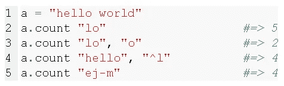
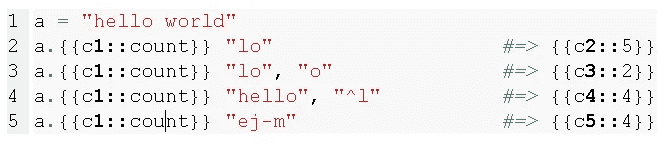
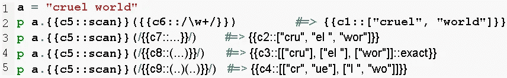
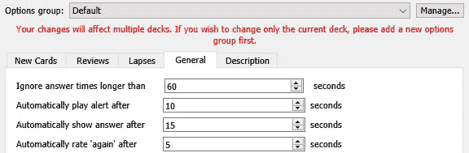

# 使用 Anki 学习编码的一些技巧

> 原文：<https://medium.com/nerd-for-tech/a-few-tips-on-using-anki-for-learning-to-code-4ad01f2080a3?source=collection_archive---------3----------------------->

约书亚·索蒂诺在 [Unsplash](https://unsplash.com?utm_source=medium&utm_medium=referral) 上拍摄的照片

最近，一个和我一起学习的朋友告诉我，他正在分享我给他的一些提示，告诉他如何在[发射学校](http://launchschool.com/)和我们的其他同学一起使用 Anki。对他们和其他任何可能受益的人来说，这就是了。

我将假设我们都知道 Anki 是什么，并且我们都使用过它，至少有一点。我也会假设我是一个比你更高级的用户，或者我有一种你可以学习的风格。

例如，我使用 Anki 帮助我流利地学习俄语和德语，学习意大利语和法语达到更基本的水平，以及不同程度的其他科目，从世界地理到元学习。我现在用它来补充和消化我在 Ruby track 上 [Launch School](http://launchschool.com/) 的学习。

为了享受使用 Anki 作为学习食谱的主要内容并从中受益，最重要的观念是它是为了记忆，而不是一般的学习。换句话说，如果你需要从头掌握一个概念，或者学习一个程序，或者解决问题，Anki 不是你的首选工具。理想的抽认卡不超过两秒钟就能理解问题，最多不超过五秒钟就能回答问题。如果我找不到一种方法来适应练习某件事情的基本要求，这样我就能在 10 秒钟内找到问题，并在 5 秒钟左右的时间内回答，这很可能不是抽认卡费用。

那么在学习编码时，我用 Anki 做什么事情呢？我制作卡片主要有两种方式。

第一种是我取一小段代码——比方说，1-5 行左右，通常包括输出——并使用完形填空删除。(要删除完形填空，突出显示所选内容，然后按 ctrl-shift-c。[这里有一个很棒的两分钟视频](https://youtu.be/IRY1rYxd9EM)，展示了删除完形填空的基础知识(观看时间最长为 2:20)。请参见代码的[语法高亮显示](https://ankiweb.net/shared/info/1463041493)插件，了解如何将代码很好地复制并粘贴到 Anki 中。)这里的关键是排除一切，除了你想记住的东西所必需的。*通常你选择的编程语言的文档可以给出这种原子化的用例。*我有时会选择一组用例，用完形填空的方式删除方法名的所有实例(一张卡片代表所有实例)和半打单独的卡片，等等，同样注意语法的各种元素和每个用例的输出。

让我们以 Ruby 中的“String#count”方法为例。

这里我删除了 5 张卡片:1 张是方法名，4 张是各种返回值。

这是一个删除了参数的“String#scan”方法的例子。这可能有点过了，但是它表达了这个想法，不是吗？

在其他情况下，当我意识到我的代码中有一个我不想再犯的错误时，我会提取出关键的部分并留下错误，也许还有错误的输出。现在，当卡出现时，我需要在几秒钟内找出问题所在以及如何修复它。好满足。

在第 6 行，这应该是“受保护的”，而不是“私人的”。我没有标出错误。(这个例子比我通常推荐的代码块要大。如果我发现在 10 秒钟内我不能理解被要求做什么，我就扔掉它。)

第二是我从我的学习材料中提取(通常只是复制粘贴)一些文本，然后用完形填空删除它。定义，阐明我容易混淆的事物之间的区别的陈述，以及我想记住的事实都是很好的候选。

那叫什么来着？

啊…

我发现有很多其他值得使用 Anki 的方法，但我会从这些开始。少即是多。

在进入**之前，我会鼓励你，如果你想经常使用 Anki，无论何时你学习的时候，都要在你的电脑上运行这个程序。做好准备，当你遇到任何值得间隔重复。只要稍加练习，一张抽认卡可以在几秒钟内完成并保存。**

# **提示**

把 Anki 作为每个学习环节的第一件事*，一天都不要错过。如果你发现很难坚持这个习惯，那就承诺做五分钟你最重要的一副牌(通常是你最近加过牌的那副)。随着压力的减轻，你会发现一旦你进入了回顾卡片的流程，你就完成了所有的卡片。*

当你创建一副牌时，确保牌组选项中的新卡和审核限制都足够高，以至于*永远不会阻止任何新卡立即进入流通*。如果你正在制作卡片(而不是从外部获得)，你不需要这些限制。

**我会推荐的附加组件**(按重要性排序；点击阅读更多):

*   [代码的语法高亮显示](https://ankiweb.net/shared/info/1463041493)
*   [GODMODE:更快的快捷键和完形填空切换](https://ankiweb.net/shared/info/1508677152)
*   [速度聚焦模式](https://ankiweb.net/shared/info/1046608507)
*   [迷你格式包装](https://ankiweb.net/shared/info/295889520)
*   [图像遮挡增强](https://ankiweb.net/shared/info/1374772155)

顾名思义，代码的语法突出显示。一定有。

GODMODE 是我最近发现的一个插件，如果你需要多个空格作为同一张卡片的一部分，它可以使用多张卡片创建完形填空删除笔记更加有效(为此使用 ctrl-S)。注意，这删除了前面提到的删除完形填空的快捷方式(ctrl-shift-C 变成 ctrl-E)和后面提到的一个快捷方式(ctrl-delete 变成 delete)。

速度聚焦模式是一个很好的附加功能，可以确保您的卡片足够精细，以保持最佳速度。它有多种选择。我把它设置成 10 秒钟发出“你花的时间太长了”的声音，总共 15 秒钟翻一次牌，翻完一张牌后 5 秒钟内把它评为错误或“再次”。它真的提高了我使用 Anki 的效率，很大程度上是因为它帮助我认识到，当一张卡片(或一整张纸条)不值得花时间去理解被问及的问题，然后回答。有关相关设置，请转到面板选项>常规。

我确保我的所有甲板选项组都有上述速度聚焦设置。

迷你格式包可以让你比 Anki 允许的更好地修饰你的笔记。

图像遮挡是需要花费最多时间来掌握的附加功能，但是考虑一下是否值得花一个小时来学习使用它是值得的。基本上，如果你想制作和使用基于图像的闪存卡，你需要这个。

**键盘快捷键(PC):**

空格键和 1，2，3，4。不要——我重复一遍——在翻转卡片或告诉 Anki 它有多难时不要使用鼠标。如果空格键不 klak，你不是一个真正的 Anki 呆子。我把左手拇指放在空格键上，同一只手的三个手指放在 1、2 和 3 键上。或者，我也使用键盘最右边的数字小键盘，用我的小手指按回车键。

Ctrl-enter 保存您正在创建的新注释以及您所做的任何编辑。避开杂乱的鼠标工作，使用它。(我想知道你将如何记住所有这些快捷方式……)

接下来，@和 Ctrl-delete(针对 PC)。@表示暂停一张卡片，ctrl-del 表示删除整个笔记。当你提高了判断什么是有价值的笔记/卡片，什么是没有价值的笔记/卡片的能力时，根据需要通过挑选卡片来证明这种能力。(知道笔记/卡片必须被删除的一个方法是，你需要花很长时间来理解被问到的问题，而在你理解之后，答案是显而易见的，因为你已经在代码中一直使用它。)扔掉这些枯木会让你在学习 Anki 之外的材料时快速制作卡片，而不需要过多地打断你的学习流程，也不会感觉永远被束缚在臃肿混乱的卡片组中。

也要习惯用“e”。这是编辑便笺的快捷方式。就像上面的两个热键一样，它真的很方便，这样你就不必第一次就把笔记做得绝对完美。当你忘记它之后，在 Anki 会议中重新面对它时，你会更好地知道什么是需要的。

(“e”也可以作为备用的“暂停”按钮，如果你使用的是快速对焦模式，并且需要超过 15 秒或任何你设置的自动失败——少用。)

**套牌和标签**

另一件要注意的事情是上下文相关的笔记。如果我有一个 bash shell 的注释，但是它和其他的东西混在一起，这可能会让人感到困惑，例如，当你谈论缩写的参数(-lah，等等)时。我使用了一个分层结构(例如，Launch School > Ruby > RB109，或者 Launch School > Git)来保持上下文的分离(不完美，但是很好)。还有人说标签好多了。有可能。

**列表、序列等等**

如果你试图记住一组或一系列事情，以及每件事情是什么和/或它们是如何工作的，我建议创建两种不同的 Anki 笔记，一种是整个列表(如果列表很长，则是一大块)，另一种是单个项目。在列表的注释上，用完形填空分别删除项目。这样，如果重要的话，你可以练习回忆它们以及它们的顺序。在单独的便条上写上物品的名称和其他信息(含义、用途等)。)你想记忆和完形填空，那就把名字和每一项分别删掉。这里的关键是小组笔记不应该包括所有额外的信息。

**延伸阅读**

要更深入地了解如何将你想要掌握的知识分解成抽认卡大小的片段，请看[这一领域先驱之一的经典文章](http://super-memory.com/articles/20rules.htm)。

感谢阅读。