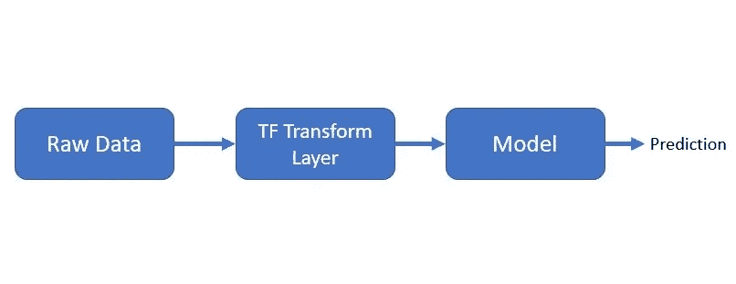
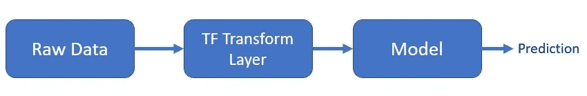

# 为 ML 模型训练/推理预处理数据的良好行业实践— tf。改变

> 原文：<https://medium.com/nerd-for-tech/a-good-industry-practice-to-preprocess-data-for-ml-model-training-inferencing-tf-transform-55ff36af952b?source=collection_archive---------9----------------------->

ML 模型推理流程

在大多数场景中，生产中的 ML/DL(机器学习/深度学习)解决方案使用 Tensorflow 来构建他们的产品。因为与 PyTorch 相比，Tensorflow(TF)拥有广泛的生产社区支持。(然而，PyTorch 由于其灵活性而成为 ML/DL 研究人员的首选)

让我来解释一下数据预处理应该如何进行:

1.  始终将数据预处理组件与模型训练/推理组件分离。
2.  使用 **tf。转换**进行预处理

我会回到为什么 **tf。转型？**

# 1.为什么我们需要将数据预处理组件与 ML 管道中的其他组件分离。？

什么是 ML 环境下的预处理？

> “将原始输入转换为特征以训练机器学习模型的过程”

当您打算扩展您的模型以满足 10K 请求/秒时。当架构与预处理紧密耦合时，进行预处理的成本会很高。最好有一个单独的组件来执行预处理任务，并将特征存储在合适的存储区域，如 Feast(特征存储),这些特征可以由训练/服务组件读取。

我们的模型架构应该以这样一种方式设计，即在初始训练期间执行的转换/预处理必须易于在下一次重新训练期间或者在服务/推理模型时重现。我们可以通过确保在模型图中保存转换或者通过创建转换特征的存储库来做到这一点。

**tf.transform** 提供了一种有效的方法，通过预处理传递数据来执行变换，并保存生成的特征和变换工件，以便在预测时间期间 TensorFlow 服务可以应用这些变换。"

# 2.tf。转换实现

以下是我们通常作为良好实践遵循的高级步骤:

1.  创建一个 tf。转换预处理函数并通过它传递原始数据。
2.  保存张量流变换层
3.  在模型服务时加载转换层
4.  通过它传递推理数据以从原始输入中获取已处理的要素。

所有的 tf。转换保存为 TF 图，下面是模型服务期间的流程:

在 [tf 中。转换文档](https://www.tensorflow.org/tfx/transform/api_docs/python/tft)您可以找到您的项目可能需要的几乎所有转换。

首先，我们需要创建一个函数，它将接受原始输入，然后使用 [tf 将它们转换为我们需要的内容。转换 API](https://www.tensorflow.org/tfx/transform/api_docs/python/tft)。

这里有一个例子，我们正在使用 **scale_to_0_1** ，它将在 0 到 1 之间缩放我们的图像像素张量值。

在我们开始训练之前，我们将所有的原始数据传递给上面的`preprocessing_fn`，然后我们得到**转换后的数据**和**转换层**

可选地，我们可以将***transformed _ data***保存为 TFRecords，它可以被训练组件有效地读取

在模型服务的时候，我们将加载 tf。变换图层。

这是模型服务流的外观:

模型服务流程

我们将原始输入传递给变换层，然后获取给定输入的特征，然后将这些特征传递给模型进行预测。

如果你想了解更多这方面的内容，可以联系我。