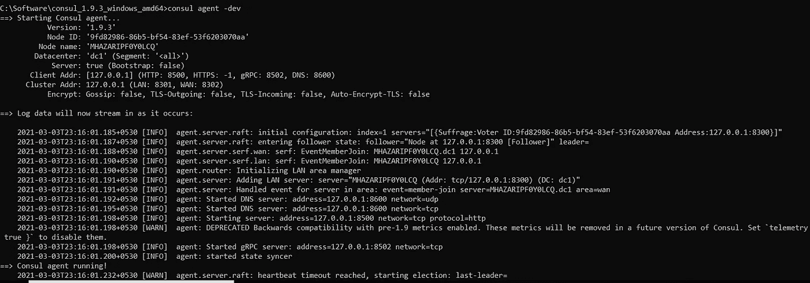
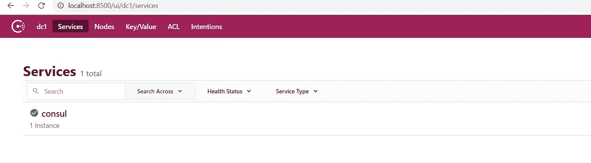
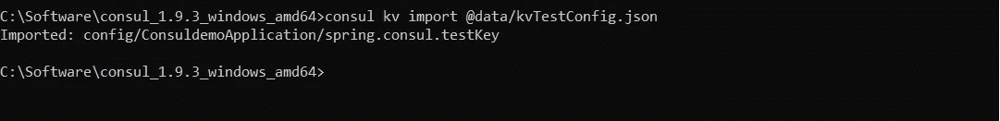
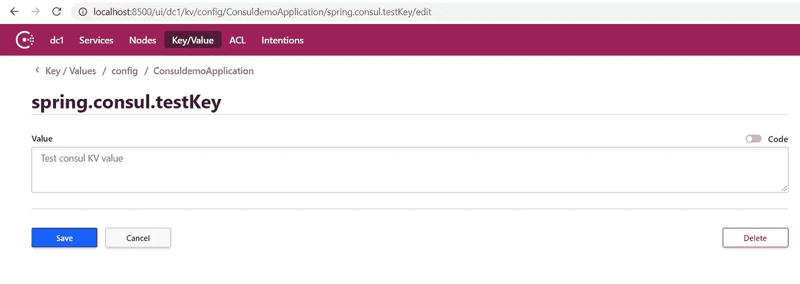
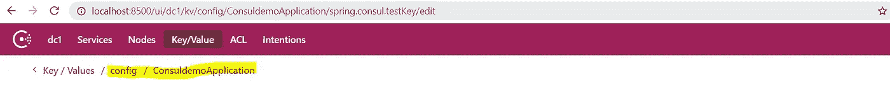
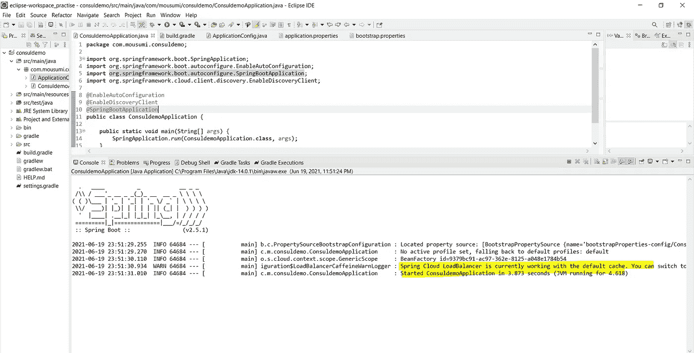

# 关于使用 HashiCorp 的 consul 作为弹簧启动应用程序的 KV 商店的指南？

> 原文：<https://medium.com/nerd-for-tech/a-guide-on-using-consul-as-a-kv-store-for-a-spring-boot-application-de833979da0f?source=collection_archive---------2----------------------->

马丁·亚当斯在 [Unsplash](https://unsplash.com?utm_source=medium&utm_medium=referral) 上的照片

大家好，在开始实际的指南之前，我将简单介绍一下领事和领事的 KV 商店功能。

**什么是执政官？**

Consul 是 HashiCorp 于 2014 年首次发布的软件。
这是一个服务网格解决方案，提供基于 DNS 的服务发现和分布式键值存储、分段和配置的全功能控制平面，可以单独使用或一起使用来构建完整的服务网格。

**领事的 KV 店是什么？**

Consul 的 KV store 是 Consul 中可用的特性之一，能够存储分布式键值。

它主要用于动态配置、特征标记、协调、领导者选举，除此之外还有许多其他用途。

其简单的 HTTP API 使其易于使用，可以被视为一种行业标准。

然而，在我的指南中，我将向您解释如何使用 consul 的 KV store 功能进行动态配置。

我考虑了一个简单的 spring boot 应用程序，它将使用 spring consul 在运行时将 consul 值绑定到 spring boot 应用程序。

**先决条件**

需要安装哈希公司咨询软件。为此，您可以遵循以下步骤。

1.  下载咨询软件([https://www.consul.io/downloads](https://www.consul.io/downloads))
2.  接下来解压缩下载的包
3.  将可执行文件(如果在 Windows 操作系统中安装)放在要启动 consul 代理的文件夹下
4.  接下来启动命令提示符，并转到 consul exec 所在的路径
5.  接下来，通过键入以下命令检查 consul 是否可用。

领事

如果一切正常，你会看到下面的屏幕-

6.最后，我们将通过执行以下命令运行 consul 代理

咨询代理-开发

如下图所示。

> 注意:咨询代理仅推荐用于开发模式。如果希望在 consul 启动时保留键值对，可以使用以下命令运行 consul 代理，consul agent-server-bind = 127 . 0 . 0 . 1-data-dir =。/data-bootstrap-expect = 1-node = agent-one-ui

一旦安装了 consul，你可以通过点击浏览器 http://localhost:8500 url 来检查它。

领事浏览器

> 注意:如果您有任何问题，请检查默认端口号 8500 是否可用，否则您需要更改端口号。

一旦 consul 启动，我们需要创建 consul 键值对和文件夹结构。我们可以使用 consul UI 逐个创建 KV 对，或者使用带有文件导入的命令提示符一次性生成所有密钥。

这是用于在 consul 中创建 kv 对的命令 consul KV import @/your-file-path/filename . JSON。

下面是屏幕-

> 注意:为了使用文件系统立即创建 KV 对，我们必须以 base 64 格式对值进行编码，否则我们将在输入字节 4 错误处得到非法的 base64 数据

下面是我用过的文件-

生成 KV 对的 JSON 文件

> 注意:在这个文件中，我们用 base 64 格式对实际值进行了编码

下面是生成密钥后 consul 文件夹结构的屏幕-

> 注意:如果您想从 consul UI 创建一个键，您不需要对值进行编码。

此外，文件夹名称应始终以“**config**name”开头，后跟应用程序主类名，如下所示

**现在让我们创建一个循序渐进的指南，以便在一个简单的 spring boot 应用程序中使用 KV pair 进行咨询。**

为了启用 consul，我们需要在您的 build.gradle 文件中包含此依赖项，如下所示

> 注意:spring actuator 是强制性的，因此 consul 会不断检查 spring boot 应用程序的健康状态

接下来，我们需要创建一个 bootstrap.properties 文件，并配置这些 consul 属性，如下所示

> 注意:应用程序名称应该与已经提到的领事“**配置**”文件夹下创建的文件夹名称相匹配。

接下来，我们需要创建一个 ApplicationConfig 类，并启用@value 注释将来自 consul 的值绑定到应用程序，如下所示

> 注意: **@RefreshScope** 注释用于在 consul 的值发生变化时立即刷新值，而无需重新启动应用程序

最后，我们需要将@EnableDiscoveryClient 注释添加到主应用程序中，如下所示

接下来，运行应用程序，如果一切正常，您可以看到如下所示的消息。

应用程序已向 consul 注册

> 注意:如果在 consul 中未正确配置密钥，或者在 spring boot 应用程序中将密钥更改为另一个名称，则会出现此错误**无法解析值“$ { spring.consul.test }”**中的占位符“spring . consul . test”，这意味着 consul it 无法绑定应用程序密钥。

这就是我们如何使用 consul 的 KV store 特性进行动态配置，这在您想要在运行时配置值时非常有用。

希望这对我的开发伙伴有所帮助。

请分享你的反馈，无论谁读了这篇文章，这将在某种程度上鼓励我。

**GitHub 链接:**[https://github.com/mousumi8/spring-boot-consul/tree/master](https://github.com/mousumi8/spring-boot-consul/tree/master)

**参考资料:**https://spring.io/projects/spring-cloud-consulT2，[https://www.hashicorp.com/products/consul](https://www.hashicorp.com/products/consul)