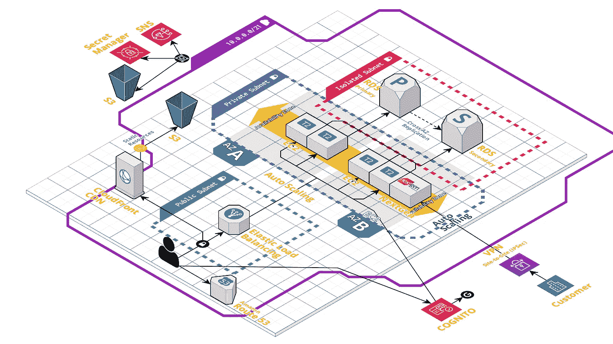
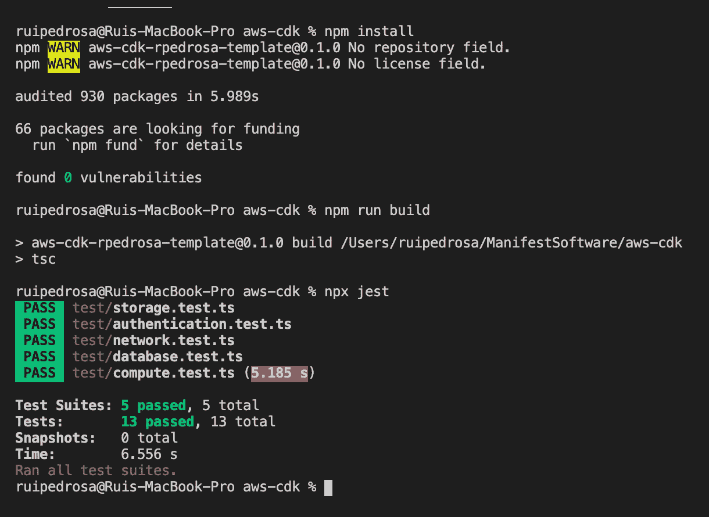
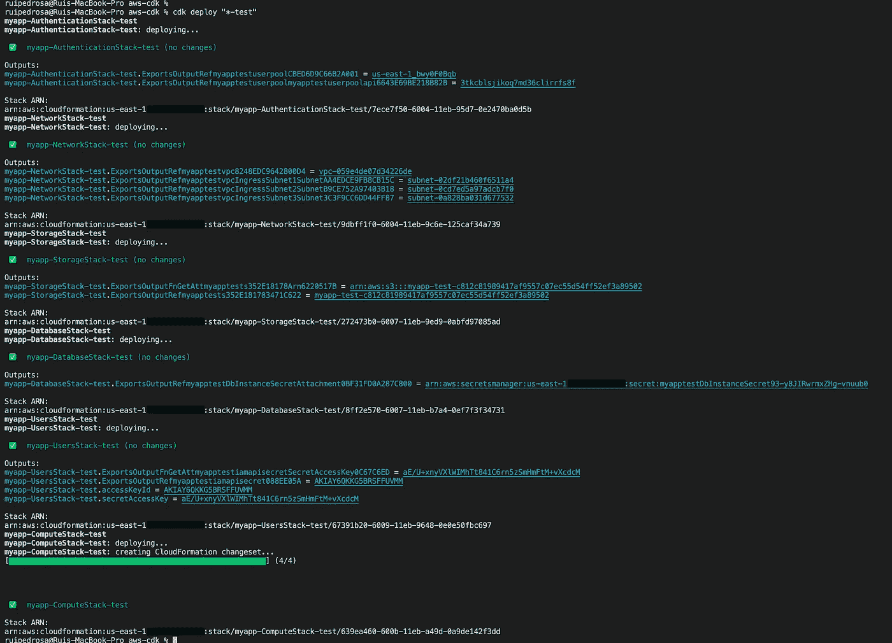
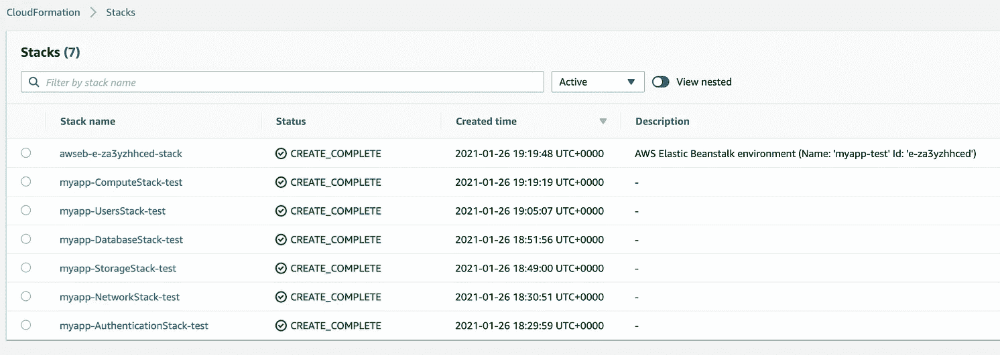
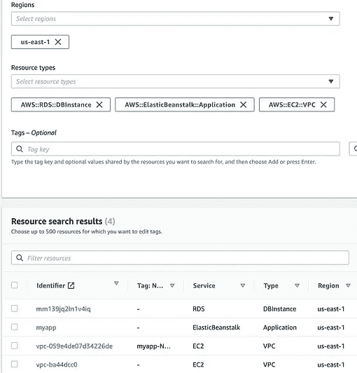
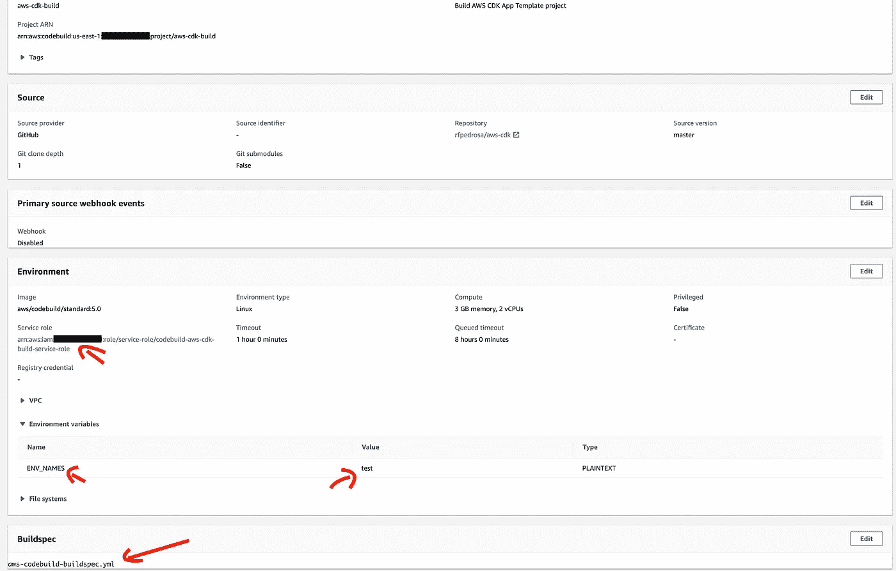
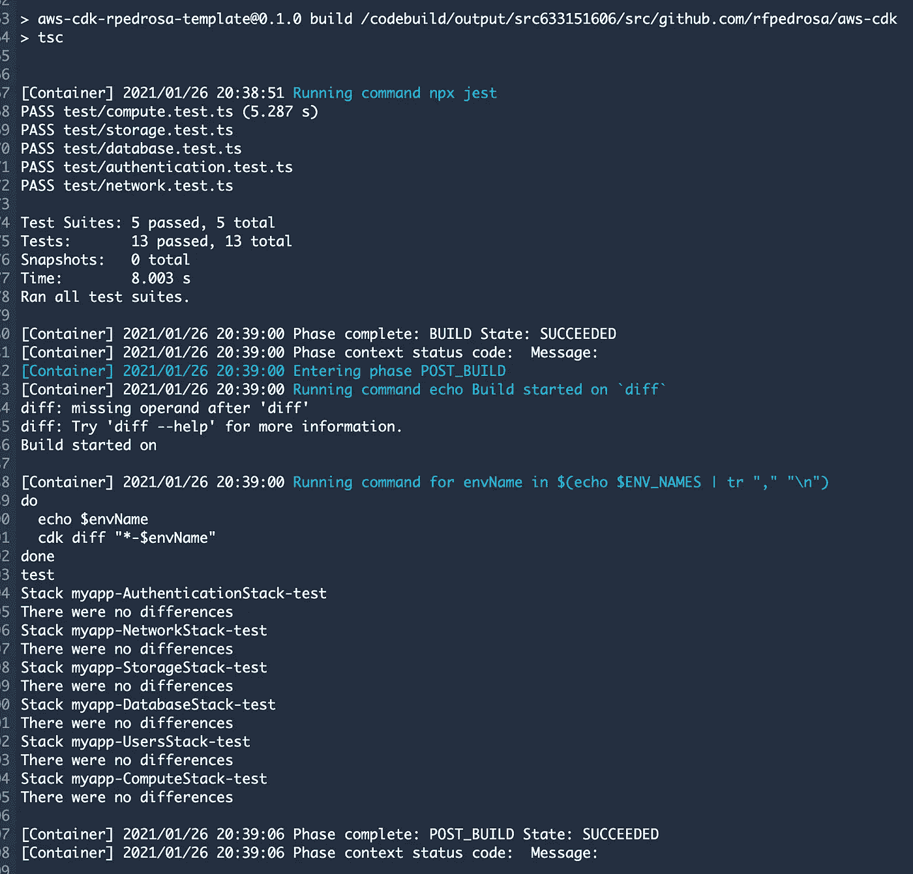
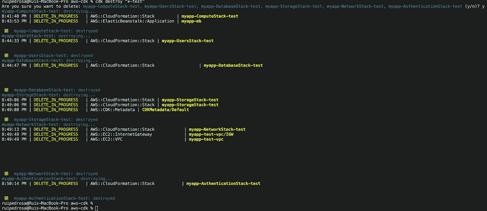

# 符合 HIPAA/HITRUST 标准的 AWS CDK 应用程序模板，基于 AWS 最佳实践，具有高可用性和安全性

> 原文：<https://medium.com/nerd-for-tech/a-hipaa-hitrust-compliant-aws-cdk-app-template-based-on-aws-best-practices-for-high-availability-24658d6be3dd?source=collection_archive---------2----------------------->

**在生产了许多满意的客户后**😎**他们中的许多人在美国卫生部门，在那里基础设施经常根据安全**[**HIPAA**](https://www.hhs.gov/hipaa/for-professionals/security/laws-regulations/index.html)**/**[**HITRUST**](https://hitrustalliance.net/)**等安全&合规性标准进行审查，我刚刚完成了一个 AWS CDK 应用程序模板，您现在也可以重复使用它来基于安全和可重复的** [**AWS 高可用性和安全性最佳实践**](https://docs.aws.amazon.com/quickstart/latest/compliance-hipaa/overview.html#best-practices) **调配 AWS 资源**[AWS CDK 应用程序模板在我的 GitHub 帐户中作为基于模板的回购](https://github.com/rfpedrosa/aws-cdk)公开提供，因此您可以轻松地立即派生和部署，但您可能仍然会发现首先了解如何:

👉它是结构化的；

👉可根据您的需求进行调整；

👉可以通过命令行或 AWS CodeBuild 作为 CI/CD 工具进行部署；

 [## rfpedrosa/aws-cdk

### 使用 AWS CDK 配置的 AWS 资源。AWS CDK 是一个“定义云的软件开发框架…

github.com](https://github.com/rfpedrosa/aws-cdk) 

# ⚡The AWS CDK 应用程序 Template⚡

[AWS CDK 应用程序模板](https://github.com/rfpedrosa/aws-cdk)基于“AWS 上 HIPAA 的[参考架构](https://docs.aws.amazon.com/quickstart/latest/compliance-hipaa/overview.html#arch)”。如前所述，it [**支持 AWS 高可用性和安全性的最佳实践**](https://docs.aws.amazon.com/quickstart/latest/compliance-hipaa/overview.html#best-practices) 和 **:**

1.  [多个 AWS 地区和多个 AWS 账户](https://github.com/rfpedrosa/aws-cdk/blob/master/cdk.json#L6-L9)。[生产环境可以部署到不同的 AWS(子)帐户，以实现更高的资源隔离](https://aws.amazon.com/blogs/mt/best-practices-for-organizational-units-with-aws-organizations/)；
2.  多重环境。[默认情况下，开发、测试&生产都是编码](https://github.com/rfpedrosa/aws-cdk/blob/master/bin/aws-cdk.ts#L19-L44)的，但是你可以通过复制&粘贴[几行代码](https://github.com/rfpedrosa/aws-cdk/blob/master/bin/aws-cdk.ts#L59-L94)来轻松创建和部署更多；
3.  旨在优化运行成本(例如:测试环境中不需要 NAT 网关，因为数据库和应用层通过放置在公共子网中可以公开访问)；
4.  涵盖了检查最关键的安全漏洞的单元测试；

项目 [**代码被构建在多个栈**](https://docs.aws.amazon.com/cdk/latest/guide/stack_how_to_create_multiple_stacks.html) 中。[栈](https://docs.aws.amazon.com/cdk/latest/guide/stacks.html)(相当于 AWS CloudFormation 栈)包含[构造](https://docs.aws.amazon.com/cdk/latest/guide/constructs.html)，每个构造定义了一个或多个具体的 AWS 资源，比如亚马逊 S3 桶、Lambda 函数、亚马逊 DynamoDB 表等等。[堆栈(及其资源)可以共享](https://awsmaniac.com/sharing-resources-in-aws-cdk/)。这意味着你可以添加、编辑、调整&删除[应用模板默认堆栈](https://github.com/rfpedrosa/aws-cdk/tree/master/lib)以满足你的需求，即使你的应用不是基于网络的。希望以一种比从零开始构建 AWS CDK 应用程序更快的方式，因为这是模板的目标🙃。[应用模板](https://github.com/rfpedrosa/aws-cdk)带有默认堆栈，可重新创建以下 Web 参考架构:

图 1: [AWS CDK 应用程序模板](https://github.com/rfpedrosa/aws-cdk) — Web 参考架构

最后，**它是在 TypeScript** 上编码的，因为“ [AWS CDK 是用一种语言(TypeScript)开发的，并且通过使用一个叫做 JSII](https://docs.aws.amazon.com/cdk/latest/guide/getting_started.html#getting_started_languages) 的工具为其他语言生成语言绑定。这意味着许多 AWS CDK 示例代码是用 TypeScript 和 [TypeScript CDK](https://docs.aws.amazon.com/cdk/api/latest/) 编写的，更新可能会比其他编程语言来得更早。另外，这些年来， [TypeScript 越来越受欢迎](https://aws.amazon.com/blogs/developer/first-class-typescript-support-in-modular-aws-sdk-for-javascript/)。这并不意味着如果你使用另一种[一流的编程语言](https://docs.aws.amazon.com/cdk/latest/guide/getting_started.html#getting_started_languages)就会有问题。实际上，我主要用 c#来编码。netcore)和我的一些同事对作为他们 VisualStudio/Rider 解决方案一部分的 AWS CDK for c#有很好的体验。

## [网络堆栈](https://github.com/rfpedrosa/aws-cdk/blob/master/lib/network-stack.ts)

这可能是最重要的一条。除非你运行的是无服务器应用，否则你可能需要将一些 AWS 资源放在一个[VPC/子网](https://docs.aws.amazon.com/vpc/latest/userguide/VPC_Subnets.html)中，不管它是 web 应用、worker 应用还是其他什么应用。如[所示，您可以看到](https://github.com/rfpedrosa/aws-cdk/blob/master/lib/network-stack.ts):

*   它创建了[公共(例如:用于负载平衡器)、私有(例如:用于服务器)和隔离(例如:用于数据库)子网](https://github.com/rfpedrosa/aws-cdk/blob/master/lib/network-stack.ts#L27-L80)；
*   仅对于生产环境，[它创建了一个 NAT 网关](https://github.com/rfpedrosa/aws-cdk/blob/master/lib/network-stack.ts#L97)(而不是每个可用性区域一个):

> 如果您想节省 NAT 网关的成本，可以使用隔离子网而不是专用子网(如高级子网配置中所述)。如果您需要私有实例具有 internet 连接，另一个选项是通过将 NAT gateways 属性设置为较低的值(默认为每个可用性区域一个 NAT 网关)来减少创建的 NAT 网关的数量。请注意，这可能会对您的应用程序产生可用性影响。

*   在非生产环境中，只使用一个[公共子网](https://github.com/rfpedrosa/aws-cdk/blob/master/lib/network-stack.ts#L30)，因此您不需要 NAT 网关来处理出站流量😉
*   仅对于 prod 环境，它还创建了一个[堡垒主机](https://github.com/rfpedrosa/aws-cdk/blob/master/lib/network-stack.ts#L102-L103)，因此您可以使用 SSH:

> 如果您想使用 SSH 从互联网连接，您需要将主机放入一个公共子网。然后，您可以配置允许的源主机。因为这台机器上没有部署 ssh 公共密钥，所以您需要使用 EC2 Instance Connect 和命令 AWS EC2-Instance-Connect send-SSH-public-key 来提供您的 SSH 公共密钥

这个堆栈被[传递给应用入口点](https://github.com/rfpedrosa/aws-cdk/blob/master/bin/aws-cdk.ts#L71-L76)中的其他堆栈，这样你就有办法[在其他堆栈](https://github.com/rfpedrosa/aws-cdk/blob/master/lib/database-stack.ts#L32-L35)中引用它们的资源。

## [存储堆栈](https://github.com/rfpedrosa/aws-cdk/blob/master/lib/storage-stack.ts)

它创建一个 AWS S3 加密桶(默认情况下[公共访问被阻止](https://github.com/rfpedrosa/aws-cdk/blob/master/lib/storage-stack.ts#L24-L26))；

## [认证堆栈](https://github.com/rfpedrosa/aws-cdk/blob/master/lib/authentication-stack.ts)

它创建 [AWS 认知相关资源](https://aws.amazon.com/cognito/)。这包括(除其他外):

*   一个[用户池，有一些常用的设置，比如不区分大小写的登录](https://github.com/rfpedrosa/aws-cdk/blob/master/lib/authentication-stack.ts#L59-L114)(这是一个众所周知的抱怨)；
*   [示例代码](https://github.com/rfpedrosa/aws-cdk/blob/master/lib/authentication-stack.ts#L250-L256)关于如何配置一个[用户池组](https://docs.aws.amazon.com/cognito/latest/developerguide/cognito-user-pools-user-groups.html)；
*   [关于如何配置](https://github.com/rfpedrosa/aws-cdk/blob/master/lib/authentication-stack.ts#L129-L156)[第三方身份提供者(Google)](https://docs.aws.amazon.com/cognito/latest/developerguide/cognito-user-pools-identity-federation.html) 的注释示例代码；
*   [示例代码](https://github.com/rfpedrosa/aws-cdk/blob/master/lib/authentication-stack.ts#L51-L57)关于如何使用 Html [定制邮件验证信息](https://docs.aws.amazon.com/cognito/latest/developerguide/cognito-user-pool-settings-email-verification-message-customization.html)；
*   [关于如何使用](https://github.com/rfpedrosa/aws-cdk/blob/master/lib/authentication-stack.ts#L103-L105) [lambda 触发器](https://docs.aws.amazon.com/cognito/latest/developerguide/cognito-user-identity-pools-working-with-aws-lambda-triggers.html)的示例代码；
*   [关于如何为](https://github.com/rfpedrosa/aws-cdk/blob/master/lib/authentication-stack.ts#L258-L283)[身份池提供默认授权角色](https://docs.aws.amazon.com/cognito/latest/developerguide/identity-pools.html)的示例代码；

您可能知道， [AWS Cognito 是一个基于标准的身份提供者](https://aws.amazon.com/cognito/)。我为之工作的一些客户已经在使用其他身份提供者，如 [Auth0](https://auth0.com/) ，所以我简单地删除了这个堆栈并继续前进🙂

## [用户堆栈](https://github.com/rfpedrosa/aws-cdk/blob/master/lib/users-stack.ts)

它[创建了一个 AWS IAM 用户(&组)，该用户只有编程权限](https://github.com/rfpedrosa/aws-cdk/blob/master/lib/users-stack.ts#L22-L28)供您的应用程序/代码使用。默认情况下，用户可以访问认证堆栈上的用户池(例如，[验证访问令牌](https://docs.aws.amazon.com/cognito/latest/developerguide/amazon-cognito-user-pools-using-tokens-verifying-a-jwt.html))，从 AWS Secret Manager 读取秘密，如 DB 连接字符串变量，以及从存储堆栈上创建的桶读取[写入&；](https://github.com/rfpedrosa/aws-cdk/blob/master/lib/users-stack.ts#L33)

## [数据库堆栈](https://github.com/rfpedrosa/aws-cdk/blob/master/lib/database-stack.ts)

正如您所猜测的，它在 AWS RDS 中创建了一个关系型 Aurora Postgres DB。在大多数情况下，你可以通过改变[一个设置](https://github.com/rfpedrosa/aws-cdk/blob/master/lib/database-stack.ts#L26-L28)来改变它到另一个引擎。默认情况下:

*   它为生产环境创建一个[集群，为非生产环境](https://github.com/rfpedrosa/aws-cdk/blob/master/lib/database-stack.ts#L23)创建一个[单实例；](https://github.com/rfpedrosa/aws-cdk/blob/master/lib/database-stack.ts#L79)
*   如前所述，数据库放在生产环境的[隔离子网中，放在其他非生产环境](https://github.com/rfpedrosa/aws-cdk/blob/master/lib/database-stack.ts#L33)的[公共子网中。在生产环境中，它只能通过私有/应用程序子网或 AWS 代码构建(对于 CI/CD)来实现。这只是在生产和非专业环境之间可以改变的许多设置的一个例子；](https://github.com/rfpedrosa/aws-cdk/blob/master/lib/database-stack.ts#L86)
*   它创建 [AWS 云观察指标&警报](https://github.com/rfpedrosa/aws-cdk/blob/master/lib/database-stack.ts#L53-L75)；
*   它在 AWS 秘密管理器中存储[秘密(如用户名和密码);](https://github.com/rfpedrosa/aws-cdk/blob/master/lib/database-stack.ts#L51)

## [计算堆栈](https://github.com/rfpedrosa/aws-cdk/blob/master/lib/compute-stack.ts)

它用其他栈[输出的一些变量作为环境变量](https://github.com/rfpedrosa/aws-cdk/blob/master/lib/compute-stack.ts#L42-L139)创建了一个 AWS[Elastic Beanstalk app&environments](https://github.com/rfpedrosa/aws-cdk/blob/master/lib/compute-stack.ts#L169-L173)(例如: [AWS RDS secret ARN](https://github.com/rfpedrosa/aws-cdk/blob/master/lib/compute-stack.ts#L130-L132) )。

> AWS Elastic Beanstalk 是一个易于使用的服务，用于部署和扩展用 Java 开发的 web 应用程序和服务。NET、PHP、Node.js、Python、Ruby、Go、Docker 在 Apache、Nginx、Passenger、IIS 等熟悉的服务器上。
> 
> 您只需上传您的代码，Elastic Beanstalk 就会自动处理部署，从容量供应、负载平衡、自动扩展到应用健康监控。同时，您保留了对驱动应用程序的 AWS 资源的完全控制，并且可以随时访问底层资源。

默认情况下，它[会使用。NET core 在 Linux 平台上运行](https://github.com/rfpedrosa/aws-cdk/blob/master/lib/compute-stack.ts#L172)(这里有更多关于它的信息)但是我也有在 Ruby on Rails 或 Django 上运行的生产应用。在大多数情况下，您只需[在 AWS EB 配置中瞄准/指定不同的平台或不同的 AMI](https://docs.aws.amazon.com/elasticbeanstalk/latest/dg/command-options-general.html):

[AWS CDK 应用模板](https://github.com/rfpedrosa/aws-cdk) —配置 AWS 弹性豆茎平台或定制 AMI

你也可以在不同的服务中运行你的应用程序代码，比如 Amazon Elastic Container Service(Amazon ECS ),这很简单！您可以只更新或替换这个堆栈代码，并且仍然创建所有其他资源(插件/插件)。如果是这样的话，我建议你看一下 GitHub repo 中的 [AWS CDK 示例代码。例如，你可以在这里](https://github.com/aws-samples/aws-cdk-examples)找到亚马逊 ECS [的 AWS CDK 代码示例。](https://github.com/aws-samples/aws-cdk-examples/tree/master/typescript/ecs)

# 通过命令行和 AWS AWS CodeBuild 作为 CI/CD 工具进行部署的时间🤓 🚀

我们将首先使用命令行进行部署，然后使用 AWS CodeBuild 作为 CI/CD 工具。这意味着只要您能够运行命令，您就应该能够使用任何其他 CI/CD 工具进行部署。也可以在 AWS CDK 应用程序模板代码中设置 [AWS CDK 管道，但为了简单起见，我更喜欢手动操作。你只需要:](https://cdkworkshop.com/20-typescript/70-advanced-topics/200-pipelines.html)

1.  一个 AWS 帐户(像自由层)和一个管理员的[凭证使用](https://cdkworkshop.com/15-prerequisites/200-account.html)；
2.  [AWS CLI](https://cdkworkshop.com/15-prerequisites/100-awscli.html) ， [Node.js](https://cdkworkshop.com/15-prerequisites/300-nodejs.html) ， [AWS CDK 工具包](https://cdkworkshop.com/15-prerequisites/500-toolkit.html)和 [IDE，如果你想编辑代码](https://cdkworkshop.com/15-prerequisites/400-ide.html)(推荐[vs code](https://code.visualstudio.com/))；

从分叉[回购](https://github.com/rfpedrosa/aws-cdk)开始，确保代码编译和测试成功运行:

`npm install`

`npm run build & npx jest`

[AWS CDK 应用程序模板](https://github.com/rfpedrosa/aws-cdk) —构建和运行测试

在部署之前，我们需要在`[cdk.json](https://github.com/rfpedrosa/aws-cdk/blob/master/cdk.json)` [配置文件](https://github.com/rfpedrosa/aws-cdk/blob/master/cdk.json)中设置一些上下文变量，因为这是一个模板项目。有几种设置/获取上下文值的方法，但我喜欢放在配置文件中:

[AWS CDK 应用模板](https://github.com/rfpedrosa/aws-cdk) —示例 cdk.json

请确保您已经将您的 AWS 帐户 ID 替换为[。还要注意，为了简单起见，我没有设置`SSLCertificateArns`变量，但基本上这是您在 AWS 证书管理器中验证的证书 ARN，因此您](https://docs.aws.amazon.com/IAM/latest/UserGuide/console_account-alias.html)[可以在 AWS EB 负载平衡](https://github.com/rfpedrosa/aws-cdk/blob/master/lib/compute-stack.ts#L152-L172)中使用/终止 HTTPS。

也就是说，使用命令行进行部署就像运行 [AWS CDK 工具包](https://cdkworkshop.com/15-prerequisites/500-toolkit.html)命令:`cdk deploy —-profile [AWS_CLI_PROFILE_NAME] [STACK_NAME]`一样简单😀(用`cdk -h`检查选项和其他命令)。为了创建一个测试环境，我简单地运行`cdk deploy "*-test"`:

[AWS CDK 应用程序模板](https://github.com/rfpedrosa/aws-cdk) —通过命令行成功部署

**备注**:如果您的[部署在计算栈](https://stackoverflow.com/questions/34800403/aws-elastic-beanstalk-environment-fails-to-launch)上失败，很可能是因为您需要创建一个`[aws-elasticbeanstalk-ec2-role](https://github.com/rfpedrosa/aws-cdk/blob/master/lib/compute-stack.ts)` IAM 角色。如果是这种情况，只需手动创建(并删除)一个 AWS Elastic Beanstalk 应用程序就可以解决问题，或者删除我的评论也可以😉。

瞧啊。恭喜你。👏您现在有了一个测试环境:

[AWS CDK 应用程序模板](https://github.com/rfpedrosa/aws-cdk) —通过命令行成功部署(AWS 控制台)

现在，您可以编辑堆栈并再次部署它们。以安全和可重复的方式破坏和重建测试环境(或任何其他环境)**。通常下一步是在 Elastic Beanstalk 中部署代码，但这是另一个故事了😉**

 [## 在 AWS 中为. NET Core 3.x Web API 设置连续交付(CD)管道

### 在 AWS CodePipeline + AWS CodeBuild 中设置一个连续交付(CD)管道，以在…中部署 Asp.net 核心 3.x web api

medium.com](/swlh/setup-a-continous-delivery-cd-pipeline-in-aws-for-a-net-core-3-x-web-api-ca34271bd4fc) 

无论如何，继续前进，当通过使用 AWS CodeBuild 向 GitHub 上的[主分支提交某些内容时，自动部署我们的基础设施/](https://github.com/rfpedrosa/aws-cdk/blob/master) [AWS CDK 应用程序模板](https://github.com/rfpedrosa/aws-cdk)👌，我只需要创建一个 AWS CodeBuild 项目，并确保:

1.  `[aws-codebuild-buildspec.yml](https://github.com/rfpedrosa/aws-cdk/blob/master/aws-codebuild-buildspec.yml)`文件被使用；
2.  设置一个环境变量，告知应该部署哪个环境；
3.  将 AWS IAM `Administrator`角色分配给默认情况下即将创建的`codebuild-aws-cdk-build-service-role`；

[AWS CDK 应用程序模板](https://github.com/rfpedrosa/aws-cdk) —使用 AWS 代码构建构建(&部署)

如您所见，`[aws-codebuild-buildspec.yml](https://github.com/rfpedrosa/aws-cdk/blob/master/aws-codebuild-buildspec.yml)`实际上只构建项目并运行单元测试。`[aws-codebuild-deployspec.yml](https://github.com/rfpedrosa/aws-cdk/blob/master/aws-codebuild-deployspec.yml\)`是实际执行部署的[构建规范文件](https://docs.aws.amazon.com/codebuild/latest/userguide/build-spec-ref.html)。我有两个文件，因为通常我只通过使用基于`[aws-codebuild-deployspec.yml](https://github.com/rfpedrosa/aws-cdk/blob/master/aws-codebuild-deployspec.yml\)`文件的不同 AWS CodeBuild 项目作为一个单独的步骤部署到生产中。为什么？安全！我首先手动检查构建项目的输出，寻找差异/将要部署的内容:

[AWS CDK App 模板](https://github.com/rfpedrosa/aws-cdk) — AWS CodeBuild 成功构建(`[aws-codebuild-buildspec.yml](https://github.com/rfpedrosa/aws-cdk/blob/master/aws-codebuild-buildspec.yml)`)

最后，但同样重要的是，您可以通过运行`cdk destroy "*-test"`来破坏环境:

[AWS CDK App 模板](https://github.com/rfpedrosa/aws-cdk) —破坏测试环境

# 总结一下✍️

当谈到供应 AWS 资源时，大多数人在 AWS 控制台中手动完成，或者使用[基础设施作为代码(IaC)](https://en.wikipedia.org/wiki/Infrastructure_as_code#Overview) 。 [IaC 有数不清的优势](https://en.wikipedia.org/wiki/Infrastructure_as_code#Added_value_and_advantages)，但通常需要初始投资，不是每个人都愿意或能够承担。另外， [AWS CloudFormation](https://aws.amazon.com/cloudformation) 配置文件在很长一段时间内是 IaC 的唯一 AWS 产品，看起来很复杂，尤其是对于开发者来说，或者与其他一些框架如 [Terraform](https://www.terraform.io/) 相比。

**但当 [AWS 宣布 AWS CDK](https://aws.amazon.com/pt/about-aws/whats-new/2019/07/the-aws-cloud-development-kit-aws-cdk-is-now-generally-available1/) 时，一切都变了**。 [AWS CDK](https://aws.amazon.com/cdk/) 用你熟悉的编程语言为我们提供了“高级组件，称为构造，它们用经过验证的默认值预配置云资源，因此你无需成为专家就可以构建云应用”。木下， [AWS CDK 仍然提供了 CloudFormation (CFN)资源，它与基础级 AWS CloudFormation 资源 1:1 映射，并提供了用编程语言定义 CloudFormation 的方法。CFN 资源提供云形成资源的完整覆盖，并且在云形成资源更新或新可用后不久可用](https://aws.amazon.com/cdk/features/#Constructs_for_generating_AWS_infrastructure)。换句话说，如果需要的话，你可以完全灵活地使用 CloudFormation(例如:你正在使用 AWS CDK 还不支持的东西),但是很可能你不再需要查看 [CloudFormation](https://aws.amazon.com/cdk/features/#Constructs_for_generating_AWS_infrastructure) 配置文件来找出将要部署的内容。

所以，如果像我一样，你:

👉需要提供 AWS 资源，但不需要多云提供商支持(否则请查看[Pulumi](https://www.pulumi.com/product/))；

👉想要跨多个项目/客户重用组件，以满足您的组织/客户的安全性、法规遵从性和治理要求；

👉想要为新客户快速部署新环境；

👉我也是一名开发人员，所以使用你熟悉的编程语言和你最喜欢的 IDE 来编写基础设施，而不是 AWS CloudFormation，看起来棒极了😎；

👉仅仅是由[卓越的技术](/path-pattern/technical-excellence-neglected-in-todays-agile-mindset-642cb4b00390)和[基础设施驱动的，因为如果你能在几分钟内编写代码，版本&部署一个新的 AWS 环境，代码(IaC)](https://en.wikipedia.org/wiki/Infrastructure_as_code#Overview) 不再是一个问题。这不再是一个问题，因为你知道它的多重优势:你的生产基础设施对开发人员更加透明，代码可以很容易地被另一个开发人员审查，很容易被单元测试覆盖，很容易被静态代码分析工具覆盖，如 [GitHub 安全特性](https://github.com/features/security)或 [SonarQube](https://www.sonarqube.org/?gads_campaign=Code&gads_ad_group=Analysis&gads_keyword=static%20analysis%20tools&gclid=CjwKCAiAu8SABhAxEiwAsodSZCpAiicnjTO6uw1SgD1i90cWn0MljXKVqv8DZ6A_eKqKjWLt_kAIDRoCYNwQAvD_BwE) 等；

那么我猜你会喜欢 AWS CDK，你可能会发现这个 [AWS CDK 应用程序模板](https://github.com/rfpedrosa/aws-cdk)或 [AWS 模板](https://aws.amazon.com/pt/solutions/constructs/)也很有帮助？

欢迎反馈:)