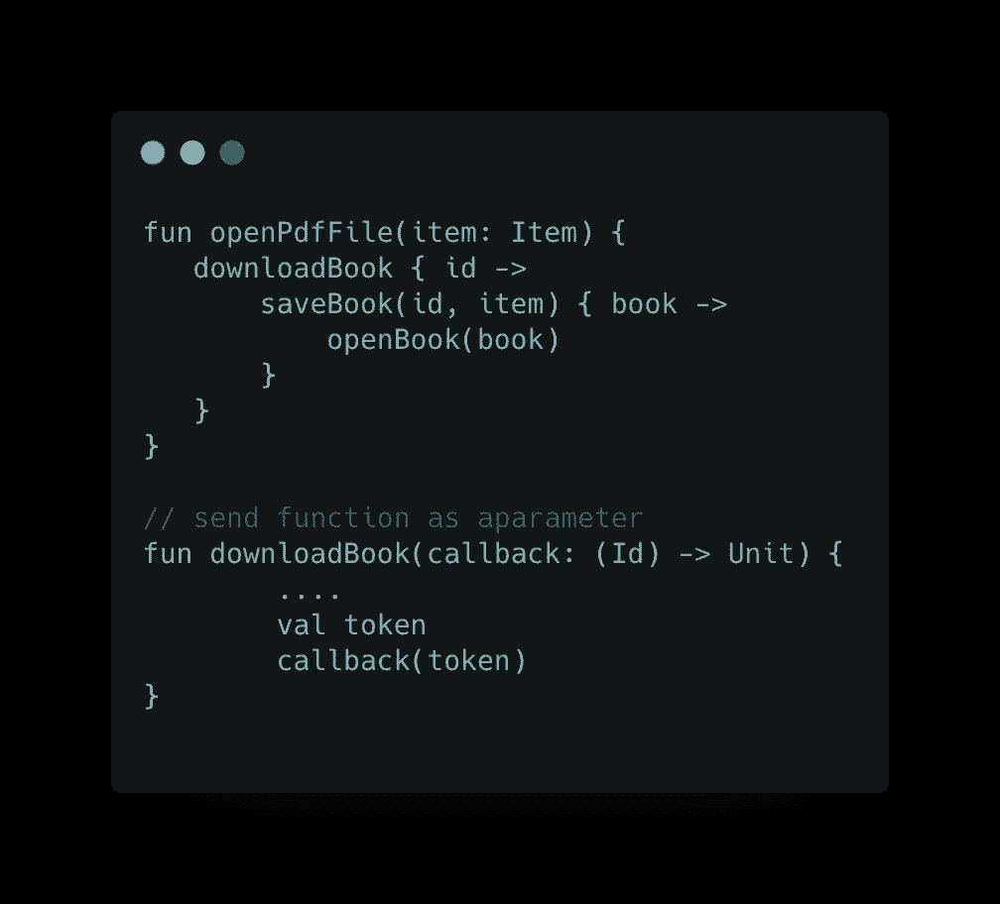
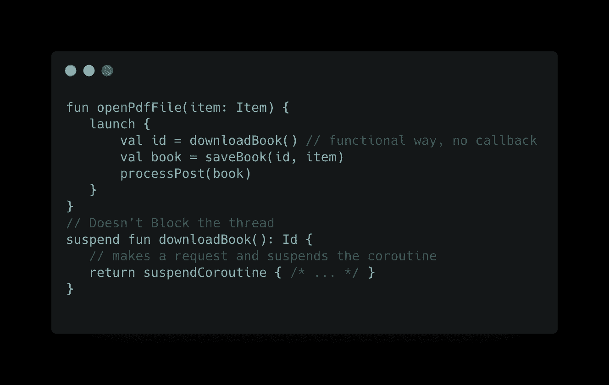
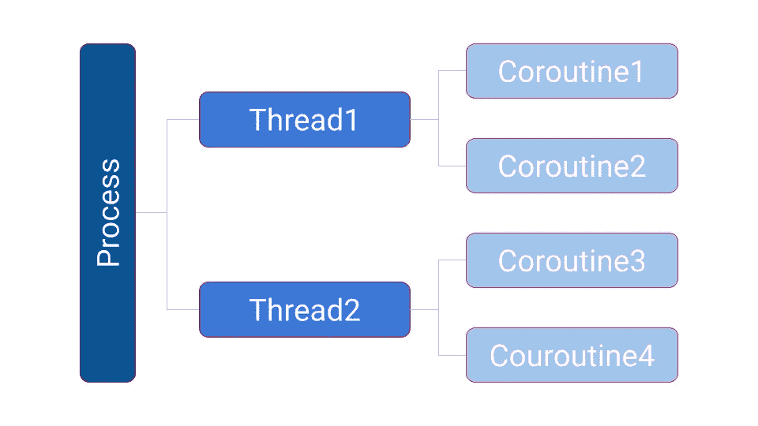

# 从回调地狱到科特林协程的旅程，第 1 集

> 原文：<https://medium.com/nerd-for-tech/a-journey-from-callback-hell-to-kotlin-coroutines-episode-1-98b52821b323?source=collection_archive---------8----------------------->

马克·赖歇尔在 [Unsplash](https://unsplash.com?utm_source=medium&utm_medium=referral) 上的照片

Ahmed 是一名开发人员，他喜欢在业余时间阅读电子书。有一天，他打开一个 pdf 下载 app，开始搜索一些书，然后开始下载，突然 app 开始滞后，然后 UI 变得不负责任，然后嘭，app 崩溃了。
用户可能会对这种体验感到厌烦，可能会从他们的设备上删除这款应用。

出现上述情况的原因有很多，我们这里考虑的是**线程。**

作为一名最新的 android 开发者，Ahmed 不希望这种情况发生在他的应用程序用户身上。所以，他做了一些研究，发现 app 需要从**主线程**中转移任何长时间运行的代码

如 [Android 开发者官方网站](https://developer.android.com/topic/performance/threads#internals)所述:

> 如果主线程不能在 16ms 内完成工作块的执行，用户可能会观察到停滞、滞后或缺乏对输入的 UI 响应。如果主线程阻塞大约五秒钟，系统显示 [*应用不响应*](https://developer.android.com/training/articles/perf-anr) (ANR)对话框，允许用户直接关闭应用。

好了，现在，Ahmed 知道了原因，并继续使用他的研究技能，知道他可以使用什么选项来编写[异步代码](https://en.wikipedia.org/wiki/Asynchrony_(computer_programming))，并找到了一些解决方案，如:

1.  穿线
2.  复试
3.  未来，承诺
4.  反应式延伸(Rx)
5.  协同程序

# **穿线**

> [计算机科学](https://simple.wikipedia.org/wiki/Computer_science)中的**线程**是执行的*线程的简称。线程是一个[程序](https://simple.wikipedia.org/wiki/Computer_program)将自己分成(称为*“split”*)两个或更多同时(或伪同时)运行[任务](https://simple.wikipedia.org/wiki/Task_(computers))的一种方式。*

Threads 是一个很好的解决方案，但是有一些问题，

有些语言，比如 javascript，没有线程。此外，它们对于系统来说可能是昂贵的，它需要在上下文(I/O、主线程等)之间切换。).它们不容易调试。

# 复试

> 在[计算机编程](https://en.wikipedia.org/wiki/Computer_programming)中，一个**回调**，也称为**调用——在**[【1】](https://en.wikipedia.org/wiki/Callback_(computer_programming)#cite_note-1)**函数**，是任何一个[可执行代码](https://en.wikipedia.org/wiki/Executable_code)，作为[参数](https://en.wikipedia.org/wiki/Argument_(computer_science))传递给其他代码；其他代码预计会在给定时间*回调*(执行)参数。这种执行可以像在**同步回调**中一样立即进行，也可以像在**异步回调**中一样在稍后的时间点进行。

回调示例

他发现它也很有用，直到他遇到了这样一个代码:

回调地狱 GIF，图片来自[https://github.com/eladkarako/AsynCallJS](https://github.com/eladkarako/AsynCallJS)

上面的 GIF 展示了所谓的**回调地狱**，当有太多嵌套回调时，代码变得难以阅读，也难以处理异常和调试。

# 未来，承诺

我保证我会在未来的某个时候回来

承诺范例

除了调试和错误处理挑战，Promises 在获取数据返回后还需要进一步的工作，因为它返回了数据的承诺，所以我们需要更多的代码行来从那个承诺中获取我们的模型:(。

# **无功扩展(Rx)**

一切都是一股水流，是可以观察到的

Rx 很棒，但它引入了 Ahmed 需要学习的新概念，相反，他决定找到一个可以用他使用的相同框架和语言实现的解决方案(我们例子中的 Kotlin)，所以。他向前走去寻找更好的东西。

# **协程**

Kotlin 处理异步代码的方法。

协同程序使代码更具可读性和有序性，就像普通编码一样。

您可以在同一个线程中使用多个协程。

从上面的代码和图表中，Ahmed 发现，他只需要在函数前添加 **suspend** 关键字，它就变得线程安全了，然后他就可以像调用导致:D 问题的函数一样使用它，而不需要改变返回类型，或者引入新概念，或者依赖于特定的平台。

与线程不同，协程是轻量级的，不昂贵，使得在同一个线程中使用多个协程成为可能。也很容易在线程之间切换。它也可以被停止、重新启动或取消。

Ahmed 对协程很满意，但他想用一些例子来测试它，以确保它们值得切换，于是他打开了 IDE，但在大量工作之后，他觉得🥱很困，所以他决定休息一会儿，打个盹，然后在恢复精神后继续练习。

艾哈迈德醒来后，下集再见👋。

你可以在这里找到第二集

# 参考

[科特林官方网站](https://kotlinlang.org/docs/coroutines-overview.html)

[安卓开发者官方网站](https://developer.android.com/topic/performance/threads#internals)

[线程，维基百科](https://simple.wikipedia.org/wiki/Thread_(computer_science))