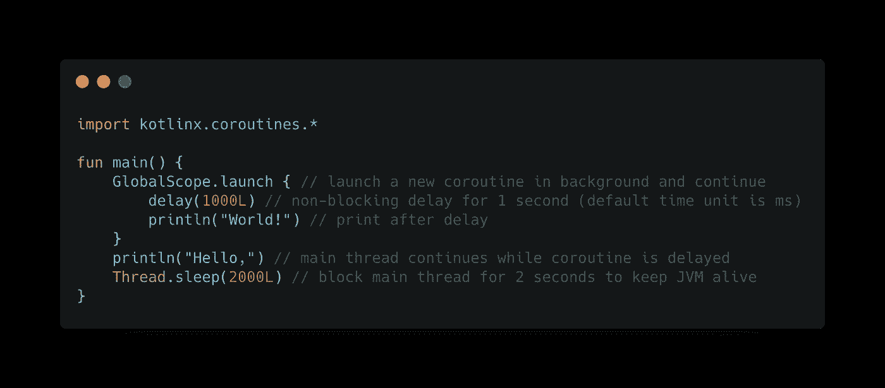
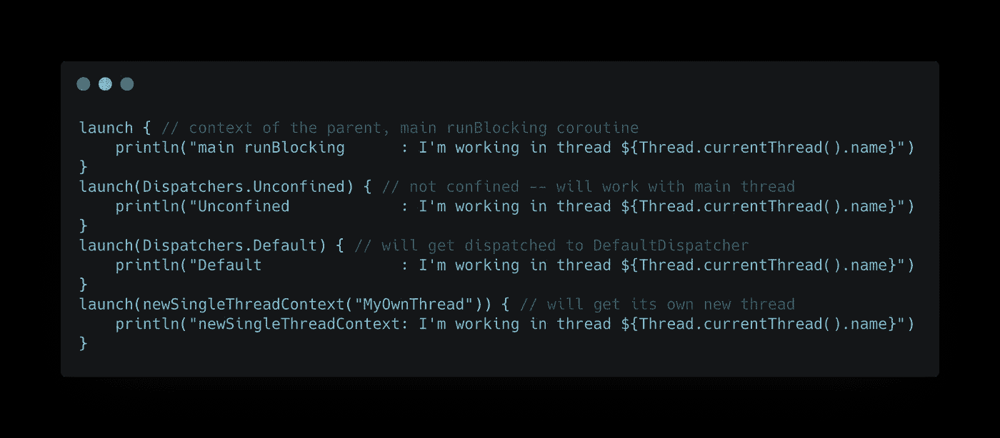
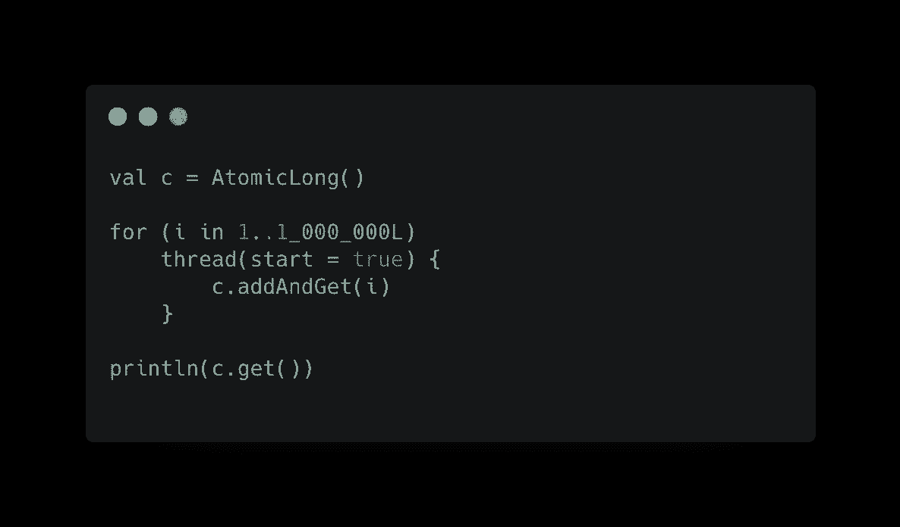
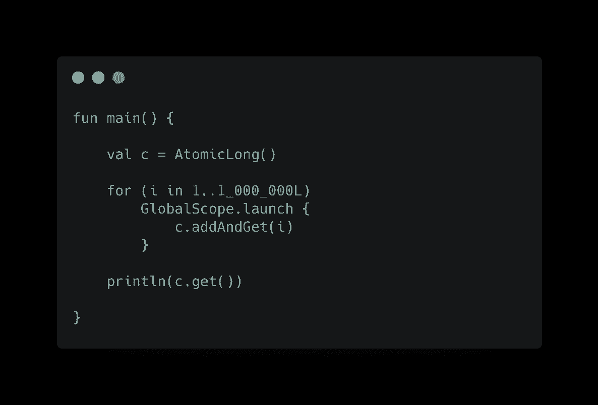
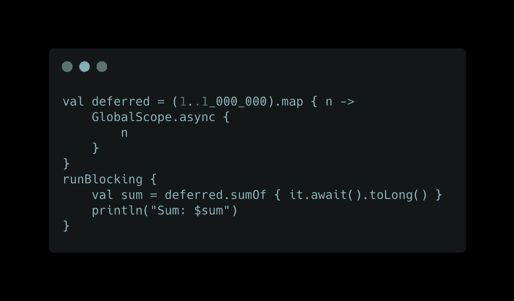
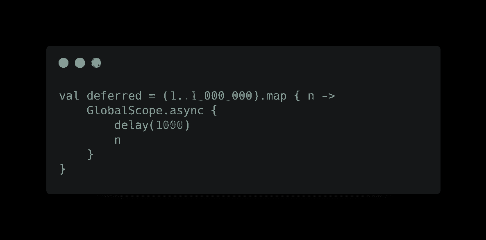

# 从回调地狱到科特林协程的旅程，第 2 集

> 原文：<https://medium.com/nerd-for-tech/a-journey-from-callback-hell-to-kotlin-coroutines-episode-2-c048f9898f?source=collection_archive---------13----------------------->


马克·赖歇尔在 [Unsplash](https://unsplash.com?utm_source=medium&utm_medium=referral) 上的照片

你可以在这里找到第一集

好了，现在，在午睡后，艾哈迈德感觉很好。他以祈祷、吃早餐开始他的日常工作，然后他继续研究协程。

他想知道那个 **suspend** 关键字后面是什么，他继续他的进度阅读，

> 协程的概念是一个函数可以在某个时候暂停执行，稍后再继续执行。

Ahmed 几乎被说服选择协程而不是其他解决方案。但是想写一些代码来看看它的运行情况。他在 [kotlinlang](https://kotlinlang.org/docs/coroutines-basics.html#your-first-coroutine) 网站上找到了下面的代码片段来展示一个简单的协程



显示一个简单协程的代码片段， [kotlinlang](https://kotlinlang.org/docs/coroutines-basics.html#your-first-coroutine)

他发现了以下输出:

```
Hello,
World!
```

有意思，但是什么是*范围*和*发射？艾哈迈德问道，然后他继续阅读以得到答案*:

# 协程上下文和调度程序

> 协程总是在某些上下文中执行 …,协程上下文是各种元素的集合。主要元素是协程的[作业](https://kotlin.github.io/kotlinx.coroutines/kotlinx-coroutines-core/kotlinx.coroutines/-job/index.html)和它的**调度器**。

协程上下文包括一个*协程调度器*(见[协程调度器](https://kotlin.github.io/kotlinx.coroutines/kotlinx-coroutines-core/kotlinx.coroutines/-coroutine-dispatcher/index.html))，它决定相应的协程使用哪个或哪些线程来执行。协程调度程序可以将协程的执行限制在一个特定的线程上，将它调度到一个线程池中，或者让它不受限制地运行。

您可以使用可选的*协程上下文、*来调用 launch{}和 async{}函数，以确定这个协程使用哪个线程来执行。



运行上面的代码片段，Ahmed 看到了以下输出:

```
Unconfined            : I'm working in thread main
Default               : I'm working in thread DefaultDispatcher-worker-1
newSingleThreadContext: I'm working in thread MyOwnThread
main runBlocking      : I'm working in thread main
```

因此，在继续阅读这里的[之后，他对如何运行一个协程有了一个很好的想法。](https://kotlinlang.org/docs/coroutine-context-and-dispatchers.html#dispatchers-and-threads)

# 检查性能

为了确保协程是轻量级的，并且不像真正的线程那样昂贵，Ahmed 决定运行一个**百万线程，并对协程做同样的事情，:D**



来自 [kotlinlang](https://kotlinlang.org/docs/coroutines-basic-jvm.html#let-s-run-a-lot-of-them) 的 snipper，运行 1M 线程

它运行 1，000，000 个线程，每个线程添加一个公共计数器。这在他的机器上花了超过 4 分 11 秒。

让我们看看他用协程做同样的事情花了多长时间



来自 [kotlinlang](https://kotlinlang.org/docs/coroutines-basic-jvm.html#let-s-run-a-lot-of-them) 的 snipper，运行 1M 的协程

这个例子在**不到一秒的时间内完成**😮，但是它打印一些任意的数字，因为一些协程在`main()`打印结果之前没有完成。让我们解决这个问题。



这打印了正确的总数。

他还想确保我们的协同程序实际上是并行运行的。他给每个`async`加了一个 **1 秒**，结果程序不应该运行 1000000 秒(超过 11.5 天):



这花了大约 10 秒钟，**所以是的**，协程确实是并行运行的。

在这一点上，Ahmed 完全被说服使用协程而不是其他解决方案来处理线程和异步。他的 kotlin 应用程序中的代码。

他有一个关于协程的好主意来开始使用它们，但是当然他需要更多地阅读并在一些真实的项目中实践。所以也许我们可以在下一集看到他的发现:)

# 参考

[协程基础知识](https://kotlinlang.org/docs/coroutines-basic-jvm.htm)

[我在#MENADD 与 Google(阿拉伯语)中谈论协程](https://www.youtube.com/watch?v=pbq8ema7YTA)

[Manuel Vivo 的 Coroutines 101](https://www.youtube.com/watch?v=ZTDXo0-SKuU)