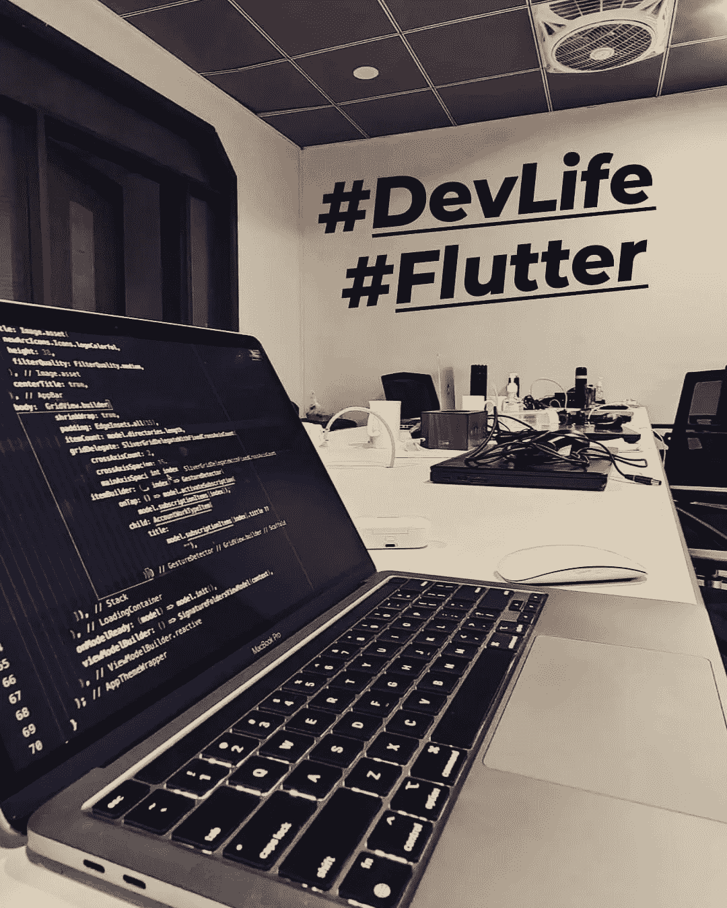

# iOS 和 Android 的 flutter 原生插件开发之旅🤩

> 原文：<https://medium.com/nerd-for-tech/a-journey-with-flutter-native-plugin-development-for-ios-android-3f0dd4ab8061?source=collection_archive---------15----------------------->

## 动机

几天前，我在我心爱的#flutter 项目中遇到了一个问题。问题是我必须实现一个**“文档扫描仪”**又名边缘检测/文档选择& **用来自**相机**或**图库**的扫描图像生成一个 PDF** 。

问题是，我找到的唯一稳定且有效的例子是 ScanBot SDK，它不是开源的。所以我决定以此为契机，开始探索它的插件生态系统。

## 构建解决方案

由于我有原生 Android 和 iOS 开发的经验，它帮助我用 flutter engine 快速完成工作。

如果你想学习如何编写特定于平台的代码，这里有一个指南:[https://flutter . dev/docs/development/platform-integration/platform-channels](https://flutter.dev/docs/development/platform-integration/platform-channels)

我在这里惊讶地看到，flutter 在连接平台 API 和它的 dart 框架方面做得非常好😍。几年前我对 React Native 做了同样的事情，这是一个大问题。但是在 flutter 中，我感觉像是在用本地代码工作😍当我和 swift 一起工作时，构建真的很快。

## 挑战

1.  第一个挑战是我没有太多的时间独自在两个平台上编写文档扫描仪(从头开始)。比如用 OCV 或类似的东西。所以我决定使用已经可以用于 android 和 iOS 原生应用的库。iOS 一号是 [**威斯康**](https://github.com/WeTransfer/WeScan) **😍**由 [**WeTransfer**](https://github.com/WeTransfer/WeScan) **。**但是对于 Android 🥺，我没有发现任何一个库在没有 GRADLE 编译问题的情况下保持稳定😒。所以这真的很有挑战性。所以我拿了那个演示的基本回购(因为它被 400 多个用户分叉了😱)作者:[**jhansireddy**](https://github.com/jhansireddy/AndroidScannerDemo)**。并开始修改其遗留的 JAVA 代码。现在，当我完成修改它时，一个想法出现在我的脑海中，既然没有好的解决方案，为什么不把它作为 android 库发布呢？所以我用 [**jitpack**](https://jitpack.io/#ishaquehassan/AndroidDocumentScanLibrary/1.8.2) **做了🎊。如果你是一个寻找类似东西的安卓开发者&，你可以在这里使用它😉:[https://JIT pack . io/# ishaquehassan/AndroidDocumentScanLibrary/1 . 8 . 2](https://jitpack.io/#ishaquehassan/AndroidDocumentScanLibrary/1.8.2)****
2.  扫描图像转换为 PDF！所以我决定在颤振端做，因为我在 [**pub**](https://pub.dev) 用[**pdf**](https://pub.dev/packages/pdf)**包🥳.找到了一个很好的解决方案这里的重点是，我在原生 iOS 和 Android 上做的唯一一件事就是打开 Activity(在 Android 上)& ViewController on(在 iOS 上)并通过 flutter 中的 [**方法通道**](https://api.flutter.dev/flutter/services/MethodChannel-class.html) 将扫描结果返回给 dart。因此，无论是 android 还是 iOS，在获得扫描图像后，我都可以通过这种机制在两个平台上以相同的方式处理响应😎。**
3.  **插件中的自定义选项，如配置、文本等。这是由[**invoke method**](https://api.flutter.dev/flutter/services/MethodChannel/invokeMethod.html)**完成的，它提供了一种漂亮而简单的方式将参数和方法名一起传递给本机代码。我使用 dart [**映射**](https://api.flutter.dev/flutter/dart-core/Map-class.html)**&[**枚举**](https://dart.dev/guides/language/language-tour#enumerated-types) 将这些配置从用户端代码指定到库 dart 文件，然后指定到本机 swift & Kotlin/java 类。******

## ****结果🤩****

****经过所有这些努力，我设法使它像预期的那样工作，并在 pub 上发表了它****

****我真的很高兴我有这个机会来学习深度的颤动，是的，插件在这里，too🥳🤩****

****[https://pub.dev/packages/document_scanner_flutter](https://pub.dev/packages/document_scanner_flutter)****

****这个插件确实有一些棘手的事情在进行，但是最好的部分是它在安全无效的情况下工作得很好！****