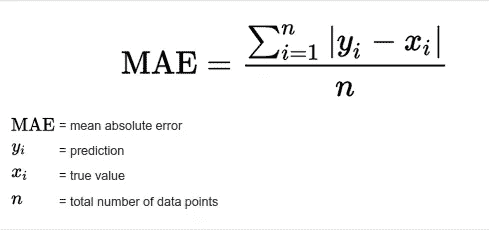
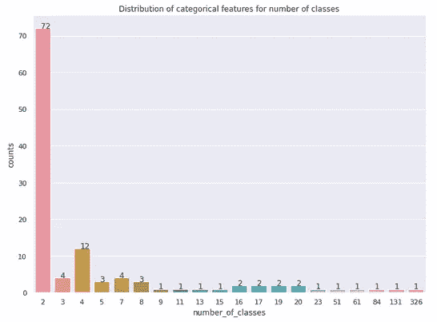
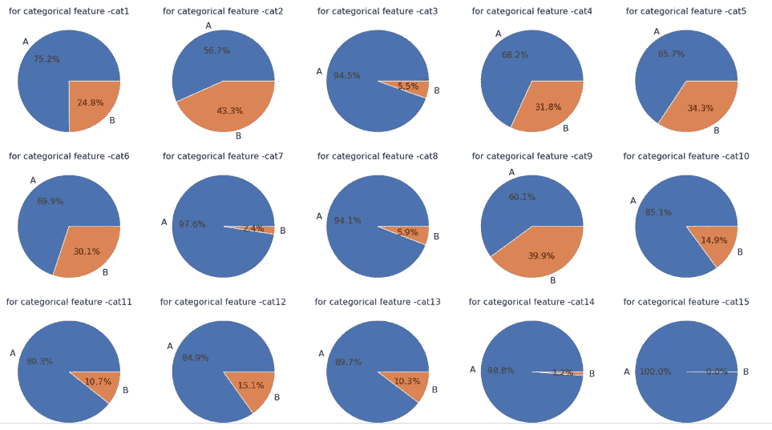
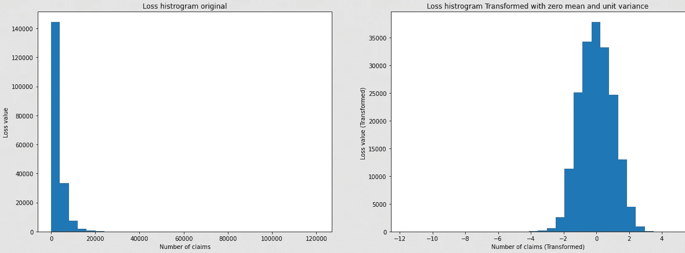
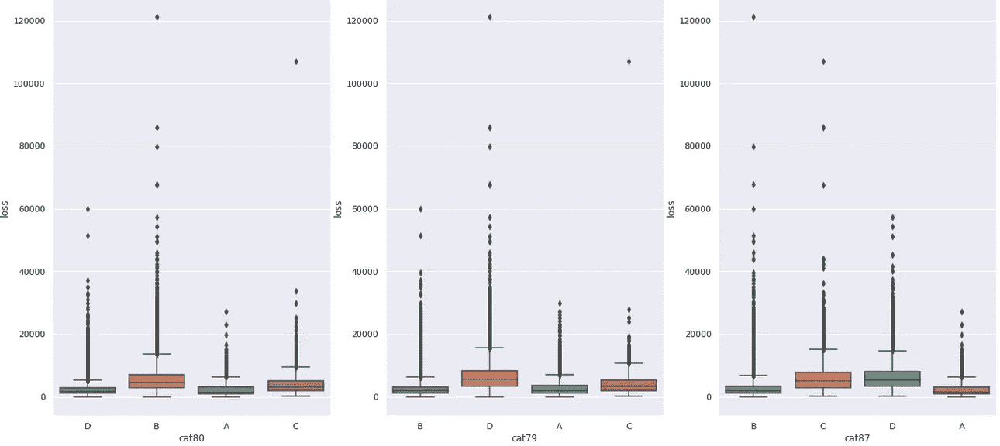
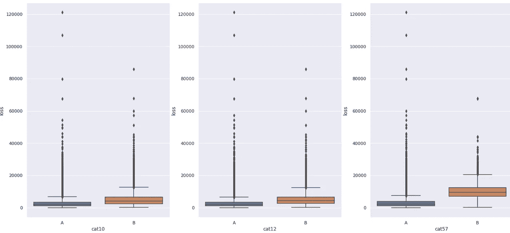
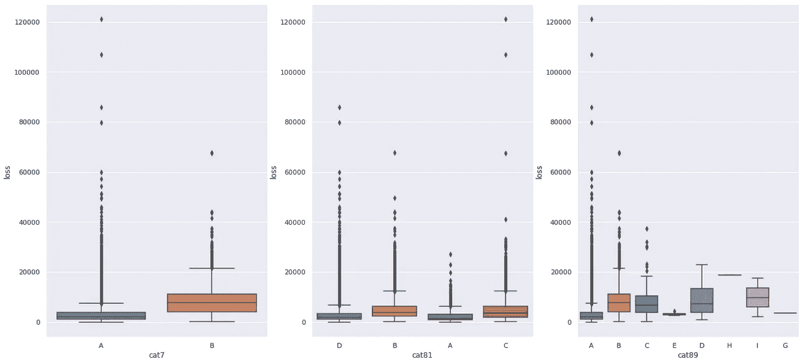
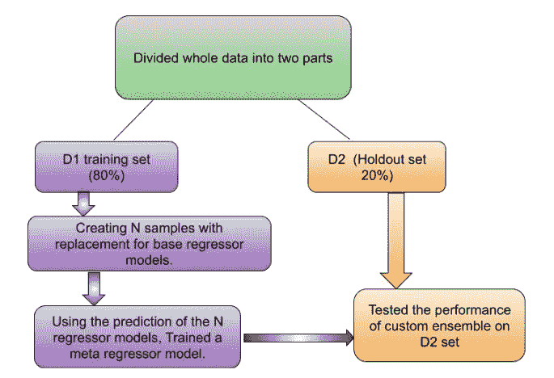
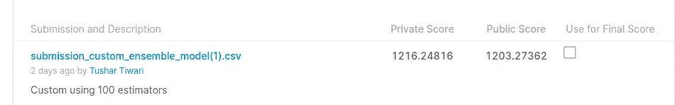

# 一场卡格尔竞赛:好事达声称严重性

> 原文：<https://medium.com/nerd-for-tech/a-kaggle-competition-allstate-claims-severity-a32f4635c849?source=collection_archive---------8----------------------->


好事达标志

# 关于数据集

好事达(Allstate)是一家美国保险公司，它在 2016 年 10 月组织了一次招聘 Kaggle 比赛。当时，好事达正在开发自动预测保险索赔成本的方法。

给出了一个表格数据集，大约有 188k 行，每行代表一个保险索赔[ [Kaggle 数据集](https://www.kaggle.com/c/allstate-claims-severity) ]。

# 商业目标

给定索赔记录的任务是尽可能准确地预测特定索赔的损失价值。

**将商业问题映射到机器学习**

好事达可能以两种方式面临损失:

1.  不向客户少收保费，以便在发生实际索赔时能够支付索赔金额。
2.  不向客户多收保费，让客户转投下一家保险公司。最终好事达会失去客户，这是潜在业务的损失。

## **绩效指标的选择**

由于我们的任务是尽可能接近地预测损失值，我们将选择*平均绝对误差(MAE)* 作为我们的性能指标。

***【MAE】***=它是(实际值和预测值)之差的平均绝对值。



信用:[statisticshowto.com](https://www.statisticshowto.com/absolute-error/)

# 探索性数据分析

在数据集中，我们有 116 个分类特征和 14 个连续值特征
，在训练数据集中有 188318 条索赔记录，在测试数据集中有 125546 条索赔记录。对于测试记录，我们没有目标变量(损失)。

整个数据集中没有缺失值。

下面是每个分类特征中类别数量的分布。



类别数量的分类特征分布

分类变量的分布有一个多数类，这可以从下面的饼图中看出



分类特征之间的分布。

下面是目标类别(即损失)的分布，我们可以看到这是幂律分布，因此我们使用 Box-Cox 变换将其转换为正态分布。这种后期的改造，给了车型性能足够的提升。



将目标变量损失转换为正态分布。

因为它们有许多特征，对每个特征进行分析是不合适的。所以选择了几个重要的特征。



80 类、79 类和 87 类箱线图

对于 cat80，如果一项索赔属于 A 类和 C 类，那么损失值不会高很多。并且 B 类与其他类相比具有更高的损耗。
对于类别 79，同样，如果索赔属于 A 类和 C 类，则损失异常值比其他类小得多。D 类的损失高于其他类，B 类在中间值附近的偏差较小。
对于 cat87，A 类的损耗小于其他类。



第 10 类、第 12 类和第 57 类的箱线图

对于第 10 类，B 类比 A 类有更高的损失和更大的中值方差。
对于第 12 类，B 类也比 A 类有更高的损失。B 类也有更多的方差。
对于 cat57，A 类的中位数方差远小于 B 类。相比之下，B 类的损失更大。



7 类、81 类、89 类箱线图

对于第 7 类，B 类比 A 类具有更高的损失和更大的损失扩散。
对于第 81 类，D 类和 A 类的大部分损失比 B 类和 c 类要小。
或第 89 类，E 类和 G 类的损失很小，没有任何异常值。H 类的损耗明显高于其他类。

**连续特征的关联热图**


**关联热图**

***观察:***

特征之间非常强的相关性

1.  cont11 和 cont12
2.  cont1 和 cont9

也有一些负相关特征对

1.  cont13 和 cont3
2.  cont9 和 cont3
3.  控制 1 和控制 3

# 特征工程和编码

我尝试了各种方法来编码分类数据，如标签编码、一键编码。在一次热编码中，维数有了很大程度的增加。最后，基于字典顺序的编码
产生了最高的性能增益。
对于数字特征，应用了诸如 log1p、log2、平方、平方根的变换。

## **PCA:主成分分析**

找出是否有任何组件比其他组件包含更多的差异。

```
from sklearn.decomposition import PCA
X_pca = np.hstack((X_con,X_cat))  
pca = PCA(n_components=20)
pca.fit(X_pca)
print(pca.explained_variance_)
print(pca.explained_variance_ratio_)# output
[2.35154011 2.0085094  1.33360039 1.07081709 0.93789653 0.85301854
 0.78585513 0.73253702 0.57646378 0.52337216 0.50127435 0.47667501
 0.4375088  0.42108877 0.39689408 0.32907901 0.31447881 0.30535877
 0.28352583 0.26869016]
[0.08142671 0.0695486  0.04617854 0.03707915 0.03247652 0.02953745
 0.02721178 0.02536554 0.01996119 0.01812279 0.01735761 0.01650581
 0.0151496  0.01458103 0.01374324 0.01139501 0.01088945 0.01057365
 0.00981764 0.00930393]
```

我们可以看到前 2 个主成分的解释方差大于 2，前 4 个主成分只有方差大于 1。不存在具有大的解释方差的主成分。此外，最高的主成分在 20 个成分中具有 8.14%的方差。

# 第 2 部分:建模

# 1.基线模型

该模型将预测所有输入的中值。

```
Mean absolute error on test data for baseline mode 1796.9614807242938
```

# 2.定制集成模型

总的训练数据被分成两个数据集 D1 和 D2。D1 包含 D2 中 80%的训练数据，而包含 20%的训练数据，这是一个维持集，稍后将用于测试最终定制集合模型的性能。从 D1 集中，我们采样(替换)N 个不同的数据集，用于训练 N 个基本回归元(决策树)。使用 N 个基本模型的预测来训练元回归模型，该模型将预测我们对于一个数据点的最终损失。这个元模型的性能最终在 D2 数据集上进行了测试。



自定义集合模型流程图

# 模型比较

在这里，我训练了 6 个模型，其中自定义集合模型的表现优于其他模型。我使用了一个决策树作为我的基础模型，并且使用定制的集合，性能比基础模型有了显著的提高。

模型比较。

# Kaggle 提交结果

提交材料是在 Kaggle 比赛结束后提交的。



取得了公分 1203，私分 1216.24 的成绩。

# 未来的工作

1.  尝试不同的堆叠架构并减少 MAE。
2.  包括不同的特征工程方式。
3.  使用 optuna 之类的库进行超参数调优。
4.  神经网络可以试用。

# 参考

1.  [https://www . Applied ai course . com/course/11/Applied-Machine-learning-course](https://www.appliedaicourse.com/course/11/Applied-Machine-learning-course)
2.  【https://notendur.hi.is/heh89/Allstate_Claims_Severity.pdf 号
3.  [http://cs 229 . Stanford . edu/proj 2017/final-reports/5242012 . pdf](http://cs229.stanford.edu/proj2017/final-reports/5242012.pdf)
4.  [https://www . ka ggle . com/sharmasanthosh/explorative-study-on-ml-algorithms](https://www.kaggle.com/sharmasanthosh/exploratory-study-on-ml-algorithms)

# 代码库和部署。

**Github 仓库:**包含了这个项目的全部代码。[ [好事达](https://github.com/tushifire/kaggle-allstate-project)

试用该模型的网站:[ [herokuapp](https://allstate-claim-severity-kaggle.herokuapp.com/) ]

## **联系人:**[LinkedIn](https://www.linkedin.com/in/tushar-tiwari-8ab70548/)| |[邮箱](mailto:tushi.fire@gmail.com)