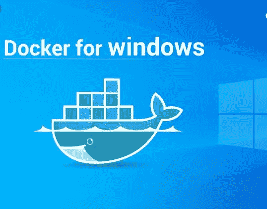
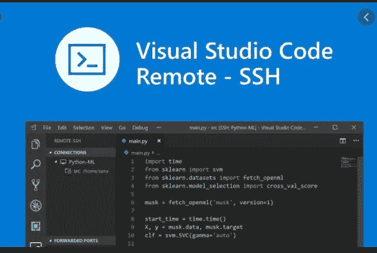
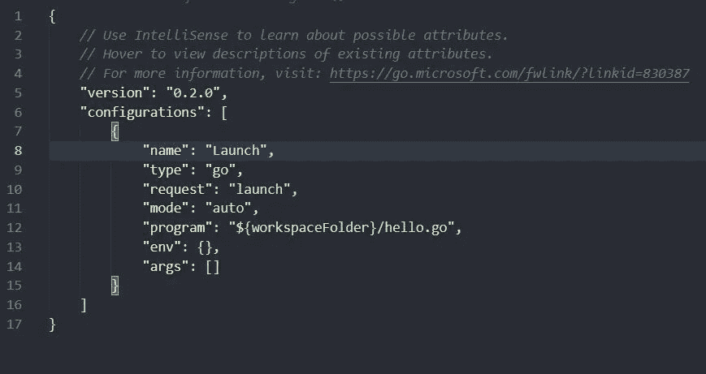
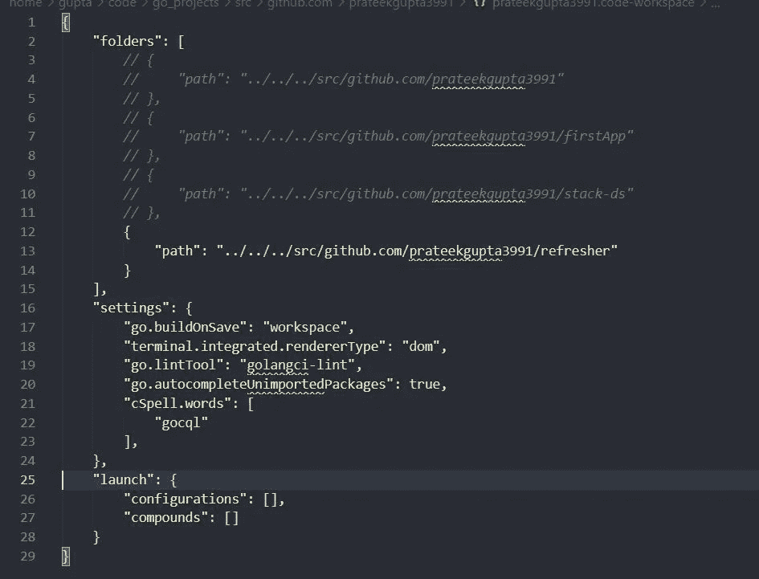
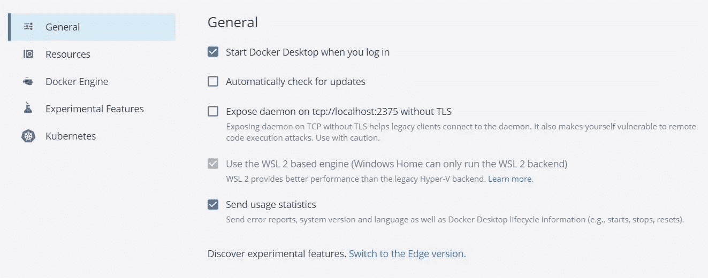
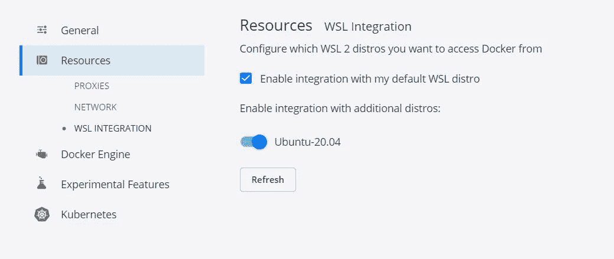

# windows 中的 linux 风格开发人员设置

> 原文：<https://medium.com/nerd-for-tech/a-linux-style-developer-setup-in-windows-fb6f4b30e7f7?source=collection_archive---------3----------------------->



最近，我一直在为我的个人项目尝试很多围棋东西。这篇文章致力于分享我在 Go + Cassandra DB 实验中的知识。对我来说，更有趣的是使用 docker 处理所有事情，原因如下:

1.  自从我上大学以来，我一直在用 linux 处理大部分工作。
2.  我职业生涯的大部分时间都在做 mac，深深享受 mac 和 unix 的流畅。
3.  我最近买了一台 windows 笔记本电脑(它比 mac 便宜得多),想在我的系统上完成我的个人工作，但我对开发人员的 windows 设置不太适应。

因此，在探索我的问题的解决方案时，我遇到了一个非常适合我的开发设置。因此，我决定与可能和我处境相同的人分享这些知识。

# Windows + WSL + VSCode + Docker

当我在上大学的时候买了第一个系统，在我启动 ubuntu linux 之前，我一直在使用 windows 系统。

因此，我不知道 Windows 已经使用**WSL(linux 的 Windows 子系统)**深深地拥抱了 Linux，这就像是任何 Linux 发行版的虚拟主机。我很惊讶 ubuntu for WSL 居然能在微软商店买到。虽然我花了相当多的时间让开发者在 windows 系统上友好起来。

有了 docker，unix 系统中的事情变得很好，但现在 docker 已经与 **WSL2** 惊人地集成在一起，工作起来同样流畅。

值得一提的是，WSL2 是最新版本，支持 linux 系统调用，提供了出色的 linux CLI 体验。默认情况下，WSL 安装在 windows 系统中，但是可能会出现版本 2 没有启用的情况。要启用版本 2，请以管理员身份运行终端并执行以下命令。

```
wsl --set-default-version
```

接下来你可以在微软商店下载一个可用的 linux 发行版。我更喜欢 ubuntu。默认情况下，下载的 ubuntu 将使用 WSL。您需要将其转换为使用 WSL2

```
wsl.exe --set-version Ubuntu 2
```

现在你可以走了。

然后是 start - VSCode，一个我完全敬畏的来自 intellij 和 eclipse 的编辑器。VSCode 中的远程环境支持让您感觉好像您的 IDE 正在 linux 环境中工作。WSL 远程环境是一个非常棒的开发人员友好的设置，一个双启动的 linux 系统是工作和游戏的必备窗口的日子已经一去不复返了。

**一些很棒的 VSCode 特性**1。**定制**
最强大的功能是定制你的工作空间，启动文件，参数，扩展。您可以单独启用/禁用每个项目和每个工作空间的设置。要定制每个项目，有一个**。可以添加的 vscode** 文件夹，可以有以下类型的文件:
**launch.json** —作为任何类型项目的启动配置— springboot、Go、java、maven 等。
**settings.json** -定制每个项目的设置，如字体类型、字体大小、要启用/禁用的扩展、依赖关系。

> 注:这是我见过的最棒的特性之一。我鼓励任何愿意探索这一点的人。上面的文件可以从谷歌上的一个模板中获取。



2.**工作区**
工作区是在 VSCode 中同时打开的文件夹的虚拟集合，定义在一个 **< name >** `**.code-workspace**`文件中。打开此文件将自动打开文件夹集合。这被称为“多根”工作空间。虽然单个文件夹将保留在各自的位置，但是工作区将只包含您希望添加并打算同时工作的项目。



注意关键的“文件夹”。它有一个值数组，每个对象指向一个不同的项目。我评论了我有时会同时需要的计划。

3.**扩展**
**VSCode** 有一套很棒的扩展。我更喜欢使用的是:
代码自动完成
代码导航
代码运行器
代码流
代码时间
Docker
Jfrog
tab nine 自动完成
Intellicode
远程 WSL
远程 SSH
远程开发
Eclipse keymap
**主题—推荐的主题是—** 黑暗骑士、一个黑暗主题、幻影代码

4.**远程 WSL
但这一点就是帖子的原因。这就是开发环境成为 linux 风格的地方。这个扩展将连接 VSCode 以在 WSL2 linux 发行版中运行。终端将指向 WSL 文件系统。**

参考链接来配置同样的
https://marketplace.visualstudio.com/items?[itemName = ms-vs code-remote . remote-wsl #:~:text = The % 20 remote % 20% 2D % 20 wsl % 20 extension % 20 let，as % 20 you % 20 would % 20 from % 20 windows](https://marketplace.visualstudio.com/items?itemName=ms-vscode-remote.remote-wsl#:~:text=The%20Remote%20%2D%20WSL%20extension%20lets,as%20you%20would%20from%20Windows)。

> 注意:从 WSL 文件系统访问 windows 文件系统的挂载点应该是 **/mnt/c/Users/**

**Docker** Docker 桌面 for windows 是 Docker 运行在 WSL 上。安装可以通过以下方式完成

[](https://docs.docker.com/docker-for-windows/install/) [## 在 Windows 上安装 Docker 桌面

### Docker Desktop for Windows 是 Docker for Microsoft Windows 的社区版本。你可以下载 Docker 桌面…

docs.docker.com](https://docs.docker.com/docker-for-windows/install/) 

初始设置后，docker 就可以使用了。现在您需要启用一些配置。
转到 docker 面板中的设置>转到常规选项卡>确认“使用基于 WLS2 的引擎是否已启用”



接下来进入资源标签>检查“启用集成…”检查已安装的发行版



现在你的桌面 docker 和你的发行版已经准备好了。

# 结尾注释

我想在这篇文章中分享的原始内容是关于我的 Go + cassanda + docker 的实验，但显然我转向了 windows 中的一个开发人员友好的设置，我觉得对于那些在处理个人资料之前有正确资料的人来说，这可能是一个很好的阅读材料。

在下一篇文章中，我将与部署在 docker setup 上的 cassandra db 共享 Go webapp。这肯定会是一本好书。在那之前…