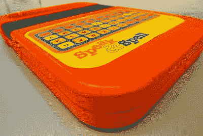
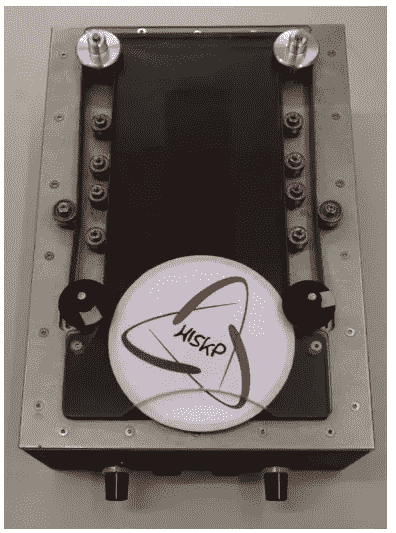

# 一个丢失已久的《我的世界》被发现，“文学地动仪”，和杀人机器人

> 原文：<https://medium.com/nerd-for-tech/a-long-lost-minecraft-is-found-literary-seismographs-and-killbots-d352e1274adb?source=collection_archive---------3----------------------->

## 今天的链接节:我在网上拖延时间时发现的最好的东西

每周一，我都会提供一份清单，上面列有我在网上拖延几个小时时发现的最好的东西。欢迎来到本周的 2021 年 7 月 5 日！

*首先……*

## 1.🔍一个罕见的，遗失已久的《我的世界》版本终于被发现了

《我的世界》几乎每周都会更新，所以 12 年后，[已经有上百个版本了。这款游戏的粉丝通常会保留旧游戏，玩它们是为了娱乐、怀旧，或者享受废弃游戏机制的烟熏味。](https://docs.google.com/spreadsheets/d/1OCxMNQLeZJi4BlKKwHx2OlzktKiLEwFXnmCrSdAFwYQ/htmlview#)

但是有一个已经失踪很久了，那就是失落的《我的世界》亚特兰蒂斯！

版本 1.1.1。

Mojang 在 2010 年 9 月 18 日发布了它——然后很快意识到它有一个令人讨厌的错误，并在仅仅 3 小时 25 分钟后将其撤下。很少有人下载它，多年来似乎也没有人保存它。在过去的十年里，《我的世界》的爱好者们在 Mediafire 和 MEGA.nz 的荒凉洞穴中四处游荡，绝望地寻找一份副本，但毫无收获。

直到上周末！在 Twitter 上，@ lunasorcery 写了一个帖子,描述了她如何意识到她实际上在 2010 年第一次下载 1.1.1 时就已经发布了该版本。她找到了当时的旧硬盘，插上电源，然后*瞧。*

她把 1.1.1 放到了网上，《我的世界》迷们欣喜若狂。她的思路是一个关于数字包装的奇妙故事，以互联网流行文化的档案格言结尾:

“千万不要删除任何东西”。

## 2.📖“文学地震仪”:通过研究一个国家的小说来预测国家危机

《卫报》上有一篇引人入胜的文章，讲述了一群德国文学学者试图通过观察一个国家的文学场景来预测即将出现的国家危机。什么类型的小说能引起大众的共鸣？有审稿人？引起争论，或者似乎反映了即将爆发的公民冲突。

这听起来有点疯狂，但该组织声称取得了一些成功:2017 年，他们预测阿尔及利亚内乱的时机已经成熟，这确实在两年后发生了。但该组织的资金在 2020 年被撤回，因此该项目被搁置。

尽管如此，可以说，这是一种思考小说意味着什么的有趣方式。它们是故事，它们是艺术，它们是虚构的——但它们也是数据。

[早在 2006 年，我做过一些关于中央情报局](https://www.nytimes.com/2006/12/03/magazine/opensource-spying.html)的报道，并与几位研究“开源情报”的中央情报局分析师交谈过，开源情报是他们对公开发布的任何类型的非秘密信息的艺术术语，如一个国家的报纸、博客、推特……或小说。事实证明，中央情报局的分析师有时也会阅读这些文章，而且和学者们一样，发现这些文章有助于判断一个国家的发展方向。

## 3.🤖倾倒在一个说话和拼写的 ROM，以证明它没有一个“脏话”模式

还记得“说脏话”模式吗？

早在 80 年代，孩子们声称，如果你在键盘上输入正确的命令，你会打开一个模式，机器人的声音会像喝醉的水手一样咒骂。

[《说出&咒语》作者优素福·C](https://www.flickr.com/photos/90326842@N00/4407337016)

唉，原来是硅时代早期的阴谋论。Adafruit 的 Phillip Burgess 从一个古老的 Speak 咒语 T15 中删除了 ROM，并在代码中爬行，一劳永逸地证明了其中没有脏话。查看他的视频，看看他的挖掘。(还有，花絮！你是否像我一样，认为 Speak &通过将音素组合在一起来拼写发音的单词？也不是真的:它说的每一句话都被完整地记录了下来。)

伯吉斯确实发现了一个记录在只读存储器上但从未在拼写游戏中使用过的单词:“蚊子”。

*污秽*的东西。

## 4.💣自主致命杀手机器人在这里

你可能还记得 2017 年的那个怪异的“屠宰场机器人”科幻视频？

它让我做噩梦，伙计。“屠宰机器人”是由一群科学家和思想家发布的，他们担心无人驾驶自动杀手会随时被部署；毕竟，正如他们指出的那样，你需要的主要东西——人脸识别人工智能、廉价多余的无人机、道德严重受损的政治演员等。—我们已经在这里了。

这个组织仍然很活跃，并且[刚刚写了一篇文章，指出一份联合国报告确定了一个似乎是现实生活中的自主杀手无人机案例——2020 年春天在利比亚使用。](https://spectrum.ieee.org/automaton/robotics/military-robots/lethal-autonomous-weapons-exist-they-must-be-banned)

"用这么多的话来说，自主瞄准人类的红线现在已经被越过了."这对我的睡眠也没什么帮助。

## 5.🥏为什么啤酒杯垫会做出恶心的飞盘

如果你曾经尝试过像扔飞盘一样扔啤酒杯垫——我们当中有谁没有过——你可能会注意到它们飞得很糟糕。你扔出去几英尺后，那该死的东西翻了过来，垂直落下。

[Arxiv 的一篇新论文分析了这些空气动力学，并找出了原因](https://arxiv.org/abs/2106.08238):重力迅速拉动啤酒杯垫，升力集中在前缘，这使东西垂直翻转，直至死亡。(Ars Technica 的詹妮弗·韦莱特写了一篇[精彩的明文文章。](https://arstechnica.com/science/2021/06/the-physics-of-why-that-flying-beer-coaster-is-nothing-like-a-frisbee/))

不过，这篇论文突出了两件事！一个是主要作者——Johann ost Meyer——实际上已经做了*之前关于啤酒物理学的工作*:去年春天[他在 Arxiv 上发表了一篇论文，解释了“啤酒攻丝”的物理学](https://arxiv.org/abs/2002.02896)。这家伙显然是想找一个当之无愧的傻瓜。

第二件事是:为了测试他假设的啤酒杯垫物理模型，Ostmeyer 和他的团队建造了一台机器，以机器人的一致性拍摄啤酒杯垫。他们附上了这个宏伟设备的照片…

他们应该在酒吧里到处安装这些。我的帽子掉了。

Clive Thompson 是《纽约时报杂志》的特约撰稿人，《连线》和《史密森尼》杂志的专栏作家，也是《琼斯母亲》的定期撰稿人。他是《编码者:一个新部落的形成和世界的重建》和《比你想象的更聪明:技术如何改变我们的想法》的作者。他在推特上的[*@ pomeranian 99*](https://twitter.com/pomeranian99)*和*[*insta gram*](https://www.instagram.com/pomeranian99/)*。*