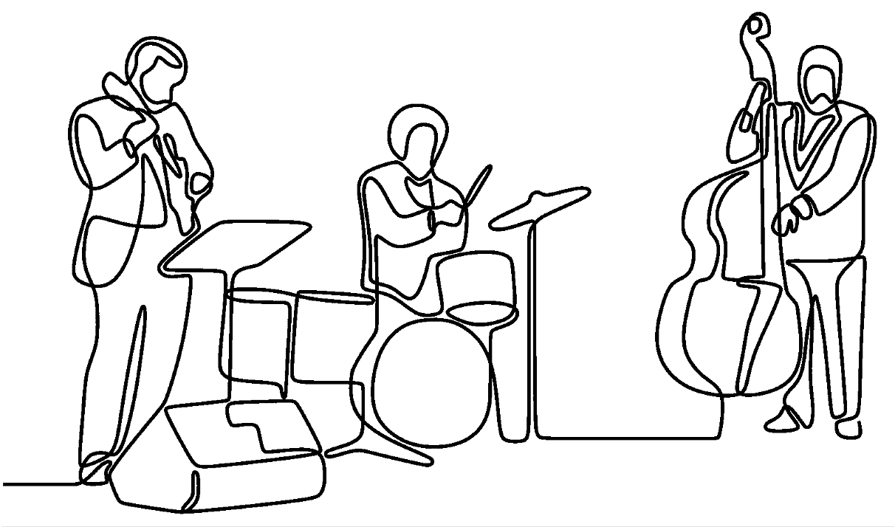
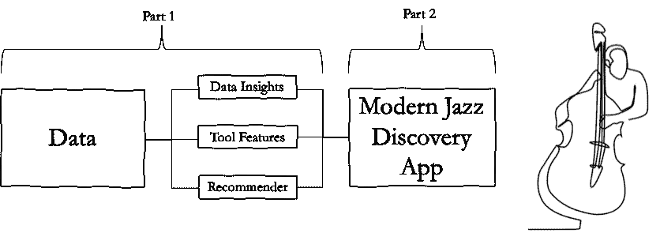
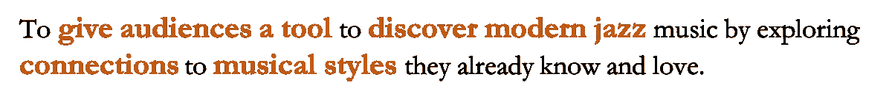
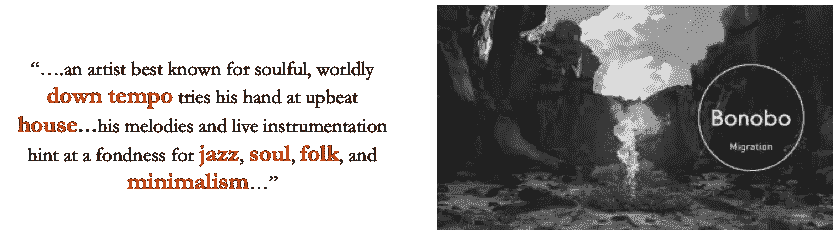
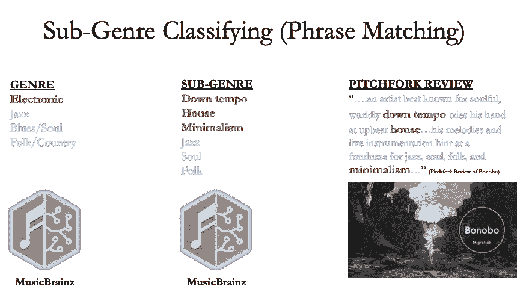
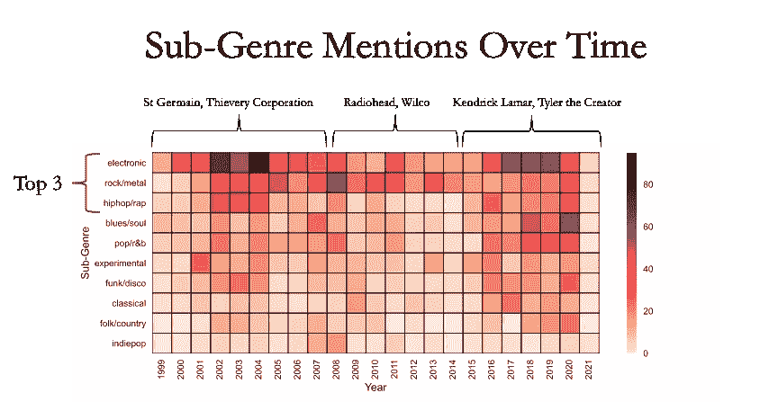
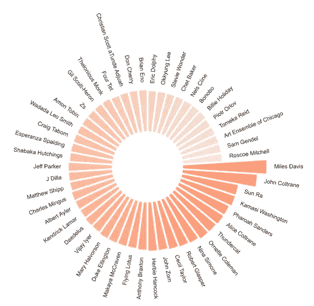
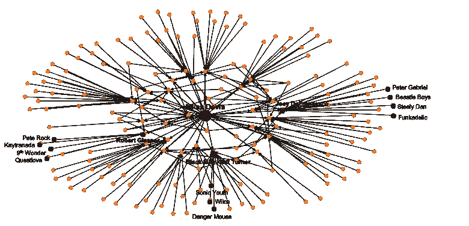
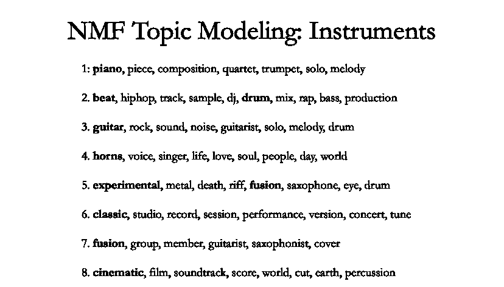
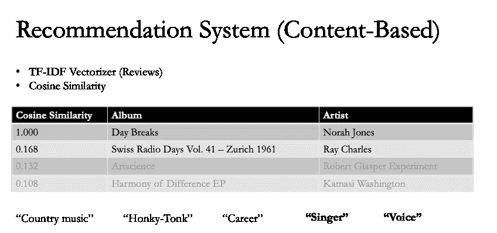

# 现代爵士乐发现工具(pt。1)

> 原文：<https://medium.com/nerd-for-tech/a-modern-jazz-discovery-tool-420344872985?source=collection_archive---------27----------------------->

## 这是两部分系列的第一部分。本文主要关注使用 Pitchfork Jazz 专辑评论构建一个基于内容的发现工具。



我对音乐充满热情，和许多阅读这篇文章的人一样，我尤其热衷于爵士音乐。因此，对于我在 [Metis](https://www.thisismetis.com/) 为期 12 周的沉浸式数据科学训练营的最后一个顶点项目，我决定为现代爵士乐专辑探索建立一个基于内容的推荐工具。这是由两部分组成的博客文章的第一部分。第一部分将带领我们完成构建工具的旅程，从项目的*动机*开始，使用的*数据*，从分析数据中收集的*见解*，以及推荐器是如何构建的。第二部分将关注于 [Streamlit 应用](https://pitchfork-metis.herokuapp.com/)本身。



首先让我们从一个简单的问题开始…

# 什么是爵士乐？

**简单的问题吧？嗯，不完全是。我相信你知道，要用几句话概括爵士是什么太难了，所以我在这里谦虚地画几个大概。**

> “爵士乐是现在的力量。没有剧本。*——*温顿·马萨利斯(爵士小号手)

正如温顿·马萨利斯指出的那样，爵士乐团不仅仅是音乐表演。这是民主在行动:参与性、包容性、挑战性、竞争性和集体性。

> “… **唯一的音乐**有一个**社会时代**以它的荣誉命名:爵士时代(20 世纪 20 年代)”——杰拉尔德·林恩·厄尔利(美国散文家和文化评论家)

正如杰拉尔德·厄尔利所写的，要知道爵士乐曾是世界范围内流行音乐的主要形式长达几十年。

> “爵士乐是 20 世纪的产物，但它现在已经离开了家”——迈克·诺克(爵士钢琴家)

近年来，爵士乐已经成为音乐产业中的一个利基市场，有些人甚至说它是过去的遗物，对今天的听众来说已经失去了意义和相关性。

> “…像**卡马西·华盛顿** … **肯德里克·拉马尔**…锻造了一种**新的爵士乐综合**…在**艺术**和**流行** …”杰拉尔德·林·厄尔利之间提供了一种全新的**关系**

然而，如果你在音符、之间读一读，你会意识到爵士乐与当今流行音乐和文化是多么的紧密相连。正如我将在这篇博文中描述的那样，在 ***现代爵士专辑评论*** 中可以生动地看到这些联系。

鉴于这些对爵士乐的粗略描述和今天对爵士乐的理解，我对这个项目的总体动机是:



# 数据

专辑评论总是为发现新音乐提供一个有价值的媒介。为了让观众发现爵士乐，我寻找各种方法来揭示各种音乐风格(除了爵士乐)和现代爵士乐艺术家之间的联系。这就是[干草叉](https://pitchfork.com/)出现的地方。Pitchfork 在历史上以评论独立艺术家专辑而闻名，但后来它将触角延伸到了流行音乐、爵士乐和许多其他流派。我决定使用 Pitchfork jazz 评论作为推荐工具的基础文本语料库。我将在关键见解部分进一步解释这些评论中爵士乐和其他流派之间的联系。

我通过使用 Selenium 和 BeautifulSoup 的网络抓取技术获得了 Pitchfork jazz 专辑的评论。我以大约 20 年的回顾(1999-2021)结束。在大约 20，000 个专辑评论中，大约 700 个是专门针对爵士乐的，这也是我们这个项目的重点。让我们看看专辑评论数据本身的一些关键见解。

# 关键见解— **流派提及频率**

从 Pitchfork jazz 专辑评论中得到的一个重要的关键见解是评论者如何直接或间接地将 jazz 专辑分类成不同的音乐类型。让我用一个例子来说明:



节选自 pitchfork 专辑对倭黑猩猩迁徙的评论

从上面的评论摘录中可以看出，根据评论者的观点，高亮显示的单词代表了这张专辑所体现的不同音乐流派。为了帮助识别无数的音乐流派，我使用了一个音乐流派分类法，这是一个对公众开放的音乐百科全书。他们使用两个层次的分类——类型*和子类型*和子类型。比如*电子*音乐有很多子流派，比如*“down tempo”、“house”、“极简主义”*等等。现在，让我们再次对照我们的类型分类来看看 Bonobo 的专辑评论节选。



从右到左，我们看到评论中的几个单词和短语出现在我们的分类中。通过使用 spaCy 的短语匹配器*[](https://spacy.io/usage/rule-based-matching#phrasematcher)**，我们可以匹配短语，而不是单个单词，从而对这些专辑评论进行分类。应用短语匹配的代码很简单，它从导入包开始，如下所示:***

```
***import spacy
nlp = spacy.load(‘en_core_web_sm’)from spacy.matcher import PhraseMatcher
phrase_matcher = PhraseMatcher(nlp.vocab)***
```

***接下来，我编写了一个函数，根据我通过 MusicBrainz 获得的音乐流派分类法，在专辑评论文本中的短语之间应用短语匹配:***

```
***import os
from os import listdir
from os.path import isfile, join
from io import StringIO
import pandas as pd
from collections import Counter
import en_core_web_sm
nlp = en_core_web_sm.load()
from spacy.matcher import PhraseMatcher*#function that does phrase matching and builds a candidate profile*
def create_profile(file):

 text = file
 keyword_dict = pd.read_csv(‘../data/mbrainz_genres.csv’)
 stats_words = [nlp(text) for text in keyword_dict[‘subgenre’].dropna(axis = 0)]matcher = PhraseMatcher(nlp.vocab)
 matcher.add(‘Stats’, None, *stats_words)doc = nlp(text)

 d = [] 
 matches = matcher(doc)

 for match_id, start, end in matches:
 rule_id = nlp.vocab.strings[match_id] *# get the unicode ID, i.e. ‘COLOR’*
 span = doc[start : end] *# get the matched slice of the doc*
 d.append((rule_id, span.text)) 
 keywords = “\n”.join(f’{i[0]} {i[1]} ({j})’ for i,j in Counter(d).items())

 *## convertimg string of keywords to dataframe*
 _df = pd.read_csv(StringIO(keywords),names = [‘Keywords_List’])
 _df1 = pd.DataFrame(_df.Keywords_List.str.split(‘ ‘,1).tolist(),columns = [‘Subject’,’Keyword’])
 _df2 = pd.DataFrame(_df1.Keyword.str.split(‘(‘,1).tolist(),columns = [‘Keyword’, ‘Count’])
 _df3 = pd.concat([_df1[‘Subject’],_df2[‘Keyword’], _df2[‘Count’]], axis =1) 
 _df3[‘Count’] = _df3[‘Count’].apply(lambda x: x.rstrip(“)”))

 *# initialize list of lists* 
 cdata = [[i]] 

 *# Create the pandas DataFrame* 
 cdata2 = pd.DataFrame(cdata, columns = [‘album’]) 

 dataf = pd.concat([ cdata2[‘album’], _df3[‘Subject’], _df3[‘Keyword’], _df3[‘Count’]], axis = 1) 
 dataf[‘album’].fillna(dataf[‘album’].iloc[0], inplace = True)
 #print(“dataf 2”,dataf)

 return(dataf)

*#function ends*

*#code to execute/call the above functions*
final_database=pd.DataFrame()
i = 0for i in range(0,len(df)):
 file = df[‘review_clean’].iloc[i]
 dat = create_profile(file)
 final_database = final_database.append(dat)
 i +=1*# transpose — convert nans to zero*
df_wide = final_database.pivot(“album”,”Keyword”,”Count”) 
df_wide.fillna(0,inplace=True)
print(“df wide”,df_wide)***
```

****作为运行上述代码的结果，**我们可以将 Bonobo 专辑归类为具有电子音乐的暗示(流派=电子)，更具体地说，是“down tempo”、“house”和“minimalism”属性(子流派=down tempo、house、minimalism)。就我们的目的而言，一张专辑包含多个流派或子流派是完全可以的。正如我们将在第二部分的 Streamlit 应用中看到的，用户将能够通过评论短语匹配，根据连接从非爵士流派和子流派列表中选择要引入爵士专辑的流派。**

**现在，在这种背景下，我们可以看看下面的图表，它显示了这些子流派在这些年的 Pitchfork jazz 评论中被提及的频率。**

****

**热图的 y 轴列出了 Pitchfork jazz 评论中提到的前 10 个子流派(超过 200 个)(不包括爵士乐流派)。前 3 名分别是*电音、摇滚*和 *hiphop* 。在 x 轴上，我们可以展示这些流派不同的时代。例如，21 世纪初，圣日耳曼和窃盗集团等电子艺术家将爵士乐融入他们的音乐中。从 2008 年到 2015 年，一些摇滚乐队，如电台司令和威尔科，在融入爵士乐方面略有增加。今天，我们注意到爵士乐元素在嘻哈音乐中的复兴，就像在艺术家 Kendrick Lamar 的音乐中听到的那样。**

# **关键见解— *艺术家被提及的频率***

****既然我们已经了解了流派提及的频率**，那么艺术家提及的频率呢？下面是爵士乐评论中最常提及的前 50 位艺术家的图表:**

*****爵士专辑评论中最常提及的前 50 位艺人*****

****

**这表明，我们仍然可以看到历史上对现代爵士乐影响最大的两位大师——米勒·戴维斯和约翰·科尔特兰。**

**下面是一个网络图，以米勒·戴维斯为例，更仔细地观察了现代爵士乐艺术家之间的联系。**

*****【现代爵士乐影响(新旧)】*****

****

**为了清楚起见，我只注释了几个艺术家节点。从中心节点开始，你有米勒·戴维斯。在中间部分(星形部分)，我们有来自 Pitchfork 的现代爵士乐艺术家的专辑评论。从评论中，我们已经收集到这些艺术家/专辑中的每一个(即罗伯特·格拉斯佩尔，乔伊·德弗朗斯科等。)在某些方面受到了迈尔斯的影响，也受到了主流艺术家的影响。这再次显示了现代爵士乐是如何与传统和主流音乐领域相互联系的。**

# **工具功能—相册纹理**

**为了向 discovery 工具的用户推荐爵士专辑，我对评论进行了主题建模。我主要关注评论中的名词，并提取专辑中使用的主要乐器。我使用了 NMF 主题模型，最终得到了 8 个主题。如你所见，主题从钢琴、鼓或节奏沉重的歌曲，到吉他、圆号等等。这有助于用户在听之前或听的时候理解专辑的质地:**

****

# ****推荐系统****

****最后，我们有自己的推荐系统**。该系统简单地基于在清洁的评论文本上应用 TF-IDF 矢量器，然后使用余弦相似性来测量矢量之间的距离。下面是在 Python 中应用这一点的一般方法的一些代码片段。**

```
***# first we instantiate our tfidf vectorizer*tfidf = TfidfVectorizer(analyzer=’word’, stop_words=my_stop_words)*# next we fit this model against our cleaned review text*rev_matrix= tfidf.fit_transform(df[‘review_clean2’])*# this converts our doc/word matrix to an array and outputs to a dataframe*rev_matrix_arr = rev_matrix.toarray()pd.DataFrame(rev_matrix_arr, columns=tfidf.get_feature_names())*# we compute the cosine similarity between documents using the results of our tfidf approach*cosine_similarities = cosine_similarity(rev_matrix)np.save(‘cosine_sim.npy’, cosine_similarities)*# lastly we obtain the cosine similarities between album reviews*similarities = {}for i in range(len(cosine_similarities)):*# Sort each element in cosine_similarities and get the indexes of the artists*similar_indices = cosine_similarities[i].argsort()[:-50:-1]*# Store in similarities each name of the 10 most similar artists**# Keep the first one as the main search item — and then the remaining similar artists*similarities[df[‘album’].iloc[i]] = [(cosine_similarities[i][x], df[‘album’][x], df[‘artist’][x]) for x in similar_indices][0:]**
```

**我们对推荐器的工作情况进行健全性检查。让我们来看看诺拉·琼斯的一张专辑《天亮了:**

****

**根据余弦相似度得分，与她的专辑最接近的是雷·查尔斯的再版。仔细观察 Pitchfork 的评论，我们发现有几个常见的词或主题贯穿始终，比如*【乡村】*【音乐】*【低级酒吧】*。这是有道理的，因为他们都与乡村音乐有联系。我们看到像*“事业”*这样的词，考虑到他们在音乐行业的时间，这也是有意义的。像*【歌手】**【声音】*这样的词强调了这样一个事实:这些艺术家主要以他们的声音而闻名。**

**在回顾了许多这样的案例后，我们认为事情表现得相当好，可以继续构建应用程序了。**

**[**在我的下一篇文章**](/nerd-for-tech/a-modern-jazz-discovery-tool-pt-2-82adb4f97e36) 中，看看上面描述的洞察力和相似性模型是如何部署到一个 Streamlit 应用程序中来帮助你发现现代爵士乐的！**

**更多细节、代码或连接，请访问我的 [Github 知识库](https://github.com/chan-chris/Metis_proj5)或 [LinkedIn](https://www.linkedin.com/in/chrischanlkn/) 页面。**